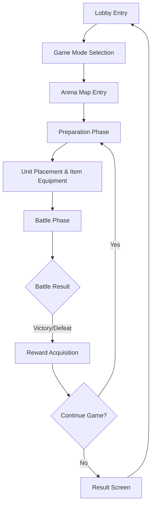

# MetoChess Game Overview

## Project Introduction

MetoChess is an auto battler genre game developed on the **MapleStory Worlds (MSW)** platform. Players collect MapleStory characters and strategically place them to aim for victory through auto battle.

## Core Gameplay Loop



The game progresses through the following **4-phase system**:

### 1. Ready Phase (Preparation Phase)
- Player state initialization and gold grant
- Unit shop update
- Next round preparation

### 2. Setting Phase (Setting Phase) 
- Unit placement and strategy planning
- Item equipment and rune card settings
- Synergy check

### 3. Battle Phase (Battle Phase)
- Auto battle progress
- Real-time battle status display
- Determine outcome

### 4. Clean Phase (Cleanup Phase)
- Battle result processing
- Reward calculation and grant
- Next round progress

## Main Systems

### Unit System
- **Character Collection**: Various MapleStory characters
- **Grade System**: Stats by grade from 1-star to 3-star
- **Synergy Effect**: Additional effects when combining same series characters

### Item System  
- **Equipment Items**: Increase stats like attack power, defense
- **Item Combination**: Craft higher-tier items through specific item combinations
- **Item Shop**: Round-based item purchase system

### Rune Card System
- **Rune Card Equipment**: Grant special abilities
- **Set Effect**: Additional effects when multiple same type rune cards equipped
- **Rune Card Shop**: Probability-based rune card acquisition

### Coach System
- **Coach Collection**: Coach characters helpful for game progress
- **Gacha System**: Probability-based coach acquisition
- **Avatar Change**: Player appearance change through coach

## Project Folder Structure

```
MetoChess/
├── RootDesk/MyDesk/          # Main game logic
│   ├── InGame/               # In-game systems
│   └── OutGame/              # Out-of-game UI and menu
├── map/                      # Game map files
├── ui/                       # UI layout files
├── Environment/              # MSW environment settings
└── Global/                   # Global setting files
```

### Core Folder Roles

| Folder | Role | Main Content |
|--------|------|--------------|
| `RootDesk/MyDesk/InGame/` | In-game System | Battle, unit, item, manager systems |
| `RootDesk/MyDesk/OutGame/` | Out-of-game System | Achievement, collection, profile, mission |
| `map/` | Map Definition | Game maps like Lobby, Arena, Field |
| `ui/` | UI Layout | Game interface composition |
| `Global/` | Global Settings | Player basic settings, game rules |

## Beginner Developer Guide

### 1. Understanding Project Structure
First, we recommend understanding the project in the following order:

1. **Global/DefaultPlayer.model** - Check player basic configuration
2. **RootDesk/MyDesk/InGame/Managers/GameManager.mlua** - Understand game progress flow  
3. **map/** folder - Understand game map structure
4. **ui/** folder - Check user interface

### 2. Understanding Core Manager Systems
The game is composed of multiple manager classes:

- **GameManager**: Control overall game flow
- **TeamManager**: Player team information management  
- **CharacterShopManager**: Character shop operation
- **SynergyManager**: Synergy effect calculation
- **TitleManager**: Title system management

### 3. Development Environment Setup
Since this is a MapleStory Worlds project, the following is required:

- MSW development environment setup
- Lua scripting understanding
- MSW component system learning

### 4. Recommended Learning Order
1. **Understanding Project Structure** → Understanding role by folder
2. **Gameplay Flow** → Overall game progress process
3. **Core Architecture** → Map, data, event systems
4. **Detailed Systems** → Individual features like units, items, UI

## Code References

### Main Entry Points
- `Global/DefaultPlayer.model` :: Player basic component configuration
- `RootDesk/MyDesk/InGame/Managers/GameManager.mlua :: OnMapEnter()` — Game start processing
- `RootDesk/MyDesk/InGame/Managers/GameManager.mlua :: GoToNextPhase()` — Phase transition logic

### Game Progress Management  
- `RootDesk/MyDesk/InGame/Managers/GameManager.mlua :: Ready()` — Preparation phase processing
- `RootDesk/MyDesk/InGame/Managers/GameManager.mlua :: StartBattle()` — Battle start
- `RootDesk/MyDesk/InGame/Managers/GameManager.mlua :: OnUpdate()` — Real-time update

### Data Management
- `RootDesk/MyDesk/Dictionary/Data/DictionaryDataManager.mlua :: DataSetInitialize()` — Game data initialization
- `RootDesk/MyDesk/Dictionary/DictionaryManager.mlua :: OnBeginPlay()` — Dictionary system start

Through this document, you can understand the overall structure of the MetoChess project and gameplay flow, with each detailed system covered in more detail in corresponding documents.
