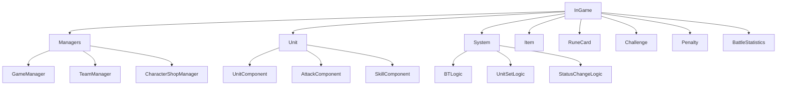
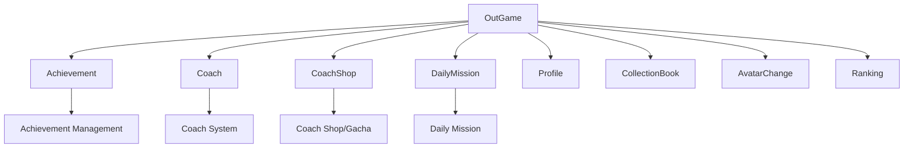

# Folder Structure and Roles

## Overall Project Structure

The MetoChess project follows the standard structure of the **MapleStory Worlds (MSW)** platform and is organized as follows:

```
MetoChess/
├── RootDesk/MyDesk/          # Main game logic and data
├── map/                      # Game map definition files  
├── ui/                       # User interface layout
├── Environment/              # MSW platform environment settings
├── Global/                   # Global game settings
└── docs/                     # Project documentation
```

## RootDesk/MyDesk Folder Structure

The main folder concentrating the project's core logic, clearly separated into **InGame** and **OutGame**.

### InGame Folder - In-Game Systems



#### Roles of Main Subfolders

| Folder Name | Role | Key Files |
|-------------|------|-----------|
| **Managers/** | Overall game progress management | GameManager, TeamManager, SynergyManager |
| **Unit/** | All unit-related systems | UnitComponent, AttackComponent, SkillComponent |
| **System/** | Core game system logic | BTLogic, UnitSetLogic, StatusChangeLogic |
| **Item/** | Item system | ItemInfo, ItemCombineService |
| **RuneCard/** | Rune card system | RuneCardComponent, RuneCardList |
| **Challenge/** | Challenge system | ChallengeManager, ChallengeComponent |
| **Penalty/** | Penalty system | PenaltyManager, PenaltyComponent |
| **BattleStatistics/** | Battle statistics system | BattleStatistics UI related |
| **Coach/** | In-game coach system | CoachComponent, CoachManager |
| **ESCMenu/** | In-game menu system | ESCMenuService, ShortCutKeyService |

#### Unit Folder Detailed Structure
```
Unit/
├── 00_AttackComponent/     # Attack-related components (99 files)
├── 00_SkillComponent/      # Skill-related components (101 files)  
├── 00_ProjectileComponent/ # Projectile system (21 files)
├── 01_UnitComponent/       # Basic unit components (10 files)
└── BT/                     # Behavior tree system (4 files)
```

### OutGame Folder - Out-of-Game Systems



#### Roles of Main Subfolders

| Folder Name | Role | Key Files |
|-------------|------|-----------|
| **Achievement/** | Achievement system | AchievementManager, UI_AchievementPopup |
| **Coach/** | Lobby coach system | CoachService, CoachMoveComponent |
| **CoachShop/** | Coach shop and gacha | CoachShopManager, GachaLogic |
| **DailyMission/** | Daily mission system | DailyMissionLogic, DailyMissionComponent |
| **Profile/** | Player profile | UI_Profile, PlayerTouch |
| **CollectionBook/** | Collection system | UI_CollectionManager, PlayerCollectionData |
| **AvatarChange/** | Avatar change | PlayerAvatarChangeComponent |
| **Ranking/** | Ranking system | Ranking_UILogic |
| **Reward_Popup/** | Reward popup | UI_RewardPopup |

### Common Folders

#### Dictionary Folder - Game Encyclopedia System
```
Dictionary/
├── Data/              # Game data management (characters, synergies, items, etc.)
├── UI/                # Dictionary UI components
└── Model/             # Dictionary-related models
```

#### Events Folder - Event System  
```
Events/
├── SystemEvents/      # System-level events (13 files)
├── UnitBehaviorEvents/ # Unit behavior events (11 files) 
└── UserBehaviorEvents/ # User behavior events (19 files)
```

#### UIComponents Folder - Common UI Components
- Reusable UI components (85 files)
- Basic UI elements like buttons, popups, toasts, tooltips

## map Folder Structure

Defines all maps used in the game:

| Map File | Purpose | Key Features |
|----------|---------|--------------|
| **Lobby.map** | Lobby/waiting room | Player spawn, NPC placement, UI elements |
| **Arena.map** | Battle arena | Tile system (Line_1/Tile_1 structure), battle area |
| **Field.map** | Game field | Actual gameplay space |
| **Sample.map** | Test map | Development/testing purposes |

### Map Structure Example (Arena.map)
```
Arena/
├── Background/          # Background image
├── Line_1/             # First row of game board
│   ├── Tile_1/         # Individual tile + unit sprite
│   ├── Tile_2/
│   └── ...
├── Line_2/             # Second row of game board  
└── SpawnLocation/      # Player spawn location
```

## ui Folder Structure

Defines all user interface layouts:

### Main UI Files

| UI File | Role | Connected Script |
|---------|------|------------------|
| **Dictionary.ui** | Game encyclopedia main | DictionaryManager |
| **Lobby_HUD.ui** | Lobby main screen | Lobby related UI components |
| **Arena_ReadyPhase.ui** | Battle preparation screen | Unit placement, shop UI |
| **Arena_BattlePhase.ui** | Battle progress screen | Real-time battle status display |
| **CollectionBook.ui** | Collection screen | UI_CollectionManager |
| **PopupGroup.ui** | Popup management | Various popup systems |

## Environment Folder

Contains environment configuration files for the **MapleStory Worlds platform**:

```
Environment/
├── NativeScripts/      # MSW native script definitions
│   ├── Component/      # MSW component definitions (102 files)
│   ├── Enum/          # Enumeration definitions (117 files)
│   ├── Event/         # Event definitions (215 files)
│   ├── Logic/         # Logic definitions (11 files)
│   ├── Misc/          # Miscellaneous definitions (123 files)
│   └── Service/       # Service definitions (46 files)
└── config             # Environment configuration file
```

## Global Folder

Defines globally used settings and models:

| File Name | Role | Included Components |
|-----------|------|---------------------|
| **DefaultPlayer.model** | Player default settings | All manager components (28) |
| **Player.model** | Player entity settings | MSW basic components (24) |
| **common.gamelogic** | Common game logic | - |
| **CollisionGroupSet.collisiongroupset** | Collision group settings | - |

### Main Components in DefaultPlayer.model
```lua
-- Game management components
"script.GameManager"           -- Overall game progress management
"script.TeamManager"          -- Team information management  
"script.CharacterShopManager_New" -- Character shop
"script.SynergyManager_New"   -- Synergy calculation

-- Player data components  
"script.PlayerDataComponent"   -- Player data storage
"script.TitleManager"         -- Title system
"script.AchievementManager"   -- Achievement system
"script.CoachManager"         -- Coach management
```

## Characteristics of MSW Project Architecture

### 1. Component-Based Design
- All game objects are composed of **component combinations**
- Component composition defined in **Model files**
- Mixed use of **script components** and **MSW native components**

### 2. Client-Server Separation
- `@ExecSpace("ServerOnly")` - Server-only logic
- `@ExecSpace("ClientOnly")` - Client-only logic  
- Data synchronization through `@Sync` attributes

### 3. Event-Driven Architecture
- **SystemEvents**: Game state changes
- **UnitBehaviorEvents**: Unit actions
- **UserBehaviorEvents**: Player actions

### 4. Data-Centric Design
- Game data management through **CSV + UserDataSet** combination
- Centralized data management through **DictionaryDataManager**
- Easy updateability with seasonal data configuration

## Code References

### Project Structure Related Key Files
- `Global/DefaultPlayer.model` :: Player default component composition definition
- `RootDesk/MyDesk/InGame/Managers/GameManager.mlua :: OnMapEnter()` — Map-specific initialization processing
- `RootDesk/MyDesk/Dictionary/Data/DictionaryDataManager.mlua :: DataSetInitialize()` — Game data initialization

### Folder Entry Points  
- `RootDesk/MyDesk/InGame/Managers/` :: Central management of in-game systems
- `RootDesk/MyDesk/OutGame/Achievement/AchievementManager.mlua` :: Representative of out-of-game features
- `RootDesk/MyDesk/Events/SystemEvents/` :: Understanding event system structure

Understanding this folder structure allows easy identification of where functionality is located and helps select appropriate locations when adding new features.

