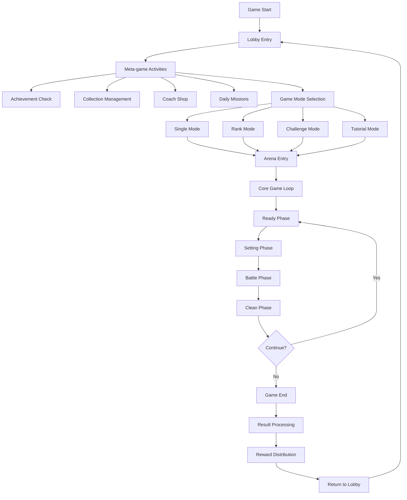
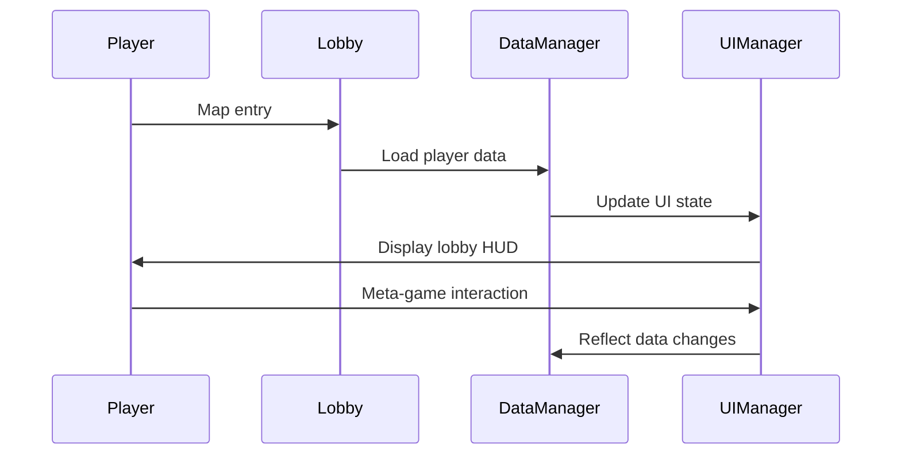
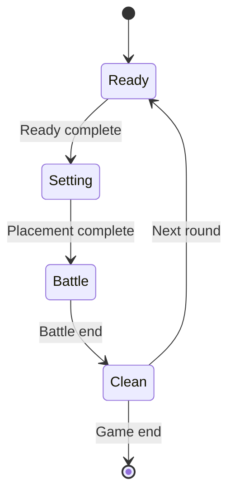
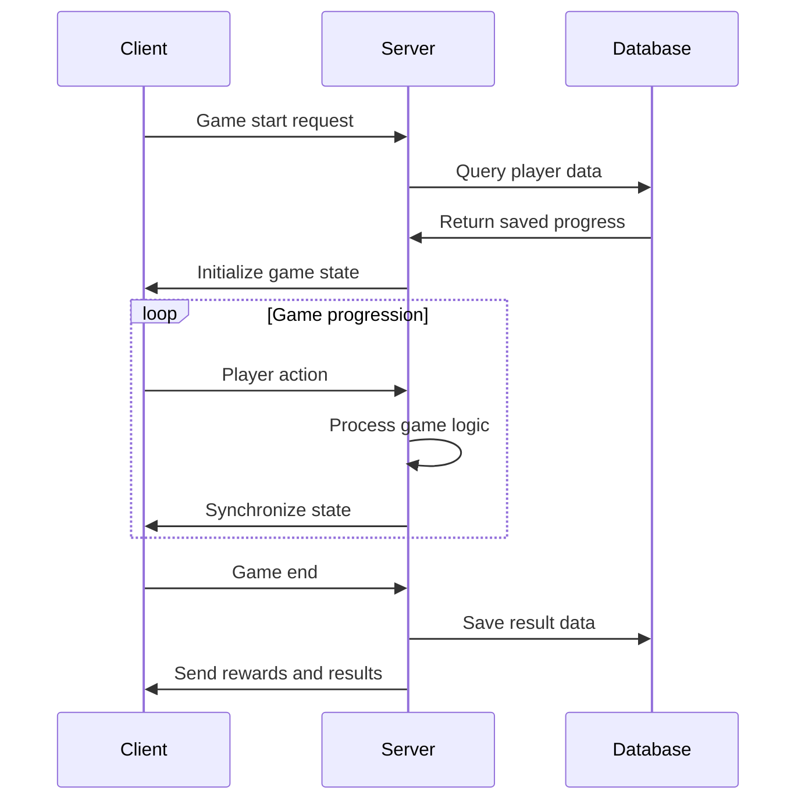

# Gameplay Flow

## Overall Player Experience Design

MetoChess player experience is designed as a cyclical structure where the **lobby-centered meta-game** and **arena-centered core game** flow together.



## Stage 1: Lobby Meta-game System

### Lobby Entry and Initialization
When players connect to the game, they enter the **Lobby map** and various meta-game elements are activated.

#### Main Activities in Lobby

| System | Role | Related UI |
|--------|------|-------------|
| **Achievement System** | Provides gameplay objectives and rewards | AchievementManager |
| **Collection System** | Character card/synergy badge collection | CollectionBook.ui |
| **Coach System** | Avatar management and gacha | CoachShop related UI |
| **Daily Mission** | Short-term objectives and daily rewards | DailyMission UI |
| **Profile Management** | Player information and ranking | Profile UI |
| **Dictionary System** | Game information learning | Dictionary.ui |

### Lobby System Operation Flow


## Stage 2: Game Mode Selection

### Mode Selection System
Select from 4 game modes through `UI_LobbyLevelSelect`.

#### Game Mode Characteristics

| Mode | Description | Entry Requirements | Features |
|------|-------------|-------------------|----------|
| **Tutorial** | Tutorial | No restrictions | Basic gameplay learning |
| **Single** | Single-player | No restrictions | Difficulty level challenges |
| **Rank** | Rank mode | Level 10 or higher | Season-based ranking competition |
| **Challenge** | Challenge mode | Specific conditions | Special rule challenges |

### Mode Selection Processing Flow
```lua
-- UI_LobbyLevelSelect :: OnButtonClick_ModeSelect()
if mode == "Rank" then
    -- Check player level (10 or higher)
    -- Check remaining time (1 hour or more)
elseif mode == "Challenge" then
    -- Check challenge conditions
    -- Check daily attempt count
end
```

### Entry Queue System
After mode selection, transition to entry queue state through **SetEnteranceMode()**:

1. **UI Deactivation**: Disable mode change, coach change buttons
2. **Effect Playback**: Activate entry button particle effects
3. **Countdown**: Execute actual entry after 3-second wait
4. **Map Movement**: Call `GameManager :: MoveToArena()`

## Stage 3: Arena Map Transition

### Map Transition Processing
```lua
-- GameManager :: MoveToArena()
-- 1. Verify entry conditions
-- 2. Prepare player data  
-- 3. Request arena map movement
-- 4. Activate loading screen
```

### Arena Entry Initialization
Processing when entering arena map in `GameManager :: OnMapEnter()`:

```lua
if enteredMap.MapComponent.IsDynamicMap == true then
    -- Initialize game state
    self.Stage = 1
    self.Round = 1
    self.Phase = 0
    
    -- Spawn unit samples
    _SampleClientSpawnLogic:SpawnUnitSample(userId, "start")
    _UnitSetLogic_New:ProjectileSampleSpawn(userId)
    
    -- Initialize new game
    self.Entity.TeamManager:InitNewGame(true)
end
```

## Stage 4: Core Game Loop (4-Phase System)

MetoChess core is a structure where **Ready → Setting → Battle → Clean** 4-stage phases repeat.



### Phase 1: Ready Phase

#### Main Operations
- **Gold Distribution**: Distribute previous round rewards
- **Shop Refresh**: Refresh character/item/rune card shops
- **UI Activation**: Activate ready-related UI groups
- **Timer Start**: Measure preparation time

```lua
-- GameManager :: Ready()
-- Process gold distribution
teamManager:AddGolds(getGolds, "roundResult")

-- Play direction effects
_GeneralDirectorLogic:PlayCoinDirector_Sprite(getGolds/2, nil, "RoundResult", userId)

-- UI transition
self:Ready_OnClient(userId)
```

#### Player Activities
- Character purchase and sale
- Level up and experience purchase
- Item purchase and combination
- Rune card purchase and equipping

### Phase 2: Setting Phase

#### Main Operations
- **Placement Mode**: Enable unit drag and drop
- **Strategy Development**: Confirm and optimize synergy effects
- **Equipment Management**: Item equipping and rearrangement
- **Sound Playback**: Battle preparation sound (`M0145`)

```lua
-- GameManager :: SetBattle()
-- Play sound
_PlaySoundLogic:PlaySound("M0145", userId)

-- Process battle preparation
self:SetBattle_OnClient(userId)
```

#### Player Activities
- Place units on game board tiles
- Confirm and adjust synergy combinations
- Optimize item equipping
- Final strategy review

### Phase 3: Battle Phase

#### Main Operations
- **Auto Battle**: AI-based unit actions
- **Real-time Status**: Update battle progress UI
- **Timer Management**: Battle time limit countdown
- **Result Determination**: Check victory conditions

```lua
-- GameManager :: OnUpdate() - Battle Phase
if self.PhaseType == "Battle" then
    self.BattleTime -= delta
    
    if self.BattleTime <= 0 then
        self:GoToNextPhase()  -- Overtime/draw
    elseif self.EnemyCount <= 0 then
        self:SetBattleResult(true, self.MyUnitCount)  -- Victory
    elseif self.MyUnitCount <= 0 then
        self:SetBattleResult(false, self.EnemyCount)  -- Defeat
    end
end
```

#### Battle System Operations
- **Behavior Tree AI**: Automatic unit action decisions
- **Skill System**: Mana accumulation and skill activation
- **Projectile System**: Ranged attack processing
- **Status Effects**: Buff/debuff application and removal

### Phase 4: Clean Phase

#### Main Operations
- **Result Compilation**: Battle statistics and data cleanup
- **Reward Calculation**: Determine rewards based on battle results
- **Next Round Preparation**: Update Stage/Round information
- **State Initialization**: Unit state and field cleanup

```lua
-- GameManager :: Clean()
-- Process and cleanup battle results
-- Prepare for next round
-- Initialize state
```

#### Progression Condition Check
- **Continue**: Return to Ready Phase for next round progression
- **End**: Game ends when HP reaches 0 or objectives are achieved

## Stage 5: Game End and Result Processing

### Game End Conditions
- **HP Depletion**: Player HP drops to 0 or below
- **Objective Achievement**: All stages cleared
- **Force Quit**: Player directly ends game

### Result Screen System
When game ends, display results through **GameResult UI**:

#### Result Information Display
- **Final Ranking**: Reached round and ranking
- **Battle Statistics**: Damage dealt, damage taken, skills used, etc.
- **Acquired Rewards**: Experience, gold, achievement progress
- **Record Updates**: Personal best record updates

### Reward System Processing

#### Experience and Gold Distribution
```lua
-- GetBattleReward :: Reward calculation logic
-- 1. Calculate base reward (based on round, ranking)
-- 2. Apply bonus rewards (achievements, win streak, etc.)
-- 3. Reflect to player data
```

#### Progress Saving
- **Achievement Progress**: Update progress rate of achieved objectives
- **Collection**: Save newly confirmed character/synergy information
- **Ranking**: Update season ranking for rank mode
- **Statistics**: Accumulate play records and statistics data

## Data Flow and Synchronization

### Client-Server Data Flow


### Data Saving Points
- **Real-time**: Important game state changes (purchases, level ups, etc.)
- **Phase Transitions**: At the end of each phase
- **Game End**: Final results and reward data
- **Periodic**: Automatic progress saving at regular intervals

## UI Group Management System

### Map-based UI Group Transitions
Appropriate UI groups are activated/deactivated according to each map:

#### Lobby Map UI Groups
- **Lobby_HUD**: Main lobby interface
- **Lobby_LevelSelect**: Mode selection screen
- **Dictionary**: Game encyclopedia
- **CollectionBook**: Collection management
- **PopupGroup**: Various popups and modals

#### Arena Map UI Groups
- **Arena_Default**: Arena default layout
- **Arena_ReadyPhase**: Ready phase UI
- **Arena_BattlePhase**: Battle progress UI
- **HoverPopupGroup**: Tooltips and hover information
- **ToastGroup**: Notification messages

### Loading System
**LoadingManager** manages the loading process during map transitions:

```lua
-- LoadingManager main functions
-- 1. Track loading progress
-- 2. Cyclically display loading tip messages  
-- 3. Handle BGM fade in/out processing
-- 4. UI transition after loading completion
```

## Code References

### Game Flow Control
- `RootDesk/MyDesk/InGame/Managers/GameManager.mlua :: OnMapEnter()` — Initialization on map entry
- `RootDesk/MyDesk/InGame/Managers/GameManager.mlua :: GoToNextPhase()` — Phase transition logic
- `RootDesk/MyDesk/InGame/Managers/GameManager.mlua :: MoveToArena()` — Arena map movement

### Mode Selection System
- `RootDesk/MyDesk/UIComponents/UI_Lobby/UI_LobbyLevelSelect.mlua :: OnButtonClick_ModeSelect()` — Mode selection processing
- `RootDesk/MyDesk/UIComponents/UI_Lobby/UI_LobbyLevelSelect.mlua :: SetEnteranceMode()` — Entry queue mode

### Phase-specific Processing
- `RootDesk/MyDesk/InGame/Managers/GameManager.mlua :: Ready()` — Ready phase
- `RootDesk/MyDesk/InGame/Managers/GameManager.mlua :: StartBattle()` — Battle phase
- `RootDesk/MyDesk/InGame/Managers/GameManager.mlua :: Clean()` — Clean phase

### Data Management
- `RootDesk/MyDesk/DataStorage/PlayerDataComponent.mlua` — Player data storage
- `RootDesk/MyDesk/InGame/BattleEndReward/GetBattleReward.mlua` — Reward processing

Through this systematic gameplay flow, players can have a seamless gaming experience, and each system organically connects to maximize the overall game enjoyment.


