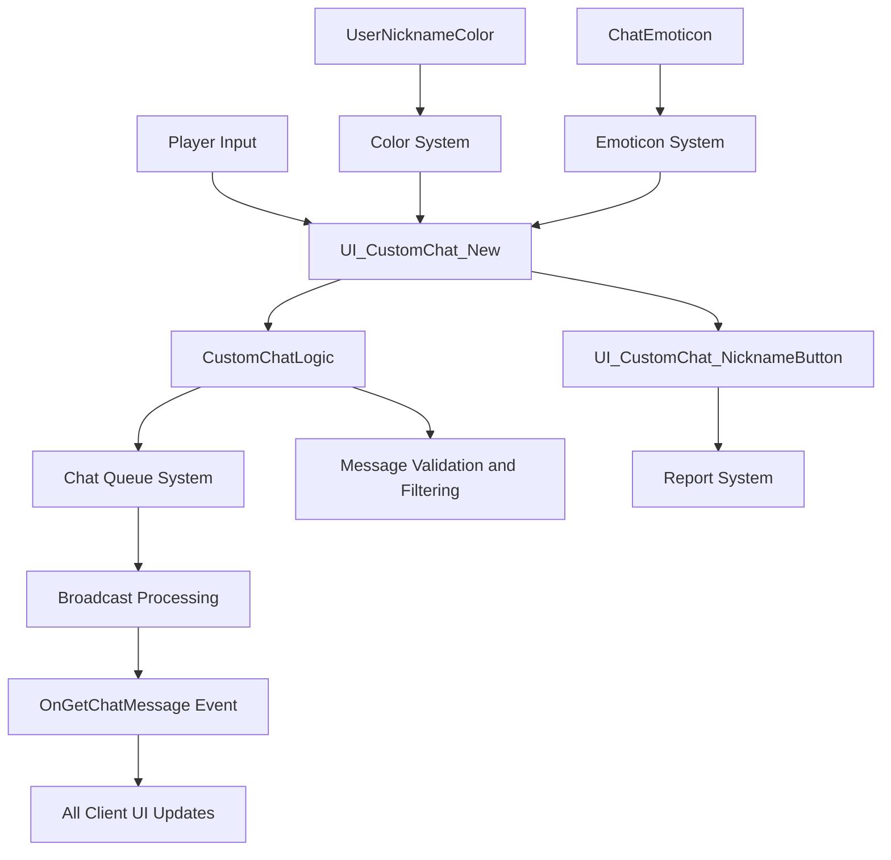
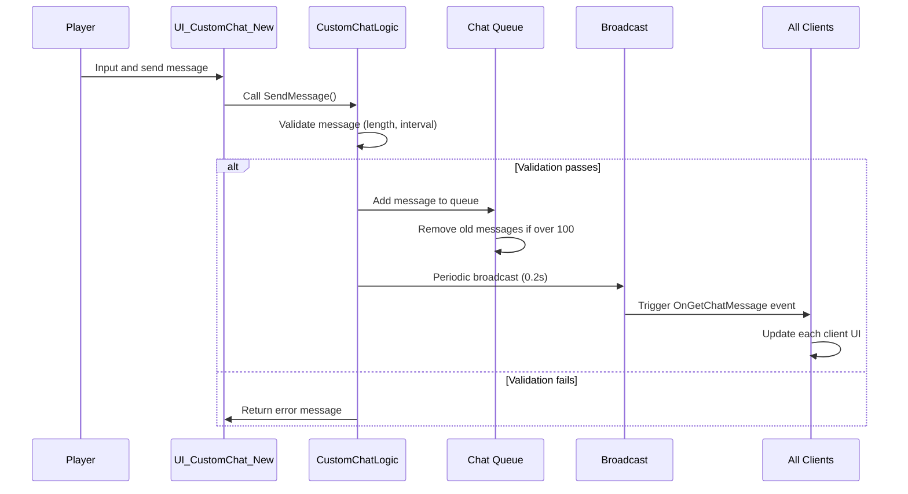
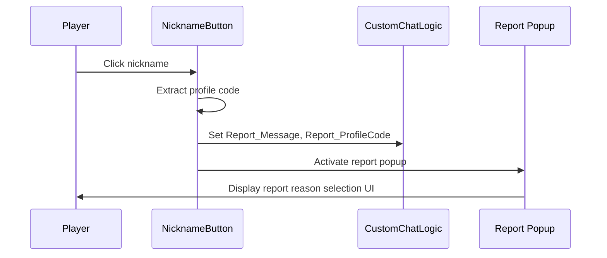

# Core Architecture - Communication System

## Overview

MetoChess's communication system is a comprehensive chat and interaction system that supports real-time communication between players. Implemented in the `CustomChat` folder, this system provides an integrated solution for text chat, emoticons, nickname color display, and user reporting functionality, creating a safe and vibrant community environment.

The core design principles of this system are **performance optimization** and **user safety**, ensuring stable communication in a large-scale multiplayer environment through efficient broadcasting via message queuing and robust reporting mechanisms.

## System Architecture

### Overall Structure



### Chat Type Classifications

MetoChess supports the following chat types:

- **TYPE_DEFAULT (0)**: General all chat
- **TYPE_PARTY (1)**: Party/group chat (currently disabled)
- **TYPE_WHISPER (2)**: Whisper/private messages (currently disabled)  
- **TYPE_SYSTEM (3)**: System messages
- **TYPE_MEGAPHONE (4)**: Megaphone/announcement messages (currently disabled)
- **TYPE_CACHED (-1)**: Cached previous messages

## Core Components

### 1. CustomChatLogic (Chat Logic Engine)

The server-side logic that serves as the backbone of the chat system.

#### Main Functions
- **Message Queue Management**: Independent queue system per chat type
- **Broadcast Control**: Efficient message propagation at 0.2-second intervals
- **Message Restrictions**: 50-character limit, 1-second minimum interval restriction
- **Caching System**: Cache of recent 10 messages for new joiners

#### Core Properties
```lua
- chatQueue: Message queue table by type
- BROADCAST_INTERVAL: Broadcast interval (0.2 seconds)
- CharacterLimit: Message length limit (50 characters)
- minChatInterval: Minimum chat interval (1 second)
- cachedDefaultMessageCount: Cached message count (10 messages)
```

#### Message Processing Flow



### 2. UI_CustomChat_New (Lightweight Chat UI)

A performance-optimized component that represents the new version of the user interface.

#### Main Functions
- **Message Display**: Manage up to 50 messages
- **Scroll System**: Auto-scroll and manual scroll control
- **Color System**: Color differentiation by message type/user
- **Emoticon Support**: Automatic text-based emoticon conversion

#### Color System
```lua
- ChatColor_DefaultChatColor: Default chat color
- ChatColor_MyChatColor: Own chat color
- MessageColor_DEFAULT: General message color
- MessageColor_SYSTEM: System message color
```

### 3. User Interaction System

#### UI_CustomChat_NicknameButton
Makes nicknames clickable buttons to support user-to-user interactions.

**Report Function Flow**:


### 4. Data Systems

#### UserNicknameColor System
- Provides **89 different nickname colors**
- Managed with HEX color codes (#CD5C5C, #BC8F8F, etc.)
- Assigns unique colors per user for visual distinction

#### ChatEmoticon System
- **Keyword-based emoticons** (:cry:, :happy:, :super:, etc.)
- **RUID-based sprite management**
- Automatic emoticon conversion during text input

## Performance Optimization Strategies

### 1. Message Queuing System
- **Batch Processing**: Broadcast by queue units, not individual messages
- **Type Separation**: Independent queue management by chat type
- **Automatic Cleanup**: Automatic removal of old messages when exceeding 100

### 2. Broadcast Optimization
- **Fixed Intervals**: Consistent network load at 0.2-second intervals
- **Conditional Transmission**: Broadcast only when new messages exist
- **Index-based**: Track transmitted message indices to prevent duplication

### 3. UI Optimization
- **Message Limits**: Maintain only up to 50 messages in UI
- **Lazy Loading**: Render only messages visible on screen
- **Efficient Scrolling**: Optimize scrollbar dragging state

## User Safety and Management Features

### 1. Anti-Spam Mechanisms
- **Length Restriction**: 50-character limit per message
- **Interval Restriction**: 1-second minimum chat interval
- **Command Protection**: Restrict admin command usage

### 2. Report and Monitoring System
- **One-Click Reporting**: Report possible with just nickname click
- **Context Preservation**: Automatically save reported user's messages and profile code
- **Admin Tools**: Manage reported messages and user information

### 3. Message Filtering
- **Automatic Censorship**: Automatic filtering of inappropriate content (expandable)
- **User Blocking**: Hide specific user messages feature (expandable)

## Extensibility and Future Development

### 1. Currently Disabled Features
Features present in code but currently commented out:
- **Party Chat**: Group chat system
- **Whisper**: Private messaging functionality  
- **Megaphone**: Server-wide announcement system

### 2. Expandable Areas
- **Voice Chat**: WebRTC-based voice communication
- **Image Sharing**: Screenshot and image transmission
- **Translation Feature**: Real-time multilingual translation
- **Chatbot**: AI-based auto-response system

### 3. Management Tool Enhancement
- **Real-time Monitoring**: Real-time chat activity tracking
- **Auto-sanctions**: AI-based automatic sanctions system
- **Statistical Analysis**: Chat usage pattern analysis

## Real-world Usage Scenarios

### 1. General Chat Situation
```
PlayerA: "Hello! This is my first time playing, can you give me some tips? :happy:"
↓ (Broadcast to all players after 0.2 seconds)
PlayerB: "Welcome! Economy management is important in the early game"
PlayerC: "Learn synergy combinations first :super:"
```

### 2. Reporting Situation
```
1. Discover offensive message
2. Click the nickname
3. Report popup automatically displays (message and profile code automatically saved)
4. Select and submit report reason
5. Report content delivered to administrator
```

### 3. System Messages
```
System: "A new event has started!"
System: "PlayerA has acquired a legendary grade unit!"
```

## Security Considerations

### 1. Server-Side Validation
- All messages validated on server before transmission
- Double validation to prevent client manipulation
- User identification based on profile codes

### 2. Privacy Protection
- Prohibit exposure of personal information except nicknames
- Encrypted storage of profile codes
- Secure storage of report content

## Code References

- `RootDesk/MyDesk/CustomChat/CustomChatLogic.mlua :: OnBeginPlay()` — Chat queue initialization and broadcast timer setup
- `RootDesk/MyDesk/CustomChat/CustomChatLogic.mlua :: AddMessage()` — Message validation and queue addition logic
- `RootDesk/MyDesk/CustomChat/UI_CustomChat_New.mlua :: OnBeginPlay()` — Chat UI initialization and color system setup
- `RootDesk/MyDesk/CustomChat/UI_CustomChat_New.mlua :: OnGetMessage()` — Message reception and UI updates
- `RootDesk/MyDesk/CustomChat/UI_CustomChat_NicknameButton.mlua :: HandleButtonClickEvent()` — Report popup activation on nickname click
- `RootDesk/MyDesk/CustomChat/OnGetChatMessage.mlua` — Chat message reception event definition
- `RootDesk/MyDesk/CustomChat/UserNicknameColor.csv` — 89 nickname color data
- `RootDesk/MyDesk/CustomChat/ChatEmoticon.csv` — 16 emoticon keyword-RUID mapping
