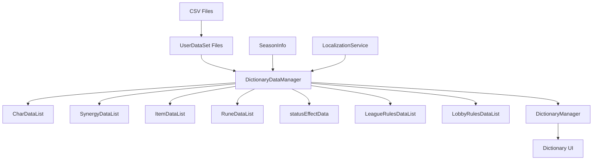
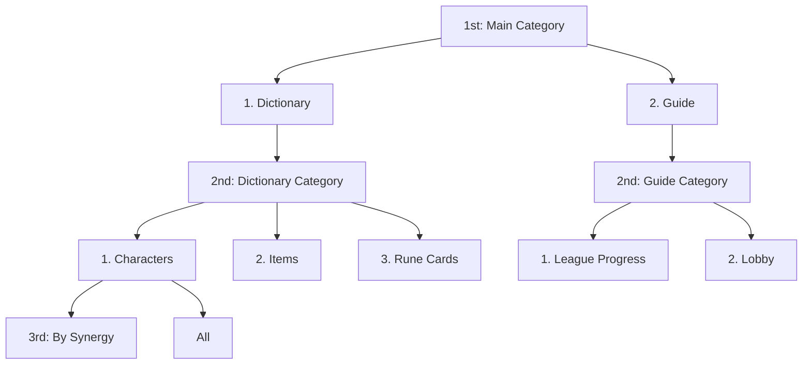

# Game Data System

## Overview

MetoChess's game data system centrally manages all game content data through **DictionaryDataManager**. It systematically structures information about core gameplay elements such as characters, synergies, items, and rune cards, and provides them intuitively to players through the **dictionary UI**.

## Data System Architecture



## DictionaryDataManager - Core Data Manager

### Data Management Structure

**DictionaryDataManager** is a singleton logic that loads and manages all game metadata in memory.

```lua
@Logic
script DictionaryDataManager extends Logic
    property boolean IsDataLoadComplete = false
    
    -- Core game data
    property table CharDataList = {}         -- Character information
    property table SynergyDataList = {}      -- Synergy information
    property table ItemDataList = {}         -- Item information
    property table RuneDataList = {}         -- Rune card information
    property table statusEffectData = {}     -- Status effect information
    
    -- Game rules data
    property table LeagueRulesDataList = {}  -- In-game rules
    property table LobbyRulesDataList = {}   -- Out-of-game rules
```

### Data Initialization Process

At system startup, all data is sequentially loaded through the **DataSetInitialize()** method:

```lua
@ExecSpace("ClientOnly")
method void DataSetInitialize()
    self:SetCharacterData()      -- Load character data
    self:SetSynergyData()        -- Load synergy data  
    self:SetItemData()           -- Load item data
    self:SetStatusEffectData()   -- Load status effect data
    self:SetRuneCardData()       -- Load rune card data
    self:SetAllGameRulesData()   -- Load game rules data
    
    self.IsDataLoadComplete = true  -- Loading complete flag
end
```

## Character Data System

### CharDictionaryData Structure

A data class containing all information for each character:

```lua
@Struct
script CharDictionaryData
    -- Basic information
    property string CharID = ""              -- Character unique ID
    property number Cost = 0                 -- Purchase cost
    property number Scale = 1                -- Size scale
    property string Role = ""                -- Role (Tank, LRD, SRD)
    property string MainStats = ""           -- Main stats
    property string IdleRUID = ""            -- Default state sprite
    
    -- Synergy information
    property number SynergyCount = 0         -- Number of synergies owned
    property table Synergies = {}           -- List of synergy IDs
    
    -- Season inclusion
    property table ContainedSeason = {}     -- Seasonal availability
    
    -- UI display options
    property boolean DictionaryEnable = true  -- Dictionary display enabled
    property boolean CollectionEnable = true -- Collection display enabled
end
```

### Character Data Loading Process

```lua
@ExecSpace("ClientOnly") 
method void SetCharacterData()
    -- 1. Load CSV data sources
    local data_CharInfo = _DataService:GetTable("CharacterInfo")
    local data_CharSynergy = _DataService:GetTable("CharacterSynergy")  
    local data_CharStat = _DataService:GetTable("CharacterStatus")
    local data_CharInfoBySeason = _DataService:GetTable("CharacterListBySeason")
    local seasonInfo = _DataService:GetTable("SeasonInfo")
    
    -- 2. Process information for each character
    for i=1, data_CharInfo:GetRowCount() do
        local character = CharDictionaryData()
        local row_charInfo = data_CharInfo:GetRow(i)
        
        -- Set basic information
        character.CharID = row_charInfo:GetItem("CharID")
        character.Cost = tonumber(row_charInfo:GetItem("Cost"))
        character.Role = row_charInfo:GetItem("Role")
        
        -- Set seasonal inclusion
        local charRow_inCharListBySeason = data_CharInfoBySeason:FindRow("CharID", character.CharID)
        for j=1, seasonInfo:GetRowCount() do
            local season = seasonInfo:GetRow(j):GetItem("Season")
            local isContained = charRow_inCharListBySeason:GetItem(season) == "TRUE"
            character.ContainedSeason[season] = isContained
        end
        
        -- Store final data
        self.CharDataList[character.CharID] = character
    end
end
```

## Synergy Data System

### SynergyDictionaryData Structure

Manages all information about synergy effects:

```lua
@Struct
script SynergyDictionaryData
    property string SynergyID = ""           -- Synergy unique ID
    property string IconRUID = ""            -- Synergy icon
    property string Desc = ""                -- Synergy description
    
    -- Stage-specific effect information
    property table NeedCount_step = {}       -- Required units per stage (5 stages)
    property table Detail_step = {}          -- Effect description per stage (4 stages)
    
    -- Included character information
    property number CharacterCount = 0       -- Number of included characters
    property table CharIDs = {}             -- List of included character IDs
    
    -- Connected synergies
    property number LinkedCount = 0          -- Number of connected synergies
    property table linkedSynergyIDs = {}    -- List of connected synergy IDs
    
    -- Season inclusion
    property table ContainedSeason = {}
end
```

### Synergy Data Processing Features

- **Stage-specific Effects**: Manage required units and effects for synergy levels 1-5
- **Character Connection**: Automatically manage list of all characters with that synergy
- **Synergy Connection**: Express relationships between related synergies

## Item Data System

### ItemStatusDictionaryData Structure

Manages detailed information about all in-game items:

```lua
@Struct  
script ItemStatusDictionaryData
    property string ItemID = ""             -- Item unique ID
    property string Type = ""               -- Item type
    property string Tags = ""               -- Item tags
    property string RUID = ""               -- Item sprite
    
    -- UI display information
    property Vector3 RUID_LocalPos = Vector3(0,0,0)    -- Local position
    property Vector3 RUID_LocalScale = Vector3(1,1,1)  -- Local scale
    
    -- Gameplay information
    property string Guide = ""              -- Item guide (localization)
    property string StatusEffectID = ""     -- Connected status effect ID
    
    -- Season inclusion
    property table ContainedSeason = {}
end
```

### Item Resource Optimization

Pre-calculate resource information for UI display optimization during item loading:

```lua
-- Item UI optimization
local resourceInfo = _LoadResourcesInfo:GetUILocalPositionScale(item.RUID)
item.RUID_LocalPos = resourceInfo["pos"]     -- Optimal position in UI
item.RUID_LocalScale = resourceInfo["scale"] -- Optimal size in UI
```

## Rune Card Data System

### RuneCardDictionaryData Structure

Manages metadata for the rune card system:

```lua
@Struct
script RuneCardDictionaryData
    property string RuneID = ""             -- Rune card unique ID  
    property string Grade = ""              -- Grade (Normal, Rare, Epic, Legendary)
    property string Type = ""               -- Type classification
    property string Guide = ""              -- Rune card effect description
    property string RUID = ""               -- Rune card sprite
    
    -- Season inclusion
    property table ContainedSeason = {}
end
```

## CSV + UserDataSet File Structure

### File Structure System

MetoChess uses a **dual file structure** to manage data:

```
Data file structure:
├── CharacterInfo.csv          # Actual character data
├── CharacterInfo.userdataset  # CSV meta-information and MSW settings
├── CharacterListBySeason.csv  # Seasonal character inclusion information
├── CharacterListBySeason.userdataset
└── ... (other data files)
```

#### CSV File Example (CharacterInfo.csv)

```csv
CharID,Version,Cost,Scale,Name,Role,MainStats,IdleRUID,AttackComponent,SkillComponent,DictionaryEnable,CollectionEnable
C10001,1,1,1,슬라임,SRD,Status_MagicalAttack,37291140ca7149c29e4cce958b0e7767,C10001_Slime_Attack,C10001_Slime_Skill,TRUE,TRUE
C10002,1,1,1,주황버섯,Tank,Status_PhysicalAttack,b1dac2598a0949fa83cc289ee16b5b6e,C10002_OrangeMushRoom_Attack,C10002_OrangeMushRoom_Skill,TRUE,TRUE
```

#### UserDataSet File Structure

```json
{
  "EntryKey": "userdataset://2b67bfcd-73b0-49be-ad48-1c2c2e7ddbc1",
  "ContentProto": {
    "Use": "Json",
    "Json": {
      "name": "CharacterInfo",
      "serveronly": false,        // Client accessible
      "dynamicloading": 0,       // Immediate loading
      "worldCoreVersion": "1.24.0.0",
      "useService": 0
    }
  }
}
```

### Seasonal Data Management

#### CharacterListBySeason.csv Example

```csv
CharID,Name,1.0,1.1,1.2,1.3,1.4,1.5,1.6,1.7
C10001,슬라임,TRUE,TRUE,TRUE,TRUE,TRUE,TRUE,TRUE,TRUE
C10002,주황버섯,TRUE,TRUE,TRUE,TRUE,TRUE,TRUE,TRUE,TRUE
C10003,변형된 달팽이,TRUE,FALSE,TRUE,FALSE,TRUE,TRUE,TRUE,FALSE
```

#### Seasonal Filtering Logic

```lua
-- DictionaryDataManager :: GetSortedCharIDList()
method table GetSortedCharIDList(string season, string synergyID)
    local sortedCharIDList = {}
    
    for charID, charData in pairs(self.CharDataList) do
        -- Filter only characters included in current season
        local isContainedSeason = charData.ContainedSeason[season] == true
        
        -- Filter only characters with target synergy  
        local hasTargetSynergy = (synergyID == "ALL") or 
                                 table.contains(charData.Synergies, synergyID)
        
        if isContainedSeason and hasTargetSynergy then
            table.insert(sortedCharIDList, charID)
        end
    end
    
    return sortedCharIDList
end
```

## DictionaryManager - Dictionary UI System

### UI Management Structure

**DictionaryManager** manages all interactions of the in-game dictionary UI:

```lua
@Logic
script DictionaryManager extends Logic
    -- UI entity references
    property Entity UI_Dictionary = "fe246253-c976-4abe-9cb0-ba3b32a59366"
    property Entity UI_CharListPanel = "ae92af29-481e-4087-8f59-0e2f3aab1d68"
    property Entity UI_ItemListPanel = "fec85286-f6bd-4a0f-9c0b-6af1bcd27ffa"
    property Entity UI_RuneListPanel = "4810457e-6c2b-4ca2-a6cc-417d98bba628"
    property Entity UI_GameGuidePanel = "8723e575-1248-490a-97a6-2326fc92de16"
    
    -- State management
    property string NowShowingSeason = "1.0"              -- Currently displayed season
    property SyncTable<string, integer> ShowingPageIndex -- Page index management
    property SyncTable<string> CategoryList_3rd          -- Third-level category list
    property SyncTable<string> SeasonList               -- Season list
end
```

### Category System

The dictionary uses a **3-level category structure**:



### Page Index Management

Tracks current page position for each category:

```lua
@ExecSpace("ClientOnly")
method void Initialize()
    self.ShowingPageIndex["Default"] = 1      -- 1st category = Dictionary
    self.ShowingPageIndex["1"] = 1           -- (1) Dictionary = (1) Characters  
    self.ShowingPageIndex["1_1"] = 1         -- Dictionary > Characters > All
    self.ShowingPageIndex["1_2"] = 1         -- Dictionary > Items > First
    self.ShowingPageIndex["1_3"] = 1         -- Dictionary > Rune Cards > All
    self.ShowingPageIndex["2"] = 1           -- (2) Guide = (1) Lobby
    self.ShowingPageIndex["2_1"] = 1         -- Guide > League Progress > First
    self.ShowingPageIndex["2_2"] = 1         -- Guide > Lobby > First
end
```

### Season Dropdown System

```lua  
@ExecSpace("ClientOnly")
method void SetUI_SeasonDropDownList()
    -- Construct season list by reading SeasonInfo data
    local seasonInfo = _DataService:GetTable("SeasonInfo") 
    
    for i=1, seasonInfo:GetRowCount() do
        local row = seasonInfo:GetRow(i)
        local season = row:GetItem("Season")
        table.insert(self.SeasonList, season)
    end
end
```

## Game Rules Data Management

### GameRulesData Structure

Structures game rules and help information:

```lua
@Struct
script GameRulesData
    property string Style = ""              -- Style information
    property string RuleDesc = ""           -- Rule description
    property string CategoryLocalKey = ""   -- Category localization key
end
```

### In-game vs Out-of-game Rule Separation

```lua
@ExecSpace("ClientOnly")
method void SetAllGameRulesData()
    -- In-game rules (league progress related)
    local ingameRulesDataset = _DataService:GetTable("InGameRulesData")
    for i=1, ingameRulesDataset:GetRowCount() do
        local row = ingameRulesDataset:GetRow(i)
        local ruleData = GameRulesData()
        
        ruleData.CategoryLocalKey = row:GetItem("CategoryLocalKey")
        ruleData.RuleDesc = row:GetItem("RuleDesc")
        
        -- Classify and store by category
        if not self.LeagueRulesDataList[ruleData.CategoryLocalKey] then
            self.LeagueRulesDataList[ruleData.CategoryLocalKey] = {}
        end
        table.insert(self.LeagueRulesDataList[ruleData.CategoryLocalKey], ruleData)
    end
    
    -- Out-of-game rules (lobby related)
    local outgameRulesDataset = _DataService:GetTable("OutGameRulesData") 
    -- Similar processing to store in self.LobbyRulesDataList
end
```

## Data Loading Optimization

### Lazy Loading System

```lua
@ExecSpace("ClientOnly")
method void OnBeginPlay()
    _DictionaryDataManager:DataSetInitialize()    -- Data initialization
    
    -- Wait for loading completion
    local loadingSprite = _EntityService:GetEntity("loading-sprite-id")
    local checkLoading = function()
        loadingSprite.Enable = not _DictionaryDataManager.IsDataLoadComplete
    end
    
    local TimerID = _TimerService:SetTimerRepeat(checkLoading, 1.5)
    
    if _DictionaryDataManager.IsDataLoadComplete then
        _TimerService:ClearTimer(TimerID)
        self:Initialize()  -- UI initialization
        self.IsInitialized = true
    end
end
```

### Memory Management

- **Singleton Pattern**: DictionaryDataManager uses single instance throughout the game
- **Reference-based Access**: Efficient access through references without data copying
- **On-demand Loading**: Process only related data when UI is activated

## Localization Integration

```lua
-- Localization processing for multi-language support
item.Guide = _LocalizationService:GetText(row:GetItem("Guide"))

-- Season names, category names, etc. also managed as localization keys
ruleData.CategoryLocalKey = row:GetItem("CategoryLocalKey")
```

## Code References

### Core Data Management
- `RootDesk/MyDesk/Dictionary/Data/DictionaryDataManager.mlua :: DataSetInitialize()` — Overall data loading
- `RootDesk/MyDesk/Dictionary/Data/DictionaryDataManager.mlua :: SetCharacterData()` — Character data loading
- `RootDesk/MyDesk/Dictionary/Data/DictionaryDataManager.mlua :: GetSortedCharIDList()` — Seasonal filtering

### Dictionary UI System
- `RootDesk/MyDesk/Dictionary/DictionaryManager.mlua :: OnBeginPlay()` — Dictionary initialization
- `RootDesk/MyDesk/Dictionary/DictionaryManager.mlua :: Initialize()` — Page index setup
- `RootDesk/MyDesk/Dictionary/DictionaryManager.mlua :: SetUI_SeasonDropDownList()` — Season list construction

### Data Classes
- `RootDesk/MyDesk/Dictionary/Data/CharDictionaryData.mlua` — Character data structure
- `RootDesk/MyDesk/Dictionary/Data/SynergyDictionaryData.mlua` — Synergy data structure  
- `RootDesk/MyDesk/Dictionary/Data/ItemStatusDictionaryData.mlua` — Item data structure
- `RootDesk/MyDesk/Dictionary/Data/GameRulesData.mlua` — Game rules data structure

### CSV Data Files
- `RootDesk/MyDesk/InGame/CharacterInfo/CharacterInfo.csv` — Character basic information
- `RootDesk/MyDesk/InGame/CharacterInfo/CharacterListBySeason.csv` — Seasonal character inclusion information
- `RootDesk/MyDesk/InGame/CharacterInfo/SynergyInfo.csv` — Synergy information
- `RootDesk/MyDesk/InGame/CharacterInfo/ItemStatus.csv` — Item status information

Through this systematic data management system, MetoChess can efficiently manage complex game content and provide rich information to players.
