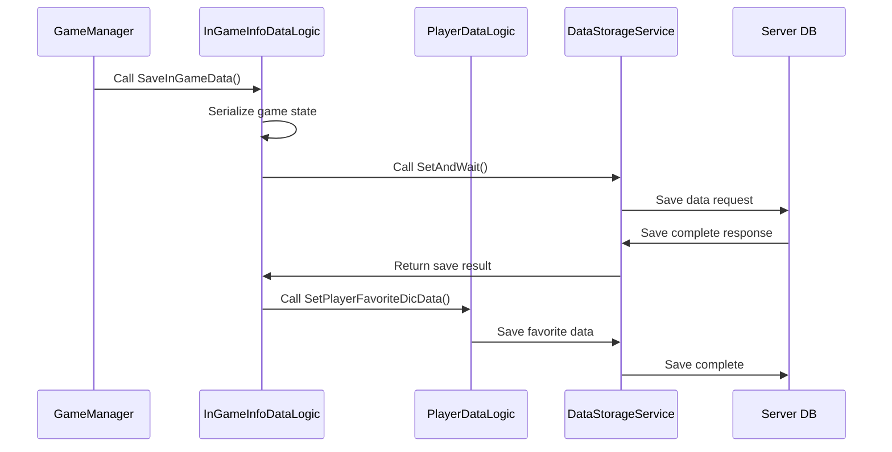
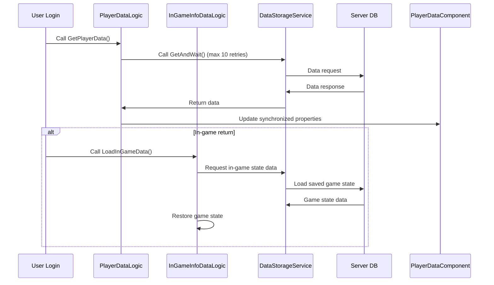

# Player Data System

## Overview

MetoChess's player data system integrates management of **out-of-game persistent data** and **in-game progress state**. Centered around **PlayerDataLogic** and **InGameInfoDataLogic**, it safely saves and restores all player progress, providing consistent gaming experience through real-time server-client synchronization.

## Data System Architecture

```mermaid
graph TD
    A[Player Data System] --> B[PlayerDataLogic]
    A --> C[InGameInfoDataLogic]
    A --> D[PlayerDataComponent]
    A --> E[GameModeDataManager]
    
    B --> B1[Out-of-game Persistent Data]
    B1 --> B11[Achievement System]
    B1 --> B12[Coach Collection]
    B1 --> B13[Title Management]
    B1 --> B14[Player Level/Experience]
    B1 --> B15[Collection Progress]
    
    C --> C1[In-game Progress State]
    C1 --> C11[Game Progress]
    C1 --> C12[Unit Information]
    C1 --> C13[Rune Card Equipment]
    C1 --> C14[Shop State]
    
    D --> D1[Real-time Synchronization]
    D1 --> D11[@TargetUserSync]
    D1 --> D12[Client Synchronization]
    
    F[DataStorageService] --> G[Server DB]
    B --> F
    C --> F
```

## PlayerDataLogic - Out-of-game Data Management

### Core Role

**PlayerDataLogic** is the core system that manages player's **persistent progress**. It loads all out-of-game data upon game connection and updates according to game progress.

```lua
@Logic
script PlayerDataLogic extends Logic
    property string SetVer = "OpenBeta"  -- Data version management
    
    @ExecSpace("ServerOnly")
    method void GetPlayerData(string userID)
        -- Load all data upon player connection
        self:GetLastLoginDateData(userID)           -- Last login date
        self:GetAchievementData(userID)             -- Achievement progress
        self:GetCoachesData(userID)                 -- Owned coaches
        self:GetTitleData(userID)                   -- Acquired titles
        self:GetPlayerRecordData(userID)            -- Play records
        self:GetPlayerSyrupsData(userID, true)      -- Owned currency (syrup/diamond)
        self:GetPlayerFavoriteDicData(userID)       -- Favorite dictionary
        self:GetCollectionData(userID)              -- Collection progress
        self:GetPlayerLevelData(userID)             -- Level and experience
        self:GetPlayerTutorialData(userID)          -- Tutorial progress
        self:GetPlayerChallengeInfoData(userID)     -- Challenge information
        self:GetPlayerDailyMissionData(userID)      -- Daily mission progress
        
        self:SetPlayerInfoData(userID)              -- Final player information setting
    end
end
```

### Main Data Categories

#### 1. Achievement System Data

Achievement data is stored in complex string structures, tracking state and progress of each achievement:

```lua
@ExecSpace("ServerOnly")
method void GetAchievementData(string userID)
    -- Data format: (ID)_(state-state-state)_(count)_(date-date-date)
    local p_err, pachieve_Data = _DataStorageService:GetUserDataStorage(userID):GetAndWait(
        string.format("PlayerAchievementData_%s", self.SetVer)
    )
    
    -- Ensure stability with up to 10 retries
    for i = 1, 10 do
        if p_err == 0 then
            break
        elseif i == 10 then
            _UserService:KickUser(userID, KickReason.WorldContent)  -- Force disconnect on failure
        end
    end
    
    -- Parse and apply data
    if isvalid(pachieve_Data) then
        local achievementList = _UtilLogic:Split(pachieve_Data, ",")
        for _, data in pairs(achievementList) do
            local aData = _UtilLogic:Split(data, "_")
            local aID = aData[1]
            local aStateTable = _UtilLogic:Split(aData[2], "-")
            local aCount = tonumber(aData[3])
            local aDateTable = _UtilLogic:Split(aData[4], "-")
            
            achievementManager.PlayerAchievementData[aID] = {
                ["state"] = aStateTable, 
                ["count"] = aCount, 
                ["date"] = aDateTable
            }
        end
    end
end
```

#### 2. Coach Collection Data

Manages information of all coaches owned by the player:

```lua
-- Coach data structure
-- Stored as CoachID1,CoachID2,CoachID3,... format
local coachData = _UtilLogic:Split(pcoaches_Data, ",")
for _, coach in pairs(coachData) do
    coachManager.CoachList[coach] = true  -- Add to owned coach list
end
```

#### 3. Player Level System

Manages experience and level information, handling level-up rewards:

```lua
-- Load level data
local p_err, pLevel_Data = _DataStorageService:GetUserDataStorage(userID):GetAndWait(
    string.format("PlayerLevel_%s", self.SetVer)
)

local levelData = _UtilLogic:Split(pLevel_Data, "_")
playerDataComponent.Level = tonumber(levelData[1])
playerDataComponent.EXP = tonumber(levelData[2])
```

#### 4. Collection Progress

Tracks collection status of character cards and synergy badges:

```lua
-- Collection data structure
-- CharacterCard: "C10001,C10002,C10003,..."
-- SynergyBadge: "SY001-Bronze,SY002-Silver,SY003-Gold,..."
```

## InGameInfoDataLogic - In-game Progress State Management

### Core Role

**InGameInfoDataLogic** saves and restores **all state information** of the currently ongoing game. It performs detailed state management to allow resumption from the exact point even when game is interrupted.

```lua
@Logic
script InGameInfoDataLogic extends Logic
    
    @ExecSpace("ServerOnly")
    method void SaveInGameData(string userID)
        -- Save all in-game states
        self:SaveInGameInfoData(user)           -- Basic game information
        self:SaveInGameTeamInfoData(user)       -- Team state information
        self:SaveInGameUnitInfoData(user)       -- Unit placement information
        self:SaveInGameRuneInfoData(user)       -- Rune card equipment information
        self:SaveInGameTeamPropertyInfoData(user) -- Team property information
        
        -- Save battle statistics
        self:SaveGameUnitBattleStatisticsData(user, 0)
        self:SaveGameTeamBattleStatisticsData(user, 0)
        
        self:SetSavedDataDB(true, user)         -- Save completion flag
    end
    
    @ExecSpace("ServerOnly") 
    method void LoadInGameData(string userID)
        -- Restore saved in-game state
        self:LoadInGameInfoData(userID)         -- Restore basic game information
        self:LoadInGameTeamInfoData(userID)     -- Restore team state
        self:LoadInGameUnitInfoData(userID)     -- Restore unit placement
        self:LoadInGameRuneInfoData(userID)     -- Restore rune card equipment
        self:LoadInGameTeamPropertyInfoData(userID) -- Restore team properties
        
        -- Restore battle statistics
        self:LoadInGameUnitBattleStatisticsData(userID)
        self:LoadInGameTeamBattleStatisticsData(userID)
    end
end
```

### Save/Load Basic Game Information

#### Game Information to Save

```lua
@ExecSpace("ServerOnly")
method void SaveInGameInfoData(Entity user)
    local gameInfoTable = {}
    
    -- Mode and progress information
    gameInfoTable["ModeVersion"] = gameManager.ModeSetVersion
    gameInfoTable["ModeType"] = gameManager.ModeType        -- Single/Rank/Challenge
    gameInfoTable["ModeLevel"] = gameManager.ModeLevel      -- Difficulty
    gameInfoTable["PhaseType"] = gameManager.PhaseType      -- Ready/Battle/Clean
    gameInfoTable["PlayTime"] = gameManager.PlayTime        -- Total play time
    
    -- Game progress
    gameInfoTable["Stage"] = gameManager.Stage              -- Current stage
    gameInfoTable["Round"] = gameManager.Round              -- Current round
    gameInfoTable["Round83"] = gameManager.Round8_3Num      -- 8-3 round number
    
    -- Battle related
    gameInfoTable["NextEnemyPresetID"] = gameManager.NextEnemyPresetID
    
    -- Shop state
    gameInfoTable["CharShopRerollCount"] = charShopManager.RerollCount
    gameInfoTable["CharShopLineUp"] = table.concat(charShopManager.LineUp, ",")
    gameInfoTable["ItemShopLineUp"] = table.concat(specialShopManager.ItemLineUp, ",")
    gameInfoTable["RuneShopLineUp"] = table.concat(specialShopManager.RuneLineUp, ",")
    
    -- JSON serialize and save
    local gameInfoJSON = _HttpService:JSONEncode(gameInfoTable)
    local saveResult = _DataStorageService:GetUserDataStorage(userID):SetAndWait(
        string.format("InGameInfo_%s", _PlayerDataLogic.SetVer), 
        gameInfoJSON
    )
end
```

### Save/Load Team Information

Saves current team state (health, gold, level, etc.):

```lua
-- Basic team information
teamInfoTable["TeamHP"] = teamManager.TeamHP
teamInfoTable["Golds"] = teamManager.Golds  
teamInfoTable["TeamLevel"] = teamManager.TeamLevel
teamInfoTable["TeamEXP"] = teamManager.TeamEXP
teamInfoTable["WinningStreak"] = teamManager.WinningStreak
teamInfoTable["LoseStreak"] = teamManager.LoseStreak

-- Owned item list (ID:count format)
local itemList = {}
for itemID, count in pairs(teamManager.ItemList) do
    table.insert(itemList, string.format("%s:%d", itemID, count))
end
teamInfoTable["ItemList"] = table.concat(itemList, ",")
```

### Save/Load Unit Placement Information

Saves all unit states in current field and bench:

```lua
-- Unit information serialization
local unitInfoList = {}
for _, unit in pairs(teamManager.UnitList) do
    local unitData = {
        ID = unit.UnitInfo.ID,
        StarLevel = unit.UnitInfo.StarLevel,
        TilePos = string.format("%d,%d", unit.UnitInfo.TileX, unit.UnitInfo.TileY),
        ItemList = table.concat(unit.UnitInfo.ItemList, "-"),
        -- Additional unit state information...
    }
    table.insert(unitInfoList, _HttpService:JSONEncode(unitData))
end
teamInfoTable["UnitList"] = table.concat(unitInfoList, "|")
```

## PlayerDataComponent - Real-time Synchronization

### Synchronization System

**PlayerDataComponent** synchronizes player's core data with client in real-time through **@TargetUserSync** attribute:

```lua
@Component
script PlayerDataComponent extends Component
    
    -- Game progress (clear level by mode)
    @TargetUserSync
    property SyncTable<string, number> ClearLevelByMode
    
    @TargetUserSync  
    property SyncTable<string, number> ClearStageByMode
    
    -- Play statistics
    @TargetUserSync
    property number StartGameCount = 0      -- Number of started games
    
    @TargetUserSync
    property number PlayGameCount = 0       -- Number of played games
    
    @TargetUserSync
    property number WinGameCount = 0        -- Number of won games
    
    -- Player level system
    @TargetUserSync
    property integer Level = 0              -- Current level
    
    @TargetUserSync
    property integer EXP = 0                -- Current experience
    
    -- Game currency
    @TargetUserSync
    property integer Syrup = 0              -- Regular currency
    
    @TargetUserSync
    property integer RoyalSyrup = 0         -- Premium currency
    
    -- Revival tickets
    @TargetUserSync
    property integer Repechage = 0          -- Paid revival ticket
    
    @TargetUserSync
    property integer Repechage_Free = 0     -- Free revival ticket
end
```

### Profile System

Manages recent game records displayed in player profile:

```lua
-- Game history (maximum 10 records)
@TargetUserSync
property SyncTable<number, boolean> Profile_IsWin         -- Victory status

@TargetUserSync  
property SyncTable<number, string> Profile_ModeType       -- Game mode

@TargetUserSync
property SyncTable<number, number> Profile_ModeLevel      -- Difficulty

@TargetUserSync
property SyncTable<number, string> Profile_LastRound      -- Reached round

@TargetUserSync
property SyncTable<number, string> Profile_UnitInfo       -- Used units

@TargetUserSync  
property SyncTable<number, string> Profile_RuneList       -- Equipped rune cards

-- Public settings
@TargetUserSync
property boolean Profile_Record_IsPublic = false          -- Record visibility

@TargetUserSync
property boolean Profile_History_IsPublic = false         -- History visibility
```

### Favorites System

Synchronizes favorite items in dictionary:

```lua
@TargetUserSync
property SyncTable<string> fave_Character_Dictionary       -- Favorite characters

@TargetUserSync  
property SyncTable<string> fave_Item_Dictionary           -- Favorite items

@TargetUserSync
property SyncTable<string> fave_Rune_Dictionary           -- Favorite rune cards
```

## GameModeDataManager - Mode-specific Data

### Mode Information Management

**GameModeDataManager** manages detailed settings for each game mode:

```lua
@Logic
script GameModeDataManager extends Logic
    
    -- Single mode settings
    property SyncTable<number, string> Single_IconRUID      -- Icon per level
    property SyncTable<number, string> Single_BigIconRUID   -- Large icon per level  
    property SyncTable<number, number> Single_PresetLevel   -- Preset difficulty per level
    property SyncTable<number, string> Single_AddedPenalty  -- Additional penalty per level
    
    -- Rank mode settings
    property SyncTable<number, string> Rank_Tier            -- Tier per level
    property SyncTable<number, string> Rank_TierGrade       -- Tier grade
    property SyncTable<number, string> Rank_IconRUID        -- Icon per tier
    property SyncTable<number, string> Rank_BigIconRUID     -- Large icon per tier
    property SyncTable<number, string> Rank_PresetLevel     -- Preset difficulty per tier
    property SyncTable<number, string> Rank_EnemyLevel      -- Enemy level per tier
    
    @ExecSpace("ClientOnly")
    method void Initialize()
        -- Load mode information from CSV data
        local singleDataSet = _DataService:GetTable("SingleModeInfo")
        local rankDataSet = _DataService:GetTable("RankModeInfo")
        
        -- Data mapping and caching
    end
end
```

## Data Save/Load Process

### Save Process



### Load Process



### Error Handling and Recovery

```lua
-- Ensure stability during data loading
for i = 1, 10 do
    local p_err, data = _DataStorageService:GetUserDataStorage(userID):GetAndWait(dataKey)
    if p_err == 0 then
        break  -- Exit loop on success
    elseif i == 10 then
        -- Force user disconnect after 10 failures
        _UserService:KickUser(userID, KickReason.WorldContent)
        return
    end
    -- Wait before retry (optional)
    wait(0.1)
end
```

## Data Version Management

### Version System

```lua
property string SetVer = "OpenBeta"  -- Current data version

-- Generate versioned data key
local dataKey = string.format("PlayerAchievementData_%s", self.SetVer)
```

### Upgrade Handling

- **Version Change**: Migrate existing data to new version
- **Compatibility**: Gradual upgrade of previous version data
- **Rollback Support**: Restore to previous version on issues

## Performance Optimization

### Data Compression

Compress complex data structures to strings to optimize storage space and transfer:

```lua
-- Achievement data compression: ID_state-state-state_count_date-date-date
local compressedData = string.format("%s_%s_%d_%s", 
    achievementID, 
    table.concat(stateList, "-"),
    count,
    table.concat(dateList, "-")
)
```

### Batch Processing

Save multiple related data at once to minimize DB call count:

```lua
-- In-game data batch save
self:SaveInGameInfoData(user)
self:SaveInGameTeamInfoData(user) 
self:SaveInGameUnitInfoData(user)
self:SaveInGameRuneInfoData(user)
-- Process in single transaction
```

### Selective Synchronization

Through **@TargetUserSync** attribute, synchronize only necessary data with client to reduce network load.

## Code References

### Core Data Logic
- `RootDesk/MyDesk/DataStorage/PlayerDataLogic.mlua :: GetPlayerData()` — Out-of-game data loading
- `RootDesk/MyDesk/DataStorage/InGameInfoDataLogic.mlua :: SaveInGameData()` — In-game state saving
- `RootDesk/MyDesk/DataStorage/InGameInfoDataLogic.mlua :: LoadInGameData()` — In-game state restoration

### Player Component
- `RootDesk/MyDesk/DataStorage/PlayerDataComponent.mlua` — Player synchronization properties
- `RootDesk/MyDesk/DataStorage/GameModeDataManager.mlua :: Initialize()` — Mode-specific data initialization

### Individual Data Processing
- `RootDesk/MyDesk/DataStorage/PlayerDataLogic.mlua :: GetAchievementData()` — Achievement data processing
- `RootDesk/MyDesk/DataStorage/PlayerDataLogic.mlua :: GetCoachesData()` — Coach data processing
- `RootDesk/MyDesk/DataStorage/PlayerDataLogic.mlua :: GetPlayerLevelData()` — Level data processing

Through this integrated player data system, MetoChess safely preserves all player progress and provides a robust system that allows game resumption from any interruption point.
