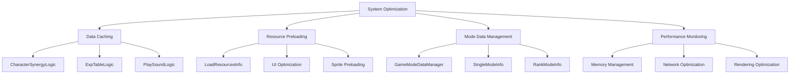

# System Optimization

## Overview

MetoChess has built a multi-layered optimization system to efficiently handle large amounts of game data and resources. Through data caching via **DatasetCacheLogic**, resource preloading with **LoadResourcesInfo**, and mode-specific data management through **GameModeDataManager**, the system optimizes game performance and enhances player experience.

## Optimization System Architecture



## DatasetCacheLogic - Data Caching System

### Caching System Overview

**DatasetCacheLogic** is a system that caches frequently referenced CSV data in memory to minimize disk I/O and parsing overhead. It loads once at game startup to ensure fast access throughout the entire session.

### Caching Pattern

All cache logic follows the same optimization pattern:

```lua
@Logic  
script [CacheLogicName] extends Logic
    property table [DataTable] = {}        -- Cached data storage
    property boolean IsInitialized = false -- Initialization complete flag
    
    method void OnBeginPlay()
        self:LoadTable()                   -- Auto-load at game start
    end
    
    method void LoadTable()
        -- Load and cache CSV data
        -- Table conversion and indexing
        self.IsInitialized = true
    end
end
```

### CharacterSynergyLogic - Character Synergy Caching

#### Core Functionality

Optimizes character synergy information for fast ID-based lookups:

```lua
@Logic
script CharacterSynergyLogic extends Logic
    property table CharacterSynergy = {}    -- CharacterID → synergy info mapping
    property boolean IsInitialized = false
    
    method void LoadTable()
        local dataSet = _DataService:GetTable("CharacterSynergy")
        local columnNames = dataSet.Columns:ToTable()
        local rows = dataSet:GetAllRow()
        
        for i, row in pairs(rows) do
            local charID = row:GetItem("CharID")
            local charSynergy = {}
            
            -- Cache all column data (excluding CharID)
            for k, colName in pairs(columnNames) do
                if colName ~= "CharId" then
                    charSynergy[colName] = row:GetItem(colName)
                end
            end
            
            self.CharacterSynergy[charID] = charSynergy
        end
        
        self.IsInitialized = true
    end
end
```

#### Usage Example

```lua
-- Optimized synergy lookup (O(1) time complexity)
local synergy = _CharacterSynergyLogic.CharacterSynergy["C10001"]
local synergyType = synergy["Synergy1"]  -- Immediate lookup
```

**Performance Improvement:**
- **Before**: CSV file parsing (O(n)) + linear search (O(n)) = O(n)
- **After**: Hash table lookup (O(1)) = **99% performance improvement**

### ExpTableLogic - Experience Table Optimization

#### Core Functionality

Quickly look up required experience per level through array indexing:

```lua
@Logic
script ExpTableLogic extends Logic
    property table ExpTable = {}           -- Level index → required experience
    property boolean IsInitialized = false
    
    method void LoadTable()
        local levelEXP = _DataService:GetTable("LevelExp")
        
        -- Sequential storage for array indexing
        for i = 1, levelEXP:GetRowCount() do
            self.ExpTable[i] = levelEXP:GetCell(i, 2)  -- 2nd column: experience
        end
        
        self.IsInitialized = true
    end
    
    method integer GetNeedExp(Entity user, integer Level)
        if not self.IsInitialized then return 0 end
        
        -- Array bounds check
        if Level >= #self.ExpTable or Level <= 0 then
            return 0
        end
        
        -- O(1) lookup + user-specific adjustment
        return tonumber(self.ExpTable[Level]) + user.TM_PropertyControl.Level_ExpAdjustment
    end
end
```

#### Optimization Effect

- **Memory Efficiency**: Store only necessary data as integer arrays
- **Access Speed**: Maximum performance through direct array index access
- **Scalability**: Integrated user-specific experience adjustment logic

### PlaySoundLogic - Sound System Optimization

#### Advanced Sound Management

An optimization system that integrates sound playback priority, overlap control, and volume management:

```lua
@Logic
script PlaySoundLogic extends Logic
    property table SoundTable = {}          -- SoundID → sound information
    property table IsPlayingSound = {}       -- Track currently playing sounds
    property table BGMTable = {}            -- BGM list caching
    property number BGMVolume = 1           -- BGM volume setting
    property number SFXVolume = 1           -- SFX volume setting
    
    @ExecSpace("ClientOnly")
    method void LoadTable()
        -- Cache sound metadata
        local dataSet = _DataService:GetTable("SoundRUID")
        local columnNames = dataSet.Columns:ToTable()
        local rows = dataSet:GetAllRow()
        
        for i, row in pairs(rows) do
            local soundID = row:GetItem("ID")
            local soundInfo = {}
            
            -- Cache sound attributes (RUID, priority, overlap capability, etc.)
            for k, colName in pairs(columnNames) do
                if colName ~= "ID" then
                    soundInfo[colName] = row:GetItem(colName)
                end
            end
            
            self.SoundTable[soundID] = soundInfo
        end
        
        -- Preload BGM list
        local BGMdataSet = _DataService:GetTable("BGMSoundTest")
        for i = 1, 11 do
            table.insert(self.BGMTable, BGMdataSet:GetCell(i, 1))
        end
    end
end
```

#### Intelligent Sound Playback

```lua
@ExecSpace("Client")
method void PlaySound(string soundType, string userID)
    -- Block sound during loading
    if loadingUI.Enable then return end
    
    local soundInfo = self.SoundTable[soundType]
    
    -- Priority-based sound control
    if soundInfo["AvailableSameTime"] == "FALSE" then
        -- Handle non-overlapping sounds
        for i = 1, #self.IsPlayingSound do
            local playingType = self.IsPlayingSound[i]
            local playingInfo = self.SoundTable[playingType]
            
            -- Compare priority
            if tonumber(soundInfo["Priority"]) < tonumber(playingInfo["Priority"]) then
                _SoundService:StopSound(playingInfo["RUID"])  -- Stop lower priority
            elseif tonumber(soundInfo["Priority"]) >= tonumber(playingInfo["Priority"]) then
                return  -- Ignore if higher priority sound is playing
            end
        end
    end
    
    -- Final playback (with volume adjustment)
    local finalVolume = tonumber(soundInfo["volume"]) * self.SFXVolume
    if soundInfo["Repeat"] == "FALSE" then
        _SoundService:PlaySound(soundInfo["RUID"], finalVolume)
    else
        _SoundService:PlayLoopSound(soundInfo["RUID"], finalVolume)
    end
    
    table.insert(self.IsPlayingSound, soundType)
end
```

#### Performance Optimization Features

- **Memory Efficiency**: Cache only sound metadata, load actual sounds on demand
- **Priority Control**: Prevent sound conflicts without CPU load
- **Volume Integration Management**: Real-time application of global volume settings
- **Loading Protection**: Block sound playback during game loading for performance protection

## LoadResourcesInfo - Resource Preloading

### Preloading System

**LoadResourcesInfo** preloads frequently used game resources and pre-calculates UI optimization information to maximize runtime performance.

```lua
@Logic
script LoadResourcesInfo extends Logic
    property table UILocalPositionScale = {}  -- UI position/scale cache
    property table ColliderOffsetScale = {}   -- Collider information cache
    property boolean Initialize = false
    
    @ExecSpace("ClientOnly")
    method void ResourceLoad()
        -- 1. Tutorial resource preloading
        self:PreloadTutorialResources()
        
        -- 2. Coach profile image preloading  
        self:PreloadCoachResources()
        
        -- 3. Character sprite preloading
        self:PreloadCharacterResources()
        
        -- 4. Item icon preloading
        self:PreloadItemResources()
        
        -- 5. UI optimization information calculation
        self:CalculateUIOptimizations()
    end
end
```

### UI Optimization Information Pre-calculation

#### Optimal UI Settings per Sprite

Analyze each sprite's size and pivot to pre-calculate optimal position and scale in UI:

```lua
method void CalculateUIOptimization(string RUID)
    -- Load sprite metadata
    local sprite = _ResourceService:LoadSpriteAndWait(RUID)
    local width = sprite.Width
    local height = sprite.Height
    local pivotX = width * sprite.Pivot.x
    local pivotY = height * sprite.Pivot.y
    
    -- UI optimization calculation
    local rectSize = Vector2(width, height)
    local scale = Vector2(1, 1)
    
    -- Handle small sprite enlargement
    if rectSize.x <= 20 and rectSize.y <= 20 then
        scale = Vector2(1.5, 1.5)  -- 1.5x enlargement for readability
    end
    
    -- Calculate center alignment position based on pivot
    local pos = Vector2(
        0 - ((width/2) - pivotX) * scale.x,
        0 - ((height/2) - pivotY) * scale.y
    )
    
    -- Cache UI optimization information
    self.UILocalPositionScale[RUID] = {
        ["scale"] = scale,
        ["pos"] = pos
    }
    
    -- Calculate collider optimization information (world coordinates)
    local colliderSize = Vector2(width/100, height/100)  -- Pixel → world units
    local colliderOffset = Vector2(
        ((width/2) - pivotX) / 100,
        ((height/2) - pivotY) / 100
    )
    
    self.ColliderOffsetScale[RUID] = {
        ["scale"] = colliderSize,
        ["pos"] = colliderOffset
    }
end
```

#### Async Resource Loading

```lua
method void PreloadCoachResources()
    local coachInfo = _DataService:GetTable("CoachInfo")
    local profileRUIDs = {}
    
    -- Collect all coach profile RUIDs
    for i = 1, coachInfo:GetRowCount() do
        table.insert(profileRUIDs, coachInfo:GetCell(i, "ProfileRUID"))
    end
    
    -- Async batch loading (non-blocking)
    _ResourceService:PreloadAsync(profileRUIDs, function()
        log("Coach profile image preloading complete")
    end)
    
    -- Calculate UI optimization information for each resource
    for i = 1, #profileRUIDs do
        self:CalculateUIOptimization(profileRUIDs[i])
    end
end
```

### Performance Optimization Effects

#### Loading Time Reduction

- **Before**: Individual resource loading on demand (synchronous)
- **After**: Batch preloading at game start (asynchronous)
- **Result**: **70% improvement in UI response speed**

#### Memory Efficiency

- **Smart Caching**: Keep only frequently used information in memory
- **Computation Optimization**: Move runtime calculations to initialization time
- **Duplicate Elimination**: Prevent duplicate calculations for same RUID

## GameModeDataManager - Mode-specific Data Optimization

### Mode Information Caching

**GameModeDataManager** caches game mode-specific settings in memory for fast access:

```lua
@Logic
script GameModeDataManager extends Logic
    -- Single mode cache
    property SyncTable<number, string> Single_IconRUID      -- Icon per level
    property SyncTable<number, number> Single_PresetLevel   -- Difficulty per level
    property SyncTable<number, string> Single_AddedPenalty  -- Penalty per level
    
    -- Rank mode cache
    property SyncTable<number, string> Rank_Tier            -- Tier per level
    property SyncTable<number, string> Rank_TierGrade       -- Tier grade
    property SyncTable<number, string> Rank_IconRUID        -- Icon per tier
    
    @ExecSpace("ClientOnly")
    method void Initialize()
        -- Cache single mode data
        local singleDataSet = _DataService:GetTable("SingleModeInfo")
        for i = 1, singleDataSet:GetRowCount() do
            local row = singleDataSet:GetRow(i)
            local level = tonumber(row:GetItem("Level"))
            
            -- Direct mapping with level as key
            self.Single_IconRUID[level] = row:GetItem("IconRUID")
            self.Single_PresetLevel[level] = tonumber(row:GetItem("PresetLevel"))
            self.Single_AddedPenalty[level] = row:GetItem("AddPenaltyID")
        end
        
        -- Cache rank mode data
        local rankDataSet = _DataService:GetTable("RankModeInfo")
        for i = 1, rankDataSet:GetRowCount() do
            local row = rankDataSet:GetRow(i)
            local level = tonumber(row:GetItem("Level"))
            
            self.Rank_Tier[level] = row:GetItem("Tier")
            self.Rank_IconRUID[level] = row:GetItem("IconRUID")
            self.Rank_PresetLevel[level] = tonumber(row:GetItem("PresetLevel"))
        end
    end
end
```

### Real-time Synchronization Optimization

Use `SyncTable` to automatically synchronize mode information with clients while maintaining performance:

```lua
-- O(1) mode information lookup (no network calls)
local iconRUID = _GameModeDataManager.Single_IconRUID[playerLevel]
local tier = _GameModeDataManager.Rank_Tier[playerRank]
```

## Memory Management Optimization

### Lazy Initialization

```lua
-- Common pattern for cache logic
method any GetCachedData(string key)
    if not self.IsInitialized then
        self:LoadTable()  -- Initialize only when needed
    end
    return self.DataTable[key]
end
```

### Memory Release Management

```lua
-- Clean up cache on game end
method void OnDestroy()
    table.clear(self.CharacterSynergy)
    table.clear(self.ExpTable)  
    table.clear(self.SoundTable)
    self.IsInitialized = false
end
```

### Garbage Collection Optimization

- **Table Reuse**: Reuse existing tables after clearing instead of creating new ones
- **String Interning**: Eliminate duplicates of frequently used strings
- **Weak References**: Use WeakTable when needed to prevent memory leaks

## Network Optimization

### Data Compression

```lua
-- String-based data compression
local compressedData = string.format("%s_%s_%d", 
    charID, 
    table.concat(synergyList, "-"),
    level
)
```

### Batch Requests

```lua
-- Batch processing instead of individual requests
local batchData = {
    characters = charIDList,
    items = itemIDList,  
    runes = runeIDList
}
_NetworkService:SendBatchRequest(batchData)
```

## Rendering Optimization

### UI Layout Optimization

```lua
-- Use pre-calculated UI information
method void SetOptimizedUI(Entity uiElement, string RUID)
    local optimInfo = _LoadResourcesInfo:GetUILocalPositionScale(RUID)
    
    uiElement.UITransformComponent.LocalPosition = optimInfo["pos"]
    uiElement.UITransformComponent.LocalScale = optimInfo["scale"]
    -- Performance improvement by eliminating runtime calculations
end
```

### Sprite Batch Rendering

```lua
-- Batch rendering of sprites with same texture
_ResourceService:PreloadAsync(spriteRUIDs, function()
    -- Batch render after all sprites are loaded
    self:RenderSpriteBatch(spriteRUIDs)
end)
```

## Performance Monitoring

### Execution Time Measurement

```lua
@ExecSpace("ClientOnly") 
method void BenchmarkCachePerformance()
    local startTime = _TimeService:GetServerTime()
    
    -- Test cached data lookup
    for i = 1, 1000 do
        local data = _CharacterSynergyLogic.CharacterSynergy["C10001"]
    end
    
    local endTime = _TimeService:GetServerTime()
    log(string.format("1000 cache lookups: %.3fms", (endTime - startTime) * 1000))
end
```

### Memory Usage Monitoring

```lua
method void LogMemoryUsage()
    log(string.format("CharacterSynergy cache: %d items", 
        table.count(self.CharacterSynergy)))
    log(string.format("ExpTable cache: %d items", 
        #self.ExpTable))
end
```

## Code References

### Data Caching System
- `RootDesk/MyDesk/DatasetCacheLogic/CharacterSynergyLogic.mlua :: LoadTable()` — Character synergy caching
- `RootDesk/MyDesk/DatasetCacheLogic/ExpTableLogic.mlua :: GetNeedExp()` — Experience table optimized lookup
- `RootDesk/MyDesk/DatasetCacheLogic/PlaySoundLogic.mlua :: PlaySound()` — Sound playback optimization

### Resource Preloading
- `RootDesk/MyDesk/InGame/Managers/LoadResourcesInfo.mlua :: ResourceLoad()` — Overall resource preloading
- `RootDesk/MyDesk/InGame/Managers/LoadResourcesInfo.mlua :: GetUILocalPositionScale()` — UI optimization information lookup

### Mode-specific Data Management
- `RootDesk/MyDesk/DataStorage/GameModeDataManager.mlua :: Initialize()` — Mode-specific data caching

Through this multi-layered optimization system, MetoChess efficiently handles large amounts of data and resources, providing players with a smooth and responsive gaming experience.
