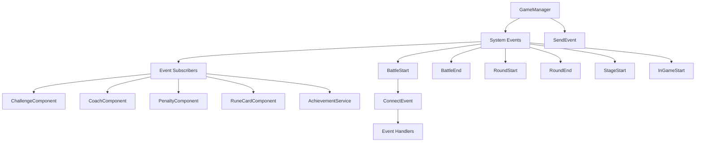

# System Events

## Overview

MetoChess system events are the core of the **event-driven architecture** that manages the game's major state changes and lifecycle. Through 13 system-level events defined in the **Events/SystemEvents** folder, they systematically handle each stage of game progression and achieve loose coupling between various components.

## Event System Architecture



## System Event List

### Game Lifecycle Events

| Event Name | Trigger Point | Main Data | Role |
|------------|---------------|-----------|------|
| **InGameStart** | Upon entering in-game | - | Game session start notification |
| **InGameDataLoad** | During in-game data loading | - | Restore saved game state |
| **StageStart** | New stage start | - | Stage level initialization |
| **RoundStart** | Round start | RoundType, Round, Stage | Prepare systems for each round |
| **RoundEnd** | Round end | - | Process round results |

### Battle Related Events

| Event Name | Trigger Point | Main Data | Role |
|------------|---------------|-----------|------|
| **BattleSet** | When battle preparation complete | - | Battle setup completion notification |
| **BattleStart** | Battle start | RoundType | Battle start processing |
| **BattleEnd** | Battle end | RoundType | Battle result aggregation |
| **BattleWin** | Battle victory | - | Victory rewards and effects |
| **BattleLose** | Battle defeat | - | Defeat penalty processing |
| **BattleOverTime** | Battle overtime | - | Overtime special processing |
| **BattleReward** | Battle reward distribution | rewardTable | Reward data delivery |

### Special System Events

| Event Name | Trigger Point | Main Data | Role |
|------------|---------------|-----------|------|
| **SetActiveRune** | Rune card activation | - | Apply rune card effects |

## Event Definition Structure

### Basic Event Structure

All system events are defined through **@Event** annotation and **EventType** inheritance:

```lua
@Event
script [EventName] extends EventType
    -- Define event-specific required data
    property [DataType] [PropertyName] = [DefaultValue]
end
```

### Major Event Definition Examples

#### BattleStart - Battle Start Event

```lua
@Event
script BattleStart extends EventType
    property string RoundType = ""  -- "Battle", "Monster" etc. round type
end
```

#### BattleReward - Battle Reward Event

```lua
@Event
script BattleReward extends EventType
    property table rewardTable = {}  -- Detailed reward information
    -- rewardTable structure example:
    -- {
    --   ["Default"] = 5,        -- Basic gold
    --   ["Interest"] = 2,       -- Interest gold  
    --   ["WinningBonus"] = 3,   -- Victory bonus
    --   ["Streak"] = 1          -- Win streak bonus
    -- }
end
```

#### RoundStart - Round Start Event

```lua
@Event
script RoundStart extends EventType
    property string RoundType = ""  -- Round type
    property number Round = 0       -- Current round number
    property number Stage = 0       -- Current stage number
end
```

## Event Triggering (Publisher)

### Event Triggering in GameManager

**GameManager** triggers appropriate system events at major game progression points:

```lua
-- At round start
@ExecSpace("ServerOnly")
method void Ready()
    -- ... round preparation logic ...
    
    -- Trigger round start event
    user:SendEvent(RoundStart(self.RoundType, self.Round, self.Stage))
end

-- At battle start  
@ExecSpace("ServerOnly")
method void StartBattle()
    self.BattleTime = 30
    _UnitSetLogic_New:BattleSetting_OnBattlePhase(self.Entity.OwnerId)
    
    -- Trigger battle start event
    self.Entity:SendEvent(BattleStart(self.RoundType))
end

-- At battle end
@ExecSpace("ServerOnly") 
method void EndBattle()
    -- ... battle result processing ...
    
    -- Trigger battle end event
    self.Entity:SendEvent(BattleEnd(self.RoundType))
    
    -- Notify achievement system of battle end
    _AchievementService:BattleEnd(win, self.ModeType, self.ModeLevel, self.Stage, self.Round, self.Round8_3Num, user)
end
```

### Event Triggering Patterns

#### 1. Simple Notification Events

```lua  
-- Notify state changes without data
self.Entity:SendEvent(InGameStart())
self.Entity:SendEvent(BattleOverTime())
```

#### 2. Data Delivery Events

```lua
-- Deliver necessary game data together
self.Entity:SendEvent(BattleStart("Battle"))
self.Entity:SendEvent(RoundStart("Monster", 5, 2))
self.Entity:SendEvent(BattleReward(rewardData))
```

## Event Subscription (Subscriber)

### Event Subscription by Component

Various game components subscribe to necessary system events to execute appropriate logic at the right time.

#### ChallengeComponent - Challenge System

```lua
@ExecSpace("ServerOnly")
method void OnBeginPlay()
    local userEntity = self.Entity.Parent
    
    -- Subscribe to game lifecycle events
    userEntity:ConnectEvent(InGameStart, function(event) 
        self:StartGameHandler(event) 
    end)
    userEntity:ConnectEvent(StageStart, function(event) 
        self:StartStageHandler(event) 
    end)
    userEntity:ConnectEvent(RoundStart, function(event) 
        self:StartRoundHandler(event) 
    end)
    
    -- Subscribe to battle related events
    userEntity:ConnectEvent(BattleStart, function(event) 
        self:StartBattleHandler(event) 
    end)
    userEntity:ConnectEvent(BattleEnd, function(event) 
        self:EndBattleHandler(event) 
    end)
    userEntity:ConnectEvent(BattleWin, function(event) 
        self:WinBattleHandler(event) 
    end)
    userEntity:ConnectEvent(BattleLose, function(event) 
        self:LoseBattleHandler(event) 
    end)
end
```

#### CoachComponent - Coach System

```lua
@ExecSpace("ServerOnly")
method void OnBeginPlay()
    local userEntity = self.Entity.Parent.Parent
    
    -- Same event subscription pattern
    userEntity:ConnectEvent(InGameStart, startGameAct)
    userEntity:ConnectEvent(RoundStart, startRoundAct) 
    userEntity:ConnectEvent(BattleStart, startBattleAct)
    
    -- Process coach-specific special effects
    userEntity:ConnectEvent(BattleWin, winBattleAct)
    userEntity:ConnectEvent(RoundEnd, endRoundAct)
end
```

#### PenaltyComponent - Penalty System

```lua
@ExecSpace("ServerOnly")
method void OnBeginPlay()
    local userEntity = self.Entity.Parent.Parent
    
    -- Subscribe to events for penalty application timing
    userEntity:ConnectEvent(RoundStart, function(event)
        self:ApplyRoundPenalties(event)
    end)
    userEntity:ConnectEvent(BattleStart, function(event)
        self:ApplyBattlePenalties(event)  
    end)
end
```

#### RuneCardComponent - Rune Card System

```lua
@ExecSpace("ServerOnly")
method void OnBeginPlay() 
    local userEntity = self.Entity.Parent.Parent
    
    -- Subscribe to rune card effect trigger timing
    userEntity:ConnectEvent(StageStart, startStageAct)
    userEntity:ConnectEvent(RoundStart, startRoundAct)
    userEntity:ConnectEvent(BattleStart, startBattleAct)
    
    -- Special rune card events
    userEntity:ConnectEvent(SetActiveRune, setActiveRuneAct)
end
```

## Event Processing Patterns

### 1. State-Based Processing

```lua
-- Conditional processing based on game state at event trigger
method void StartRoundHandler(RoundStart event)
    if event.RoundType == "Monster" then
        self:HandleMonsterRound(event.Round, event.Stage)
    elseif event.RoundType == "Battle" then  
        self:HandleBattleRound(event.Round, event.Stage)
    end
end
```

### 2. Data Collection and Processing

```lua
-- Detailed processing using event data
method void BattleRewardHandler(BattleReward event)
    local rewards = event.rewardTable
    
    -- Process each reward type
    if rewards["Default"] > 0 then
        self:ProcessDefaultReward(rewards["Default"])
    end
    if rewards["WinningBonus"] > 0 then
        self:ProcessWinBonus(rewards["WinningBonus"])
    end
end
```

### 3. Chain Event Processing

```lua
-- One event triggers other events
method void BattleEndHandler(BattleEnd event)
    -- Update battle statistics
    self:UpdateBattleStatistics(event)
    
    -- Check challenge progress  
    self:CheckChallengeProgress(event)
    
    -- Schedule next event
    if self:ShouldProceedToNextRound() then
        _TimerService:SetTimerOnce(function()
            self.Entity:SendEvent(RoundStart(nextRoundType, nextRound, nextStage))
        end, 2.0)
    end
end
```

## Event System Use Cases

### 1. Challenge System

```lua
-- Track challenge progress through various system events
userEntity:ConnectEvent(BuyUnit, function(event)
    self:CheckUnitPurchaseChallenges(event)
end)

userEntity:ConnectEvent(BattleWin, function(event) 
    self:CheckWinStreakChallenges(event)
end)

userEntity:ConnectEvent(RoundEnd, function(event)
    self:CheckSurvivalChallenges(event)
end)
```

### 2. Coach Effect System

```lua  
-- Trigger coach-specific special effects at appropriate timing
userEntity:ConnectEvent(RoundStart, function(event)
    if self.ActiveCoach == "ExpBoostCoach" then
        self:ApplyExpBoost(event.Round)
    end
end)

userEntity:ConnectEvent(BattleStart, function(event)
    if self.ActiveCoach == "AttackBoostCoach" then
        self:ApplyAttackBoost()
    end
end)
```

### 3. Penalty System

```lua
-- Apply penalties according to game progression
userEntity:ConnectEvent(RoundStart, function(event)
    for penaltyID, penalty in pairs(self.ActivePenalties) do
        penalty:ApplyRoundEffect(event.Round, event.Stage)
    end
end)

userEntity:ConnectEvent(BattleLose, function(event)
    for penaltyID, penalty in pairs(self.ActivePenalties) do
        penalty:ApplyLossEffect()
    end  
end)
```

## Event System Optimization

### 1. Conditional Subscription

```lua
-- Performance optimization by subscribing to events only when necessary
method void UpdateEventSubscriptions()
    if self.HasActiveChallenges then
        userEntity:ConnectEvent(BattleStart, battleStartHandler)
    else
        userEntity:DisconnectEvent(BattleStart, battleStartHandler)
    end
end
```

### 2. Event Batch Processing

```lua
-- Process multiple related events in batches
property table PendingEvents = {}

method void QueueEvent(EventType event)
    table.insert(self.PendingEvents, event)
end

method void ProcessEventBatch()
    for _, event in pairs(self.PendingEvents) do
        self:ProcessEvent(event)
    end
    table.clear(self.PendingEvents)
end
```

### 3. Asynchronous Event Processing

```lua
-- Execute heavy processing asynchronously to prevent game blocking
method void HeavyEventHandler(SystemEvent event)
    _TimerService:SetTimerOnce(function()
        self:ProcessHeavyOperation(event)
    end, 0.1)
end
```

## Event Debugging and Monitoring

### Event Logging

```lua
-- Event logging for development/debugging
method void LogSystemEvent(EventType event)
    local eventName = event.GetTypeName()
    local timestamp = _TimeService:GetServerTime()
    log(string.format("[%f] SystemEvent: %s", timestamp, eventName))
    
    -- Detailed event data logging
    if eventName == "RoundStart" then
        log(string.format("  RoundType: %s, Round: %d, Stage: %d", 
            event.RoundType, event.Round, event.Stage))
    end
end
```

### Event Sequence Tracking

```lua
-- Track event occurrence sequence to analyze game flow
property table EventHistory = {}

method void TrackEvent(EventType event)
    table.insert(self.EventHistory, {
        name = event.GetTypeName(),
        timestamp = _TimeService:GetServerTime(),
        data = event
    })
    
    -- Keep only 100 events maximum (memory management)
    if #self.EventHistory > 100 then
        table.remove(self.EventHistory, 1)
    end
end
```

## Code References

### System Event Definitions
- `RootDesk/MyDesk/Events/SystemEvents/BattleStart.mlua` — Battle start event
- `RootDesk/MyDesk/Events/SystemEvents/BattleEnd.mlua` — Battle end event
- `RootDesk/MyDesk/Events/SystemEvents/RoundStart.mlua` — Round start event  
- `RootDesk/MyDesk/Events/SystemEvents/BattleReward.mlua` — Battle reward event

### Event Triggering
- `RootDesk/MyDesk/InGame/Managers/GameManager.mlua :: Ready()` — Round start event triggering
- `RootDesk/MyDesk/InGame/Managers/GameManager.mlua :: StartBattle()` — Battle start event triggering
- `RootDesk/MyDesk/InGame/Managers/GameManager.mlua :: EndBattle()` — Battle end event triggering

### Event Subscription and Processing
- `RootDesk/MyDesk/InGame/Challenge/ChallengeComponent.mlua :: OnBeginPlay()` — Challenge system event subscription
- `RootDesk/MyDesk/InGame/Coach/CoachComponent.mlua :: OnBeginPlay()` — Coach system event subscription
- `RootDesk/MyDesk/InGame/Penalty/PenaltyComponent.mlua :: OnBeginPlay()` — Penalty system event subscription

Through this systematic system events approach, MetoChess has greatly enhanced maintainability and extensibility by modularizing complex game logic and minimizing dependencies between systems.
