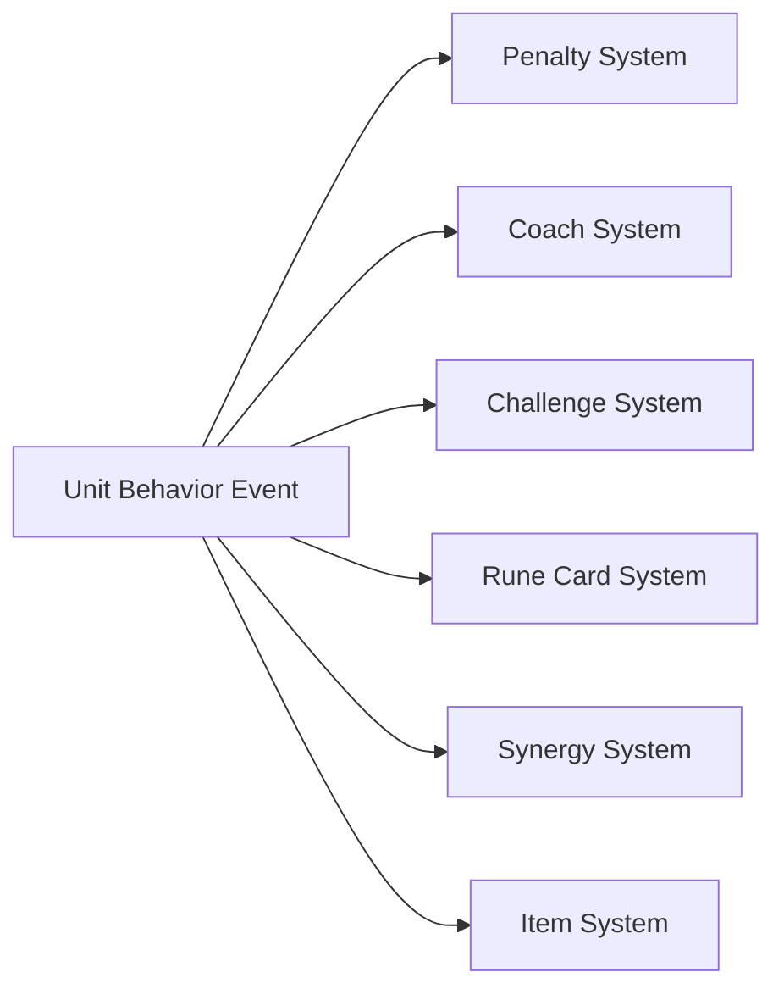
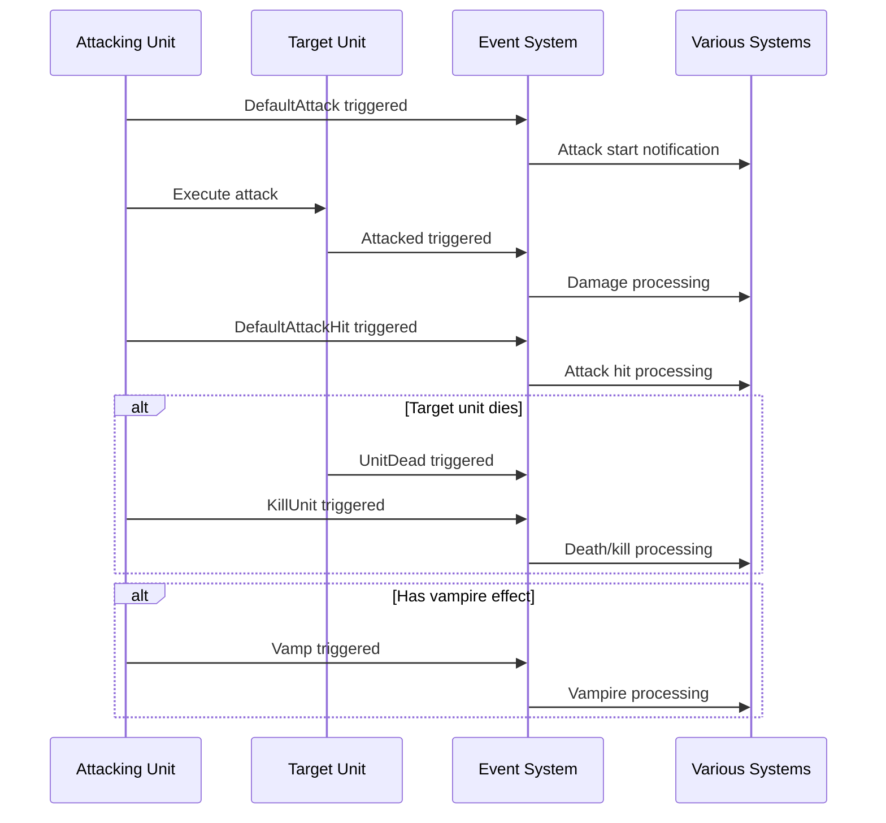
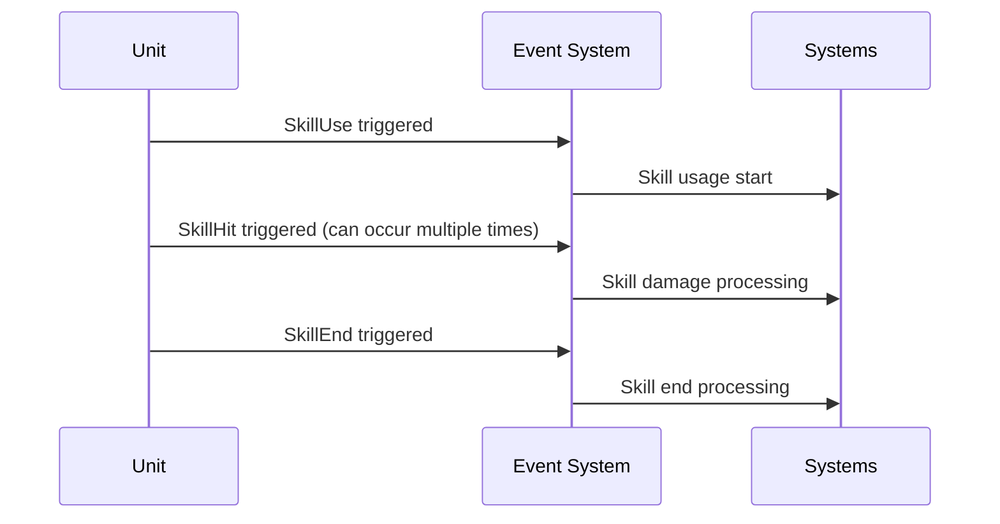

# Core Architecture - Event System - Unit Behavior Events

## Overview

The Unit Behavior Events system in MetoChess is a core mechanism that tracks and processes all unit actions and state changes occurring during combat. Through 11 events defined in the `Events/UnitBehaviorEvents` folder, it meticulously manages every moment of combat including attacks, skill usage, taking damage, and death.

This system serves as a centralized event hub that allows various game systems such as penalties, coach, challenges, and rune cards to react to unit behaviors and execute their respective logic.

## Event Types and Structure

### Attack-Related Events

#### 1. DefaultAttack
Event triggered when a basic attack begins.
```
- attacker: Attacker entity
- target: Attack target entity
```

#### 2. DefaultAttackHit
Event triggered when a basic attack actually hits.

#### 3. Attacked
The most comprehensive damage event triggered when a unit takes damage.
```
- Attacker: Attacker entity
- Target: Damaged unit entity
- InitialDamages: Initial damage values (table)
- FinalDamages: Final damage values (table)
- IsCritical: Whether it's a critical hit
- AttackType: Attack type (string)
```

### Skill-Related Events

#### 4. SkillUse
Event triggered when a unit uses a skill.
```
- Attacker: Skill user entity
```

#### 5. SkillHit
Event triggered when a skill actually hits.
```
- Attacker: Skill user entity
- Target: Skill target entity
- InitialDamages: Initial damage values (table)
- FinalDamages: Final damage values (table)
- IsCritical: Whether it's a critical hit
- HitCount: Number of hits for continuous damage skills
```

#### 6. SkillEnd
Event triggered when skill usage is completed.

### Status Change Events

#### 7. ChangeHPAmount
Event triggered when a unit's HP changes.
```
- Attacker: Entity causing the change
- Target: Entity receiving the change
- SetDamage: Set damage value
- TargetHPPer: Target's HP percentage
```

#### 8. PlayAttack
Event triggered when attack animations or effects are played.

### Survival-Related Events

#### 9. UnitDead
Event triggered when a unit dies.
```
- Attacker: Entity that made the kill
- Target: Deceased entity
- DeadTile: Tile where the deceased unit last stood
```

#### 10. KillUnit
Event triggered when a unit kills another unit.
```
- Attacker: Entity that made the kill
- Target: Killed entity
- DeadTile: Tile where the killed unit stood
- AttackType: Type of kill
```

### Special Effect Events

#### 11. Vamp
Event triggered when vampire effects activate.
```
- VampRate: Vampire rate
- VampAmount: Vampire amount
- Attacker: Unit that vamped
- Victim: Unit that took damage
```

## Event Processing Mechanism

### Event Connection

Each system connects to unit behavior events of interest to perform its own logic:



### Major Event Processing Systems

#### 1. Penalty System (`PenaltyComponent.mlua`)
- Monitor all major unit behavior events
- Check and apply penalty conditions
- Process restrictions for specific actions

#### 2. Coach System (`CoachComponent.mlua`) 
- Analyze unit behavior patterns
- Apply coach-specific special effects
- Collect battle statistics

#### 3. Challenge System (`ChallengeComponent.mlua`)
- Check achievement of specific action conditions
- Update challenge progress
- Process reward distribution

#### 4. Rune Card System (`RuneCardComponent.mlua`)
- Check rune card effect trigger conditions
- Activate special abilities
- Apply set effects

#### 5. Synergy System (`UnitSynergy.mlua`)
- Trigger synergy effects
- Process unit status changes
- Apply team buffs/debuffs

#### 6. Item System (`UnitItem.mlua`)
- Trigger item effects
- Activate equipped item special abilities

## Event Trigger Timing

### Battle Flow and Event Triggering



### Event Flow During Skill Usage



## Event Use Cases

### 1. Challenge Progress Tracking
- "Kill 10 enemy units" → Count `KillUnit` events
- "Successful critical attacks" → Check `IsCritical` in `Attacked` events
- "Kill enemies with skills" → Analyze correlation between `SkillHit` and `UnitDead`

### 2. Rune Card Effect Activation
- "Additional effect on attack" → Apply special effects in `DefaultAttack` events
- "Create shield when damaged" → Activate protective effects in `Attacked` events

### 3. Synergy Effect Processing
- "Rage when ally unit dies" → Apply team buffs in `UnitDead` events
- "Mana recovery when using skills" → Provide mana bonus in `SkillUse` events

### 4. Statistics and Analysis
- Record all actions for battle statistics
- Collect damage and kill data for balancing

## Performance Optimization

### Event Handler Optimization
- `@ExecSpace("ServerOnly")`: Event handlers processed only on server
- `@EventSender("Self")`: Limit event trigger scope
- Minimize unnecessary event connections to improve performance

### Data Transmission Optimization
- Deliver only necessary data as event properties
- Process complex calculations in handlers, not at event trigger time

## Extensibility

### Adding New Events
When adding events for new unit behaviors or special effects:
1. Define new event in `Events/UnitBehaviorEvents/` folder
2. Declare necessary properties as `property`
3. Connect the event in related systems
4. Implement event trigger logic in appropriate components

### Cross-System Extension
For complex events that require simultaneous reactions from multiple systems, the existing event structure can be utilized to allow each system to process independently.

## Code References

- `RootDesk/MyDesk/Events/UnitBehaviorEvents/*.mlua` — All unit behavior event definitions
- `RootDesk/MyDesk/InGame/Penalty/PenaltyComponent.mlua :: ConnectEvent()` — Penalty system event connection
- `RootDesk/MyDesk/InGame/Coach/CoachComponent.mlua :: ConnectEvent()` — Coach system event connection
- `RootDesk/MyDesk/InGame/Challenge/ChallengeComponent.mlua :: ConnectEvent()` — Challenge system event connection
- `RootDesk/MyDesk/InGame/RuneCard/RuneCardComponent.mlua :: ConnectEvent()` — Rune card system event connection
- `RootDesk/MyDesk/InGame/Unit/01_UnitComponent/UnitSynergy.mlua :: HandleAttacked()` — Synergy system damage processing
- `RootDesk/MyDesk/InGame/Unit/01_UnitComponent/UnitItem.mlua :: HandleSkillUse()` — Item system skill usage processing
- `RootDesk/MyDesk/InGame/Unit/00_SkillComponent/C10014_MoonBunny_Skill.mlua :: HandleAttacked()` — Individual skill damage reaction
