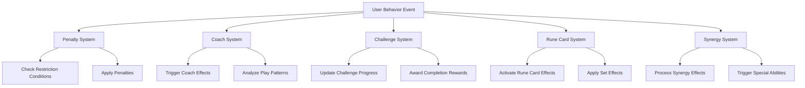
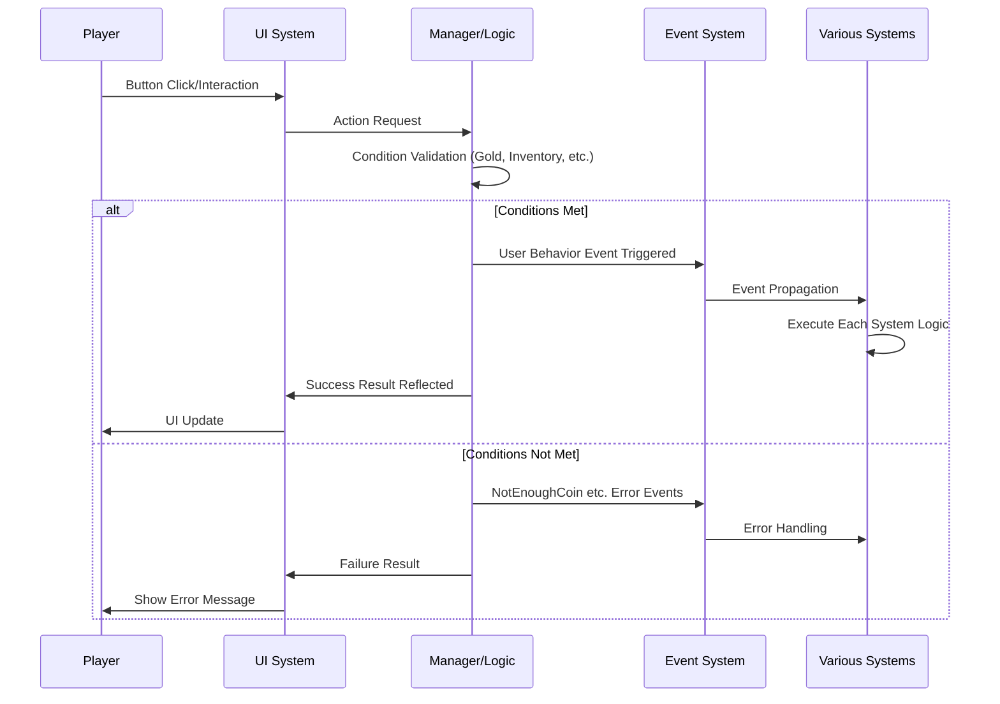
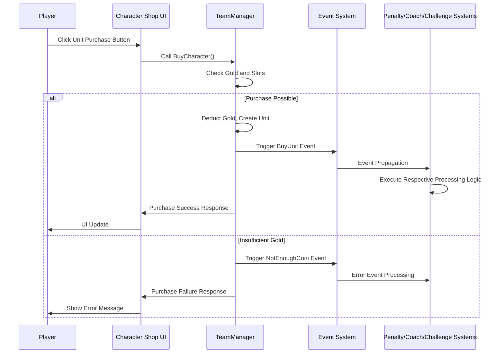
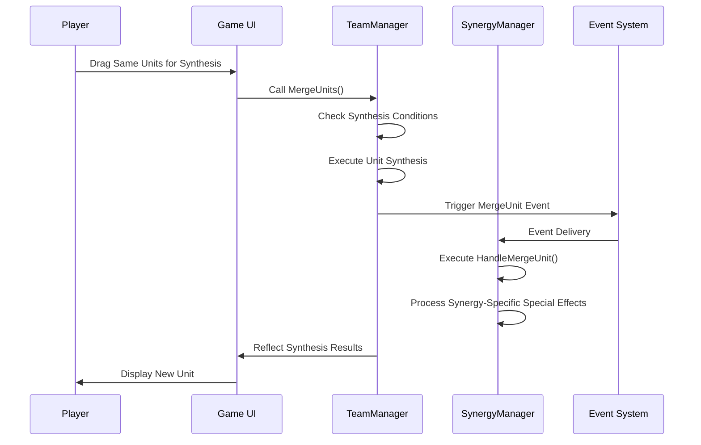

# Core Architecture - Event System - User Behavior Events

## Overview

The User Behavior Events system in MetoChess is a system that tracks and processes all intentional actions performed by players within the game. Through 19 events defined in the `Events/UserBehaviorEvents` folder, it systematically manages all of the player's gameplay behaviors including shop usage, unit management, item manipulation, and UI interactions.

This system serves as a core infrastructure for analyzing player behavior patterns, tracking challenge progress, collecting game balance data, and executing reactive logic for various game systems.

## Event Categories

### Shop and Purchase Related Events

#### 1. BuyUnit
Triggered when a player purchases a unit from the character shop.
```
- Unit: The purchased unit entity
- CharID: The purchased character ID
```

#### 2. BuyItem
Triggered when a player purchases an item from the item shop.
```
- (no properties)
```

#### 3. BuyRuneCard
Triggered when a player purchases a rune card from the rune card shop.
```
- RuneID: The purchased rune card ID
```

#### 4. BuyEXP
Triggered when a player purchases experience points.
```
- (no properties)
```

#### 5. NotEnoughCoin
Triggered when a player attempts to make a purchase but lacks sufficient coins.
```
- (no properties)
```

### Unit Management Events

#### 6. PlaceUnit
Triggered when a player places a unit.
```
- CharID: The placed character ID
```

#### 7. SetUnitOnTile
Triggered when a player sets a unit on a specific tile.
```
- setUnit: The unit entity to be set
- setTile: The destination tile entity
- nowTile: The current tile entity
```

#### 8. MergeUnit
Triggered when a player performs unit synthesis.
```
- MergedUnit: The synthesized unit entity
- TargetLevel: The target level
```

#### 9. SellUnit
Triggered when a player sells a unit.
```
- (no properties)
```

#### 10. LevelUpUnit
Triggered when a player levels up an individual unit.
```
- (no properties)
```

### Team Management Events

#### 11. LevelUpTeam
Triggered when a player levels up the entire team.
```
- SetLevel: The level set
```

### Item and Inventory Management Events

#### 12. EquipedItem
Triggered when a player equips an item to a unit.
```
- Unit: The unit entity that received the item
- ItemID: The equipped item ID
```

#### 13. CombinationItem
Triggered when a player performs item combination.
```
- (no properties)
```

#### 14. UseConsumableItem
Triggered when a player uses a consumable item.
```
- ItemID: The used item ID
```

#### 15. OpenItemBox
Triggered when a player opens an item box.
```
- (no properties)
```

### Rune Card Management Events

#### 16. SellRuneCard
Triggered when a player sells a rune card.
```
- (no properties)
```

#### 17. ChangeRuneCardOrder
Triggered when a player changes the order of rune cards.
```
- (no properties)
```

### Shop Management Events

#### 18. RerollCharacterShop
Triggered when a player rerolls the character shop.
```
- (no properties)
```

#### 19. LockShop
Triggered when a player locks the shop.
```
- (no properties)
```

## Event Processing System Structure

### Major Event Listener Systems



### Event Connection Patterns

Each major system connects to user behavior events of interest to execute their own logic:

#### 1. Penalty System (`PenaltyComponent.mlua`)
- `BuyUnit`: Check unit purchase restrictions
- `UseConsumableItem`: Limit consumable item usage

#### 2. Coach System (`CoachComponent.mlua`)
- `BuyUnit`: Coach-specific unit purchase bonuses
- `UseConsumableItem`: Trigger coach special effects

#### 3. Challenge System (`ChallengeComponent.mlua`)
- `BuyUnit`: "Purchase specific units" challenges
- `UseConsumableItem`: "Use consumable items" challenges

#### 4. Rune Card System (`RuneCardComponent.mlua`)
- `BuyUnit`: Rune card purchase bonus effects
- `UseConsumableItem`: Rune card special abilities

#### 5. Synergy System (`SynergyManager_New.mlua`)
- `MergeUnit`: Synergy-specific synthesis special effects

## Event Trigger Flow

### General User Action Processing



### Specific Event Use Cases

#### 1. Unit Purchase Flow



#### 2. Unit Synthesis Flow



## Event Utilization Areas

### 1. Gameplay Statistics Collection
- Analyze player purchase patterns
- Track unit usage frequency
- Survey item preferences
- Classify play styles

### 2. Challenge and Achievement System
- "Purchase 100 units" → Count `BuyUnit` events
- "Combine 10 items" → Track `CombinationItem` events
- "Purchase 5 rune cards" → Monitor `BuyRuneCard` events

### 3. Game Balance Data
- Which units are purchased most
- Which items are used most
- What strategies do players prefer

### 4. Dynamic Game System Reactions
- Apply coach-specific special bonuses
- Trigger rune card effects
- Activate penalty system
- Enable synergy special abilities

### 5. User Experience Improvement
- UI optimization based on player behavior patterns
- Personalized shop recommendations
- Adaptive tutorial system

## Event Extensibility

### Adding New User Behaviors
When adding events for new gameplay elements:

1. **Event Definition**: Create new event file in `Events/UserBehaviorEvents/` folder
2. **Property Design**: Define data properties needed for that behavior
3. **Trigger Point Implementation**: Add event triggering logic in relevant managers or UI
4. **Processing System Connection**: Connect the event in necessary systems
5. **Testing**: Verify that event triggering and processing work correctly

### Cross-System Event Processing
When a single user behavior affects multiple systems:
- Each system connects to the same event independently
- Minimize dependencies between event handlers
- Use event chaining for sequential processing when necessary

## Performance Optimization

### Event Processing Efficiency
- **Conditional Connection**: Only necessary systems connect to related events
- **Fast Failure**: Prevent unnecessary processing through condition validation
- **Batch Processing**: Group processing of similar events

### Data Collection Optimization
- **Sampling**: Log only necessary events, not all events
- **Compression**: Remove duplicate or unnecessary data
- **Asynchronous Processing**: Statistics collection that doesn't affect gameplay

## Code References

- `RootDesk/MyDesk/Events/UserBehaviorEvents/*.mlua` — All user behavior event definitions
- `RootDesk/MyDesk/InGame/Penalty/PenaltyComponent.mlua :: ConnectEvent(BuyUnit, ...)` — Penalty system purchase event handling
- `RootDesk/MyDesk/InGame/Coach/CoachComponent.mlua :: ConnectEvent(UseConsumableItem, ...)` — Coach system item usage handling
- `RootDesk/MyDesk/InGame/Challenge/ChallengeComponent.mlua :: ConnectEvent(BuyUnit, ...)` — Challenge system event tracking
- `RootDesk/MyDesk/InGame/RuneCard/RuneCardComponent.mlua :: ConnectEvent()` — Rune card system event reaction
- `RootDesk/MyDesk/InGame/Managers/SynergyManager_New.mlua :: HandleMergeUnit()` — Synergy system unit synthesis processing
- `RootDesk/MyDesk/InGame/Managers/TeamManager.mlua` — Team management and user behavior event sources
- `RootDesk/MyDesk/UIComponents/UI_Ingame/*.mlua` — UI user interaction handling and event triggering
