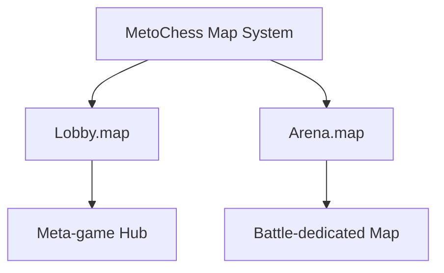

# Map Structure and Components

## Overview

MetoChess consists of 2 main maps, each designed for specific game purposes and functions. Based on **MapleStory Worlds** map system, they are structured using an entity-component architecture.

## Overall Map Configuration



## 1. Lobby.map - Meta-game Hub

### Map Role
**Lobby.map** is the **meta-game center** where players encounter when connecting to the game. All out-of-game activities and game mode selection take place here.

### Main Components

#### Basic Map Structure
```
Lobby/
├── Background/          # Background image
├── MapleMapLayer/      # MSW map layer
├── RectTileMap/        # Tile map system
├── SpawnLocation/      # Player spawn points (multiple)
└── bground/            # Additional background elements
```

#### NPC System
Various **NPC characters** are placed in the lobby to create atmosphere:

| NPC Name | Role | Component Configuration |
|----------|------|-------------------------|
| **npc-spiegelmann** | Main NPC | StateAnimation, ChatBalloon, NameTag |
| **npc-caster** | Commentator character | StateAnimation, ChatBalloon, NameTag |
| **npc-3fansLeft/Right** | Spectator NPC | StateAnimation, KinematicLayerOrder |
| **npc-noblesse** | Special NPC | Includes StateAnimation |

#### CustomCameraComponent Functionality
The Lobby map has **CustomCameraComponent** attached to handle map-specific UI control:

```lua
-- CustomCameraComponent :: OnBeginPlay()
if currentMapName == "Lobby" then
    ui_lobbyHUD.Enable = true           -- Activate lobby main UI
    ui_lobbycurrencyHUD.Enable = true   -- Activate currency display UI
    
    -- Deactivate arena UIs
    ui_arena_Default.Enable = false
    ui_arena_Ready.Enable = false
    ui_arena_battle.Enable = false
end
```

### Map Configuration Information
- **EntryKey**: `map://lobby`
- **Main Components**: MapComponent, FootholdComponent, CustomCameraComponent, SoundComponent
- **Spawn Points**: Multiple SpawnLocation entities supporting simultaneous multi-player connections

## 2. Arena.map - Battle-dedicated Map

### Map Role  
**Arena.map** is the core map where actual **auto chess battles** take place. Game board structure and all battle-related elements are systematically arranged here.

### Game Board Tile System

#### Line-Tile Structure
The most distinctive feature of Arena map is the systematic tile arrangement in **Line_X/Tile_Y** format:

```
Arena/
├── Line_1/                    # First row
│   ├── Tile_1/               # Row 1 Col 1 tile
│   │   └── Knight/           # Unit sprite on tile
│   ├── Tile_2/               # Row 1 Col 2 tile  
│   ├── Tile_3/               # Row 1 Col 3 tile
│   └── ...
├── Line_2/                   # Second row
│   ├── Tile_1/
│   ├── Tile_2/
│   └── ...
└── Line_8/                   # Up to 8 rows expansion
```

#### TileComponent_New System
Arena tiles use **TileComponent_New** to provide enhanced functionality:

```lua
-- Main properties of TileComponent_New
property string Zone = "Neutral"     -- Zone classification (Neutral/Friendly/Enemy)
property string type = "Unit"        -- Tile type (Unit/Item etc.)
property number horizontalNum = 0    -- X coordinate (synchronized)
property number verticalNum = 0      -- Y coordinate (synchronized)
```

**TileComponent vs TileComponent_New Comparison:**

| Category | TileComponent (Legacy) | TileComponent_New (Current) |
|----------|----------------------|---------------------------|
| **Coordinate System** | rowNum, columnNum | horizontalNum, verticalNum |
| **Synchronization** | Server only | Real-time sync with @Sync property |
| **Zone Management** | roomType, roomNumber | Zone-based simplification |
| **Execution Space** | Server only logic | Multicast support |

### Battle-related Special Entities

#### SellZone - Selling Area
```lua
-- SellZoneComponent role
-- Determines if mouse release location is in 'selling area' when ScreenTouchReleaseEvent occurs
```
- **Location**: `/maps/Arena/SellZone`
- **Role**: Drag and drop area for unit/item selling
- **Components**: SellZoneComponent, TouchReceiveComponent, TriggerComponent

#### UIDragSample - Drag Sample
- **Location**: `/maps/Arena/UIDragSample`  
- **Role**: Sample entity for drag and drop visual feedback
- **Connected**: Referenced as `_UnitSetLogic_New.DragSample`

#### Player Information Display
- **AdventurerEntity**: Player avatar and information
  - `Score`: Current score display (TextComponent)
  - `ExpBar`: Experience bar (SliderComponent)
- **CopiedUserEntity**: Copy of other player information

### Map Configuration Information
- **EntryKey**: `map://arena`
- **Main Components**: MapComponent, FootholdComponent, SoundComponent
- **Dynamic Map**: Set as `IsDynamicMap = true` (dynamic map)

## Map-specific Entity Component Configuration

### Common Basic Structure
All maps commonly include the following **basic entities**:

| Entity | Component | Role |
|--------|-----------|------|
| **Root Map** | MapComponent, FootholdComponent | Basic map settings |
| **Background** | BackgroundComponent | Background image display |
| **MapleMapLayer** | MapLayerComponent | MSW map layer |
| **RectTileMap** | RectTileMapComponent | Tile map system |
| **SpawnLocation** | SpawnLocationComponent | Player spawn point |

### Map-specific Components

#### Lobby Map Specialized
- **CustomCameraComponent**: Map-specific UI control
- **NPC System**: Various background characters
- **UI Integration**: Lobby-specific UI group management

#### Arena Map Specialized  
- **TileComponent_New**: Enhanced tile system
- **SellZoneComponent**: Selling area detection
- **Dynamic Map**: Real-time change support
- **Battle UI**: Arena-specific UI groups


## Map Transition Initialization Process

### GameManager Map Detection
```lua
-- GameManager :: OnMapEnter(Entity enteredMap)
if enteredMap.MapComponent.IsDynamicMap == true then
    -- Arena/field map (dynamic map) entry
    self.Entity.MovementComponent.Enable = false
    self.Stage = 1
    self.Round = 1
    -- Unit sample spawn and game initialization
elseif enteredMap.Name == "Lobby" then
    -- Lobby map entry
    self.Entity.MovementComponent.Enable = true
end
```

### UI System Integration
**CustomCameraComponent** detects map changes and activates appropriate UI groups:

1. **Lobby Entry**: Activate Lobby_HUD, Lobby_CurrencyHUD
2. **Arena Entry**: Activate Arena_Default, Arena_ReadyPhase  
3. **Previous UI Deactivation**: Clean up UI elements from previous map

## Map System Extensibility

### Considerations for Adding New Maps
1. **EntryKey Setting**: `map://mapname` format
2. **Basic Entities**: MapComponent, Background, SpawnLocation required
3. **Specialized Components**: Add unique functionality for map purpose
4. **UI Integration**: Add UI control logic in CustomCameraComponent

### Data Sharing Between Maps
- **PlayerDataComponent**: Player data maintained across map transitions
- **GameManager**: Continuity of game state information between maps
- **TeamManager**: Continuous team information management

## Code References

### Core Map System
- `map/Arena.map` :: Battle map entity configuration
- `map/Lobby.map` :: Lobby map entity configuration

### Map-related Components
- `RootDesk/MyDesk/InGame/CustomCameraComponent.mlua :: OnBeginPlay()` — Map-specific UI control
- `RootDesk/MyDesk/InGame/TileComponent_New.mlua :: TileSet()` — Tile system setup
- `RootDesk/MyDesk/InGame/Managers/SellZoneComponent.mlua` — Selling area detection

### Map Transition Processing
- `RootDesk/MyDesk/InGame/Managers/GameManager.mlua :: OnMapEnter()` — Initialization on map entry
- `RootDesk/MyDesk/InGame/System/UnitSetLogic_New.mlua :: SettingTile()` — Tile system setup

Through this map system, optimized game environments for each specific purpose are provided, and players can have a natural and immersive gaming experience.
