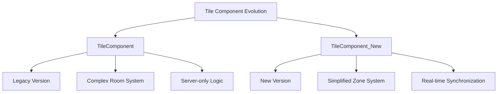
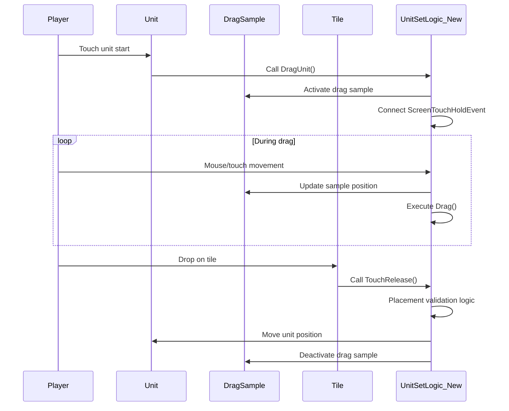

# Tile System

## Overview

MetoChess's tile system is responsible for **the core of auto chess gameplay** - unit placement and interaction. Based on **Line-Tile structure**, it provides intuitive unit placement through drag-and-drop and precise touch event processing.

## Tile Component Comparison

### TileComponent vs TileComponent_New

MetoChess transitioned from the existing `TileComponent` to the improved `TileComponent_New` to provide better performance and functionality.



#### Key Differences Comparison

| Category | TileComponent (Legacy) | TileComponent_New (Current) |
|----------|----------------------|--------------------------|
| **Coordinate System** | `rowNum`, `columnNum` | `horizontalNum`, `verticalNum` |
| **Zone Management** | `roomType`, `roomNumber`, `Zone` | `Zone` (simplified) |
| **Synchronization Method** | Server-only processing | Real-time sync with `@Sync` property |
| **Execution Space** | `@ExecSpace("Server")` | `@ExecSpace("Multicast")` |
| **Tile Setup** | Complex room-based validation | Simple Zone-based setup |
| **Performance** | High network load | Optimized synchronization |

### TileComponent_New Structure

```lua
@Component
script TileComponent_New extends Component
    property string Zone = "Neutral"      -- Zone classification
    property string type = "Unit"         -- Tile type
    
    @Sync
    property number horizontalNum = 0     -- X coordinate (real-time sync)
    
    @Sync
    property number verticalNum = 0       -- Y coordinate (real-time sync)
```

#### Zone System
- **User**: Player placement zone
- **Enemy**: Enemy placement zone  
- **Neutral**: Neutral zone (exists only in some maps)
- **Waiting**: Bench zone

## Game Board Tile Layout Structure

### Line-Tile Architecture

The Arena map's game board is designed with a systematic **Line_X/Tile_Y** structure:

```
Arena Game Board Structure:
├── WaitLine/              # Bench (Y=0)
│   ├── Tile_1/           # Bench slot 1
│   ├── Tile_2/           # Bench slot 2
│   └── ... (Tile_9)      # Up to 9 bench slots
├── Line_1/               # Game board row 1 (Y=1)
│   ├── Tile_1/          # (1,1)
│   ├── Tile_2/          # (2,1)
│   └── ... (up to 9)
├── Line_2/               # Game board row 2 (Y=2)
│   ├── Tile_1/          # (1,2)
│   ├── Tile_2/          # (2,2)
│   └── ... (up to 8)
└── ... (up to Line_7)    # Up to 7 rows
```

### Hexagonal Coordinate System

The game board uses a **hexagonal coordinate system** to provide strategic depth:

```lua
-- UnitSetLogic_New :: SettingTile()
for i = 1, 7 do  -- 7 rows (vertical)
    local tileLine = currentMap:GetChildByName("Line_" .. i)
    local jMax = 8 + (i%2)  -- Odd rows have 9 tiles, even rows have 8 tiles
    
    for j = 1, jMax do  -- Horizontal tile count
        local tile = tileLine:GetChildByName("Tile_" .. j)
        local jNum = j * 2 - (i%2)  -- Hexagonal X coordinate calculation
        
        -- Store coordinates
        user.GameManager.RoomTile[jNum .. "," .. i] = tile
    end
end
```

#### Coordinate Conversion Formula
- **X coordinate**: `jNum = j * 2 - (i%2)`  
- **Y coordinate**: `i` (row number)
- **Hexagonal offset**: Odd rows are offset by half a tile

### Automatic Zone Assignment

Tile Zones are automatically determined based on position:

```lua
-- Zone assignment logic
if jMax == 9 and j == 5 then
    tile.TileComponent_New:TileSet("Neutral", "Unit", j, i)  -- Center neutral zone
elseif j <= 4 then
    tile.TileComponent_New:TileSet("User", "Unit", j, i)     -- Player zone
elseif j >= 5 then
    tile.TileComponent_New:TileSet("Enemy", "Unit", j, i)    -- Enemy zone
end
```

## Touch Event System

### Drag and Drop Processing Flow



### Stage 1: Start Drag (DragUnit)

```lua
@ExecSpace("Client")
method void DragUnit(Entity selectUnit, string selectUnitID)
    -- Prevent duplicate drag
    if isvalid(self.SelectUnit) then
        return  -- Stop if unit already being dragged
    end
    
    -- Set drag state
    self.SelectUnit = selectUnit
    selectUnit.Visible = false  -- Hide original unit
    
    -- Activate drag sample
    self.DragSample.SpriteRendererComponent.SpriteRUID = selectUnit.UnitInfo.spriteRenderer.SpriteRendererComponent.SpriteRUID
    self.DragSample.Visible = true
    
    -- Connect touch event
    self.Handler = _InputService:ConnectEvent(ScreenTouchHoldEvent, self.Drag)
end
```

### Stage 2: Drag Movement (Drag)

```lua
@ExecSpace("ClientOnly")
method void Drag(any screenholdEvent)
    if isvalid(self.SelectUnit) then
        local touchPoint = screenholdEvent.TouchPoint
        
        -- Convert screen coordinates to world coordinates
        self.DragSample.TransformComponent.WorldPosition = 
            _UILogic:ScreenToWorldPosition(touchPoint):ToVector3()
        
        self.DragSample.Visible = true
    end
end
```

### Stage 3: Drop Complete (TouchRelease)

During drop, several validation stages are performed:

#### Key Validation Items

1. **Movement Possibility Check**
```lua
if selectUnit.UnitInfo.IsMovableByPlayer == false then
    log_warning("This unit cannot be placed on bench.")
    return
end
```

2. **Game Phase Check**  
```lua
if gameManager.PhaseType ~= "Ready" then
    _UIToast:ShowMessageByLocalizingKey("CannotDragUnit", userID)
    return
end
```

3. **Bench Placement Restrictions**
```lua
if selectUnit.UnitInfo.IsSettableOnWatingField == false then
    if selectTile.TileComponent_New.verticalNum == 0 then
        log_warning("This unit cannot be placed on bench.")
        return
    end
end
```

4. **Bench Capacity Limit**
```lua
if UnitAmount >= userPControl.Tile_AvailableWaitingTile then
    log_warning("Bench is full.")
    return
end
```

### Stage 4: End Drag (DragOff)

```lua
@ExecSpace("Client")  
method void DragOff(Entity selectUnit)
    -- Release event
    _InputService:DisconnectEvent(ScreenTouchHoldEvent, self.Handler)
    
    -- Reset state
    selectUnit.Visible = true  -- Restore original unit
    self.DragSample.Visible = false  -- Hide drag sample
    self.SelectUnit = nil
    
    -- Clean up visual effects
    _GeneralDirectorLogic:SetTileDirection_Main("OnDragging", false)
    _GeneralDirectorLogic:UnitOnTileDirector(selectUnit, true)
end
```

## Visual Feedback System

### DragSample Entity

**DragSample** is the core entity providing visual feedback during drag:

- **Location**: `/maps/Arena/UIDragSample`
- **Role**: Visual representation of unit being dragged
- **Behavior**: Real-time following of mouse/touch position

### Tile Visual Effects

#### TileSetAlpha Component

Provides smooth visual feedback by adjusting tile alpha values:

```lua
@Component
script TileSetAlpha extends Component
    
    @ExecSpace("Client")
    method void Starttoalpha100()
        -- Gradually increase alpha to 100%
        local setalpha = function()
            self.Entity.SpriteRendererComponent.Color.a += 0.035
        end
        
        for i = 1, 20 do
            _TimerService:SetTimerOnce(setalpha, i/125)
        end
    end
```

#### Tile Outline Materials

Provides tile outline effects for various situations:

| Material Name | Purpose | Color Features |
|---------------|---------|----------------|
| **AvailableTileOutline** | Display placeable tiles | Cyan (InnerOutline) |
| **AttackRangeOutline** | Display attack range | Configurable color |
| **SynergyHoverTileOutLine** | Synergy tile highlight | Unique color per synergy |
| **GreenTileOutLine_2** | General tile emphasis | Green outline |
| **RedrTileOutLine_2** | Warning/restriction tile | Red outline |

### Tile Special Effect Materials

#### Dynamic Lighting Effect
```json
// KnightTile.material - Dynamic lighting effect
{
  "shadertype": "LimLight",
  "Glow": 3.0,
  "LightColor": {"r": 1.0, "g": 0.140625, "b": 0.0, "a": 1.0},
  "TimeScale": 0.5,  // Animation speed
  "Width": 5.0       // Light width
}
```

## Tile Interaction Processing

### Touch Event Connection

The tile system utilizes MSW's touch event system:

```lua
-- Event types
ScreenTouchHoldEvent    -- During drag
ScreenTouchPressEvent   -- Touch start  
ScreenTouchReleaseEvent -- Touch end
```

### Coordinate Conversion System

```lua
-- Screen coordinates → World coordinates
local worldPos = _UILogic:ScreenToWorldPosition(touchPoint)

-- World coordinates → Tile coordinates
local tileX = math.floor(worldPos.x / TILE_WIDTH)
local tileY = math.floor(worldPos.y / TILE_HEIGHT)
```

### Tile State Management

Each tile maintains the following state information:

```lua
-- Tile state managed by TeamManager
property SyncTable<Entity, Entity> EntityOnTile  -- Entity on tile
property SyncTable<string, Entity> RoomTile      -- Tile reference by coordinate string
```

## Advanced Tile Features

### Hexagonal Pathfinding

The tile system provides hexagonal grid supporting A* algorithm:

```lua
-- Coordinate system used in AStarAlgorithm.mlua
-- Supports 6-directional movement (adjacent directions of hexagonal tiles)
local directions = {
    {0, -1},   -- North
    {1, -1},   -- Northeast  
    {1, 0},    -- Southeast
    {0, 1},    -- South
    {-1, 1},   -- Southwest
    {-1, 0}    -- Northwest
}
```

### Dynamic Tile Restrictions

Available tile count changes dynamically according to game progression:

```lua
-- Managed by TM_PropertyControl
property number Tile_AvailableWaitingTile = 4  -- Available bench slots
property number Tile_AvailableFieldTile = 8    -- Available field tiles
```

### Synergy Tile Highlight

Highlights related tiles during specific synergy combinations:

```lua
-- Tile direction control by GeneralDirectorLogic
_GeneralDirectorLogic:SetTileDirection_Main("OnDragging", true)    -- Display during drag
_GeneralDirectorLogic:ShowRedTile(userId)                         -- Overplacement warning
_GeneralDirectorLogic:UnitOnTileDirector(unit, true)             -- Unit placement direction
```

## Performance Optimization

### Tile Caching System

Cache frequently referenced tiles to improve performance:

```lua
-- Tile reference caching in GameManager
property SyncTable<string, Entity> RoomTile  -- Cache in "X,Y" format
```

### Synchronization Optimization

`TileComponent_New` synchronizes only necessary data through `@Sync` property:

- **horizontalNum, verticalNum**: Only coordinate information synchronized
- **Zone, type**: No change after initial setup

## Code References

### Core Tile System
- `RootDesk/MyDesk/InGame/TileComponent_New.mlua :: TileSet()` — New version tile setup
- `RootDesk/MyDesk/InGame/TileComponent.mlua :: TouchReleaseCheck()` — Legacy version touch processing
- `RootDesk/MyDesk/InGame/System/UnitSetLogic_New.mlua :: SettingTile()` — Tile placement system

### Drag and Drop System
- `RootDesk/MyDesk/InGame/System/UnitSetLogic_New.mlua :: DragUnit()` — Drag start
- `RootDesk/MyDesk/InGame/System/UnitSetLogic_New.mlua :: Drag()` — Drag movement processing
- `RootDesk/MyDesk/InGame/System/UnitSetLogic_New.mlua :: TouchRelease()` — Drop completion processing

### Visual Effect System
- `RootDesk/MyDesk/EffectFolder/Components/TileSetAlpha.mlua :: Starttoalpha100()` — Alpha animation
- `RootDesk/MyDesk/EffectFolder/Material/AvailableTileOutline.material` — Tile outline effects

Through this sophisticated tile system, players can have intuitive and smooth unit placement experience, providing the foundation for strategic gameplay.
