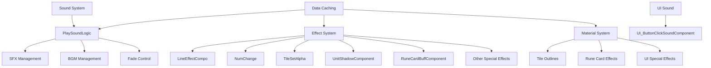
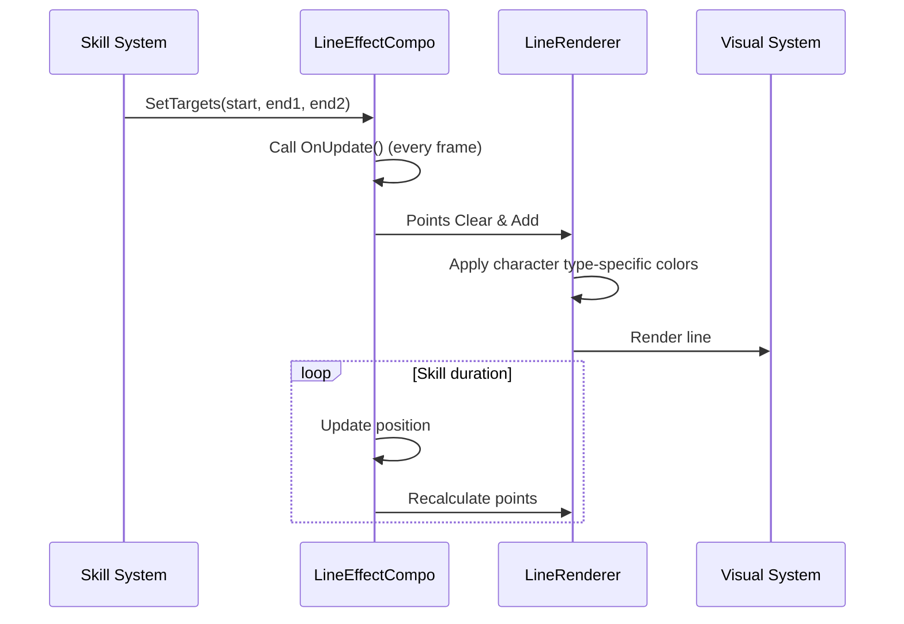
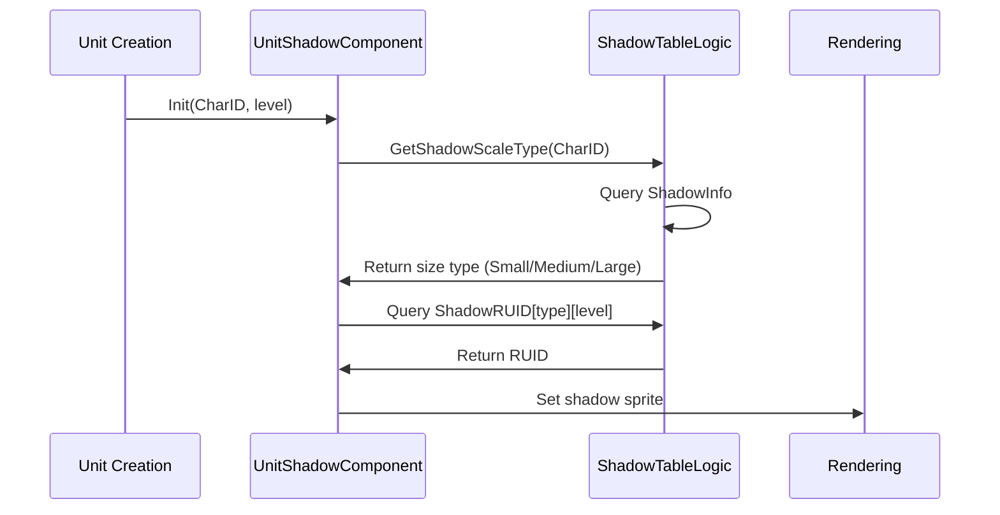
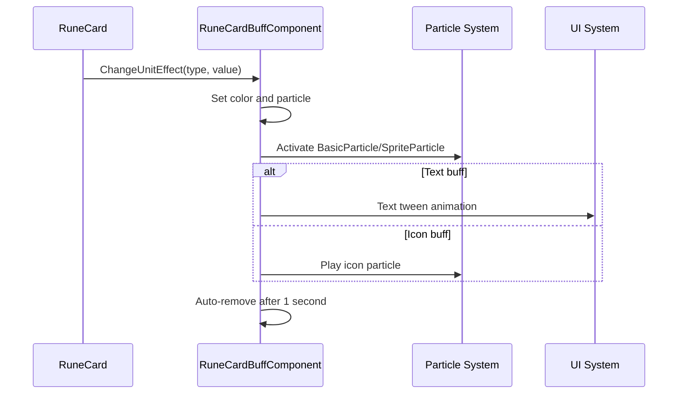
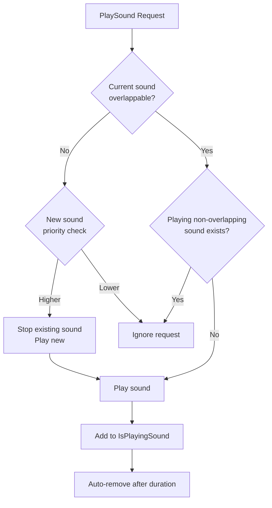
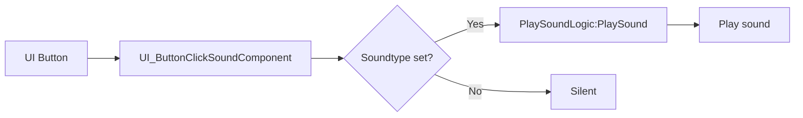

# Core Architecture - Presentation and Audio System - Effects and Sound

## Overview

MetoChess's effects and sound system is a detailed and professional presentation system designed to enhance the visual and auditory completeness of the game. Implemented around `EffectFolder/Components` and `PlaySoundLogic`, this system provides players with an immersive gaming experience through **character-specific effects**, **dynamic visual effects**, **intelligent sound management**, and **UI feedback systems**.

The core design principles of this system are **performance optimization** and **modularization**, where each effect component operates independently while creating harmonious overall presentations, and the sound system ensures clean audio experience through duplicate playback prevention and priority management.

## System Architecture

### Overall Structure Diagram



### Effect Hierarchy

1. **Component Layer**: Individual effect components
2. **Material Layer**: Visual shader effects
3. **Sound Layer**: Audio playback and management
4. **Data Layer**: Resource caching and configuration

## Core Effect Components

### 1. LineEffectCompo (Line Effect System)

A core visual effect system providing character-specific line effects.

#### Character-specific Effects

**Warrior Class - Lioner (C20008)**
```lua
-- Golden lightning-type line effect
Color(255/255, 242/255, 0/255) -- Gold color
random_width = 1~20/10 -- Random thickness for lightning effect
```

**Archer Class - Bowman (C20011)**
```lua
-- Green precise shooting line
Color(21/255, 163/255, 7/255) -- Green color
width = 0.2 -- Thin and precise line
```

**Mage Class - Flame Wizard (C30006)**
```lua
-- Orange flame line
Color(255/255, 146/255, 0/255) -- Orange color
```

**Special Class - Kirin (C30013)**
```lua
-- Blue mystical line
Color(0/255, 30/255, 142/255) -- Deep blue color
```

#### Synergy-specific Line Effects

**S10020 - Arcane River Synergy**
```lua
-- Light green healing light
startColor = Color(148/255, 227/255, 181/255) -- Light green
endColor = Color(220/255, 244/255, 176/255) -- Yellow green
```

**S10010 - Sniper Synergy**
```lua
-- Reddish brown sniper line
Color(133/255, 83/255, 83/255) → Color(233/255, 83/255, 83/255)
```

#### Line Effect Operation Flow


### 2. NumChange (Number Animation System)

An animation component that visually represents number changes.

#### Feature Implementation
```lua
Swaping(Pool) -- Cycling playback from number pool
- 0.7 second interval timer
- Smooth change through array cycling

StopNum(value) -- Fix to final number
- Stop timer
- Display confirmed value
```

#### Use Cases
- **Gold Acquisition Animation**: 100, 200, 150, 175, 160... → Final value
- **Damage Display**: Random numbers → Actual damage
- **Experience Gain**: Virtual increase → Actual increase amount

### 3. TileSetAlpha (Tile Emphasis System)

A system that animates tile transparency to draw player attention.

#### Animation Patterns
```lua
Starttoalpha100() -- 0 → 100% (fade in)
- Increase by 0.035 in 20 steps
- Auto-start fade out after 0.3 seconds

Starttoalpha0() -- 100% → 0 (fade out)
- Decrease by 0.035 in 20 steps
```

#### Visual Effect Timing

```mermaid
gantt
    title Tile Alpha Animation Timing
    dateFormat X
    axisFormat %L ms
    
    section Fade In
    Alpha increase :0, 160
    
    section Hold
    Maximum opacity :160, 300
    
    section Fade Out
    Alpha decrease :300, 460
```


### 4. UnitShadowComponent (Unit Shadow System)

A system that dynamically generates appropriate shadows for each unit.

#### Shadow Generation Logic
```lua
Init(CharID, level)
- Base color: #19182E (dark navy)
- Transparency: 0.4
- RUID: Character-specific lookup from ShadowTableLogic
```

#### ShadowTableLogic Integration


### 5. RuneCardBuffComponent (Rune Card Buff Direction)

A sophisticated effect system providing visual feedback when rune card effects activate.

#### Buff Type Color System
```lua
Buff type colors:
1. Attack: #ff8b8b (light red)
2. Speed: #8bfbff (light cyan)
3. Defense: #ffd68b (light yellow)
4. BloodSucking: #e88cef (light purple)
5. Weakening: #faff18 (bright yellow)
6. Debuff: #000000 (black)
```

#### Special Effect - Unit Change (RC20039 Denma Rune Card)
```lua
Colors by grade:
1 star: #8d8d8d (gray)
2 star: #54efaf (green)
3 star: #81eff7 (sky blue)
4 star: #d7b8ff (light purple)
5 star: #ffd038 (gold)
6 star: #ffffff (white) + special effects
```

#### Buff Direction Flow


## Sound System

### PlaySoundLogic (Comprehensive Sound Manager)

The core system that integrates all audio management in MetoChess.

#### Sound Data Structure
```lua
SoundTable[soundID] = {
    RUID = "Audio resource ID",
    AvailableSameTime = "TRUE/FALSE", -- Simultaneous playback capability
    Priority = "1-10", -- Priority (lower number = higher priority)
    volume = "0.0-1.0", -- Base volume
    durationTime = "in seconds", -- Playback duration
    Repeat = "TRUE/FALSE" -- Loop playback
}
```

#### Intelligent Sound Collision Management

**Non-overlapping Sound Processing**


#### BGM System

**Smooth BGM Transition**
```lua
PlayBGM_Ver2(Stage)
1. Fade out current BGM (1 second)
2. Replace with new BGM
3. Fade in new BGM (1 second)
```

**Fade In/Out Implementation**
```lua
FadeInFadeOut(IsFadeIn, durationTime, startVolume, toVolume)
- Smooth volume change in 60 steps
- Timer-based frame-by-frame volume adjustment
```

#### Stage-specific Sound System
```lua
PlayTileSettingSound()
- Check current stage from BackgroundChangeLogic
- Random selection between Sound_1, Sound_2 per stage
- Play appropriate sound effect during tile placement
```

### UI_ButtonClickSoundComponent (UI Sound)

Provides consistent audio feedback for all UI interactions.

#### Event-based Sound Playback
```lua
HandleButtonClickEvent() -- Button click
HandleUITouchDownEvent() -- Touch down
- Specify sound to play via Soundtype property
- Integrated management through PlaySoundLogic
```

#### Usage Pattern


## Material System

### Visual Effect Materials (50+ items)

#### Tile-related Materials
- **AttackRangeOutline**: Attack range display
- **AvailableTileOutline**: Placeable tiles
- **HoverTileOutline**: Mouse hover tiles
- **SynergyHoverTileOutLine**: Synergy tile emphasis

#### Rune Card Effect Materials
- **BattleWave_RuneCardEffect**: Battle rune card effects
- **RC10003_RuneCardEffect**: Specific rune card effects
- **RC30004TileEffect**: RC30004 rune card tile effects

#### UI Special Effect Materials
- **UI_BattleStartButton**: Battle start button effect
- **UI_LoadingGuage**: Loading gauge effect
- **UIToggled**: Toggled UI element emphasis

#### Character-related Materials
- **CharacterMaterial_2star/3star**: Grade-specific character effects
- **CharacterMaterial_Shadow**: Character shadows
- **CoachShadowMaterial**: Coach shadows

## Performance Optimization

### 1. Resource Management
- **Pre-caching**: Load all sound data in OnBeginPlay
- **RUID-based**: Use RUID system instead of direct file paths
- **Pooling**: Save memory through particle effect reuse

### 2. Rendering Optimization
- **Conditional Rendering**: Activate only visible effects
- **LOD System**: Adjust effect quality based on distance
- **Batch Rendering**: Process same material effects together

### 3. Audio Optimization
- **Duplicate Prevention**: Block duplicate playback of same sound
- **Priority**: Important sounds replace less important ones
- **Auto Cleanup**: Automatic memory release for completed sounds

### 4. Timer Optimization
```lua
-- Efficient timer usage example
_TimerService:SetTimerOnce(function() 
    self.Entity:Destroy() 
end, 1.0) -- Auto cleanup after 1 second
```

## Extensibility

### Adding New Effects
1. **New Character Line Effect**: Add type to LineEffectCompo
2. **New Buff Visualization**: Expand RuneCardBuffComponent colors
3. **Custom Materials**: Add new shader to EffectFolder/Material

### Sound System Extension
1. **3D Sound**: Position-based audio effects
2. **Dynamic Audio**: Sound changes based on environment
3. **User Customization**: Player-specific sound settings

### UI Effect Enhancement
1. **Transition Effects**: Screen transition animations
2. **Interaction Feedback**: Richer UI responses
3. **Accessibility**: Alternative feedback for visual/audio impaired

## Developer Tools

### Effect Debugging
- Individual effect on/off toggle
- Real-time color/size adjustment
- Performance profiling

### Sound Debugging
- List of currently playing sounds
- Volume level visualization
- Collision detection and priority display

## Real Usage Scenarios

### 1. Battle Sequence
```
1. Unit selection → UI click sound
2. Skill use → Character-specific line effect
3. Damage occurrence → Number animation with NumChange
4. Buff application → RuneCardBuffComponent particles
5. Tile emphasis → TileSetAlpha blinking
```

### 2. BGM Transition Scenario
```
Lobby BGM → Game start → Stage BGM
1. Current BGM fade out (1 second)
2. Load and play new BGM
3. New BGM fade in (1 second)
```

### 3. UI Interaction
```
Button hover → Visual highlight
Button click → Sound + visual effect
Menu transition → Transition effect
```

## Code References

- `RootDesk/MyDesk/EffectFolder/Components/LineEffectCompo.mlua :: OnUpdate()` — Real-time rendering of character-specific line effects
- `RootDesk/MyDesk/EffectFolder/Components/NumChange.mlua :: Swaping()` — Number cycling animation system
- `RootDesk/MyDesk/EffectFolder/Components/TileSetAlpha.mlua :: Starttoalpha100()` — Tile fade in/out animation
- `RootDesk/MyDesk/EffectFolder/Components/UnitShadowComponent.mlua :: Init()` — Dynamic shadow generation per unit
- `RootDesk/MyDesk/DatasetCacheLogic/PlaySoundLogic.mlua :: PlaySound()` — Intelligent sound collision management
- `RootDesk/MyDesk/DatasetCacheLogic/PlaySoundLogic.mlua :: PlayBGM_Ver2()` — Smooth BGM transition system
- `RootDesk/MyDesk/DatasetCacheLogic/PlaySoundLogic.mlua :: FadeInFadeOut()` — Volume fade effect implementation
- `RootDesk/MyDesk/UIComponents/UI_Common/UI_ButtonClickSoundComponent.mlua :: HandleButtonClickEvent()` — UI button click sound
- `RootDesk/MyDesk/EffectFolder/Components/RuneCardBuffComponent.mlua :: ChangeUnitEffect()` — Rune card buff visual effects
- `RootDesk/MyDesk/EffectFolder/Material/*.material` — 50+ specialized visual effect materials
