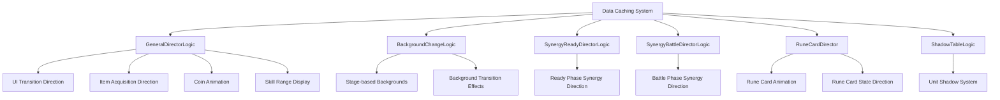
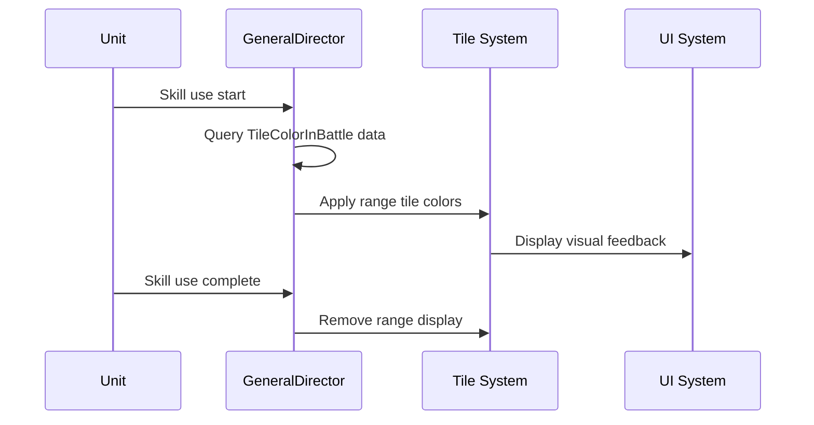
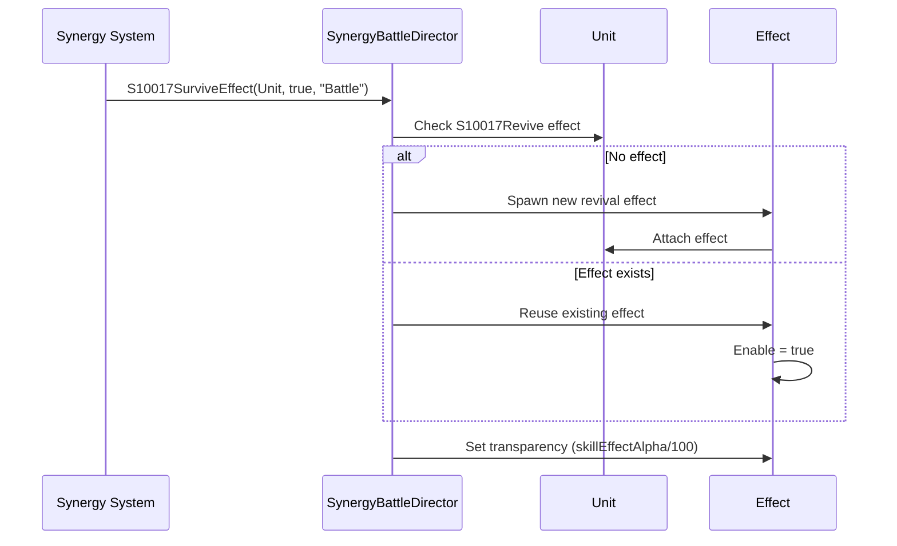
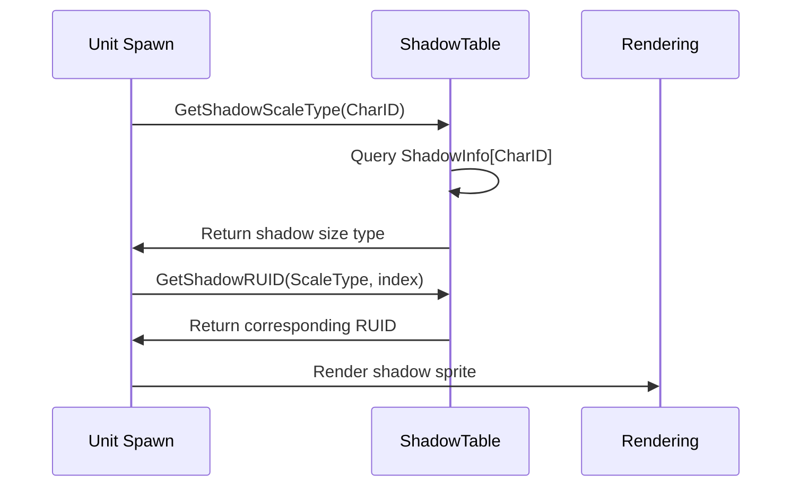
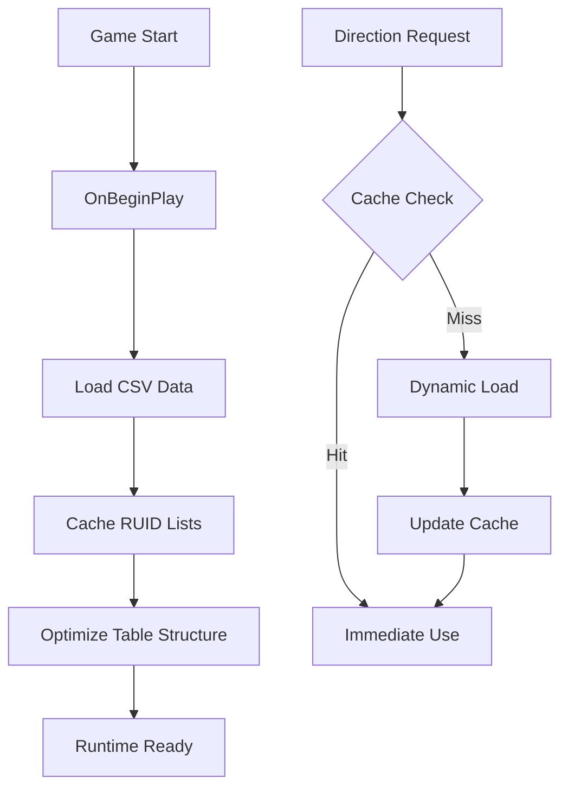
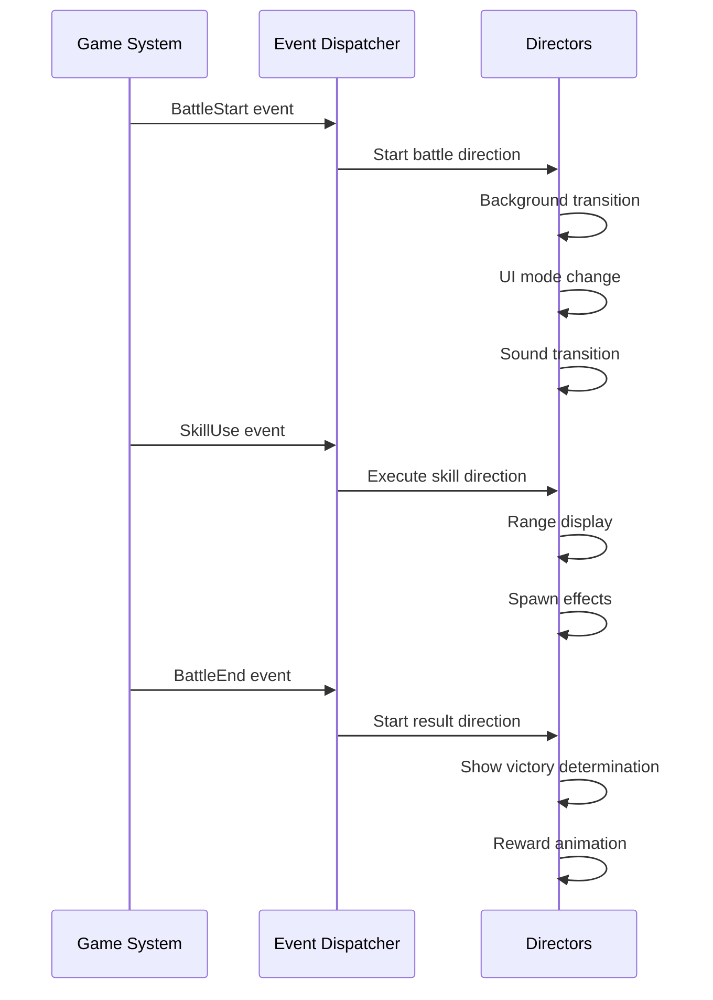

# Core Architecture - Presentation and Audio System - Game Direction Management

## Overview

MetoChess's game direction management system is a comprehensive presentation control system designed to provide players with an immersive visual experience. Implemented in the `EffectFolder/Logic` folder, this system integrates overall in-game presentation management, synergy-specific presentations, background transitions, UI animations, and shadow systems to create professional and refined gaming experience.

The core design philosophy of this system is **performance optimization** and **visual consistency**, ensuring smooth presentations through resource pre-caching and reuse while maintaining harmony with the overall art style of the game.

## System Architecture

### Overall Structure Diagram



### Direction System Hierarchy

1. **Overall Management Layer**: `GeneralDirectorLogic`
2. **Specialized Direction Layer**: Various Director logics
3. **Data Management Layer**: Resource caching and optimization
4. **Rendering Layer**: Actual visual output

## Core Components

### 1. GeneralDirectorLogic (Overall Direction Manager)

Serves as the central control hub for all presentations in the game.

#### Main Management Areas

**UI Transitions and Animations**
- Shop panel, inventory UI transitions
- Ready/battle phase UI changes
- ESC menu show/hide

**Gameplay Direction**
- Unit spawn buff effect timer management
- Skill range tile color display
- Attack range visualization

**Economy System Direction**
- Coin acquisition/consumption animations
- Result screen coin direction (`ResultCoin`)
- Gold direction display (`IsCoinDirection`)

#### Core Feature Implementation

**Skill Range Display System**


### 2. BackgroundChangeLogic (Background Transition System)

Manages dynamic background changes according to stage progression.

#### Main Features

**Background Data Management**
- `BackgroundTable` CSV data caching
- Stage-specific background image mapping
- Background transition animation control

**Stage Visualization**
- Icon management by in-progress/completed state
- Stage roadmap UI updates
- Node connection line display

#### Stage Icon System
```lua
StageIconRUID["Ing"] = {8 in-progress icons}
StageIconRUID["Clear"] = {8 completed icons}
```

### 3. Synergy Direction System

#### SynergyReadyDirectorLogic (Ready Phase Direction)

**Resource Pre-caching**
- `SynergyDirection` data table processing
- Art resource (RUID1~5) and sound resource management
- Synergy detail information (`SynergyDirectionRUIDInfo`) caching

**Tile-based Effects**
- Synergy effects displayed at specific positions
- Ally/enemy distinction tile effects (`Tile10025`, `Tile10025_Enemy`)

#### SynergyBattleDirectorLogic (Battle Phase Direction)

**Individual Synergy Special Direction**

**S10017 - Revival Synergy**


**S10019 - Item Acquisition Direction**
- Spawn item sprite at unit position
- Tween animation flying upward
- Dynamic item RUID setting

### 4. RuneCardDirector (Rune Card Direction System)

#### Rune Card Animation Management
- Pre-load 18 icon RUIDs
- Shake effect when rune card acquired/used
- Visual representation of stackable rune cards

#### Special Management Rune Cards
```lua
RuneCardManagingValue = {
    ["RC10010"] = {}, -- Special value management
    ["RC20007"] = {}, -- Advanced rune card
    ["RC30001"] = {}, -- Legendary rune card
    -- ... Total 22 special management targets
}
```

#### Stack Limited Rune Cards
```lua
RuneCardMaxStack = {
    ["RC10024"] = 4,   -- Maximum 4 stacks
    ["RC20011"] = 50,  -- Maximum 50 stacks
    ["RC30017"] = 30,  -- Maximum 30 stacks
    -- ... Rune cards with stack limits
}
```

### 5. ShadowTableLogic (Shadow System)

#### Unit-specific Shadow Management
- `ShadowInfoTable` data caching
- Shadow size/position information by character ID
- Small/Medium/Large 3-tier size classification

#### Shadow RUID System
```lua
ShadowRUID = {
    ["Small"] = {3 RUIDs},
    ["Medium"] = {3 RUIDs},
    ["Large"] = {3 RUIDs}
}
```

#### Shadow Application Flow


## Performance Optimization Strategies

### 1. Resource Pre-caching
- Load all necessary data in **OnBeginPlay**
- Minimize runtime database queries
- Memory cache RUID lists

### 2. Object Reuse
- Use Enable/Disable instead of deleting effect objects
- Clone object pooling system
- Minimize memory allocation/deallocation

### 3. Conditional Rendering
- Activate only visible presentations
- Separate presentations by phase (ready/battle)
- Distance-based LOD (Level of Detail)

### 4. Batch Processing
- Batch process same type effects
- Timer-based batch updates
- Distribute direction workload per frame

## Data Structure and Management

### Main Data Tables

#### BackgroundTable
- **ID**: Background identifier
- **Stage**: Stage number
- **Others**: Background-related properties

#### SynergyDirection
- **Synergy ID**: Unique identifier
- **RUID1~5**: Art resources
- **SoundID**: Sound resource

#### TileColorInBattle
- Tile color information during battle
- Color data for skill range display

#### ShadowInfoTable
- **CharID**: Character identifier
- **ScaleType**: Small/Medium/Large
- **Position Info**: Shadow offset

### Caching Strategy


## Direction Timing Control

### Direction by Game Phase

#### Ready Phase
- Activate synergy ready direction
- UI transition animations
- Background music fade in

#### Battle Phase
- Activate synergy battle direction
- Display skill effects
- Prepare result direction

#### Result Phase
- Victory/defeat direction
- Reward animations
- Next round preparation

### Event-based Direction Triggers


## Extensibility and Customization

### Guide for Adding New Direction

#### 1. Adding Synergy Direction
```lua
-- Add new method to SynergyBattleDirectorLogic
method void S99999NewEffect(Entity Unit, boolean Active)
    -- Implement new synergy direction
end
```

#### 2. Adding New Background
- Add new row to `BackgroundTable.csv`
- Register corresponding resource RUID
- Auto-load in `BackgroundChangeLogic`

#### 3. New Rune Card Direction
- Add new icon to `IconRUIDList`
- Register in `RuneCardManagingValue` if special management needed

### Modular Design
Since each Director logic operates independently:
- Individual system modifications don't affect other systems
- Easy to add new direction systems
- Enable direction changes for A/B testing

## Debugging and Development Tools

### Direction Debug Features
- Individual direction on/off toggle
- Direction performance monitoring
- Resource usage tracking

### Artist-friendly Tools
- CSV-based data modification
- Real-time resource replacement
- Direction timing adjustment

## Code References

- `RootDesk/MyDesk/EffectFolder/Logic/GeneralDirectorLogic.mlua :: OnBeginPlay()` — Overall direction system initialization and resource caching
- `RootDesk/MyDesk/EffectFolder/Logic/GeneralDirectorLogic.mlua :: ShowReadyUI()` — Ready phase UI direction management
- `RootDesk/MyDesk/EffectFolder/Logic/BackgroundChangeLogic.mlua :: LoadTable()` — Background data caching and stage icon setup
- `RootDesk/MyDesk/EffectFolder/Logic/BackgroundChangeLogic.mlua :: ChangeBackground()` — Stage-specific background transition logic
- `RootDesk/MyDesk/EffectFolder/Logic/SynergyReadyDirectorLogic.mlua :: LoadTable()` — Synergy direction resource pre-loading
- `RootDesk/MyDesk/EffectFolder/Logic/SynergyBattleDirectorLogic.mlua :: S10017SurviveEffect()` — Revival synergy special direction
- `RootDesk/MyDesk/EffectFolder/Logic/SynergyBattleDirectorLogic.mlua :: S10019GetItem()` — Item acquisition direction
- `RootDesk/MyDesk/EffectFolder/Logic/RuneCardDirector.mlua :: ShakingCard_Battle()` — Rune card battle direction animation
- `RootDesk/MyDesk/EffectFolder/Logic/ShadowTableLogic.mlua :: GetShadowScaleType()` — Unit-specific shadow size determination
- `RootDesk/MyDesk/EffectFolder/DataSet/BackgroundTable.csv` — Stage-specific background configuration data
