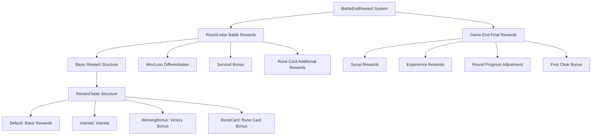
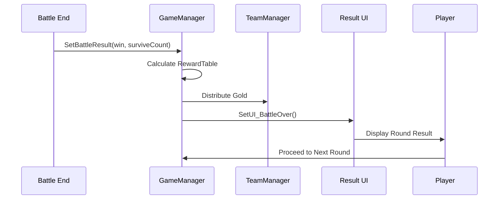
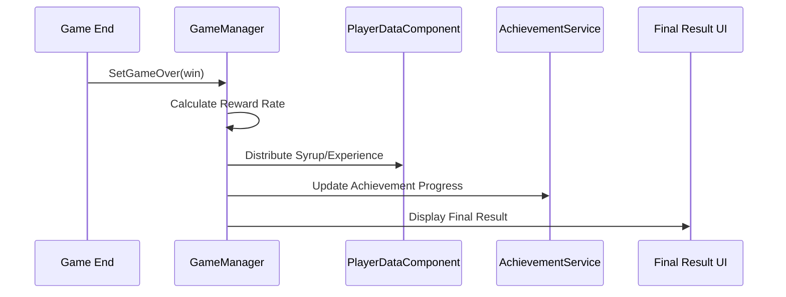

# In-Game Systems - Battle System - Battle End Rewards

## Overview

The BattleEndReward system is a core economic system in MetoChess that **provides fair and systematic rewards based on battle results**. It is dual-structured with **round-wise battle rewards** and **final rewards at game end**, offering **differentiated rewards** by comprehensively considering various factors such as **win/loss status**, **number of surviving units**, **rune card effects**, and **game progress**.

The core design philosophy of this system is **performance-based rewards** and **continuous motivation**. Rather than just win/loss results, it encourages various play styles and increases the desire to retry through **finely differentiated rewards** based on players' strategic choices and game progress.

## System Architecture

### Overall Structure



## Core Components

### 1. Round-wise Battle Reward System

Gold rewards are distributed through a **RewardTable** divided into **4 categories** at the end of each round.

#### Reward Structure (RewardTable)

```lua
-- Basic reward table for victory
self.RewardTable = {
    ["Default"] = userPControl.Golds_baseReward,           -- Basic reward (fixed)
    ["Interest"] = math.min(                               -- Interest reward (based on holdings)
        math.max(0, userPControl.Golds_MaxInterestReward),
        math.floor(teamManager.Golds/5)
    ),
    ["WinningBonus"] = 0,                                 -- Survival unit bonus
    ["RuneCard"] = userPControl.Golds_BattleReward_Win +  -- Rune card bonus
                   userPControl.Golds_BattleReward
}
```

#### Win vs Loss Differentiation

##### On Victory
```lua
if win then
    -- Full rewards including victory bonus
    self.RewardTable["RuneCard"] = userPControl.Golds_BattleReward_Win + 
                                   userPControl.Golds_BattleReward
    
    -- Coach battle record
    coachManager:SetBattleResultRUID(true, user.OwnerId)
    
    -- Battle statistics record
    user.TeamBattleStatistics:SetProperty("SetRoundResult", "W")
    
    -- Victory event triggered
    user:SendEvent(BattleWin(surviveUnitCount))
end
```

##### On Defeat
```lua
if not win then
    -- Reduced rune card bonus on defeat
    self.RewardTable["RuneCard"] = userPControl.Golds_BattleReward_Lose + 
                                   userPControl.Golds_BattleReward
    
    -- Coach defeat record
    coachManager:SetBattleResultRUID(false, user.OwnerId)
end
```

### 2. Survival Unit-Based Bonus System

**Only on victory**, additional gold is awarded proportional to the number of units surviving on the field.

#### Survival Unit Calculation
```lua
local survivorBonusCount = 0
local unitsParent = _UnitSetLogic_New.UnitsParentEntity[self.Entity.OwnerId]

for _, unit in pairs(unitsParent.Children) do
    if unit.UnitInfo.TeamType == "User" 
    and unit.UnitInfo.use
    and unit.UnitStatus.HP > 0
    and not unit.UnitInfo.IsOnetimeUnit    -- Exclude one-time units
    and unit.UnitInfo:IsOnFieldUnit()       -- Only field-deployed units
    and unit.UnitInfo.IsResellable then     -- Only resellable units
        survivorBonusCount += 1
    end
end

-- Number of surviving units = Victory bonus gold
self.RewardTable["WinningBonus"] = survivorBonusCount
```

### 3. Rune Card Special Reward System

**Conditional additional rewards** are provided when specific rune cards are equipped.

#### Rana (RC20036) Rune Card Reward
```lua
if survivorBonusCount >= 3 then
    -- Rana rune card effect when 3+ allied units survive
    local checkCount = teamManager:GetRuneCardCount("RC20036")
    if checkCount > 0 then
        self.RewardTable["RuneCard"] += 10 * checkCount
        
        -- Store data for result screen presentation
        _GeneralDirectorLogic:SetResultCoinTable(true, "RC20036", 
                                               10 * checkCount, user.PlayerComponent.UserId)
    end
    
    -- Phantom (RC40003) + Rana combination effect
    if teamManager:GetRuneCardCount("RC40003") > 0 then
        local runeCardParent = self.Entity:GetChildByName("RuneCardParent")
        for i=1, 5 do
            local playerRune = runeCardParent:GetChildByName(string.format("PlayerRune%d", i))
            if isvalid(playerRune.RC40003) and playerRune.RC40003.CopyRuneID == "RC20036" then
                self.RewardTable["RuneCard"] += 10
                
                -- Presentation for Rana effect copied by Phantom
                _GeneralDirectorLogic:SetResultCoinTable(true, "RC40003", 10, 
                                                       user.PlayerComponent.UserId)
            end
        end
    end
end
```

### 4. Penalties and Special Effects

#### PEN10006 Penalty Effect
```lua
-- "No longer receive interest, but rewards proportional to surviving allies increase by 100%"
if userPControl.Penalty_SetCheck["PEN10006"] > 0 then
    self.RewardTable["WinningBonus"] *= 2  -- Double survival bonus
    self.RewardTable["Interest"] = 0        -- No interest
end
```

### 5. Final Reward System on Game End

**Syrup** and **experience** rewards are given when the game completely ends (clear or elimination).

#### Reward Rate Calculation System

##### On Victory (Complete Clear)
```lua
local rewardRate = 1  -- 100% rewards
```

##### On Defeat (Based on Reached Round)
```lua
if win == false then
    if self.Stage < 4 then
        rewardRate = 0  -- No rewards below Stage 4
    else
        -- CSV data-based reward rate lookup
        local rewardRateTable = _DataService:GetTable("GameRewardRateByClearRound")
        local row = rewardRateTable:FindRow("Round", string.format("%d-%d", self.Stage, self.Round))
        rewardRate = tonumber(row:GetItem("RewardRate"))
    end
end
```

#### Syrup Reward Calculation
```lua
-- Basic syrup reward (200 fixed)
local syrup_default = math.floor(200 * rewardRate)

local syrup_extra = 0
-- 240% additional reward for first clear
if isInitClear == true then
    syrup_extra = syrup_default * 2.4  -- 2.4x additional to basic
end

-- Final syrup distribution
playerDataCompo:AddSyrup("Syrup", syrup_default + syrup_extra, "PlayGame")
```

#### Experience Reward Calculation
```lua
-- Basic experience lookup by mode/difficulty
local exp_default = _PlayerLevelLogic:GetRewardEXPAmount(self.ModeType, self.ModeLevel) * rewardRate

local exp_extra = 0
-- First clear bonus
if isInitClear == true then
    exp_extra = exp_default * 2.4
end

-- Experience distribution and level-up processing
local expInfo = {
    ["BeforeLevel"] = playerDataCompo.Level,
    -- ... level-up related information
}
```

### 6. Mode-based/Difficulty-based Experience System

**Differential experience** is awarded based on **game mode** and **difficulty** through PlayerLevelLogic.

#### Experience Calculation Logic
```lua
@ExecSpace("ServerOnly")
method integer GetRewardEXPAmount(string mode, integer level)
    -- Extract main type from mode name (e.g., "Single_Easy" → "Single")
    mode = _UtilLogic:Split(mode, "_")[1]
    
    -- Lookup mode/level-based experience from CSV data
    local expTable = _DataService:GetTable("EXPRewardByModeNLevel")
    local row = expTable:FindRow("Level", string.format("%d", level))
    local exp = tonumber(row:GetItem(mode))
    
    return exp
end
```

### 7. Achievement and Statistics Integration

**Various achievements** and **battle statistics** are processed simultaneously when battle ends.

#### Achievement Progress Update
```lua
-- Achievement processing after battle end
_AchievementService:BattleEnd(win, self.ModeType, self.ModeLevel, 
                             self.Stage, self.Round, self.Round8_3Num, user)

-- Category-based achievement classification examples
-- - All-Star League Graduate
-- - Single Mode Exclusive Achievements
-- - Rank Mode Exclusive Achievements  
-- - Battle Master
-- - Rune Card Related Achievements
```

#### Battle Statistics Recording
```lua
-- Survival unit statistics recording
user.TeamBattleStatistics:SetRankCountProperty("CT10004", survivorBonusCount, "Add")

-- Round result recording
user.TeamBattleStatistics:SetProperty("SetRoundResult", "W") -- On victory
```

## Reward Distribution Flow

### Round End Flow


### Game End Flow


## Data Table Integration

### Main CSV Data
- `GameRewardRateByClearRound`: Reward rate by reached round
- `EXPRewardByModeNLevel`: Experience reward table by mode/difficulty
- Rune card related reward data

### TM_PropertyControl Configuration Values
```lua
-- Basic reward related
property number Golds_baseReward              -- Basic gold reward
property number Golds_MaxInterestReward       -- Maximum interest reward
property number Golds_BattleReward_Win        -- Victory rune card bonus
property number Golds_BattleReward_Lose       -- Defeat rune card bonus
property number Golds_BattleReward            -- Common rune card bonus
```

## Performance Optimization and Scalability

### 1. Reward Calculation Optimization
- **Pre-calculated table usage**: CSV data-based lookup tables
- **Conditional calculation**: Execute complex logic only when necessary
- **Batch processing**: Distribute multiple rewards at once

### 2. Scalability
- **Modular reward structure**: Easy addition of new reward types
- **Rune card expansion**: Systematic support for new rune card reward effects
- **Various game modes**: Differential reward system by mode

### 3. Balancing Flexibility
- **CSV-based value adjustment**: Balance patches possible without code changes
- **A/B test support**: Experimental possibilities for various reward structures

## Related Files

### Code References
- `RootDesk/MyDesk/InGame/Managers/GameManager.mlua :: SetBattleResult()` — Round-wise battle reward calculation and distribution
- `RootDesk/MyDesk/InGame/Managers/GameManager.mlua :: SetGameOver()` — Final reward processing on game end
- `RootDesk/MyDesk/Player/PlayerLevelLogic.mlua :: GetRewardEXPAmount()` — Mode/difficulty-based experience calculation
- `RootDesk/MyDesk/InGame/Managers/TM_PropertyControl.mlua` — Basic reward-related configuration value management
- `RootDesk/MyDesk/DataStorage/PlayerDataComponent.mlua :: AddSyrup()` — Syrup reward distribution
- `RootDesk/MyDesk/OutGame/Achievement/AchievementService.mlua :: BattleEnd()` — Achievement processing after battle end

### Data Integration
- `GameRewardRateByClearRound` CSV — Reward rate table by reached round
- `EXPRewardByModeNLevel` CSV — Experience reward table by mode/difficulty
- Various rune card definition files

### Integration Systems
- `TeamManager.mlua` — Gold distribution and rune card count verification
- `CoachManager.mlua` — Coach battle record
- `TeamBattleStatistics.mlua` — Battle statistics recording
- `AchievementManager.mlua` — Achievement progress management
- `GeneralDirectorLogic.mlua` — Result screen presentation

Through this comprehensive design, the BattleEndReward system fairly evaluates player performance and provides appropriate rewards, thereby providing continuous game participation motivation and encouraging various strategic choices.
