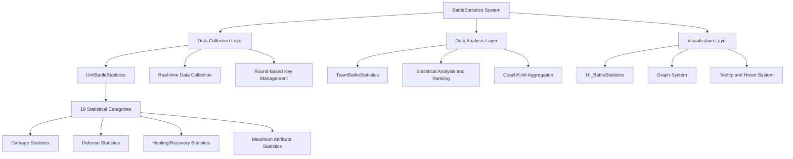
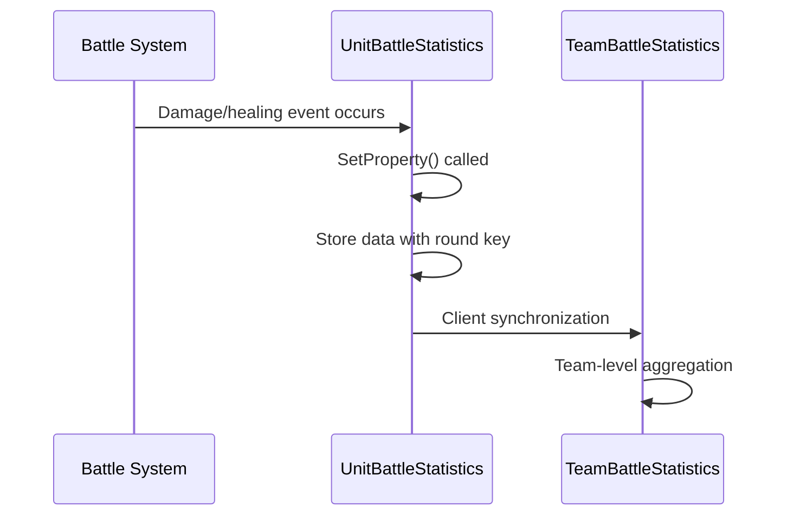
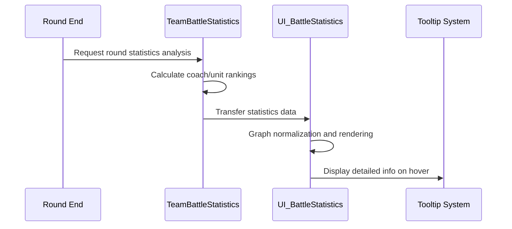

# In-Game Systems - Battle System - Battle Statistics

## Overview

The BattleStatistics system is a comprehensive battle data management system in MetoChess that **collects all numerical values occurring during battle in real-time**, **analyzes them in detail**, and provides **intuitive visual feedback** to players. It systematically manages statistics **by unit**, **by team**, and **by round**, visualizing complex battle data through **graphs and tooltips** for easy understanding.

The core value of this system is **providing strategic insights** and **performance tracking**. Players can see concrete numerical evidence of how effective their tactics actually were and use this to improve their strategies for the next round.

## System Architecture

### Overall Structure



## Core Components

### 1. Data Collection System (UnitBattleStatistics)

**Tracks all battle actions of each unit in real-time** and stores them **segmented by round**.

#### Core Statistical Categories (19 types)

##### Damage-related Statistics
```lua
-- Damage dealt (3 types)
property SyncTable<string, number> PhysicalDamageDealt    -- Physical damage
property SyncTable<string, number> MagicalDamageDealt     -- Magical damage  
property SyncTable<string, number> TrueDamageDealt        -- True damage

-- Damage taken (3 types)
property SyncTable<string, number> PhysicalDamageTaken    -- Physical damage taken
property SyncTable<string, number> MagicalDamageTaken     -- Magical damage taken
property SyncTable<string, number> TrueDamageTaken        -- True damage taken

-- Damage blocked (3 types)
property SyncTable<string, number> PhysicalDamageAbsorbed -- Physical damage absorbed
property SyncTable<string, number> MagicalDamageAbsorbed  -- Magical damage absorbed
property SyncTable<string, number> TrueDamageAbsorbed     -- True damage absorbed
```

##### Recovery and Support Statistics
```lua
-- Self-recovery
property SyncTable<string, number> HPAmountGainedByHealing         -- HP recovered by healing
property SyncTable<string, number> HPAmountGainedByBloodAbsorption -- HP recovered by lifesteal
property SyncTable<string, number> ShieldAmountGained              -- Shield amount gained

-- Ally support
property SyncTable<string, number> HPAmountProvidedToHealing -- HP provided to allies
property SyncTable<string, number> ShieldAmountProvided     -- Shield provided to allies
```

##### Attribute and Action Statistics
```lua
-- Battle actions
property SyncTable<string, number> SkillCountUsed -- Skill usage count
property SyncTable<string, number> DeadTime       -- Death time

-- Maximum attribute records
property SyncTable<string, number> MaximumHP                        -- Maximum HP
property SyncTable<string, number> MaximumPhysicalAttack           -- Maximum physical attack
property SyncTable<string, number> MaximumMagicalAttack            -- Maximum magical attack
property SyncTable<string, number> MaximumCriticalPercent          -- Maximum critical rate
property SyncTable<string, number> MaximumBloodAbsorptionPercent   -- Maximum lifesteal rate
```

#### Round-based Key Management
Battle statistics are managed with **Stage-Round format keys**, specially supporting **8-3 replay**.

```lua
-- Basic key generation
local setKey = math.floor(gameManager.Stage) .. "-" .. math.floor(gameManager.Round)

-- Special handling for 8-3 replay
if setKey == "8-3" then
    setKey = string.format("%s-%d", setKey, gameManager.Round8_3Num)
    -- e.g., "8-3-1", "8-3-2", "8-3-3" for distinction
end
```

#### Real-time Data Recording
```lua
-- Accumulating statistics through SetProperty method
method void SetProperty(string propertyName, number amount, boolean sync)
    if propertyName == "PhysicalDamageDealt" then
        if isvalid(self.PhysicalDamageDealt[setKey]) then
            self.PhysicalDamageDealt[setKey] += amount  -- Cumulative total
        else
            self.PhysicalDamageDealt[setKey] = amount   -- Initial value
        end
    end
    
    -- Client synchronization
    if sync then
        self:SetPropertyToClient(propertyName, amount, unitInfo.OwnerId)
    end
end
```

### 2. Data Analysis System (TeamBattleStatistics)

Analyzes **team-level** and **coach-based** statistics to calculate **rankings** and **achievements**.

#### Statistical Analysis Categories

##### Coach (Character)-based Statistics Tracking
```lua
-- Performance aggregation by coach ("CT" prefix)
local countTable = {
    ["CT10002"] = 0,  -- Single unit highest damage dealt
    ["CT10003"] = 0,  -- Single unit highest damage taken  
    ["CT10011"] = 0,  -- Single unit highest healing amount
    ["CT10015"] = 0   -- Single unit highest skill usage count
}

-- Calculating highest records
for _, unit in pairs(units.Children) do
    local unitBStat = unit.UnitBattleStatistics
    if unitInfo.use and unitInfo.TeamType == "User" then
        -- Calculate total damage dealt
        local damageDealt = unitBStat.PhysicalDamageDealt[checkKey] + 
                           unitBStat.MagicalDamageDealt[checkKey] + 
                           unitBStat.TrueDamageDealt[checkKey]
        countTable["CT10002"] = math.max(countTable["CT10002"], damageDealt)
    end
end
```

##### Round-based Performance Comparison
```lua
-- Round performance ranking system
local keyTable = {"CT10002", "CT10003", "CT10011", "CT10015"}

for _, key in pairs(keyTable) do
    if isvalid(self.SetRankAmount[key]) then
        -- Update ranking by comparing with previous records
        if self.SetRankAmount[key] < countTable[key] then
            self.SetRankAmount[key] = countTable[key]
        end
    end
end
```

### 3. Visualization System (UI_BattleStatistics)

Represents complex battle data through **intuitive graphs** and **detailed tooltips**.

#### UI Structure and Categories

##### 2-tier Category System
```lua
-- Primary category
property integer Category_1st = 1  -- 1:Cumulative statistics, 2:Maximum attributes

-- Secondary category (when primary is 1)
-- 1:Damage dealt, 2:Damage taken, 3:Damage blocked, 4:Recovery, 5:Healing, 6:Skill usage
property integer Category_2nd = 1
```

##### Statistics Display Tables
```lua
-- Separate storage for ally/enemy
property table UnitCombatStats = {}    -- Ally unit statistics
property table EnemyCombatStats = {}   -- Enemy unit statistics

-- Tables for graph rendering
property table Graphs = {}       -- Ally graphs
property table EnemyGraphs = {}  -- Enemy graphs
```

#### Graph Visualization System

##### Statistical Value Normalization and Display
```lua
-- Normalization based on maximum value
local maxValue = 0
for i=1, #self.UnitCombatStats do
    maxValue = math.max(maxValue, self.UnitCombatStats[i][statCategory])
end
self.MaxSelectedStat = maxValue

-- Graph height calculation (proportion-based)
local graphHeight = (statValue / maxValue) * maxGraphHeight
```

##### Value Formatting
```lua
-- Apply appropriate format for each statistical type
method string StatValueFormatter(number valueInput, string category)
    if category == "MaximumCriticalPercent" or 
       category == "MaximumBloodAbsorptionPercent" or 
       category == "MaximumAttackSpeed" then
        return string.format("%.2f", valueInput)  -- 2 decimal places
    else
        return string.format("%d", valueInput)    -- Integer
    end
end
```

### 4. Tooltip and Hover System

A **smart tooltip** system that displays detailed information when **mouse hovers over graphs**.

#### Graph Tooltip (UI_BattleStatistics_GraphTooltipActivator)

```lua
@EventSender("Self")
handler HandleUITouchEnterEvent(UITouchEnterEvent event)
    -- Parse slot index
    local slotIdx = tonumber(string.sub(self.Entity.Parent.Name, 6, -1))
    
    -- Display tooltip content
    _UI_BattleStatistics:ShowTooltip_CharStatistics(slotIdx, self.IsEnemyUI)
end
```

#### Dynamic Tooltip Position Adjustment (UI_Tooltip_BattleStatisticsGraph)

```lua
method void OnUpdate(number delta)
    local mousePos = _InputService:GetCursorPosition()
    local uiPos = _Util:ScreenPostoUIPos(mousePos)
    
    -- Screen boundary check and position adjustment
    if (anchoredPos.x + rectSize.x + 10) > 1920 then
        anchoredPos.x = 1920 - rectSize.x - 10  -- Right boundary correction
    elseif anchoredPos.x < 10 then
        anchoredPos.x = 10                       -- Left boundary correction
    end
    
    self.Entity.UITransformComponent.anchoredPosition = anchoredPos
end
```

#### Category-based Tooltip Content

```lua
method void ShowTooltip_CharStatistics(integer slotIndex, boolean isEnemy)
    local itemName, itemValue
    
    if self.Category_1st == 1 then  -- Cumulative statistics
        if self.Category_2nd == 1 then  -- Damage dealt
            itemName = {"Physical Damage", "Magical Damage", "True Damage"}
            itemValue = {"PhysicalDamageDealt", "MagicalDamageDealt", "TrueDamageDealt"}
        elseif self.Category_2nd == 2 then  -- Damage taken
            itemName = {"Physical Damage Taken", "Magical Damage Taken", "True Damage Taken"}  
            itemValue = {"PhysicalDamageTaken", "MagicalDamageTaken", "TrueDamageTaken"}
        -- ... other categories
        end
    end
    
    -- Display information in tooltip UI
    for i=1, 3 do
        if itemName[i] ~= nil then
            local formattedValue = self:StatValueFormatter(
                statTable[characterNum][itemValue[i]], itemValue[i]
            )
            ui_graphText.TextComponent.Text = itemName[i].." "..formattedValue
        end
    end
end
```

## Data Flow and Lifecycle

### 1. Data Collection Phase


### 2. Analysis and Visualization Phase


### 3. Special Handling for 8-3 Replay

MetoChess supports **replay at Stage 8-3**, with each play recorded independently.

```lua
-- Server-side key generation
local setKey = math.floor(gameManager.Stage) .. "-" .. math.floor(gameManager.Round)
if setKey == "8-3" then
    setKey = string.format("%s-%d", setKey, gameManager.Round8_3Num)
end

-- Client-side key restoration
local setKey = roundKey
if setKey == "8-3" then
    setKey = "8-3-1"
    for i = 1, 5 do
        local checkKey = string.format("%s-%d", roundKey, i)
        if isvalid(self.SetCharID[checkKey]) then
            setKey = checkKey
        else
            break
        end
    end
end
```

## Performance Optimization and Scalability

### 1. Memory Efficiency
- **SyncTable usage**: Automatic server-client synchronization prevents duplicate storage
- **Round-based segmentation**: Selective loading of required data only
- **Static table reuse**: Recycling rendering tables for UI

### 2. Rendering Optimization
- **Lazy loading**: Process data only when statistics window opens
- **Normalization caching**: Store proportion calculation results based on maximum values
- **Conditional rendering**: Update graphs only for active categories

### 3. Scalability
- **Modular design**: Easy addition of new statistical categories
- **Category expansion**: Unlimited expansion support through 2-tier categories
- **Multi-language support**: Integration with LocalizationService

## Related Files

### Code References
- `RootDesk/MyDesk/InGame/Unit/01_UnitComponent/UnitBattleStatistics.mlua :: SetProperty()` — Real-time statistics data collection
- `RootDesk/MyDesk/InGame/Managers/TeamBattleStatistics.mlua` — Team-level statistics analysis and ranking
- `RootDesk/MyDesk/InGame/BattleStatistics/UI_BattleStatistics.mlua :: Initialize()` — Statistics UI initialization and graph rendering
- `RootDesk/MyDesk/InGame/BattleStatistics/UI_BattleStatistics.mlua :: ShowTooltip_CharStatistics()` — Tooltip content generation and display
- `RootDesk/MyDesk/InGame/BattleStatistics/UI_BattleStatistics_GraphTooltipActivator.mlua` — Graph hover event handling
- `RootDesk/MyDesk/InGame/BattleStatistics/UI_Tooltip_BattleStatisticsGraph.mlua :: OnUpdate()` — Dynamic tooltip position adjustment

### UI Files
- `ui/BattleStatGroup` — Main UI group for battle statistics
- Various tooltip UI entities

### Integration Systems
- `GameManager.mlua` — Provides round progress status
- `UnitInfo.mlua` — Links unit basic information
- `LocalizationService` — Multi-language text support

Through this comprehensive design, the BattleStatistics system provides players with a powerful tool to clearly understand their battle performance and serves as a foundation for continuous strategic improvement.
