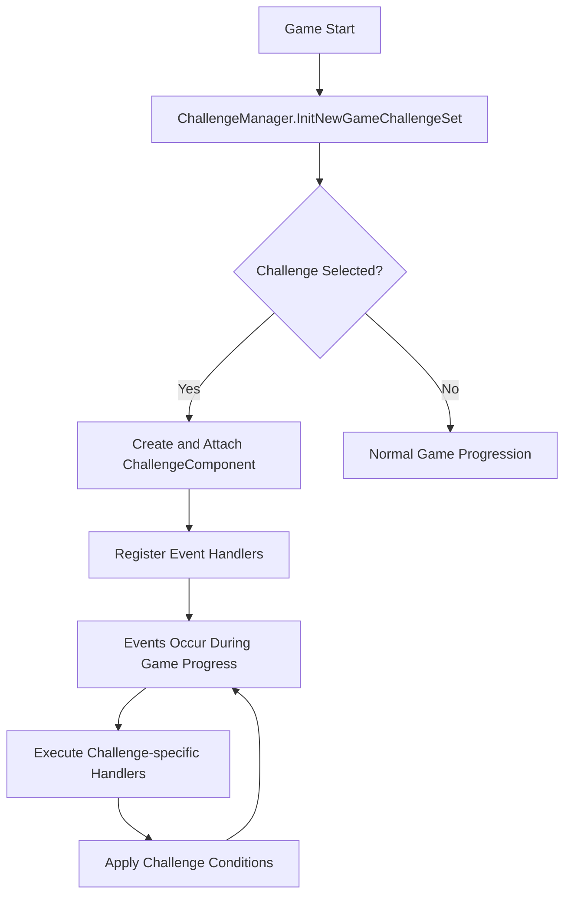

# Challenge System - Challenge Management

## Overview
MetoChess's challenge system provides players with special game conditions and constraints to offer diverse gaming experiences. Each challenge has unique rules and starting conditions, testing players' strategic thinking and adaptability.

## Core Component Structure

### ChallengeManager
The main component responsible for selecting and initializing challenges.

Main functions:
- Challenge ID management (`SetChallengeID`, `PlayChallengeID`)
- Automatic challenge component loading at game start
- Server-client synchronization

Core methods:
- `InitNewGameChallengeSet()`: Load challenge components before game start
- `SetChallenge(number chNum)`: Set challenge number

### ChallengeComponent
The base component for all challenges that monitors various in-game events.

Main features:
- Provides handlers for all major in-game events
- Manages stack information per challenge
- String-type data storage system

Events monitored:
- Game/stage/round start/end
- Unit purchase/sale/level up
- Item/rune card related actions
- Battle related events (attacks, skill usage, battle results)

## Challenge Implementation Method

Each challenge is implemented by inheriting from `ChallengeComponent` and overriding specific event handlers.

```
@Component
script CH10001 extends ChallengeComponent
    method void StartGameHandler(any event)
        -- Implement challenge-specific logic
```

### Challenge Identification System
- Challenge IDs are managed in `CH10001` ~ `CH10010` format
- Automatic ID conversion when selecting by number: `10000 + chNum`

## Data Structure

### ChallengeModeInfo.csv
Defines metadata for each challenge:
- `ChallengeID`: Unique identifier
- `CHTitle`: Challenge title
- `Desc`: Detailed description and rules
- `SetSeason`: Season information
- `TitleImageRUID`: Title image resource ID

### Challenge Categories

1. **Economic Constraints**: Changes to gold/interest systems (CH10001, CH10005)
2. **Item Constraints**: Item shop/combination restrictions (CH10002, CH10004, CH10006)
3. **Shop Constraints**: Refresh/rune card restrictions (CH10003, CH10007, CH10010)
4. **Unit Changes**: Character changes/synergy constraints (CH10008, CH10009)

## System Flow Diagram



## Code References
- `RootDesk/MyDesk/InGame/Challenge/ChallengeManager.mlua :: InitNewGameChallengeSet()` — Challenge component initialization
- `RootDesk/MyDesk/InGame/Challenge/ChallengeManager.mlua :: SetChallenge()` — Challenge ID setting
- `RootDesk/MyDesk/InGame/Challenge/ChallengeComponent.mlua :: OnBeginPlay()` — Event handler registration
- `RootDesk/MyDesk/InGame/Challenge/ChallengeComponent.mlua :: SetChallengeStackInfo()` — Stack information synchronization
- `RootDesk/MyDesk/InGame/Challenge/List/CH10001.mlua :: StartGameHandler()` — Individual challenge implementation example
- `RootDesk/MyDesk/InGame/Challenge/ChallengeModeInfo.csv` — Challenge metadata definition

## Features and Advantages

1. **Modular Design**: Each challenge implemented as independent component
2. **Event-Based Architecture**: Monitors all game actions for flexible constraint implementation
3. **Data-Driven**: Challenge information management through CSV files
4. **Extensibility**: Easy structure for adding new challenges
5. **Synchronization**: Automatic server-client challenge state synchronization

Through this system, players can experience various gameplay styles, and each challenge transforms the game's core mechanisms to require new strategic thinking.
