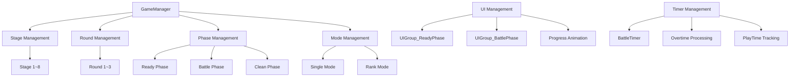
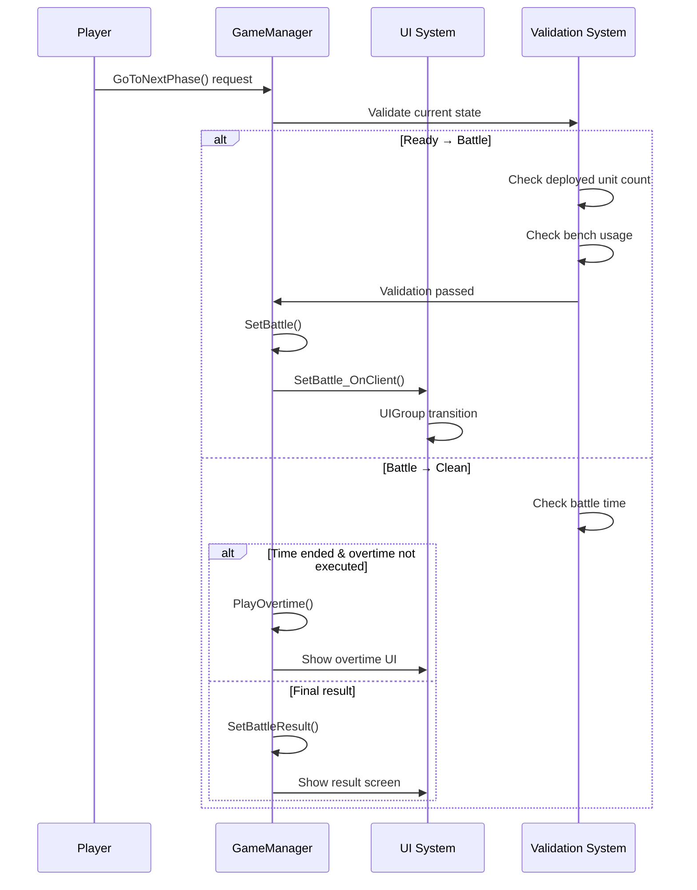
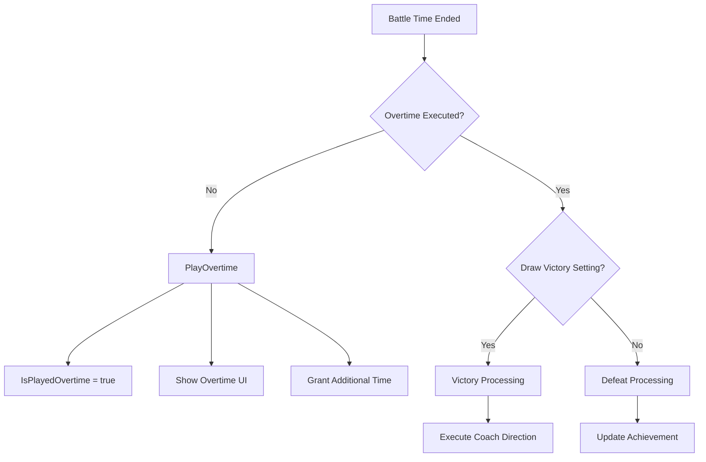

# In-Game System - Game Management - Game Manager

## Overview

GameManager is the core control system of MetoChess in-game, serving as the central component that manages the overall flow and state of the game. It comprehensively handles **Stage/Round/Phase progression management**, **game mode control**, **UI group transitions**, and **battle timer and overtime processing** to provide a consistent and stable gaming experience.

The core design principles of this system are **state-based management** and **client-server synchronization**, ensuring all game states are accurately synchronized through `@TargetUserSync` properties, with appropriate validation and transition logic performed at each phase.

## System Architecture

### Game State Hierarchy



## Core Properties and Structure

### Game Progress State

#### Synchronized Properties (@TargetUserSync)
```lua
-- Game Progress
Stage: 1~8 (current stage)
Round: 1~3 (round)
Phase: Numeric phase identifier
RoundType: "Battle" (round type)
PhaseType: "Ready", "Battle", "Clean" (current phase)

-- Game Mode
ModeType: "Single", "Rank" (game mode)
ModeLevel: Difficulty level
ModeSetVersion: Mode setting version
```

#### Battle Management Properties
```lua
-- Timer Management
BattleTime: Battle time (seconds)
ReadyTime: Preparation time
IsPlayedOvertime: Whether overtime was executed

-- Team Status
MyUnitCount: Allied unit count
EnemyCount: Enemy unit count
TeamHP_User/TeamHP_Enemy: Team HP
TeamHPMax_User/TeamHPMax_Enemy: Maximum team HP
```

### UI Group Management

#### Ready Phase UI Group
- **UIGroup_ReadyPhase**: Ready phase dedicated UI
- Unit placement interface
- Shop system
- Inventory management
- Strategic planning tools

#### Battle Phase UI Group  
- **UIGroup_BattlePhase**: Battle phase dedicated UI
- Real-time battle information
- HP bars and status displays
- Battle timer
- Result panels

## Game Flow Management

### Phase Transition System

#### Transition Flow Diagram


### Core Transition Methods

#### GoToNextPhase() - Phase Progression Control
```lua
-- Validation Phase
1. Ready Phase: Deployed unit count < Allowed unit count
2. Ready Phase: Bench usage ≤ Available bench space
3. Battle Phase: Battle time and overtime handling
4. Game end condition check (HP ≤ 0, 8-3 round completion)

-- Transition Execution
targetPhase = currentPhase + 1
Query next phase data from round info table
Execute corresponding phase method
```

#### Ready_OnClient() - Ready Phase UI Setup
```lua
-- UI Group Transition
UIGroup_ReadyPhase.Enable = true
UIGroup_BattlePhase.Enable = false

-- Progress Popup Animation
progressPopupUI.Text = "Ready"
Ease animation: 300→-300→300 (QuintEaseOut→BackEaseIn)

-- Progress Bar Expansion
ui_progressBar.UITweenScale:Play()
```

#### SetBattle_OnClient() - Battle Phase UI Setup
```lua
-- UI Group Transition
UIGroup_ReadyPhase.Enable = false
UIGroup_BattlePhase.Enable = true

-- Clear Drag States
if (unit dragging) → end drag & return to position
if (item dragging) → disable mouse tracking
if (rune card dragging) → disable drag chaser

-- Battle Popup Animation  
progressPopupUI.Text = "Battle"
```

## Game Mode System

### Single Mode
- **ModeType**: "Single" 
- **Features**: PvE-style practice mode
- **AI Opponents**: Uses predefined enemy presets
- **Progression**: Linear stage clearing

### Rank Mode  
- **ModeType**: "Rank"
- **Features**: Competitive mode
- **Matching**: Real-time player vs player battles
- **Rewards**: Rank points and special rewards

### Mode-Specific Differentiating Elements

```lua
-- Victory/Defeat Decision Differences
if ModeType == "Rank" then
    -- Rank Mode: Draw = Defeat
    _AchievementService:UpdateAchievement("AC006005", 1, user)
    SetBattleResult(false, EnemyCount)
else
    -- Single Mode: Draw processing logic
    if userPControl.Battle_DrawIsWin then
        SetBattleResult(true, MyUnitCount)
    end
end
```

## Battle Timer and Overtime

### Timer Management System

#### General Battle Timer
```lua
BattleTime: Battle time limit (in seconds)
UI_BattleTimer: Visual timer UI

-- Decrease every frame
OnUpdate(delta):
    if PhaseType == "Battle":
        BattleTime -= delta
        Update UI
```

#### Overtime System


#### PlayOvertime() Implementation
```lua
-- Server Side Overtime Setup
IsPlayedOvertime = true
Set additional battle time

-- Client UI Update  
PlayOvertime_OnClient(userId):
    Activate overtime panel
    Play special effects and sounds
    UI emphasis effects
```

## Victory/Defeat Decision System

### Victory/Defeat Conditions

#### General Victory/Defeat Decision
```lua
SetBattleResult(isWin, remainingUnits):
    Record battle statistics
    Trigger coach direction
    Update achievement progress
    Prepare next round
```

#### Game End Conditions
```lua
-- Defeat Condition
if TeamManager.HP <= 0 and PhaseType == "Clean":
    SetGameOver(false) -- Game Over (defeat)

-- Victory Condition (8-3 Stage)
if Stage == 8 and Round == 3 and PhaseType == "Clean":
    Check victory in individual rounds of 8-3
    if Victory round exists:
        SetGameOver(true) -- Game Clear
        Change BGM (victory music)
        Update synergy victory achievement
```

### Special Rule - 8-3 Round
```lua
-- Must achieve victory at 8-3 to clear
if winCheck == false:
    Round -= 1  -- Roll back round
    Round8_3Num += 1  -- Increase retry count
    "Must achieve victory in final round" message
```

## Data Loading and Saving

### Game State Restoration
```lua
-- When data loading is needed
NeedDataLoad: Whether loading is needed
NeedDataLoadVersion: Version information
NeedDataLoadType: "Single"/"Rank"
NeedDataLoadLevel: Level to restore
NeedDataLoadStage/Round: Progress to restore
NeedDataLoadPhaseType: Phase to restore

-- Apply Saved Data
SetSavedData: Whether to apply saved data
```

### Game Progress Recording
```lua
PlayTime: Total play time
PlayTimer: Play timer ID
ReadyTimeRecord: Preparation time record for each round
RewardTable: Reward information for each round
```

## Performance Optimization

### UI Transition Optimization
```lua
-- UI group transition in single frame
UIGroup_ReadyPhase.Enable = false
UIGroup_BattlePhase.Enable = true

-- Immediately disable unnecessary UI elements
Text_OnFieldUnitsCount.Enable = false
_UI_Tooltip:ClearAllTooltipUI()
```

### State Synchronization Optimization
```lua
-- Synchronize only necessary data with @TargetUserSync
-- Secure network efficiency through individual transmission per client
-- Prevent cheating through server validation
```

### Timer Management Optimization
```lua
-- Handle multiple functions with single timer
PlayTimer: Track total game play time
TeamHPUpdateTimer: HP bar update optimization

-- Batch Ease animation processing
for i=1, 20 do
    _TimerService:SetTimerOnce(moveEase, 0.02*i)
end
```

## Extensibility

### Adding New Game Modes
```lua
-- ModeType expansion possible
"Single", "Rank" → Add "Tournament", "Coop", "Challenge"

-- Mode-specific differentiation logic
if ModeType == "Tournament":
    Apply tournament special rules
elseif ModeType == "Coop":
    Cooperative play logic
```

### Dynamic Phase Expansion
```lua
-- PhaseType expansion
"Ready", "Battle", "Clean" → Add "Preparation", "Intermission"

-- Easy addition of new phases with flexible phase transition system
```

### AI and Automation
```lua
-- Auto Battle Mode
if AutoBattleMode:
    Automatically skip Ready Phase
    Apply optimal strategy automatically

-- Spectator Mode  
if SpectatorMode:
    Disable UI groups
    Keep only information display UI
```

## Debugging and Development Tools

### Developer Cheats
```lua
-- Direct stage/round movement
SetStage(target_stage)
SetRound(target_round)

-- Force phase transition
ForceNextPhase()

-- Timer manipulation
SetBattleTime(seconds)
SkipOvertime()
```

### State Monitoring
```lua
-- Real-time game state tracking
Display current Stage-Round-Phase
Remaining battle time and overtime status
UI group activation status
Synchronized property values
```

## Error Handling and Recovery

### State Inconsistency Prevention
```lua
-- Client-server synchronization validation
Check integrity of @TargetUserSync properties
Block invalid phase transition requests
```

### Recovery Mechanisms
```lua
-- Game state restoration
Restore previous state through data loading system
Check recovery necessity with NeedDataLoad flag
Accurate state reproduction based on save data
```

## Code References

- `RootDesk/MyDesk/InGame/Managers/GameManager.mlua :: GoToNextPhase()` — Phase transition and game progression validation logic
- `RootDesk/MyDesk/InGame/Managers/GameManager.mlua :: Ready_OnClient()` — Ready phase UI group setup and animations  
- `RootDesk/MyDesk/InGame/Managers/GameManager.mlua :: SetBattle_OnClient()` — Battle phase UI transition and drag state cleanup
- `RootDesk/MyDesk/InGame/Managers/GameManager.mlua :: PlayOvertime()` — Overtime system execution logic
- `RootDesk/MyDesk/InGame/Managers/GameManager.mlua :: SetBattleResult()` — Victory/defeat decision and result processing
- `RootDesk/MyDesk/InGame/Managers/GameManager.mlua :: SetGameOver()` — Game end conditions and final result processing
- `RootDesk/MyDesk/InGame/Managers/RoundInfo.userdataset` — Round-specific progression information data
- `RootDesk/MyDesk/InGame/Managers/MonsterRoundInfo.userdataset` — Enemy round information data
