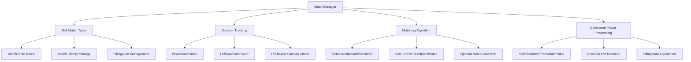

# In-Game System - Game Management - Match Manager

## Overview

MatchManager is the core system that provides **fair and balanced matching** in MetoChess's 8-player auto-chess game. Through sophisticated algorithms based on an **8x8 match table**, it ensures all players can battle each other a similar number of times while comprehensively managing **survivor tracking**, **match history management**, and **eliminated player processing**.

The core values of this system are **matching fairness** and **strategic diversity**. Rather than simple random matching, it provides equal opportunities to all players through intelligent algorithms that consider past matching history.

## System Architecture

### Overall Structure Diagram



## Core Components

### 1. 8x8 Match Table System

The match table is designed as a **symmetric matrix** structure to manage match history and cooldowns between players.

#### Table Structure
```lua
-- Initialize 8x8 matrix during setup
for i=1, 8 do
    local row = {
        ["Key"] = i,
        ["Data"] = { 0, 0, 0, 0, 0, 0, 0, 0 }
    }
    row["Data"][i] = -9999  -- Cannot match with self
    self.MatchTable[i] = row
end
```

#### Value Meanings
- **0**: Match available state
- **Positive number**: Cooldown after recent match (decreases by 1 per round)
- **-1**: Temporary match exclusion state
- **-9999**: Permanent match unavailable (self, eliminated players)

### 2. Survivor Tracking System

Tracks player survival status in real-time during game progression.

#### Core Properties
```lua
@Description("Variable indicating whether survivor")
property SyncTable<boolean> IsSurvivors
property number LeftSurvivorsCount = 0
```

#### Survivor Check Logic
```lua
-- HP-based survivor confirmation
for i=1, #teamManagers do
    local hp = teamManagers[i].TeamManager.HP
    if hp > 0 then
        local uniqueNumber = teamManagers[i].TeamManager.UniqueNumber
        table.insert(survivors, uniqueNumber)
    end
end
```

### 3. Matching Algorithm

#### Basic Matching (SetCurrentRoundMatchInfo)
**Simple random matching** method used in early stages.

```lua
-- Temporary logic: Random selection from survivors
local roomCount = math.floor((#survivors+1)/2)
for i=1, roomCount do
    -- Randomly select two players
    local randomIdx = _UtilLogic:RandomIntegerRange(1, #survivors)
    userA = survivors[randomIdx]
    table.remove(survivors, randomIdx)
    -- ... select userB
end
```

#### Advanced Matching (SetCurrentRoundMatchInfo2)
**Optimized algorithm considering match history**, which is the core matching logic.

##### Algorithm Steps

1. **Match Table Update**
```lua
-- Decrease cooldown every round
for j=1, 8 do
    if data[j] > 0 then
        data[j] -= 1
    elseif data[j] == -1 then
        data[j] = 0  -- Release temporary exclusion
    end
end
```

2. **Optimal Match Target Selection**
```lua
-- Prioritize players with fewest available match targets
local minZeroCount_row = 999
local rowIdx = 0
for i=1, #self.MatchTable do
    local zeroCount = getRowZeroCount(i)
    if zeroCount > 0 and zeroCount < minZeroCount_row then
        minZeroCount_row = zeroCount
        rowIdx = i
    end
end
```

3. **Opponent Optimization**
```lua
-- Select optimal opponent from available targets for chosen player
-- Prioritize matching with opponents having fewest 0s in columns
local finalCandidates = {}
local minZeroCount_column = 7
for i=1, #targetList do
    local column = targetList[i]
    local zeroCount = getColumnZeroCount(column)
    
    if zeroCount == minZeroCount_column then
        table.insert(finalCandidates, column)
    elseif zeroCount < minZeroCount_column then
        table.clear(finalCandidates)
        table.insert(finalCandidates, column)
    end
end
```

4. **Match History Recording**
```lua
-- Set cooldown with FillingNum value for matched pairs
targetData[selectedKey] = self.FillingNum
selectedData[targetKey] = self.FillingNum
```

### 4. Eliminated Player Processing System

Dynamically reconstruct match table when players are eliminated.

#### Elimination Processing Logic (SetEliminatedFromMatchTable)

```lua
self.LeftSurvivorsCount -= 1

-- Clean up table when eliminated in pairs
if self.LeftSurvivorsCount %2 == 0 then
    -- FillingNum adjustment (6→4, 4→3, 2→1)
    if self.LeftSurvivorsCount == 6 then
        self.FillingNum = 4
    elseif self.LeftSurvivorsCount == 4 then  
        self.FillingNum = 3
    elseif self.LeftSurvivorsCount == 2 then
        self.FillingNum = 1
    end
end
```

#### Row/Column Removal
```lua
-- Remove eliminated player rows
for i=#self.MatchTable, 1, -1 do
    local row = self.MatchTable[i]
    local key = row["Key"]
    
    if self.IsSurvivors[key] == false then
        table.remove(self.MatchTable, i)
    end
end

-- Mask eliminated player columns and decrease cooldown
for j=1, 8 do
    if self.IsSurvivors[j] == false then
        data[j] = -9999  -- Permanent match unavailable
    elseif data[j] > 0 then
        data[j] -= 1     -- Cooldown decrease
    end
end
```

## Matching Fairness Guarantee Mechanisms

### 1. Equal Matching Opportunities
- **Prioritize players with fewer 0s**: Higher priority for players with fewer available match targets
- **Bidirectional cooldown application**: Apply same cooldown to both sides after matching

### 2. Strategic Diversity Guarantee  
- **Avoid recent opponents**: Prevent consecutive matching with FillingNum-based cooldown
- **Dynamic FillingNum adjustment**: Optimize cooldown period according to number of survivors

### 3. Late Game Optimization
- **Special final handling**: Additional cooldown reduction when 2 players remain for immediate matching
- **Gradual constraint relaxation**: Increase matching flexibility by reducing FillingNum as survivors decrease

## Related Files

### Code References
- `RootDesk/MyDesk/InGame/Managers/MatchManager.mlua :: OnBeginPlay()` — 8x8 match table initialization
- `RootDesk/MyDesk/InGame/Managers/MatchManager.mlua :: SetCurrentRoundMatchInfo()` — Basic random matching algorithm
- `RootDesk/MyDesk/InGame/Managers/MatchManager.mlua :: SetCurrentRoundMatchInfo2()` — Advanced optimized matching algorithm  
- `RootDesk/MyDesk/InGame/Managers/MatchManager.mlua :: SetEliminatedFromMatchTable()` — Eliminated player processing and table reconstruction
- `RootDesk/MyDesk/InGame/Managers/MatchManager.mlua :: PrintMatchTable()` — Debug table output

### Integrated Systems
- `GameManager.mlua` — Request match information during round progression
- `TeamManager.mlua` — Provide survivor HP information
- Confluence Reference Document: `https://confluence.nexon.com/pages/viewpage.action?pageId=1113761835`

## Performance and Scalability

### Time Complexity
- **Match Generation**: O(n²) where n = number of survivors (maximum 8)
- **Table Update**: O(64) = O(1) (fixed 8x8 matrix)
- **Eliminated Player Processing**: O(n) where n = number of survivors

### Memory Efficiency
- **Fixed Size Matrix**: Consistent memory usage with 8x8 = 64 integers
- **Minimize Dynamic Allocation**: Utilize predefined structures

Through this design, MatchManager implements a balanced system that provides fair and predictable matching while not compromising the strategic fun of the game.
