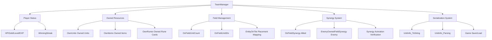
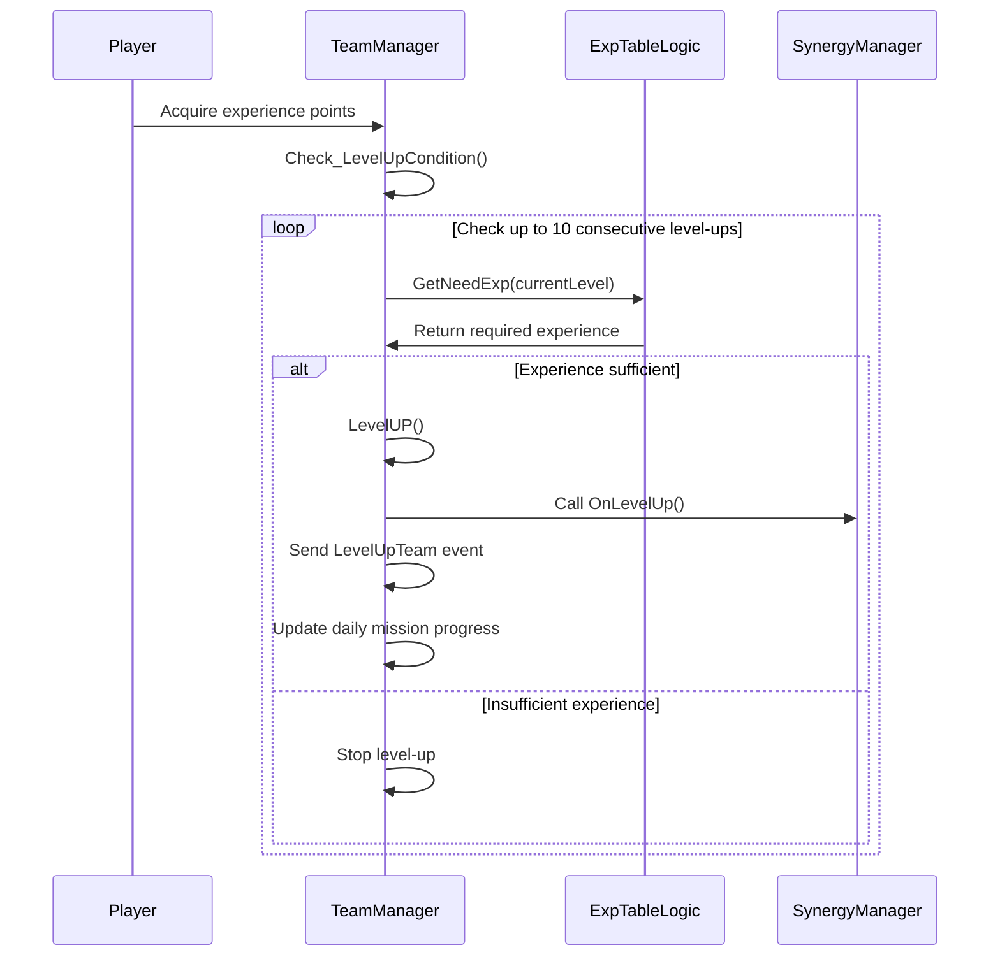
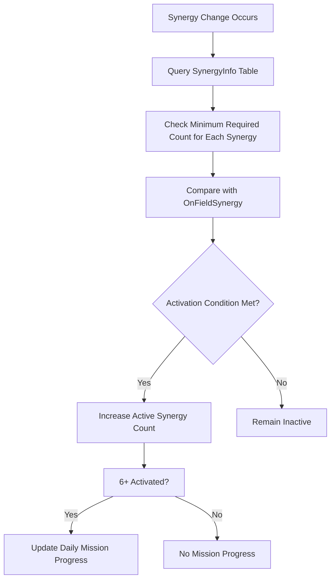

# In-Game System - Game Management - Team Manager

## Overview

TeamManager is the core component in MetoChess that manages all of a player's in-game resources and status. It comprehensively handles **player basic status** (HP/Gold/Level/EXP/WinningStreak), **owned resource management** (units/items/runes), **field placement system**, **synergy calculation engine**, and **unit information serialization system** to systematically manage all strategic elements of the game.

The core design philosophy of this system is **complete state synchronization** and **data integrity guarantee**. It provides real-time client-server synchronization through `@TargetUserSync` properties and is designed to ensure accurate saving and restoration through efficient serialization/parsing of complex unit information.

## System Architecture

### Overall Structure Diagram



## Core Property System

### Player Basic Status (@TargetUserSync)

#### Survival and Resource Management
```lua
HP: Team health (directly related to defeat conditions)
Golds: Gold owned (resources for purchases and upgrades)
Level: Team level (1~10, determines deployable unit count)
EXP: Experience points (level-up materials)
WinningStreak: Win streak record (affects reward multiplier)
```

#### Gold Tracking System
```lua
GetGoldAmount: Total gold acquired
UsedGoldAmount: Total gold spent

-- Track gold acquisition/usage for statistics and balancing data collection
```

### Owned Resource Management (@TargetUserSync)

#### Unit Management
```lua
OwnUnits: SyncTable<Entity> -- All owned unit entities
OwnUnitsBySetID: SyncTable<string, number> -- Owned quantity by character ID
OnFieldUnitCount: Number of units deployed on field
OnFieldUnitIDs: SyncTable<string, number> -- Count by deployed unit ID
```

#### Item & Rune Card System
```lua
OwnItems: SyncTable<string> -- Owned item ID list
OwnRunes: SyncTable<string> -- Owned rune card ID list
OnEntityUsingToOwnedRunes: SyncTable<Entity> -- Rune card usage mapping

ItemListFromBox: Item list acquired from item boxes
```

### Field Placement and Enemy Information

#### Placement Management System
```lua
EntityOnTile: SyncTable<Entity, Entity> -- Tile↔Unit bidirectional mapping
- Key: Tile entity
- Value: Deployed unit entity
```

#### Enemy Information Tracking
```lua
EnemyUnits: Enemy unit list
EnemyOwnedFieldSynergy: Enemy activated synergies
EnemyOwnedRunes: Enemy owned rune cards
OnEntityUsingToEnemyOwnedRunes: Enemy rune card usage mapping
```

## Player Status Management

### Level System

#### Experience Points and Level-Up Mechanism


#### LevelUP() Implementation
```lua
Level += 1
SynergyManager_New:OnLevelUp() -- Apply synergy effects
SendEvent(LevelUpTeam) -- Notify other systems of level-up

-- Special condition: Daily mission when reaching level 10
if Level == 10 and GameMode == "Single":
    DailyMissionComponent:AddProgress("DM10005")
```

### Gold Management System

#### AddGolds() - Integrated Gold Management
```lua
method AddGolds(amount, cause):
    Golds += amount
    
    -- Update acquisition/usage statistics
    if amount >= 0:
        GetGoldAmount += amount
    else:
        UsedGoldAmount -= amount
    
    -- Process by cause
    if cause in ["coach", "runeCard", "item", "char", "roundResult", "synergy"]:
        Update daily mission progress (single mode)
        PlayCoinDirector_Text(false) -- General acquisition effect
    elif cause in ["start", "init", "cheat"]:
        PlayCoinDirector_Text(true) -- Start/initialization effect
    else:
        PlayCoinDirector_Text(false) -- Default effect
```

#### Gold Acquisition Cause Classification
- **coach**: Acquired through coach effects
- **runeCard**: Acquired through rune card effects  
- **item**: Acquired through item sale/effects
- **char**: Acquired through unit sale
- **roundResult**: Round result rewards
- **synergy**: Acquired through synergy effects
- **repechage**: Repechage rewards
- **start/init**: Game start/initialization
- **cheat**: Developer cheat

## Synergy Management System

### Real-Time Synergy Calculation

#### GetOnFieldSynergyCount() - Synergy Count Management
```lua
method GetOnFieldSynergyCount(synergyID, count):
    if count > 0:  -- Add synergy
        OnFieldSynergy[synergyID] = (existing value or 0) + count
    else:  -- Reduce synergy
        OnFieldSynergy[synergyID] += count
        if OnFieldSynergy[synergyID] <= 0:
            OnFieldSynergy[synergyID] = nil  -- Remove if 0 or below
    
    -- Send synergy change event
    SendEvent(OnFieldSynergyCountChanged("User", synergyID, count))
    
    -- Daily mission: Check 6+ synergy activation (single mode)
```

#### Synergy Activation Verification System



#### CheckActiveSynergy() - Check Active Synergy Count
```lua
Create activation condition table:
    Extract minimum value from NeedCount_step1~5 for each synergy in SynergyInfo

Count active synergies:
    for each OnFieldSynergy:
        if current count >= minimum required count:
            activeSynergyAmount++
            
return activeSynergyAmount
```

#### CheckSpecificSynergy() - Check Specific Synergy Activation
```lua
method CheckSpecificSynergy(checkSynergyID):
    Query minimum required count for that synergy from SynergyInfo
    
    if OnFieldSynergy[checkSynergyID] >= required count:
        return true
    else:
        return false
```

## Unit Information Serialization System

### UnitInfo_ToString() - Unit Data Serialization

#### Serialization Format
```
"CharID_Level_Item1/Item2/Item3_StackProperty_TilePosition"

Example: "C10001_3_I10005/I10012/0_{stat1:10,stat2:5}_2/3"
```

#### Implementation Details
```lua
method UnitInfo_ToString(unit):
    unitID = unit.UnitInfo.charID
    level = unit.UnitInfo.level
    
    -- Extract equipped item IDs (use "0" if none)
    itemIDs = []
    for i=1,3:
        itemIDs[i] = unit.UnitStatus.EquippedItemIDList[i] or "0"
    
    -- Serialize stack properties (table → string)
    stackProperty_str = _UtilLogic:TableToString(unit.UnitStatus.StackProperty)
    
    -- Tile position information
    tilePosition = "vertical/horizontal"
    
    return formatted_string
```

### UnitInfo_Parsing() - Unit Data Parsing

#### Deserialization Process
```lua
method UnitInfo_Parsing(data, targetEntity):
    parsing = _UtilLogic:Split(data, "_")
    
    -- Restore basic information
    targetEntity.UnitInfo.charID = parsing[1]
    targetEntity.UnitInfo.level = parsing[2]
    
    -- Restore item information
    itemData = _UtilLogic:Split(parsing[3], "/")
    for i=1,3:
        if itemData[i] != "0":
            Equipped item restoration logic
    
    -- Restore stack properties
    stackProperty = _UtilLogic:StringToTable(parsing[4])
    
    -- Restore tile position
    tilePos = _UtilLogic:Split(parsing[5], "/")
    vertical, horizontal = tilePos[1], tilePos[2]
```

### Use Cases

#### During Game Save
```lua
SaveCurrentGame():
    for each owned unit:
        serialized_data = UnitInfo_ToString(unit)
        Save to DB
```

#### During Game Load  
```lua
LoadContinuedGame():
    saved_units = Load from DB
    for each saved_unit_data:
        new_unit = Create unit entity
        UnitInfo_Parsing(saved_unit_data, new_unit)
```

## Enemy Information Management

### Enemy Synergy Tracking

#### GetEnemyOwnedFieldSynergyCount()
```lua
method GetEnemyOwnedFieldSynergyCount(synergyID, count):
    EnemyOwnedFieldSynergy[synergyID] = (existing value or 0) + count
    
    SendEvent(OnFieldSynergyCountChanged("Enemy", synergyID, count))
    
    -- Remove if 0 or below
    if EnemyOwnedFieldSynergy[synergyID] <= 0:
        EnemyOwnedFieldSynergy[synergyID] = nil
```

### One-Time Unit Management

#### DespawnOnetimeUnits() - Clean Up Temporary Units
```lua
-- Remove allied one-time units
for i = #OwnUnits downto 1:
    if OwnUnits[i].UnitInfo.IsOnetimeUnit:
        OwnUnits[i].UnitInfo:CleanCharInfo()
        table.remove(OwnUnits, i)

-- Remove enemy one-time units  
for i = #EnemyUnits downto 1:
    if EnemyUnits[i].UnitInfo.IsOnetimeUnit:
        EnemyUnits[i].UnitInfo:CleanCharInfo()
        table.remove(EnemyUnits, i)
```

## Game State Save/Load

### Continuous Game Save

#### SaveCurrentGame() - Save Current State
```lua
-- Process by game end timing
if PhaseType == "Clean":
    GameManager:GoToNextPhase()
    _InGameInfoDataLogic:SaveInGameData(userId)
    
elif PhaseType == "Battle" or "Setting":
    -- Leaving during battle = defeat processing
    if HP > 1:
        AddTeamHP(-1)  -- Reduce HP by 1
        Award gold rewards
        Proceed to next round
    
_InGameInfoDataLogic:SaveInGameData(userId)
```

#### LoadContinuedGame() - Game Restoration
```lua
method LoadContinuedGame():
    -- Check saved game data
    if GameManager.SetSavedData and GameManager.NeedDataLoad:
        return true  -- Restoration needed
    else:
        return false  -- Start new game
```

### Game Initialization

#### InitNewGame() - New Game Setup
```lua
Set initial values:
    HP = Starting HP by mode
    Level = 1
    EXP = 0
    Golds = Starting gold by mode
    WinningStreak = 0

Initialize components:
    CoachManager:InitNewGameCoachSet()
    PenaltyManager:InitNewGamePenaltySet()
    ChallengeManager:InitNewGameChallengeSet()

Loading state management:
    LoadingManager.LoadedCount["GameDataLoad"] = 1
```

## Performance Optimization

### Synchronization Optimization
```lua
-- Individual synchronization per player with @TargetUserSync
-- Send only necessary data to clients
-- Guarantee data integrity through server validation
```

### Memory Management
```lua
-- Prevent memory leaks through automatic one-time unit cleanup
-- Remove from table when synergy count reaches 0
-- Save storage space through serialized data compression
```

### Calculation Optimization
```lua
-- Cache synergy activation condition tables
-- Batch process up to 10 consecutive level-up conditions
-- Fast search through EntityOnTile bidirectional mapping
```

## Extensibility

### Adding New Resource Types
```lua
-- Easy expansion with @TargetUserSync property
property SyncTable<string> OwnRelics  -- Relic system
property SyncTable<string> OwnPets    -- Pet system
```

### Advanced Synergy System
```lua
-- Conditional synergy activation
method CheckConditionalSynergy(synergyID, conditions):
    Check basic count condition + additional complex conditions
    
-- Synergy step-based effects
method GetSynergyStep(synergyID):
    Return synergy step (1~5 steps) based on current count
```

### Enhanced Statistics and Analysis
```lua
-- Detailed play statistics
property table PlayStatistics
- Gold usage patterns by round
- Synergy utilization frequency  
- Unit placement preferences
- Item usage efficiency
```

## Code References

- `RootDesk/MyDesk/InGame/Managers/TeamManager.mlua :: UnitInfo_ToString()` — Unit information serialization system
- `RootDesk/MyDesk/InGame/Managers/TeamManager.mlua :: UnitInfo_Parsing()` — Unit information parsing and restoration
- `RootDesk/MyDesk/InGame/Managers/TeamManager.mlua :: Check_LevelUpCondition()` — Level-up condition verification and processing
- `RootDesk/MyDesk/InGame/Managers/TeamManager.mlua :: AddGolds()` — Gold acquisition/usage management and effects
- `RootDesk/MyDesk/InGame/Managers/TeamManager.mlua :: GetOnFieldSynergyCount()` — Synergy count management and daily missions
- `RootDesk/MyDesk/InGame/Managers/TeamManager.mlua :: CheckActiveSynergy()` — Check number of activated synergies
- `RootDesk/MyDesk/InGame/Managers/TeamManager.mlua :: CheckSpecificSynergy()` — Check specific synergy activation status  
- `RootDesk/MyDesk/InGame/Managers/TeamManager.mlua :: SaveCurrentGame()` — Save current game state
- `RootDesk/MyDesk/InGame/Managers/TeamManager.mlua :: LoadContinuedGame()` — Restore saved game
- `RootDesk/MyDesk/InGame/Managers/TeamManager.mlua :: DespawnOnetimeUnits()` — One-time unit memory cleanup
