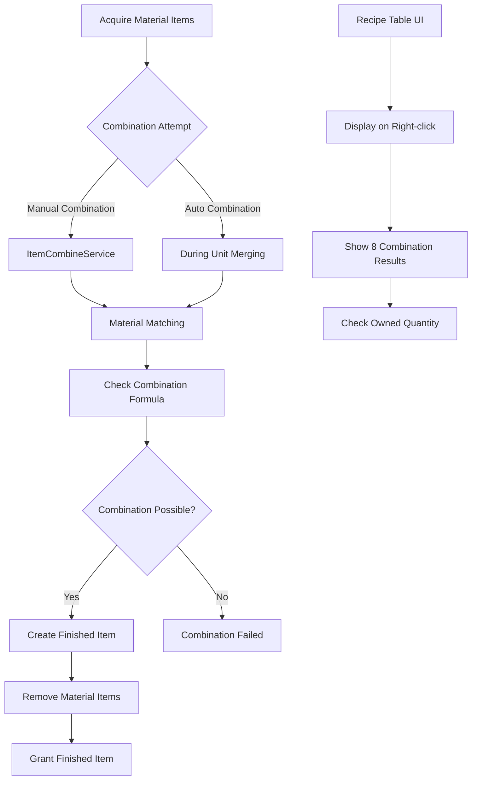

# Item Combination System

MetoChess's item combination system is a strategic system that combines Material Items to create more powerful Normal Items. Through 8 basic material items and various combination formulas, it can significantly enhance unit abilities.

## System Overview

The combination system is a deep mechanism that requires strategic choices beyond simple item crafting:
- **Material Collection**: Acquire 8 basic material items
- **Combination Formula**: Create finished products through specific material combinations
- **Auto Combination**: Automatic processing during unit merging
- **Recipe Table UI**: Real-time combination possibility display
- **Special Combination**: Special items linked to challenge achievements



## Core Combination Logic

### ItemCombineService Structure

The service that serves as the center for all combination processing.

**Data Structure:**
```lua
@Description([[ItemCombine dataset data. 
value(table) = {items = {itemId1, itemId2}, result = combinedItem}
]])
property table CombineData = {}
```

**Initialize Combination Data:**
```lua
method void LoadData()
    local data = _DataService:GetTable("ItemCombine"):GetAllRow()
    
    for _, row in pairs(data) do
        local itemId1 = row:GetItem("ItemId1") 
        local itemId2 = row:GetItem("ItemId2")
        local combinedItem = row:GetItem("CombinedItem")
        
        local tmp = {items = {itemId1, itemId2}, result = combinedItem}
        table.insert(self.CombineData, tmp)
    end
end
```

### Combination Matching Algorithm

**Order-Independent Matching:**
```lua
method string GetNormalItemIDByMaterialItemIDs(string itemId1, string itemId2, Entity user)
    for _, data in pairs(self.CombineData) do
        if (data['items'][1] == itemId1 and data['items'][2] == itemId2) or
           (data['items'][1] == itemId2 and data['items'][2] == itemId1) then
            return data['result']
        end
    end
    return nil
end
```

**Special Combination Conditions:**
```lua
-- Special item combination when challenge completed
if isvalid(user) then
    if user.TM_PropertyControl.Challenge_SetCheck["CH10002"] >= 1 then
        return "NI10033"  -- Santa Gloves (special item)
    end
end
```

## Material Item System

### 8 Basic Materials

**Material Item List:**
```lua
local ingredientItems = {
    "MI10001", "MI10002", "MI10003", "MI10004",
    "MI10005", "MI10006", "MI10007", "MI10008"
}
```

**Material Item Identification:**
```lua
method string GetMateiralIDinUnitEquippedItems(table unitItems)
    for _, itemId in pairs(unitItems) do
        if string.sub(itemId, 1, 2) == "MI" then  -- If material item
            return itemId
        end
    end
    return nil
end
```

### Material Item Characteristics

- **ID Pattern**: Starts with "MI" prefix
- **Combination Priority**: Auto combination processing when equipped on unit
- **Ownership Limit**: Collection strategy considering inventory space

## Manual Combination System

### Combination When Equipping on Unit

Automatically attempts combination when equipping material items on units:

```lua
-- Find already equipped material item
local materialItemID = _ItemCombineService:GetMateiralIDinUnitEquippedItems(equippedItemList)

if isvalid(materialItemID) then
    -- Check combination result
    local normalItemID = _ItemCombineService:GetNormalItemIDByMaterialItemIDs(
        itemID, materialItemID, user)
    
    if isvalid(normalItemID) then
        -- Process combination
        targetUnit.UnitStatus:SetProperty("EquippedItemIDList", 
            normalItemID, string.format("replace,%d", idx))
        table.remove(user.TeamManager.OwnItems, itemIdx)
        
        -- Combination complete event
        user:SendEvent(CombinationItem(normalItemID))
    end
end
```

### Special Item Exception Handling

**Santa Gloves Special Rule:**
```lua
-- Santa Gloves can only be equipped alone
if normalItemID == "NI10033" and #equippedItemList > 1 then
    -- Cancel combination and return to inventory
    targetUnit.UnitStatus:SetProperty("EquippedItemIDList", 
        normalItemID, string.format("remove,%d", idx))
    table.insert(user.TeamManager.OwnItems, normalItemID)
end
```

## Auto Combination System

### Combination During Unit Merging

Auto combination processing of material items when merging 3-star units:

```lua
-- Do we have 2 material items?
local materialIdx = {}
for idx, id in pairs(items) do
    if string.sub(id, 1, 2) == "MI" then
        table.insert(materialIdx, idx)
    end
end

-- Combine 2 material items into finished item
if #materialIdx == 2 then
    local materialItem1 = items[materialIdx[1]]
    local materialItem2 = items[materialIdx[2]]
    
    -- Create combination item
    local combineID = _ItemCombineService:GetNormalItemIDByMaterialItemIDs(
        materialItem1, materialItem2, user)
    table.insert(items, combineID)
    
    -- Remove material items
    table.remove(items, materialIdx[2])
    table.remove(items, materialIdx[1])
end
```

### Advantages of Auto Combination

- **Convenience**: Skip manual combination process
- **Efficiency**: Process simultaneously with unit merging
- **Strategy**: Increase importance of material collection planning

## Recipe Table UI System

### Right-click Recipe Table

Display recipe table when right-clicking on material items or specific box items:

```lua
@ExecSpace("ClientOnly")
method void ShowCombineTableTooltip(string itemID, string showType)
    -- Only material items and some item boxes can display
    local keyType = string.sub(itemID, 1, 2)
    local showable = false
    
    if keyType == "MI" then
        showable = true
    elseif keyType == "IB" then
        local boxIdx = tonumber(string.sub(itemID, -2, -1))
        if boxIdx >= 5 and boxIdx <= 12 then
            showable = true
        end
    end
    
    if showable == false then
        return
    end
    
    self.IsShowingCombineTableUI = true
end
```

### Combination Possibility Display

**Real-time Owned Quantity Calculation:**
```lua
-- Calculate owned item count
local ownItemCount = {}
-- Inventory items
for i=1, #ownItems do
    if isvalid(ownItemCount[ownItems[i]]) then
        ownItemCount[ownItems[i]] += 1
    else
        ownItemCount[ownItems[i]] = 1
    end
end

-- Include equipped items too
local ownUnits = _UserService.LocalPlayer.TeamManager.OwnUnits
for i=1, #ownUnits do
    local equippedItems = ownUnits[i].UnitStatus.EquippedItemIDList
    for j=1, #equippedItems do
        if isvalid(ownItemCount[equippedItems[j]]) then
            ownItemCount[equippedItems[j]] += 1
        else
            ownItemCount[equippedItems[j]] = 1
        end
    end
end
```

### UI Components

**Recipe Table Slot Structure:**
- `IsCombinable`: Display combination availability
- `Result_OutlineBG`: Result item background
- `Icon`: Result item icon
- `Text_ResultName`: Result item name

**Dynamic UI Updates:**
```lua
for i=1, 8 do
    local ui_slot = ui_table:GetChildByName(string.format("Slot_%d", i))
    
    -- Check combination result
    local targetItemID = ingredientItems[i]
    local resultItemID = self:GetNormalItemIDByMaterialItemIDs(baseItemID, targetItemID, nil)
    
    -- Check combination availability
    local isCombinable = false
    if itemType == "MaterialItem" then
        if isvalid(ownItemCount[targetItemID]) == true and ownItemCount[targetItemID] >= 1 then
            isCombinable = true
        end
    end
    
    -- Update UI
    ui_isCombinable.Enable = isCombinable
    ui_resultItemIcon.SpriteGUIRendererComponent.ImageRUID = resultItemRow:GetItem("RUID")
    ui_resultItemName.TextComponent.Text = _LocalizationService:GetText("Item_"..resultItemID.."_Name")
end
```

## UI Interaction Handling

### Mouse Event Handling

**Close Recipe Table:**
```lua
@EventSender("Service", "InputService")
handler HandleKeyDownEvent(KeyDownEvent event)
    local key = event.key
    
    if key == KeyboardKey.Mouse0 then
        if self.IsShowingCombineTableUI == true then
            local ui_tooltip = _EntityService:GetEntityByPath("/ui/HoverPopupGroup/HoverUI_ItemCombineTable")
            if ui_tooltip.Enable == true and _InputService:IsPointerOverUI() == false then
                ui_tooltip.Enable = false
                self.IsShowingCombineTableUI = false
            end
        end
    end
end
```

### Context Tracking

**UI Context Management:**
- `WatchingUI`: Currently viewed UI window (Shop, Inventory, UnitInfo, etc.)
- `WatchingItemID`: Item ID displaying recipe table
- `IsShowingCombineTableUI`: Recipe table display status

## Combination Strategy and Tips

### Efficient Material Collection

**Priority-Based Collection:**
1. Prioritize materials for frequently used combination formulas
2. Selective collection considering inventory space
3. Coordinate unit merging timing with combination timing

### Combination Timing

**Optimal Combination Timing:**
- Just before 3-star unit merging (utilize auto combination)
- When inventory space is insufficient (secure space)
- When powerful finished items are needed

### Special Item Considerations

**Santa Gloves (NI10033):**
- Can only be combined when challenge completed
- Need strategic utilization as solo equipment item
- Auto removal when equipped with other items

## Performance Optimization

### Data Caching

**Combination Data Caching:**
- Load only once at game start
- Support high-speed search in memory
- Linear search with O(n) complexity

### UI Optimization

**Recipe Table Display Optimization:**
- Dynamic creation only when needed
- Immediate closure with mouse click
- Aggressive cleanup to prevent memory leaks

## Data Structure

### ItemCombine Dataset

**Required Columns:**
- `ItemId1`: First material item ID
- `ItemId2`: Second material item ID
- `CombinedItem`: Combination result item ID

**Combination Rules:**
- Order independent: (A, B) = (B, A)
- 1:1:1 combination: 2 materials → 1 finished product
- Duplicate combination: Same material can be combined twice

## Code References

- `RootDesk/MyDesk/InGame/Item/ItemCombineService.mlua :: GetNormalItemIDByMaterialItemIDs()` — Combination matching logic
- `RootDesk/MyDesk/InGame/Item/ItemCombineService.mlua :: ShowCombineTableTooltip()` — Recipe table UI display
- `RootDesk/MyDesk/InGame/System/ItemSetLogic.mlua :: Manual combination processing` — Combination when equipped on unit
- `RootDesk/MyDesk/InGame/System/UnitSetLogic_New.mlua :: Auto combination processing` — Combination during unit merging
- `RootDesk/MyDesk/UIComponents/UI_Ingame/UI_ItemSelect_ItemSlot.mlua :: HandleUITouchDownEvent()` — Right-click recipe table
- `RootDesk/MyDesk/InGame/Item/ItemCombine.userdataset` — Combination formula data
