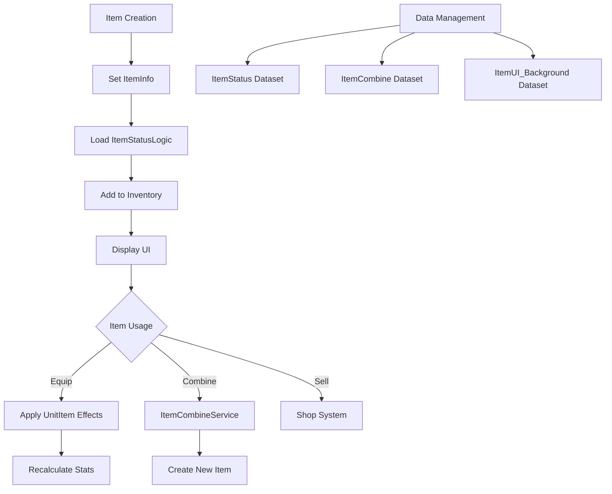

# Item Management System

MetoChess's item system is a core element that enhances units' stats and adds strategic depth. It manages the entire lifecycle from item acquisition to equipment and combination, providing an intuitive UI and powerful data management system.

## System Overview

The item system is a complex system composed of multiple layers:
- **Item Information Management**: Basic information and metadata
- **Stat Effect Processing**: Stat calculation and application
- **Inventory Management**: Storage and UI integration
- **Combination System**: Upgrade through material items
- **Unit Integration**: Equipment and effect application



## Item Basic Information System

### ItemInfo Component

The core component that manages basic information for all item entities.

**Key Properties:**
- `itemID`: Unique identifier of the item
- `itemName`: Localized item name
- `setTile`: Tile where the item is located
- `itemOwnerID`: Item owner ID

**Item Initialization:**
```lua
@ExecSpace("Server")
method void SetItemID(string setItemID)
    self.itemID = setItemID
    local itemDBrow = _DataService:GetTable("ItemStatus"):FindRow("ItemID", self.itemID)
    self.Entity.SpriteRendererComponent.SpriteRUID = itemDBrow:GetItem("RUID")
    self.itemName = itemDBrow:GetItem("Name")
end
```

### Touch Interaction System

Handles direct interaction with items:

**Touch Detection:**
```lua
@ExecSpace("Server")
method void TouchCheck(string userId)
    if (userId == self.itemOwnerID) then
        _ItemSetLogic:SetSelectItem(userId, self.Entity)
        _ItemSetLogic:DragItem(self.Entity, userId)
    end
end
```

**Drag and Drop:**
- Touch start: Item selection and drag initiation
- Touch release: Tile selection and placement processing
- Security handling through ownership verification

## Item Stat Management System

### ItemStatusLogic

Logic that centrally manages all item stat information.

**Supported Stat Types:**
- **Basic Stats**: HP, MP, Attack, Magic Power
- **Defense Stats**: Physical/Magic Resistance
- **Combat Properties**: Attack Speed, Range, Critical
- **Special Effects**: Lifesteal, Movement Speed, MP Recovery

**Stat Calculation Methods:**
```lua
method SyncTable<string, string> GetItemStatusCalculatingType()
    local CalculatingType = {
        ["MaxHP"] = "int",           -- Integer addition
        ["PhysicalAttack"] = "multi", -- Multiplier application
        ["AttackSpeed"] = "multi",    -- Multiplier application
        ["Defence"] = "int",          -- Integer addition
    }
    return CalculatingType
end
```

### Data Initialization Process

Load all item stats into memory at game start:

```lua
method void OnBeginPlay()
    local itemTable = _DataService:GetTable("ItemStatus")
    
    for i=1, itemTable:GetRowCount() do
        local row = itemTable:GetRow(i)
        local key = row:GetItem("ItemID")
        local valueTable = {}
        
        -- Load values for all stat types
        for j=1, #statusType do
            local status = row:GetItem(statusType[j])
            valueTable[statusType[j]] = tonumber(status) or 0
        end
        
        self.ItemStatus[key] = valueTable
    end
end
```

## Unit Item Integration System

### UnitItem Component

Comprehensively manages the effects of items equipped by units.

**Effect Management Tables:**
- `AddedStatus`: Integer addition type effects
- `MultiplyStatus`: Multiplier application type effects
- `ItemAbilityStacks`: Ability stacks per item
- `InBattleAbilityStacks`: Temporary effects during battle

**Stat Application Method:**
```lua
@ExecSpace("ServerOnly")
method void RefreshItemStatus()
    -- Reset to default values
    for i=1, #statusType do
        self.AddedStatus[statusType[i]] = 0
        self.MultiplyStatus[statusType[i]] = 0
    end
    
    -- Accumulate effects from all equipped items
    -- Calculate stats per item then sum up
end
```

### Item Effect Accumulation System

**Step-by-Step Processing:**
1. Load base unit stats
2. Check equipped item list
3. Calculate stat effects for each item
4. Apply accumulation according to addition/multiplication method
5. Apply final stats to unit

## Item Combination System

### ItemCombineService

System that creates superior items by combining material items.

**Data Structure:**
```lua
property table CombineData = {}
-- value = {items = {itemId1, itemId2}, result = combinedItem}
```

**Load Combination Data:**
```lua
method void LoadData()
    local data = _DataService:GetTable("ItemCombine"):GetAllRow()
    
    for _, row in pairs(data) do
        local itemId1 = row:GetItem("ItemId1") 
        local itemId2 = row:GetItem("ItemId2")
        local combinedItem = row:GetItem("CombinedItem")
        
        local tmp = {items = {itemId1, itemId2}, result = combinedItem}
        table.insert(self.CombineData, tmp)
    end
end
```

### Combination Possibility Check

**Material Matching:**
```lua
method string GetNormalItemIDByMaterialItemIDs(string itemId1, string itemId2, Entity user)
    for _, data in pairs(self.CombineData) do
        if (data['items'][1] == itemId1 and data['items'][2] == itemId2) or
           (data['items'][1] == itemId2 and data['items'][2] == itemId1) then
            return data['result']
        end
    end
    return nil
end
```

**Special Combination Conditions:**
- Special item combination possible upon challenge completion
- Auto-detect material items from unit equipped items
- Order-independent matching system

### Combination Tooltip System

**Dynamic Recipe Table Generation:**
```lua
@ExecSpace("ClientOnly")
method void ShowCombineTableTooltip(string itemID, string showType)
    -- Only material items and box items can show recipe table
    local keyType = string.sub(itemID, 1, 2)
    if keyType == "MI" or (keyType == "IB" and boxIdx >= 5) then
        -- Show combination results with 8 basic materials
        -- Show combination possibility by checking owned count
    end
end
```

## Inventory UI System

### UI_Inventory Logic

Manages all UI elements on the inventory screen.

**Caching System:**
```lua
@ExecSpace("Client")
method void ResistCache()
    local itemInfoTable = _DataService:GetTable("ItemStatus")
    
    -- Cache item icons and type information
    for i=1, itemInfoTable:GetRowCount() do
        local row = itemInfoTable:GetRow(i)
        local key = row:GetItem("ItemID")
        
        self.IconRUID[key] = row:GetItem("RUID")
        self.ItemType[key] = row:GetItem("Type")
        self.ItemName[key] = _LocalizationService:GetText("Item_"..key.."_Name")
    end
end
```

**Dynamic UI Updates:**
- Page-based item list display
- Real-time owned quantity reflection
- Type-specific background color application
- Drag and drop support

### Item Slot Management

**Information Display per Slot:**
- Item icon and background
- Owned quantity display
- Combinable status display
- Hover tooltip integration

## Item Shop System

### Shop Integration

**Item Purchase Processing:**
- Gold deduction and item addition
- Inventory capacity check
- Purchase history recording

**Shop UI Integration:**
- Real-time price display
- Owned gold check
- Purchase possibility check

## Performance Optimization

### Data Caching

**Item Information Caching:**
- Load all item information into memory at game start
- Pre-cache RUID and type information
- Pre-load localized text

**UI Optimization:**
- Page-based rendering
- Update only changed parts
- Utilize memory pooling

### Calculation Optimization

**Stat Calculation:**
- Efficient calculation through batch processing
- Prevent unnecessary recalculation
- Reuse cached results

## Data Structure

### Main Datasets

**ItemStatus**: Basic item information
- ItemID, Name, Type, RUID
- All stat values
- Special tags and properties

**ItemCombine**: Combination formulas
- ItemId1, ItemId2, CombinedItem
- Support order-independent matching

**ItemUI_Background**: UI display information
- Type, RUID, ColorCode
- Visual distinction by item grade

## Code References

- `RootDesk/MyDesk/InGame/Item/ItemInfo.mlua :: SetItemID()` — Set item basic information
- `RootDesk/MyDesk/InGame/Item/ItemStatusLogic.mlua :: GetItemStatus()` — Query item stats
- `RootDesk/MyDesk/InGame/Unit/01_UnitComponent/UnitItem.mlua :: RefreshItemStatus()` — Apply unit item effects
- `RootDesk/MyDesk/InGame/Item/ItemCombineService.mlua :: GetNormalItemIDByMaterialItemIDs()` — Process item combination
- `RootDesk/MyDesk/UIComponents/UI_Ingame/UI_Inventory.mlua :: ResistCache()` — Inventory UI caching
- `RootDesk/MyDesk/InGame/Item/ItemSample.model` — Item entity model
