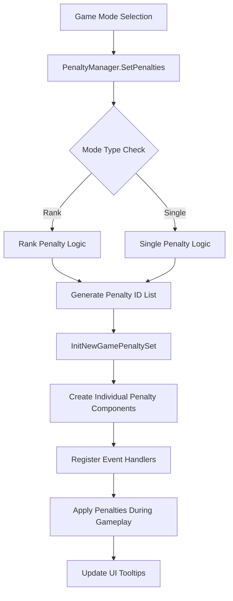

# Penalty System - Penalty Management

## Overview
MetoChess's penalty system manages disadvantageous conditions that are automatically applied according to game mode and difficulty. They are progressively added as difficulty increases with single mode level advancement or rank mode tier progression, providing continuous challenges to players.

## Core Component Structure

### PenaltyManager
The main management component responsible for penalty selection and initialization.

Key Functions:
- Automatic penalty selection based on mode and level
- Dynamic loading of penalty components
- Providing penalty information for UI tooltips

Core Properties:
- `SetPenaltiesID`: List of configured penalty IDs
- `PlayPenaltiesID`: List of penalty IDs applied to actual gameplay

Core Methods:
- `InitNewGamePenaltySet()`: Loading penalty components before game start
- `SetPenalties(string modeType, number modeLevel)`: Setting penalties by mode
- `SetGameModeTooltip_PenaltyList()`: Updating UI tooltips

### PenaltyComponent
The base component for all individual penalties, sharing the same structure as `ChallengeComponent`.

Key Features:
- Provides handlers for all major in-game events
- Manages stack information per penalty
- String type data storage system

## Penalty Application System

### Mode-based Penalty Selection Logic

#### Rank Mode
```lua
if modeType == "Rank" then
    for i = modeLevel, 1, -1 do
        local penaltyInfo = _ModeDataLogic.SetRankPenalties[i]
        if penaltyInfo == "-" then break end
        -- Add penalty
    end
```

#### Single Mode
```lua
for i = 1, modeLevel do
    local getPenaltyID = singleModeInfo:GetRow(i):GetItem("AddPenaltyID")
    if getPenaltyID ~= "-" then
        table.insert(self.SetPenaltiesID, getPenaltyID)
    end
```

### Dynamic Penalty Component Loading

Each penalty is attached as a component to independent entities:

1. Create `Penalty_1` ~ `Penalty_5` entities under `PenaltyListEntity`
2. Add components with corresponding penalty IDs to each entity
3. Automatic event connection and handler registration

## Penalty Classification System

### Classification by Level
- **Level 0**: Basic constraints (PEN00001~PEN00003)
- **Level 1**: Enemy stat enhancement (PEN10001~PEN10008)
- **Level 2**: System constraints and additional enemies (PEN20001~PEN20016)
- **Level 3**: Cost increases and slot restrictions (PEN30001~PEN30016)
- **Level 4**: Extreme constraints (PEN40001)

### Classification by Category

#### Enemy Enhancement Penalties (PEN1XXXX)
- Attack/Magic power increase (PEN10001, PEN10002)
- Defense increase (PEN10003, PEN10004)
- Attack speed/Critical increase (PEN10005, PEN10006)
- MP/HP increase (PEN10007, PEN10008)

#### System Constraint Penalties (PEN2XXXX)
- Shop restrictions (PEN20001, PEN20002)
- Additional enemy spawn (PEN20003)
- Economic system changes (PEN20005, PEN20006)
- Forced rune cards (PEN20007~PEN20016)

#### Cost/Slot Constraints (PEN3XXXX)
- Shop cost increases (PEN30001, PEN30002)
- Slot count restrictions (PEN30003~PEN30016)

## Implementation Patterns

### Enemy Stat Enhancement Pattern
```lua
for _, unit in pairs(teamManager.EnemyUnits) do
    if unit.UnitAIWanderComponent.Enable then
        _StatusChangeLogic:GetBuff(unit, "Multi_PhysicalAttack", percent, -1)
    end
end
```

### Additional Enemy Spawn Pattern
```lua
self.SetUnit = _UnitSetLogic_New:SpawnEnemyUnit(ownerId, "C00000", level, 0)
gameManager.EnemyCount += 1
```

### Item Equipment Pattern
```lua
local itemTable = {"NI10017", "NI10021", "NI10026"}
for i = 1, count do
    _ItemSetLogic:EquipItemThroughItemID(unit, itemTable[i])
end
```

## UI Integration System

### Tooltip Display
Penalty information is displayed in two locations:
- Hover popup (`/ui/HoverPopupGroup/TooltipUI_GameMode/Text_Penalties`)
- ESC menu (`/ui/ESCMenu/Panel_ESCMenu/TooltipUI_GameMode/Text_Penalties`)

### Real-time Updates
UI is automatically updated whenever the penalty list changes through the `OnSyncProperty` event.

## System Flow



## Data References
- `RootDesk/MyDesk/InGame/Penalty/PenaltyInfo.csv` — Penalty metadata and descriptions
- `_ModeDataLogic.SetRankPenalties` — Rank mode penalty settings
- `SingleModeInfo` table — Single mode penalty settings

## Code References
- `RootDesk/MyDesk/InGame/Penalty/PenaltyManager.mlua :: InitNewGamePenaltySet()` — Penalty component initialization
- `RootDesk/MyDesk/InGame/Penalty/PenaltyManager.mlua :: SetPenalties()` — Mode-based penalty setup
- `RootDesk/MyDesk/InGame/Penalty/PenaltyManager.mlua :: SetGameModeTooltip_PenaltyList()` — UI tooltip update
- `RootDesk/MyDesk/InGame/Penalty/PenaltyComponent.mlua :: OnBeginPlay()` — Event handler registration
- `RootDesk/MyDesk/InGame/Penalty/PenaltyComponent.mlua :: SetPenaltyStackInfo()` — Stack information synchronization
- `RootDesk/MyDesk/InGame/Penalty/List/PEN10001.mlua :: StartBattleHandler()` — Enemy stat enhancement example
- `RootDesk/MyDesk/InGame/Penalty/List/PEN20003.mlua :: SetBattleHandler()` — Additional enemy spawn example

## Features and Advantages

1. **Progressive Difficulty Adjustment**: Natural difficulty increase according to level/tier
2. **Modular Structure**: Each penalty implemented as independent components
3. **Automated Application**: Automatic penalty application based on mode without manual setup
4. **UI Integration**: Real-time penalty information display
5. **Scalability**: Easy structure for adding new penalties
6. **Variety**: Diverse penalty types from stat enhancement to system constraints

Through this system, players experience progressively increasing difficulty and face new strategic challenges at each level.
