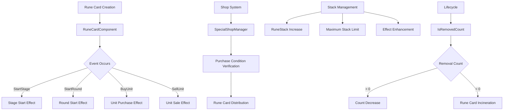

# Rune Card Management System

MetoChess's rune card system is a strategic element that provides powerful passive effects. By collecting and managing rune cards with various grades and effects, you can significantly change the flow of the game. Through event-based activation and stack systems, it provides complex yet interesting strategic choices.

## System Overview

The rune card system consists of the following core elements:
- **Rune Card Components**: Logic processing for individual rune cards
- **Shop System**: Purchase/sale and probability management
- **Inventory Management**: Storage and sorting systems
- **Event Processing**: Effect activation by game situations
- **UI Effects**: Visual representation and interaction



## Rune Card Basic Structure

### RuneCardComponent 

The core component that serves as the foundation for all rune cards.

**Main Properties:**
- `SetRuneID`: Rune card unique identifier
- `RuneStack`: Stack accumulation count
- `IsRemovedCount`: Turns remaining until incineration
- `ResellCost`: Gold acquired when selling
- `OnActive`: Activation status

**Lifecycle Management:**
```lua
@ExecSpace("ServerOnly")
method void CardRemoveCheck()
    if self.IsRemovedCount == -3 then
        -- Non-incinerating rune card
    elseif self.IsRemovedCount > 0 then
        -- Decrease turns
        self:AddIsRemovedCount(-1)
    elseif self.IsRemovedCount <= 0 then
        -- Incinerate rune card when reaching 0 turns
        specialShopManager:RemoveRuneCard(self.SetRuneID, self.UID)
        _RuneCardDirector:DestroyRuneCard(index, true, user.PlayerComponent.UserId)
    end
end
```

### Event-Based Activation System

Rune cards trigger effects in response to various game events:

**Main Event Handlers:**
```lua
@ExecSpace("ServerOnly")
method void OnBeginPlay()
    -- At stage start
    local startStageAct = function(event)
        if self.OnActive then
            self:StartStageHandler(event)
        end
    end
    
    -- At round start
    local startRoundAct = function(event)
        self:CardRemoveCheck()
        if self.OnActive then
            self:StartRoundHandler(event)
        end
    end
    
    -- When purchasing units
    local buyUnitAct = function(event)
        if self.OnActive then
            self:BuyUnitHandler(event)
        end
    end
end
```

**Activation Condition Management:**
- Control effect activation/deactivation with `OnActive` flag
- Separate handler system for individual events
- Performance optimization through conditional execution

### Stack System

Many rune cards use a system that stacks to enhance effects:

```lua
@ExecSpace("ServerOnly")
method void SetRuneStackInfo(number stack)
    self.RuneStack = stack
    self:SetRuneStackInfo_OnClient(stack, self.OwnerId)
end

@ExecSpace("Client")
method void SetRuneStackInfo_OnClient(number stack)
    self.RuneStack = stack
    _UI_Inventory:RefreshUI_RuneInventory()
    
    -- Refresh UI when stack changes during battle
    local user = _UserService.LocalPlayer
    if user.GameManager.PhaseType ~= "Ready" then
        _UI_Inventory:RefreshUI_BattleRuneList()
    end
end
```

## Rune Card Shop System

### SpecialShopManager Integration

System handling rune card purchase and sale.

**Purchase Process:**
```lua
@ExecSpace("Server")
method void PurchaseRunecard_Check(number slotIdx)
    -- 1. Verify purchase conditions
    local ownCoins = self.Entity.TeamManager.Golds
    local cost = self.Cost_Runes[slotIdx]
    
    if ownCoins < cost then
        log("Cannot purchase due to insufficient cost.")
        return
    end
    
    -- 2. Validate slot
    if self.ShopList_Runes[slotIdx] == "" then
        log("Invalid purchase request or empty slot.")
        return
    end
    
    -- 3. Check inventory space
    if #self.Entity.TeamManager.OwnRunes >= userPControl.Rune_UseRuneSlotCount then
        log("You own 5 or more rune cards.")
        return
    end
    
    -- 4. Process purchase
    local runeID = self.ShopList_Runes[slotIdx]
    self.ShopList_Runes[slotIdx] = ""
    self.Entity.TeamManager.Golds -= cost
    self:AddRCComponent(runeID, true, #teamManager.OwnRunes, slotIdx)
end
```

### Probability System

**RuneShopProb Dataset:**
- Manage appearance probability by grade
- Adjust probability according to player level
- Control rarity of special rune cards

**Post-Purchase Processing:**
```lua
@ExecSpace("Server")
method void BuyThisRuneCard(string runeID)
    local runeInfoTable = _DataService:GetTable("RuneInfo")
    local row = runeInfoTable:FindRow("RuneID", runeID)
    
    self:SetResellCostInfo(tonumber(row:GetItem("ResellCost")))
    self.SetRuneID = runeID
    
    if string.sub(self.Entity.Name, 1, 10) == "PlayerRune" then
        self.SetTeamType = "User"
    else
        self.SetTeamType = "Enemy"
    end
end
```

## Rune Card Data Management

### RuneInfo Dataset

**Main Information:**
- `RuneID`: Rune card unique identifier
- `Grade`: Grade (1~5 stars)
- `PurchaseCost`: Purchase cost
- `ResellCost`: Sale cost
- `IconRUID`: Icon resource ID
- `Description`: Effect description

### Grade System

**Grade Characteristics:**
- **1 star**: Basic effects, low cost
- **2 star**: Medium effects, reasonable cost
- **3 star**: Powerful effects, high cost
- **4 star**: Very powerful effects
- **5 star**: Game changer level effects

### Character Recommendation System

**CharMostItemSet Dataset:**
Manages rune card combinations effective for specific characters.

```lua
-- Recommended rune card sets by character
-- Optimal combination suggestions considering synergy effects
```

## UI Effects System

### RuneCardDirector

Central system managing all visual effects of rune cards.

**Main Functions:**
- **Icon Management**: Cache grade-specific icon RUIDs
- **Position Calculation**: Rune card placement within inventory
- **Animations**: Purchase/sale/incineration effects
- **Interactions**: Drag and drop support

**Icon Caching System:**
```lua
@ExecSpace("ClientOnly")
method void OnBeginPlay()
    self.IconRUIDList = {
        "39dfb7d3137a48beb17bd428aaf3fea9",  -- 1-star icons
        "b20e6d0b6e9e48abb5b293afdc836b40",
        -- ... more icon RUIDs
    }
    
    -- Rune cards requiring special management
    self.RuneCardManagingValue = {
        ["RC10010"] = {}, ["RC10024"] = {},
        ["RC20007"] = {}, ["RC30001"] = {},
        -- ... rune cards with complex effects
    }
end
```

### Inventory UI Integration

**Integration with UI_Inventory:**
- Real-time rune card list updates
- Stack information display
- Check sale availability
- Grade-based color differentiation

## Individual Rune Card Implementation

### Basic Rune Card Pattern

Individual rune cards inherit from RuneCardComponent to implement unique effects:

```lua
-- Example: Gold acquisition rune card
@ExecSpace("ServerOnly")
method void StartRoundHandler(any event)
    local user = self.Entity.Parent.Parent
    local teamManager = user.TeamManager
    
    -- Add gold at round start
    teamManager.Golds += (2 * self.RuneStack)
end
```

### Complex Effect Rune Cards

**Situational Effects:**
- **Conditional Activation**: Activate only in specific situations
- **Cumulative Effects**: Effect increase based on stacks
- **Synergy Effects**: Interaction with other rune cards

**Special Management Rune Cards:**
- Rune cards requiring separate value management
- Effects requiring complex calculations
- Effects that significantly change game state

## Dictionary System Integration

### Rune Card Collection

**UI_dictionary_RuneCard:**
- Display collected rune card list
- Favorites functionality
- Grade-based filtering

**DictionaryDataManager Integration:**
- Manage rune card list by season
- Track collection progress
- Provide detailed information

### Information Display System

**UI_RuneCardDictionaryInfo:**
```lua
@ExecSpace("ClientOnly")
method void UpdateInfo(string id)
    local runeData = _DictionaryDataManager.RuneDataList[id]
    local grade = runeData.Grade
    
    -- Display name and grade
    self.t_name.Text = _LocalizationService:GetText("RuneCard_"..id.."_Name")
    self.t_grade.FontColor = _UI_Color.RuneGrade[grade]
    self.t_grade.Text = _LocalizationService:GetText("Grade_"..grade)
    
    -- Adjust icon size
    local resourceinfo = _LoadResourcesInfo:GetUILocalPositionScale(runeData.IconRUID)
    self.sp_image.ImageRUID = runeData.IconRUID
    self.sp_image.LocalScale = resourceinfo["scale"]
end
```

## Performance Optimization

### Event Processing Optimization

**Selective Activation:**
- Prevent unnecessary calculations with `OnActive` flag
- Conditional event handler execution
- Memory-efficient stack management

### UI Update Optimization

**Batch Updates:**
- Selectively refresh only changed parts
- Utilize cached resource information
- Reduce initial loading time through lazy loading

### Data Caching

**Rune Card Information Caching:**
- Memory cache frequently accessed data
- Pre-calculate RUID and position information
- Pre-load localized text

## Strategic Utilization

### Synergy Composition

**Combination Strategies:**
- Same series rune card combinations
- Complementary effect combinations
- Configurations optimized for specific play styles

### Timing Management

**Purchase Timing:**
- Consider economic situation
- Suitability with current strategy
- Opponent interference effects

**Incineration Management:**
- Extract maximum effect within limited turns
- Decide replacement timing
- Optimize inventory space

## Code References

- `RootDesk/MyDesk/InGame/RuneCard/RuneCardComponent.mlua :: OnBeginPlay()` — Rune card event system initialization
- `RootDesk/MyDesk/InGame/RuneCard/RuneCardComponent.mlua :: BuyThisRuneCard()` — Rune card purchase processing
- `RootDesk/MyDesk/InGame/Managers/SpecialShopManager.mlua :: PurchaseRunecard_Check()` — Shop purchase verification
- `RootDesk/MyDesk/EffectFolder/Logic/RuneCardDirector.mlua :: OnBeginPlay()` — UI effects management
- `RootDesk/MyDesk/Dictionary/UI_RuneCardDictionaryInfo.mlua :: UpdateInfo()` — Rune card information display
- `RootDesk/MyDesk/InGame/RuneCard/RuneInfo.userdataset` — Rune card basic data
- `RootDesk/MyDesk/InGame/RuneCard/RuneShopProb.userdataset` — Shop probability data
