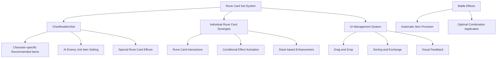

# Rune Card Set Effects System

MetoChess's rune card set effects system is an advanced strategy system that provides additional effects when specific combinations of rune cards are used together, along with character-optimized item sets. Through character-specific recommendation systems based on CharMostItemSet and synergy effects between individual rune cards, it enables deep strategic choices.

## System Overview

The rune card set effects system consists of the following core elements:
- **Character-specific Optimal Item Sets**: Based on CharMostItemSet data
- **Synergy Between Rune Cards**: Additional effects when specific rune card combinations are used
- **Conditional Effect Activation**: Set bonuses in specific situations
- **Dynamic Item Provision**: Automatic provision of optimal items during battle
- **UI Management System**: Drag and drop with visual feedback



## CharMostItemSet System

### Character-specific Optimal Item Combinations

A system that manages the most effective item combinations for each character as a dataset.

**Data Structure:**
- `CharID`: Character unique identifier
- `ItemID_1` ~ `ItemID_8`: List of 8 recommended items
- Combinations optimized for character traits and roles

**Application to AI Enemy Units:**
```lua
-- Enemy unit item setting
local charMostItemTable = _DataService:GetTable("CharMostItemSet")

for _, unit in pairs(teamManager.EnemyUnits) do
    local charID = unit.UnitInfo.charID
    local setItemRow = charMostItemTable:FindRow("CharID", charID)
    
    if isvalid(setItemRow) then
        table.insert(setUnits, unit)
        unit.UnitStatus:SetProperty("EquippedItemIDList", nil, "clear")
    end
end
```

### Integration with Special Rune Card Effects

**RC20033 Rune Card (Santa Glove Enhancement):**
```lua
-- When RC20033 rune is activated
if rc20033Checked then
    local RC20033_DataSet = _DataService:GetTable("CharMostItemSet")
    local charBestItemRow = RC20033_DataSet:FindRow("CharID", unitInfo.charID)
    
    local setItemList = {}
    for i = 1, 8 do
        table.insert(setItemList, charBestItemRow:GetItem(string.format("ItemID_%d", i)).."_copied")
    end
    
    -- Provide 2 random items
    for i = 1, 2 do
        local randItemIdx = _UtilLogic:RandomIntegerRange(1, #setItemList)
        local randItemID = setItemList[randItemIdx]
        self.Entity.UnitStatus:SetProperty("EquippedItemIDList", randItemID, "insert,-1")
        table.remove(setItemList, randItemIdx)
    end
end
```

## Dynamic Item Provision System

### Optimal Item Provision During Battle

A system where optimal items are automatically provided during battle through specific synergy or rune card effects.

**Time-based Provision:**
```lua
local function setItemFnc()
    -- Check if in battle
    if self.Entity.GameManager.PhaseType ~= "Battle" then
        _TimerService:ClearTimer(fncTimer)
        return
    end
    
    -- Find units eligible for item provision
    local checkUnits = {}
    for _, unit in pairs(t_Units) do
        if #unit.UnitStatus.EquippedItemIDList < 3 then
            table.insert(checkUnits, unit)
        end
    end
    
    -- Provide optimal item to random unit
    local setUnit = checkUnits[_UtilLogic:RandomIntegerRange(1, #checkUnits)]
    if isvalid(setUnit) then
        local charID = setUnit.UnitInfo.charID
        local charBestItemRow = mostItemSet:FindRow("CharID", charID)
        
        local setItemList = {}
        for i = 1, 8 do
            table.insert(setItemList, charBestItemRow:GetItem(string.format("ItemID_%d", i)).."_copied")
        end
        
        local randItemIdx = _UtilLogic:RandomIntegerRange(1, #setItemList)
        local randItemID = setItemList[randItemIdx]
        setUnit.UnitStatus:SetProperty("EquippedItemIDList", randItemID, "insert,-1")
    end
end

-- Repeat every 12 seconds
fncTimer = _TimerService:SetTimerRepeat(setItemFnc, 12, 0)
```

### Set Effect Activation Conditions

**Character-specific Effects:**
- When specific character + recommended item combination
- When possessing multiple same series rune cards
- When special conditions are met (specific rounds, situations, etc.)

## Rune Card UI Management System

### Drag and Drop System

**Drag Management in RuneCardSetLogic:**
```lua
@ExecSpace("Client")
method void SetDraggingEntity(Entity draggingEntity)
    -- Handle drag start
    self.CurrentDraggingEntity = draggingEntity
    
    -- Copy dragging card information to DragChaser
    local ui_sprite = self.DragChaser:GetChildByName("Sprite_ProductBg"):GetChildByName("Sprite_Product")
    local ui_cost = self.DragChaser:GetChildByName("Text_Cost")
    
    self.DragChaser.SpriteGUIRendererComponent.Color = draggingEntity:GetChildByName("CardBound").SpriteGUIRendererComponent.Color
    ui_sprite.SpriteGUIRendererComponent.ImageRUID = draggingEntity:GetChildByName("Sprite_ProductBg"):GetChildByName("Sprite_Product").SpriteGUIRendererComponent.ImageRUID
    
    -- Activate DragChaser
    self.DragChaser.Enable = true
    draggingEntity.Visible = false
    
    -- Activate sale UI
    local ui_sell = _EntityService:GetEntityByPath("/ui/Arena_ReadyPhase/Panel_SellCharacter")
    ui_sell.Enable = true
end
```

### Rune Card Sorting and Exchange

**Position Exchange Animation:**
```lua
@ExecSpace("Client")
method void SwapUIPositionOnDrag(Entity swapEntity)
    -- Smooth position exchange animation
    local tweenDuration = 0.1
    
    -- Move original card
    local startPos = self.CurrentDraggingEntity.UITransformComponent.anchoredPosition.x
    local targetPos = swapEntity.UITransformComponent.anchoredPosition.x
    
    local moveDraggingCard = function()
        local x1 = _TweenLogic:Ease(startPos, targetPos, tweenDuration, EaseType.BackEaseInOut, t1)
        self.CurrentDraggingEntity.UITransformComponent.anchoredPosition.x = x1
    end
    
    -- Execute smooth animation in 10 steps
    for i=1, 10 do
        _TimerService:SetTimerOnce(moveDraggingCard, tweenDuration * i * 0.1)
    end
end
```

### Sale System Integration

**Sale Through Drag:**
```lua
@ExecSpace("Client")
method void OnDraggingEnd()
    -- Check if dropped in sale zone
    local simulator = _CollisionService:GetSimulator(_UserService.LocalPlayer.CurrentMapName)
    local worldpoint = _InputService:GetCursorPosition()
    worldpoint = _UILogic:ScreenToWorldPosition(worldpoint)
    
    local components = simulator:OverlapPointAll(CollisionGroups.TriggerBox, worldpoint)
    local sold = false
    
    for i=1, #components do
        local selectEntity = components[i].Entity
        if isvalid(selectEntity.SellZoneComponent) == true then
            local cardIdx = tonumber(string.sub(self.CurrentDraggingEntity.Name, 6, -1))
            _UserService.LocalPlayer.SpecialShopManager:ResellRuneCard_Check(cardIdx)
            sold = true
        end
    end
    
    -- Handle order change if not sold
    if sold == false then
        if isvalid(self.CurrentDraggingEntity) == true and self.MouseHoveringSlotIdx ~= 0 then
            local indexA = tonumber(string.sub(self.CurrentDraggingEntity.Name, 6, -1))
            local indexB = self.MouseHoveringSlotIdx
            _UserService.LocalPlayer.TeamManager:SwapRuneCardIndex(indexA, indexB)
        end
    end
end
```

## Individual Rune Card Set Synergies

### Conditional Set Effects

**When Specific Rune Card Combinations:**
- Additional effects when possessing 2+ same series rune cards
- Synergy effects when complementary rune card combinations
- Conditional effects that activate only in specific situations

### Stack-based Set Effects

**Cumulative Effect Enhancement:**
- When possessing multiple rune cards with same effects
- Additional bonuses per stack
- Balance control with maximum stack limits

### Character-specific Synergies

**Character Optimization:**
```lua
-- Special effects when specific character and specific rune card combination
local charID = unit.UnitInfo.charID
if charID == "C30001" and hasRuneCard("RC10005") then
    -- Activate special set effect
    applySpecialSetEffect(unit)
end
```

## Rune Card List Management

### Season-based Rune Card Filtering

**GetRuneCardList System:**
```lua
@ExecSpace("ServerOnly")
method table GetRuneCardList(string userId, string rGrade, boolean getRuneCheck, boolean shopRuneCheck)
    local user = _UserService:GetUserEntityByUserId(userId)
    local setVersion = string.format("%.1f", gameManager.ModeSetVersion)
    
    local runeTable = {}
    for i=1, runeDataSet:GetRowCount() do
        local row = runeDataSet:GetRow(i)
        local grade = row:GetItem("Grade")
        local runeID = row:GetItem("RuneID")
        local checked = runeSeasonCheckTable:FindRow("RuneID", runeID):GetItem(setVersion)
        
        -- Filter only rune cards meeting conditions
        if checked == "TRUE" and (grade == rGrade or rGrade == "All") then
            -- Ownership/shop duplication check
            local insert = true
            if getRuneCheck and (getCount > 0) then
                insert = false
            end
            if shopRuneCheck and isInShop(runeID) then
                insert = false
            end
            
            if insert then
                table.insert(runeTable, runeID)
            end
        end
    end
    
    return runeTable
end
```

## Strategic Utilization

### Set Configuration Strategies

**Efficient Combinations:**
- **Same Series Focus**: Concentrated configuration with one series rune cards
- **Balance Type**: Balanced placement of rune cards with various effects
- **Specialized Type**: Configuration specialized for specific characters or strategies

### Situational Set Selection

**Adaptation to Game Situations:**
- **Early Game**: Economy effect-focused rune cards
- **Mid Game**: Combat power enhancement rune cards
- **Late Game**: Game changer level advanced rune cards

### Opponent Interference

**Meta Response:**
- Configure counter sets after identifying opponent strategies
- Respond to various situations with versatile sets
- Neutralize opponent strategies with specific set effects

## Performance Optimization

### Data Caching

**CharMostItemSet Caching:**
- Cache frequently referenced character-specific item data
- Use memory-efficient data structures
- Access database only when necessary

### UI Optimization

**Drag and Drop Optimization:**
- Utilize timers for smooth animations
- Prevent unnecessary UI updates
- Aggressive cleanup to prevent memory leaks

### Calculation Optimization

**Set Effect Calculation:**
- Recalculate only changed parts
- Reuse cached results
- Prevent unnecessary operations with conditional calculations

## Code References

- `RootDesk/MyDesk/InGame/System/RuneCardSetLogic.mlua :: SetDraggingEntity()` — Rune card drag start processing
- `RootDesk/MyDesk/InGame/System/RuneCardSetLogic.mlua :: GetRuneCardList()` — Season-based rune card filtering
- `RootDesk/MyDesk/InGame/Unit/01_UnitComponent/UnitItem.mlua :: UseItemAbility_NI10033()` — Santa Glove and RC20033 set effects
- `RootDesk/MyDesk/InGame/System/UnitSetLogic_New.mlua :: AI item setting` — CharMostItemSet-based item placement
- `RootDesk/MyDesk/InGame/Managers/SynergyManager_New.mlua :: Dynamic item provision` — Automatic item provision during battle
- `RootDesk/MyDesk/InGame/RuneCard/CharMostItemSet.userdataset` — Character-specific recommended item data
