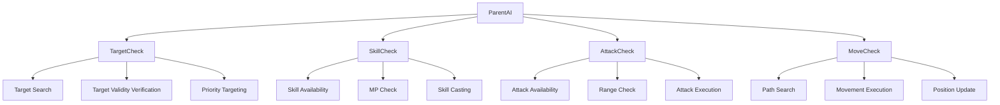
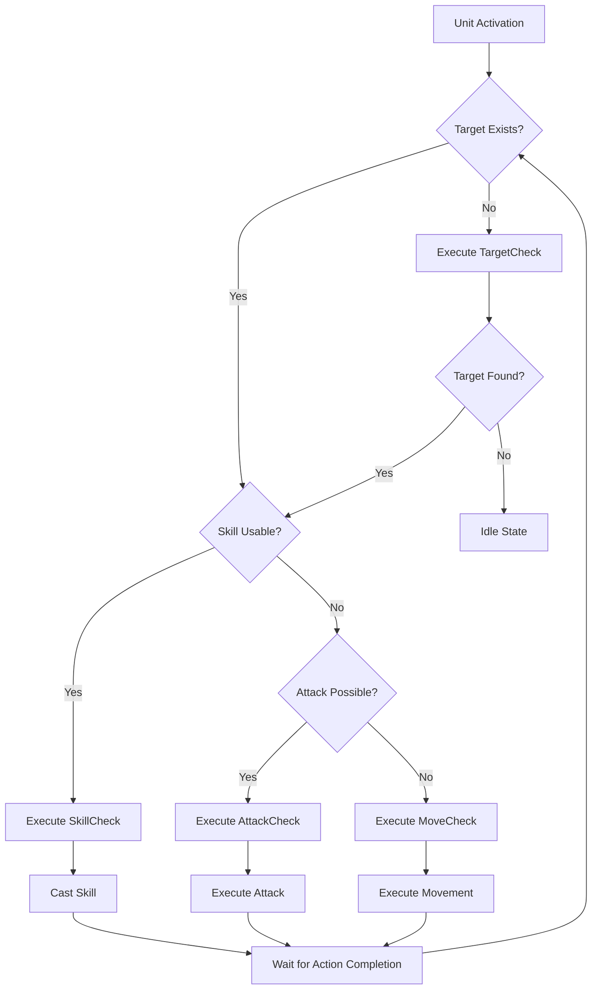

# System Logic - Behavior Tree System

## Overview
MetoChess's Behavior Tree (BT) system is the core system that controls all units' automatic AI behavior. Four core BT nodes - `TargetCheck`, `AttackCheck`, `SkillCheck`, and `MoveCheck` - cooperate to enable units to determine and execute optimal actions based on situations.

## Behavior Tree Structure

### BT Node Hierarchy


### BT Node Execution Order
1. **TargetCheck**: Select and validate attack targets
2. **SkillCheck**: Check skill availability and cast
3. **AttackCheck**: Check basic attack availability and execute
4. **MoveCheck**: Calculate movement path to target position and move

## Core BT Node Analysis

### TargetCheck - Targeting System

#### Main Features
The top-level node that searches for enemy units and determines attack priority.

```lua
-- Target search cooltime (every 0.5 seconds)
property number targetFindCoolTime = 0.5

-- Basic targeting logic
if unitInfo.TeamType == "Enemy" then
    attackableEnemy = _BTLogic_New:getEntities(teamManager.OwnUnits, "AttackAble")
elseif unitInfo.TeamType == "User" then
    attackableEnemy = _BTLogic_New:getEntities(teamManager.EnemyUnits, "AttackAble")
end
```

#### Target Selection Algorithm

##### 1. Normal Targeting (Default)
```lua
-- Prioritize closest enemy
unitStatus.Target = _BTLogic_New:getTarget(unitInfo.setTile, attackableEnemy, "Nearest")
```

##### 2. Hunter Synergy (S10008) Targeting
```lua
-- When Hunter synergy is active
if self.ParentAI.Entity.UnitInfo:DoesHaveSynergy("S10008") then
    if runeS10008Checked then
        unitStatus.Target = _BTLogic_New:getTarget(unitInfo.setTile, attackableEnemy, "HP_Low")
    else
        unitStatus.Target = _BTLogic_New:getTarget(unitInfo.setTile, attackableEnemy, "MagicResistance_Low")
    end
end
```

#### Target Validity Verification
- **Range Check**: Only enemies within range can be targeted
- **Status Check**: Invincible or stealthed enemies cannot be targeted
- **Survival Check**: Enemies with HP <= 0 are excluded from targets
- **Taunt Status**: Cannot change target when taunted

### SkillCheck - Skill System

#### Skill Usage Condition Verification
```lua
-- MP check
if unitStatus.MP >= unitInfo.SkillComponent.SkillCost then
    -- Skill range check
    if unitStatus.SkillRange >= distanceInfo[1] then
        -- Skill casting available
        unitInfo.SkillComponent:SkillStart(target, userId)
        self.Use = true
    end
end
```

#### Skill Cooldown Management
```lua
-- Calculate skill casting time
local checkTime = 1.1 / _BTLogic_New.SSpeedValue
if isvalid(unitInfo.SkillComponent.SkillTime) then
    checkTime = 1.1 * unitInfo.SkillComponent.SkillTime
end

-- Wait for skill completion
if self.SkillTime > checkTime and unitStatus.ActionTimer == 0 then
    self.Use = false
    self.SkillTime = 0
end
```

#### Skill Priority
- **MP Fulfillment**: Have required MP for skill usage
- **Range Check**: Target exists within skill range
- **Cooldown Check**: Previous skill usage completion status
- **Status Effects**: Check for silence or other skill-blocking states

### AttackCheck - Attack System

#### Basic Attack Execution Conditions
```lua
-- Check attack availability
if isvalid(target) and isvalid(targetTile) then
    local distanceInfo = _BTLogic_New:getDistance(tileNode, targetTileNode)
    
    -- Check within range
    if unitStatus.AttackRange >= distanceInfo[1] then
        -- Execute attack
        unitInfo.AttackComponent:AttackStart(target, userId)
        self.Use = true
    end
end
```

#### Attack Timing Control
```lua
-- Wait time based on attack speed
if self.checkedAttackSpeed == 0 then
    self.checkedAttackSpeed = 2.5  -- Default attack speed
end

-- Check attack completion
if self.attackTime > (1 / self.checkedAttackSpeed) and unitStatus.ActionTimer == 0 then
    self.Use = false
    self.attackTime = 0
end
```

#### Attack Priority
- **Target Exists**: Have valid attack target
- **Range Check**: Target within attack range
- **Attack Cooldown**: Wait for previous attack completion
- **Status Effects**: Check for stun, silence, or other attack-blocking states

### MoveCheck - Movement System

#### Movement Necessity Judgment
```lua
-- Check distance to current target
local distanceInfo = _BTLogic_New:getDistance(tileNode, targetTileNode)

-- Check attackable distance
if unitStatus.AttackRange < distanceInfo[1] then
    -- Movement needed
    local path = _BTLogic_New:GetPath(tileNode, targetTileNode, myUnit, target, userId)
    if path then
        -- Execute movement
        self:ExecuteMove(path[1])
    end
end
```

#### A* Pathfinding Integration
```lua
-- Utilize BTLogic_New :: GetPath()
-- Optimal path calculation based on hexagonal tiles
-- Obstacle avoidance and shortest distance path provision
```

#### Movement Cooldown Management
```lua
property number setGetPathTime = 0.3  -- Path search cooltime

-- Wait for movement completion
if self.getPathTime > self.setGetPathTime and unitStatus.ActionTimer == 0 then
    self.Use = false
    self.getPathTime = 0
end
```

## Action Decision Algorithm

### State Priority System


### BT Node State Management
Each BT node returns the following states:
- **Success**: Action successfully executing or completed
- **Failure**: Action impossible to execute or failed
- **Running**: Action executing (wait until next frame)

## Special Synergy and Status Effect Processing

### Synergy-Based Behavior Changes
- **Hunter (S10008)**: Apply special targeting algorithm
- **Other Synergies**: Modify values like movement speed, attack speed, range

### Status Effect Response
- **SE0002 (Stealth)**: Exclude from targets
- **SE0020 (Taunt)**: Cannot change target
- **Stun/Silence**: Disable corresponding actions

## Performance Optimization

### Cooldown System
```lua
-- Independent cooldown for each node
TargetCheck: 0.5 second cooltime
SkillCheck: Individual cooldown per skill
AttackCheck: Attack speed-based cooldown
MoveCheck: 0.3 second pathfinding cooltime
```

### Early Termination Optimization
- Return Failure immediately when conditions not met
- Skip unnecessary calculation processes
- Execute validity checks first

### Memory Efficiency
- Cache pathfinding results
- Reuse target information
- Recalculate only on state changes

## Code References
- `RootDesk/MyDesk/InGame/Unit/BT/TargetCheck.mlua :: OnBehave()` — Target search and selection logic
- `RootDesk/MyDesk/InGame/Unit/BT/SkillCheck.mlua :: OnBehave()` — Skill usage condition check and casting
- `RootDesk/MyDesk/InGame/Unit/BT/AttackCheck.mlua :: OnBehave()` — Basic attack execution and cooldown management
- `RootDesk/MyDesk/InGame/Unit/BT/MoveCheck.mlua :: OnBehave()` — Movement necessity judgment and pathfinding
- `RootDesk/MyDesk/InGame/System/BTLogic_New.mlua :: GetPath()` — A* pathfinding algorithm integration
- `RootDesk/MyDesk/InGame/System/BTLogic_New.mlua :: getTarget()` — Target selection algorithm

## Features and Advantages

1. **Modular Design**: Each action separated into independent nodes for easy maintenance
2. **Priority System**: Automatic selection of optimal actions based on situations
3. **Real-time Response**: Immediate response to situation changes every frame
4. **Scalability**: Easy to add new behavior patterns or synergies
5. **Performance Optimization**: Minimize CPU usage through cooldowns and early termination
6. **Strategic Depth**: Provide various targeting strategies and behavior patterns

The Behavior Tree system is the core AI system in MetoChess that enables dozens of units to behave intelligently simultaneously, providing players with strategic, predictable, yet engaging combat experiences.
