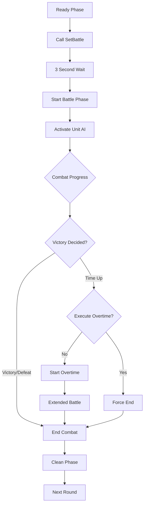

# System Logic - Combat System

## Overview
MetoChess's combat system is a comprehensive real-time combat system based on turn-based auto combat, integrating AI behavior trees, pathfinding, skill systems, and status effect management. All units have independent AI and conduct battle automatically, while players influence the outcome through pre-battle positioning and equipment.

## Core Component Structure

### BTLogic_New - Behavior Tree and Pathfinding
The core logic responsible for unit movement and action decisions during combat.

Main Features:
- **Pathfinding Algorithm**: Optimal path calculation based on hexagonal tiles
- **Action Priority**: Determining priority between attack, skill, and movement
- **Targeting System**: Selecting the most suitable attack target

Core Methods:
- `GetPath(startNode, endNode, moveEntity, targetEntity, userId)`: A* based path calculation
- Determine optimal movement direction in hexagonal coordinate system

```lua
-- Determine path priority (based on tile gap)
local xGap = (endNode[1] - startNode[1]) / 2  -- Horizontal
local yGap = endNode[2] - startNode[2]        -- Vertical

-- Set movement direction priority based on horizontal/vertical distance
if math.abs(xGap) >= math.abs(yGap) then
    -- Horizontal priority movement logic
else
    -- Vertical priority movement logic
```

### StatusChangeLogic - Status and Damage Management
Handles all status changes and damage calculations during combat.

Main Features:
- **Damage Calculation**: Process physical/magical/true damage
- **Status Changes**: Manage HP/MP fluctuations
- **Buffs/Debuffs**: Apply temporary stat changes
- **Combat Statistics**: Real-time combat data collection

Core Methods:
- `CheckDamage(setDamage, attackUnit, targetUnit, trueDamagePer, damageType)`: Damage calculation
- `SetVariableStatus(unit, targetUnit, statusName, amount, type)`: Status value changes
- `GetBuff(targetEntity, statusName, amount, time)`: Buff/debuff application

### CustomizedBattleEffectService - Combat Visual Effects
Manages visual effects and damage skins during combat.

Main Features:
- **Damage Skins**: Visual representation by damage type
- **Effect Playback**: Skill and attack effects
- **Transparency Control**: Effect alpha value adjustment based on settings

Damage type skin IDs:
```lua
local skinID = {
    ["Physic"] = "88d7500488834120bccf333534373687", 
    ["Magic"] = "db86f25624e8440aa0bc32994a108c6d", 
    ["True"] = "3b53c80e9d7a4e658e0afdfe962506e0",
    ["Heal"] = "4519a6e127d148d984d565f4bb0d176b"
}
```

## Combat Phase Processing

### Phase 1: SetBattle (Combat Setup Phase)

#### Main Processes
1. **BattleSet Event**: Notify all combat participants of battle start
2. **Unit Placement Confirmation**: Fix positions of units placed in preparation phase
3. **Apply Synergy Effects**: Calculate and apply team synergies
4. **Calculate Team Health**: Sum total team HP

```lua
-- GameManager :: SetBattle()
self.Entity:SendEvent(BattleSet(self.RoundType))
_TimerService:SetTimerOnce(self.GoToNextPhase, 3) -- Start battle after 3 seconds

-- Calculate team health
local calculateTotalHP = function(targetFrom)
    local totalValue = 0
    for _, unit in pairs(targetFrom) do
        if unit.UnitInfo:IsOnFieldUnit() then
            totalValue += unit.UnitStatus.MaxHP
        end
    end
    return totalValue
end
```

#### Battle Preparation Setup
- **UnitSetLogic_New :: BattleSetting_UnitSet()**: Set unit battle status
- **SynergyManager :: OnBattleSettingPhase()**: Final application of synergy effects
- **Item Effects**: Apply item effects triggered at battle start

### Phase 2: Battle (Combat Progress Phase)

#### Unit Activation System
```lua
-- UnitSetLogic_New :: BattleSetting_OnBattlePhase()
for _, unit in pairs(units.Children) do
    if unitInfo:IsOnFieldUnit() then
        unit.UnitStatus.Target = nil
        unit.UnitAIWanderComponent.Enable = true
        unit.UnitAIWanderComponent.setBattle = true
    end
end
```

#### Real-time Combat Logic
- **AI Behavior Tree**: Each unit makes independent action decisions
- **Targeting**: Select closest/highest priority enemy
- **Skill System**: MP accumulation and skill activation condition checks
- **Projectile Processing**: Trajectory and collision handling for ranged attacks

#### Combat End Condition Check
```lua
-- GameManager :: OnUpdate() - Battle Phase
if self.PhaseType == "Battle" then
    if self.EnemyCount <= 0 then
        self:SetBattleResult(true, self.MyUnitCount)  -- Victory
    elseif self.MyUnitCount <= 0 then
        self:SetBattleResult(false, self.EnemyCount)  -- Defeat
    elseif self.BattleTime <= 0 then
        self:GoToNextPhase()  -- Overtime/Draw
    end
end
```

### Phase 3: Overtime System

#### Overtime Entry Conditions
- When no victory is achieved within time limit
- Start overtime through `PlayOvertime()` method
- Only occurs when both teams survive

#### Overtime Features
- Faster combat progression
- Additional time limit
- Forced result determination mechanism

## AI Behavior System

### Action Priority Determination
1. **Survival Check**: Confirm unit is alive and combat-ready
2. **Target Selection**: Determine priority among attackable enemies
3. **Action Selection**: Determine optimal action among attack/skill/movement
4. **Path Calculation**: Find optimal path to destination

### Targeting Algorithm
- **Distance-Based**: Prioritize closest enemy
- **Threat Assessment**: Prioritize damage dealers
- **Strategic Consideration**: Prioritize healers or supporters for elimination
- **Range Consideration**: Target only enemies within attack range

### Pathfinding Optimization
- **Hexagonal Coordinate System**: Coordinate system matching actual game board
- **Direction Priority**: Prioritize shortest path to destination
- **Obstacle Avoidance**: Detour around other units or walls
- **Dynamic Recalculation**: Update path on combat situation changes

## Status Effect System

### Buff/Debuff Management
```lua
-- StatusChangeLogic :: GetBuff()
-- Apply temporary stat changes
_StatusChangeLogic:GetBuff(unit, "Multi_PhysicalAttack", 15, -1) -- 15% attack increase, permanent
_StatusChangeLogic:GetBuff(unit, "Add_MoveSpeed", 2, 10) -- Movement speed +2 for 10 seconds
```

### Persistent Effect Processing
- **Time-Based**: Automatic removal after certain time
- **Permanent Effects**: Effects set with duration = -1
- **Stack System**: Allow stacking of same effects
- **Interaction**: Handle mutually canceling effects

## Combat Statistics System

### Real-time Data Collection
- **Individual Unit Statistics**: Measure each unit's combat contribution
- **Team Statistics**: Overall team combat performance
- **Round-by-Round Records**: Detailed combat data for each round
- **Season Statistics**: Long-term accumulated data

### Collected Data Items
- Damage dealt / Damage received
- Skill usage count / Accuracy rate
- Survival time / Kill/Death count
- Healing amount / Damage blocked

## System Flow Diagram



## Technical Optimization Elements

### Performance Optimization
- **LOD System**: Simplify AI processing for distant units
- **Batch Processing**: Simultaneous processing of multiple units
- **Memory Pooling**: Reuse effect and projectile objects
- **Selective Updates**: Execute AI logic only when necessary

### Network Optimization
- **State Synchronization**: Send only important state changes to client
- **Prediction System**: Client-side result prediction and correction
- **Compression**: Efficient compression transmission of combat data

## Code References
- `RootDesk/MyDesk/InGame/System/BTLogic_New.mlua :: GetPath()` — A* based pathfinding algorithm
- `RootDesk/MyDesk/InGame/System/StatusChangeLogic.mlua :: CheckDamage()` — Damage calculation logic
- `RootDesk/MyDesk/InGame/System/StatusChangeLogic.mlua :: SetVariableStatus()` — HP/MP status changes
- `RootDesk/MyDesk/InGame/System/CustomizedBattleEffectService.mlua :: PlayDamageSkin()` — Damage visual effects
- `RootDesk/MyDesk/InGame/System/UnitSetLogic_New.mlua :: BattleSetting_OnBattlePhase()` — Battle start setup
- `RootDesk/MyDesk/InGame/Managers/GameManager.mlua :: SetBattle()` — Combat phase transition
- `RootDesk/MyDesk/InGame/Managers/GameManager.mlua :: OnUpdate()` — Real-time combat status check

## Features and Advantages

1. **Automated Combat**: Strategic combat that progresses without real-time player manipulation
2. **Complex AI System**: Intelligent AI integrating behavior trees, pathfinding, and targeting
3. **Real-time Processing**: Calculate and update combat situations in real-time every frame
4. **Scalability**: Modular structure that easily accommodates new skills or status effects
5. **Performance Optimization**: Optimization techniques ensuring stable performance in large-scale battles
6. **Data-Driven**: Detailed statistics collection and analysis of combat results

Through this combat system, MetoChess provides both strategic depth and real-time action simultaneously, allowing players to influence combat outcomes through pre-battle preparation.
