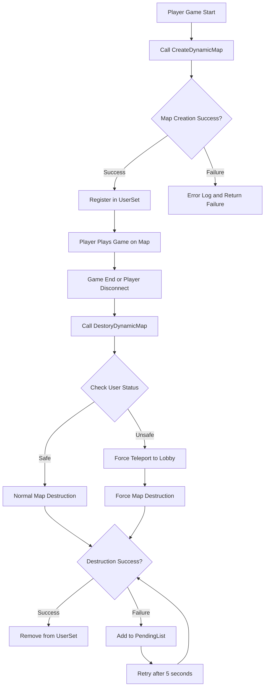

# System Logic - Dynamic Map System

## Overview
MetoChess's Dynamic Map System provides independent game environments for each player by creating and managing maps in real-time through the `DynamicMapSystemLogic`. It generates dedicated arena maps for each player and safely cleans them up upon game completion to efficiently manage server resources.

## Core Features and Structure

### Dynamic Map Generation System

#### Map Name Generation Rules
```lua
local targetMapName = self.SourceMapName .. userId
-- Example: "Arena" + "12345" = "Arena12345"
```

Each player is assigned a unique map in the format `Arena[UserId]`:
- **SourceMapName**: Base template map ("Arena")  
- **UserId**: Player's unique identifier
- **Result**: Player's dedicated independent map space

#### Map Creation Process
```lua
-- DynamicMapSystemLogic :: CreateDynamicMap()
local dynamicMapResult = _DynamicMapService:CreateDynamicMap("Arena", targetMapName)

if dynamicMapResult ~= DynamicMapResultCode.Success then
    log_error("Dynamic Map create error!!! resultCode : " .. tostring(dynamicMapResult))
    return false
end

self.UserSet[userId] = true -- Track created maps
```

### Map Lifecycle Management

#### User Map Tracking System
- **UserSet**: Manages list of currently created dynamic maps
- **Real-time Monitoring**: Tracks each player's map usage status
- **Duplicate Prevention**: Blocks duplicate map creation for the same user

#### Map Destruction System
Multi-stage verification system for safe map removal:

```lua
-- DynamicMapSystemLogic :: DestoryDynamicMap()
-- Stage 1: Check map existence
if not self.UserSet[userId] then
    return -- Already removed map
end

-- Stage 2: Check user status
local userEntity = _UserService:GetUserEntityByUserId(userId)
local targetMapName = self.SourceMapName .. userId

-- Stage 3: Check safe destruction conditions
if userEntity == nil or userEntity.CurrentMap.MapComponent.IsDynamicMap == false then
    -- Normal destruction process
    local dynamicMapResult = _DynamicMapService:DestroyDynamicMap(targetMapName)
else
    -- Abnormal situation: force teleport then destroy
    _TeleportService:TeleportToMapPosition(userEntity, Vector3(-1, 3.5, 1), self.LobbyMapName)
    local dynamicMapResult = _DynamicMapService:DestroyDynamicMap(targetMapName)
end
```

### Error Handling and Recovery System

#### Pending System
Recovery mechanism when map destruction fails:

```lua
-- Add to pending list when destruction fails
method void PendingUserId(string userId)
    table.insert(self.PendingList, userId)
end

-- Periodic retry (every 5 seconds)
method void TryDestroyPendingMap()
    for i=1, count do
        local userId = self.PendingList[i]
        local dynamicMapResult = _DynamicMapService:DestroyDynamicMap(targetMapName)
        if dynamicMapResult == DynamicMapResultCode.Success then
            table.remove(self.PendingList, i)
        end
    end
end
```

#### Force Cleanup Mechanism
- **Force User Teleport**: Teleport to lobby then destroy map
- **Periodic Retry**: Retry failed map destruction every 5 seconds
- **Error Logging**: Detailed logging for all error situations

## System Monitoring

### Development Environment Monitoring
```lua
-- Set in OnBeginPlay() (development environment only)
if not Environment:IsPublishedPlay() then
    local logFunc = function()
        local list = _DynamicMapService:GetDynamicMapNameList()
        log("DynamicMap Count : " .. tostring(#list))
    end
    self._T.logTimer = _TimerService:SetTimerRepeat(logFunc, 5, 5)
end
```

### Real-time Tracking Data
- **Created Map Count**: Total number of dynamic maps
- **Pending Destruction**: Maps waiting due to destruction failure
- **User Map Mapping**: Connection status between UserID and map names

## Map System Flow



## Technical Features

### Resource Management Optimization
1. **Memory Efficiency**: Immediate cleanup of completed maps minimizes memory usage
2. **CPU Optimization**: Eliminates unnecessary map processing
3. **Network Efficiency**: Distributes network traffic through player-specific independent maps

### Stability Assurance
1. **Multi-Stage Verification**: Multiple checks of user status before map destruction
2. **Recovery System**: Automatic retry for failed operations
3. **Force Cleanup**: Safe resource cleanup in abnormal situations

### Scalability Considerations
1. **Template-Based**: Dynamic generation of various map templates
2. **Modularized**: Independent logic minimizes coupling with other systems
3. **Configurable**: Easy to change settings like SourceMapName, LobbyMapName

## Main Usage Scenarios

### Normal Game Flow
1. **Game Start**: Player selects in-game mode
2. **Map Assignment**: Create dedicated arena map and teleport
3. **Game Progress**: Gameplay in independent environment
4. **Game End**: Return to lobby and automatic map cleanup

### Abnormal Situation Handling
1. **Connection Loss**: Automatic map cleanup on player disconnection
2. **Server Error**: Pending queue system activates on map destruction failure
3. **Force Termination**: Force cleanup of unresponsive maps

## Code References
- `RootDesk/MyDesk/InGame/System/DynamicMapSystemLogic.mlua :: CreateDynamicMap()` — Dynamic map creation logic
- `RootDesk/MyDesk/InGame/System/DynamicMapSystemLogic.mlua :: DestoryDynamicMap()` — Safe map destruction system
- `RootDesk/MyDesk/InGame/System/DynamicMapSystemLogic.mlua :: TryDestroyPendingMap()` — Retry failed map destruction
- `RootDesk/MyDesk/InGame/System/DynamicMapSystemLogic.mlua :: PendingUserId()` — Pending list management
- `RootDesk/MyDesk/InGame/System/DynamicMapSystemLogic.mlua :: OnBeginPlay()` — System initialization and monitoring setup

## Features and Advantages

1. **Independence**: Each player has a completely independent game environment
2. **Efficiency**: Creates maps only when needed and cleans up immediately after use
3. **Stability**: High stability through multi-verification and recovery systems
4. **Scalability**: Easy to add new map types or features
5. **Monitoring**: Detailed system status tracking in development environment
6. **Error Handling**: Systematic handling for all exceptional situations

The Dynamic Map System is a core system in MetoChess that provides personalized game experiences for each player while efficiently managing server resources to support multiple concurrent users.
