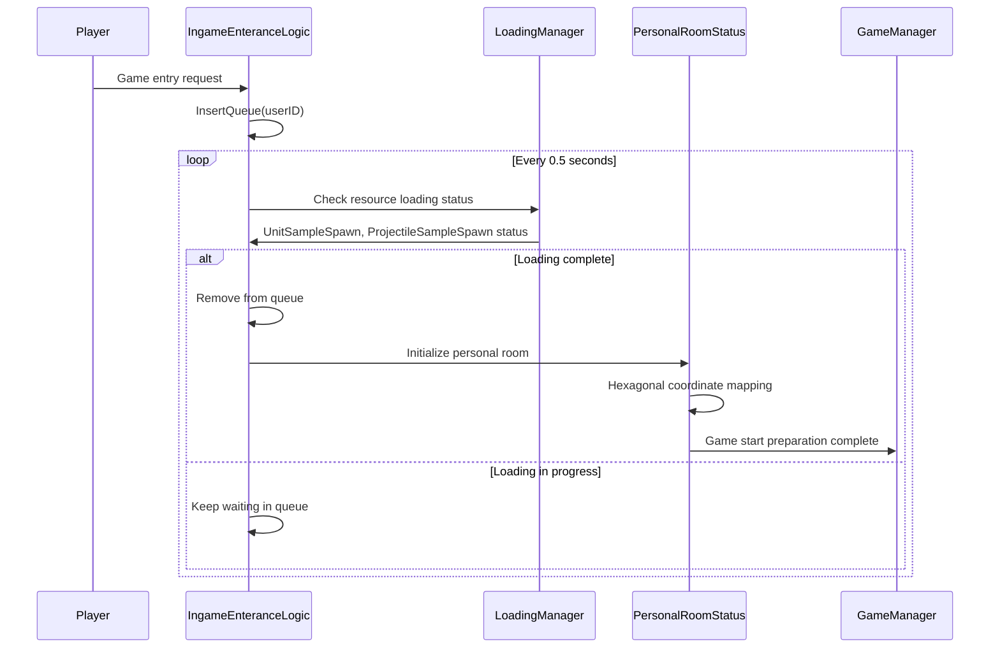

# System Logic - Entry and Map Management

## Overview
MetoChess's entry and map management system handles queue management when players enter the game, resource loading completion checks, and manages the hexagonal tile coordinate system of personal rooms through `IngameEnteranceLogic` and `PersonalRoomStatus`. It provides stable game entry and accurate spatial management.

## Core Component Structure

### IngameEnteranceLogic - Entry Queue Management

#### Main Features
This system queues players waiting for resource loading completion when entering in-game, and allows sequential entry once loading is complete.

#### Key Properties
```lua
property SyncTable<string> WaitQueue  -- List of players waiting for entry
property number CheckTimer = 0        -- Loading completion check timer
```

#### Queue System
```lua
-- InsertQueue() - Add player to queue
method void InsertQueue(string userID)
    table.insert(self.WaitQueue, userID)
end
```

- **First-In-First-Out**: Players who request first enter first
- **Auto Cleanup**: Automatically removes disconnected players from queue
- **Real-time Monitoring**: Checks loading status every 0.5 seconds

### PersonalRoomStatus - Personal Room Status Management

#### Hexagonal Tile Coordinate System
A hexagon-based tile system used in personal rooms for spatial management for strategic unit placement.

#### Key Properties
```lua
property string userID = ""           -- Personal room owner ID
property table Tiles = {}             -- Hexagonal tile coordinate mapping
property table CharOnTile = {}        -- Character placement info per tile
```

## Entry Process Management

### Loading Completion Check System
```lua
-- CheckUserLoadComplete() - Check loading status of players in queue
method void CheckUserLoadComplete()
    if #self.WaitQueue > 0 then
        local user = _UserService:GetUserEntityByUserId(self.WaitQueue[1])
        
        -- Check player connection status
        if isvalid(user) == false then
            table.remove(self.WaitQueue, 1)  -- Remove disconnected player
        else
            local loadingManager = user.LoadingManager
            
            -- Check essential resource loading completion
            if loadingManager.LoadedCount["UnitSampleSpawn"] == 1 and 
               loadingManager.LoadedCount["ProjectileSampleSpawn"] == 1 then
                table.remove(self.WaitQueue, 1)  -- Allow entry
            end
        end
    end
end
```

### Essential Resource Check
Core resources that must be loaded before entry:
- **UnitSampleSpawn**: Unit sample loading completion
- **ProjectileSampleSpawn**: Projectile sample loading completion

### Real-time Monitoring
```lua
-- OnUpdate() - Check queue status every 0.5 seconds
method void OnUpdate(number delta)
    if self.CheckTimer >= 0.5 then
        self:CheckUserLoadComplete()
    end
end
```

## Personal Room Hexagonal Coordinate System

### Tile Coordinate Initialization
```lua
-- OnBeginPlay() - Initialize hexagonal tile coordinate mapping
method void OnBeginPlay()
    for i = 1, 9 do  -- 9 lines
        local hexTileLine = self.Entity:GetChildByName("HexTileLine_" .. i)
        for j = 1, 7 do  -- 7 tiles per line
            local hexaTile = hexTileLine:GetChildByName("HexaTile_" .. j)
            
            -- Apply offset based on odd/even lines
            if i%2 == 1 then
                self.Tiles[{i, j*2}] = hexaTile      -- Odd lines
            else
                self.Tiles[{i, j*2-1}] = hexaTile    -- Even lines (with offset)
            end
        end
    end
end
```

### Hexagonal Coordinate Features
1. **Offset System**: Odd and even lines have different X coordinate offsets
2. **Strategic Placement**: 6-directional movement and adjacency due to hexagonal structure
3. **Flexible Tactics**: Provides more diverse placement strategies than rectangular grids

### Coordinate Conversion Formula
- **Odd Lines (i%2 == 1)**: X = j * 2
- **Even Lines (i%2 == 0)**: X = j * 2 - 1
- **Y Coordinate**: Uses line number i directly

## Character Placement Management

### Position Setting System
```lua
-- CharLocationSet() - Set character's tile position
method void CharLocationSet(Entity char, table location)
    if isvalid(self.CharOnTile) then
        local currentChar = self.CharOnTile
        local changeLocation = self.CharOnTile[char]
        
        -- Handle position swap
        self.CharOnTile[currentChar] = changeLocation
        self.CharOnTile[char] = location
    else
        -- New placement
        self.CharOnTile[char] = location
    end
end
```

### Placement Constraint Management
- **Population Limit**: Limit maximum characters placeable per tile
- **Position Swap**: Automatic position swap when placing on occupied tile
- **Validity Check**: Check rule violations before placement

## System Integration Architecture

### Entry Process Flow


### Coordinate System Mapping Flow
```mermaid
flowchart TD
    A[PersonalRoomStatus Initialization] --> B[Scan HexTileLine_1~9]
    B --> C[Search HexaTile_1~7 in each line]
    C --> D{Odd/Even Line Determination}
    D -->|Odd Line| E[X = j * 2]
    D -->|Even Line| F[X = j * 2 - 1]
    E --> G[Map tile with coordinate {i, X}]
    F --> G
    G --> H[Store in Tiles table]
    H --> I{All lines complete?}
    I -->|No| C
    I -->|Yes| J[Coordinate system mapping complete]
```

## Performance and Stability Assurance

### Efficient Queue Management
- **Sequential Processing**: Check only one player's loading status at a time
- **Auto Cleanup**: Prevent memory leaks by automatically removing inactive players
- **Low Overhead**: Appropriate check interval of 0.5 seconds

### Memory Optimization
- **Lazy Initialization**: Load resources at actual usage time
- **Reference-Based**: Manage references rather than storing entities directly
- **Garbage Collection**: Proper cleanup of completed objects

### Error Handling and Recovery
- **Connection Loss Detection**: Detect abnormal situations through `isvalid()` checks
- **State Recovery**: Automatic queue cleanup for abnormally terminated players
- **Loading Failure Handling**: Retry mechanism on resource loading failure

## Advanced Features and Scalability

### Multi-Map Support Preparation
The current system is designed to support various map types in the future:
- **Modular Coordinate System**: Can apply different coordinate systems per map
- **Extensible Resource Check**: Easy to add new resource types
- **Flexible Queues**: Queue management for various game modes

### Personal Room Expansion Possibilities
- **Room Size Adjustment**: Support dynamic tile count changes
- **Various Layouts**: Ready to support coordinate systems other than hexagonal
- **Multiplayer**: Can expand to cooperative play in personal rooms

## Code References
- `RootDesk/MyDesk/InGame/System/IngameEnteranceLogic.mlua :: InsertQueue()` — Add player to queue
- `RootDesk/MyDesk/InGame/System/IngameEnteranceLogic.mlua :: CheckUserLoadComplete()` — Check loading completion status
- `RootDesk/MyDesk/InGame/PersonalRoomStatus.mlua :: OnBeginPlay()` — Initialize hexagonal coordinate mapping
- `RootDesk/MyDesk/InGame/PersonalRoomStatus.mlua :: CharLocationSet()` — Set character position and handle swaps
- `RootDesk/MyDesk/InGame/PersonalRoomStatus.mlua :: GetUserID()` — Set personal room owner

## Features and Advantages

1. **Stable Entry**: Prevent game start errors by ensuring resource loading completion
2. **Sequential Processing**: Distribute server load through queue system
3. **Accurate Coordinate System**: Provide strategic depth through hexagonal system
4. **Auto Cleanup**: Automatic recovery functionality in abnormal situations
5. **Scalability**: Easy to add new map types or game modes
6. **Performance Optimization**: Efficient memory usage and appropriate check intervals

Through this system, MetoChess provides stable game entry experience for players and enables deep strategic play through precise hexagonal coordinate system.
