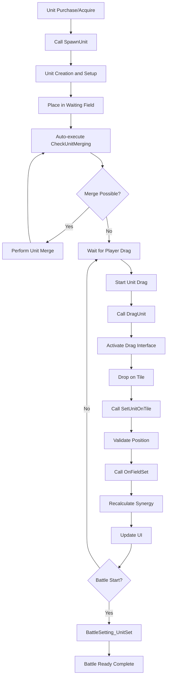

# System Logic - Unit Setup

## Overview
MetoChess's Unit Setup system is a core system that comprehensively manages unit creation, placement, movement, merging, and synergy calculation through `UnitSetLogic_New` and `UnitInfoUILogic`. It handles everything from strategic unit placement by players to automatic merging systems and real-time UI updates for all unit-related logic.

## Core Component Structure

### UnitSetLogic_New - Main Unit Management System

#### Key Properties
```lua
property Entity ArenaMap  -- Arena map reference
property Entity UnitsSample  -- Unit sample template
property Entity ProjectilesSample  -- Projectile sample template
property SyncTable<string, Entity> UnitsParentEntity  -- Unit container per user
property SyncTable<string, Entity> RoomTile  -- Map tile information
property Entity SelectUnit  -- Currently selected unit
property Entity SelectTile  -- Currently selected tile
```

#### Core Functional Areas
1. **Tile System Initialization**: Setting up game board and waiting field tiles
2. **Drag and Drop**: Unit movement and placement interface
3. **Unit Merging**: Automatic level-up system
4. **Synergy Management**: Real-time synergy calculation and application
5. **Battle Preparation**: Unit state setting before battle starts

### UnitInfoUILogic - Unit Information UI System

#### Main Features
- **Status Bar Management**: Real-time HP/MP/Shield bar updates
- **Barcode System**: Detailed health display
- **Synergy UI**: Synergy list and activation status display

## Tile System and Placement

### Tile Initialization System
```lua
-- SettingTile() - Game board tile setup
for i = 1, 7 do  -- 7 lines
    local tileLine = currentMap:GetChildByName("Line_" .. i)
    local jMax = 8 + (i%2)  -- Odd lines have 9 tiles, even lines have 8
    
    for j = 1, jMax do
        local tile = tileLine:GetChildByName("Tile_" .. j)
        -- Set team tile areas
        if j <= 4 then
            tile.TileComponent_New:TileSet("User", "Unit", j, i)
        elseif j >= 5 then
            tile.TileComponent_New:TileSet("Enemy", "Unit", j, i)
        end
    end
end
```

### Coordinate System
- **Hexagonal Coordinates**: Calculate actual game coordinates using `jNum = j * 2 - (i%2)` formula
- **Tile Keys**: Manage tile positions as string keys in `"x,y"` format
- **Waiting Field**: Distinguish waiting field tiles with `"i,0"` coordinates

## Drag and Drop System

### Unit Selection and Drag Start
```lua
-- DragUnit() - Start unit dragging
method void DragUnit(Entity selectUnit, string selectUnitID)
    if isvalid(self.SelectUnit) then
        return  -- Already holding another unit
    end
    
    self.SelectUnit = selectUnit
    selectUnit.Visible = false  -- Hide original unit
    
    -- Copy unit appearance to drag sample
    self.DragSample.SpriteRendererComponent.SpriteRUID = selectUnit.UnitInfo.spriteRenderer.SpriteRendererComponent.SpriteRUID
    
    -- Connect input events
    self.Handler = _InputService:ConnectEvent(ScreenTouchHoldEvent, self.Drag)
end
```

### Unit Placement System
- **Position Validation**: Check if tile is placeable
- **Duplicate Handling**: Position swap when placing on occupied tile
- **Synergy Update**: Automatic synergy calculation update on placement change
- **Special Units**: Additional processing for special units like Orbis Stone

## Unit Creation and Management

### Normal Unit Creation
```lua
-- SpawnUnit() - Unit creation
method Entity SpawnUnit(string userId, string unitID, number unitLevel, number cost)
    -- Clone unit entity
    local unit = _ReplicateService:ReplicateEntity(sample)
    
    -- Set basic properties
    unit.UnitInfo.IsMergableUnit = true
    unit.UnitInfo:SetPropertyToServer("IsItemEquippable", true, "", true)
    unit.UnitInfo.IsMovableByPlayer = true
    unit.UnitInfo.IsAppliableSynergy = true
    unit.UnitInfo:SetPropertyToServer("IsSettableOnWatingField", true, "", true)
    
    -- Set character information
    unit.UnitInfo:SetCharInfo(unitID, unitLevel, cost)
    
    -- Schedule auto merge check
    _TimerService:SetTimerOnce(function() self:CheckUnitMerging(userId) end, 0.2)
    
    return unit
```

### Special Unit Creation
```lua
-- SpawnOnetimeUnit() - One-time unit creation
method Entity SpawnOnetimeUnit(string userId, string unitID, Entity summonTile, number unitLevel, string teamType, boolean isApplyingSynergy)
    -- Temporary units that only exist during battle
    unitInfo.IsOnetimeUnit = true
    unitInfo.IsAppliableSynergy = isApplyingSynergy
```

## Automatic Unit Merging System

### Merge Condition Check
```lua
-- CheckUnitMerging() - Unit merge check
method void CheckUnitMerging(string userId)
    -- 1. Group units with same character ID
    -- 2. Check if there are 3 or more units of same level
    -- 3. Execute merge then recursively check for additional merges
    
    if merge_possible then
        -- Execute merge
        local mainUnit = select_representative_unit()
        local subUnits = select_material_units()
        
        -- Integrate stats and items
        process_merge(mainUnit, subUnits)
        
        -- Recursive call for additional merges
        _TimerService:SetTimerOnce(function()
            self:CheckUnitMerging(userId)
        end, 1.8)
    end
```

### Data Integration During Merge
- **Stack Stats**: Integrate all units' stack stats into main unit
- **Item Handling**: Proper handling of equipped items
- **Synergy Update**: Synergy recalculation based on unit count changes

## Synergy Management System

### Field Synergy Calculation
```lua
-- OnFieldSet() - When unit is placed/removed from field
method void OnFieldSet(Entity unit, boolean on, boolean countCheck)
    local charSynergyDBRow = _DataService:GetTable("CharacterSynergy"):FindRow("CharID", charID)
    
    if on then  -- Field entry
        -- Increase synergy count
        for i = 1, 3 do
            local synergyID = charSynergyDBRow:GetItem("Synergy_" .. i)
            if synergyID ~= "" then
                teamManager:GetOnFieldSynergyCount(synergyID, 1)
            end
        end
    else  -- Field exit
        -- Decrease synergy count
        for i = 1, 3 do
            local synergy = charSynergyDBRow:GetItem("Synergy_" .. i)
            if synergy ~= "" then
                teamManager:GetOnFieldSynergyCount(synergy, -1)
            end
        end
    end
    
    -- Trigger synergy change event
    teamManager.Entity.SynergyManager_New:OnFieldUnitCountChanged()
end
```

### Synergy Duplicate Handling
- **Same Character**: Calculate synergy stacking for multiple of same character
- **Item Synergy**: Additional synergy activation through medal items
- **Special Conditions**: Synergy changes due to specific rune cards or effects

## Battle Preparation System

### BattleSetting_UnitSet
```lua
-- Unit setup by battle phase
method void BattleSetting_UnitSet(string userId, string phaseType)
    if phaseType == "Setting" then
        -- Create enemy units
        enemyUnitCount = self:BattleSetting_EnemyUnit(userId, ...)
        
        -- Calculate enemy synergy
        self:BattleSetting_EnemySynergyCheck(userId)
        
        -- Calculate units on battlefield
        gameManager.MyUnitCount = myUnitCount
        gameManager.EnemyCount = enemyUnitCount
        
    elseif phaseType == "Clean" then
        -- Cleanup after battle
        -- Remove enemy units
        -- Initialize temporary effects
        -- Reset states
    end
```

### BattleSetting_OnBattlePhase
```lua
-- Activate units when battle starts
method void BattleSetting_OnBattlePhase(string userId)
    -- Initialize battle statistics
    user.TeamBattleStatistics:RoundPropertyInitialize()
    
    -- Activate unit AI
    for _, unit in pairs(units.Children) do
        if unitInfo:IsOnFieldUnit() then
            unit.UnitStatus.Target = nil
            unit.UnitAIWanderComponent.Enable = true
            unit.UnitAIWanderComponent.setBattle = true
        end
    end
    
    -- Apply item effects
    -- Apply synergy effects
```

## UI System Integration

### Status Bar System
```lua
-- SetBar() - HP/MP bar update
method void SetBar(Entity unit)
    local unitStatus = unit.UnitStatus
    
    -- Calculate HP and shield relationship
    if unitStatus.HP + unitStatus.Shield > unitStatus.MaxHP then
        shieldBar.SpriteGUIRendererComponent.FillAmount = 1
        hpBar.SpriteGUIRendererComponent.FillAmount = unitStatus.HP / (unitStatus.MaxHP + unitStatus.Shield)
    else
        shieldBar.SpriteGUIRendererComponent.FillAmount = (unitStatus.HP + unitStatus.Shield) / unitStatus.MaxHP
        hpBar.SpriteGUIRendererComponent.FillAmount = unitStatus.HP / unitStatus.MaxHP
    end
    
    -- Set MP bar
    mpBar.SpriteGUIRendererComponent.FillAmount = unitStatus.MP / unitStatus.MaxMP
```

### Barcode System
System for visual representation of detailed health units:
- **HP Barcode**: Display health divided into small units as bars
- **MP Barcode**: Visualize mana by units
- **Dynamic Calculation**: Real-time barcode updates based on current status

## System Flow Diagram



## Code References
- `RootDesk/MyDesk/InGame/System/UnitSetLogic_New.mlua :: SpawnUnit()` — Unit creation and initial setup
- `RootDesk/MyDesk/InGame/System/UnitSetLogic_New.mlua :: CheckUnitMerging()` — Automatic unit merging system
- `RootDesk/MyDesk/InGame/System/UnitSetLogic_New.mlua :: OnFieldSet()` — Synergy calculation and field status management
- `RootDesk/MyDesk/InGame/System/UnitSetLogic_New.mlua :: DragUnit()` — Drag and drop system
- `RootDesk/MyDesk/InGame/System/UnitSetLogic_New.mlua :: BattleSetting_OnBattlePhase()` — Unit activation when battle starts
- `RootDesk/MyDesk/InGame/System/UnitInfoUILogic.mlua :: SetBar()` — Unit status bar UI update
- `RootDesk/MyDesk/InGame/System/UnitInfoUILogic.mlua :: SetBarcode()` — Detailed health display system

## Features and Advantages

1. **Integrated Management**: Unified management of all processes from unit creation to placement and merging
2. **Automation System**: Automatic handling of merging and synergy calculations improves player convenience
3. **Real-time Feedback**: Immediate UI reflection of all changes
4. **Flexible Placement**: Intuitive drag and drop interface
5. **Accurate Calculation**: Precise handling of complex synergy and stat calculations
6. **Scalability**: Easy to add new unit types or synergies

Through this system, MetoChess provides player-friendly interface for complex unit management while ensuring accurate and efficient data processing internally.
