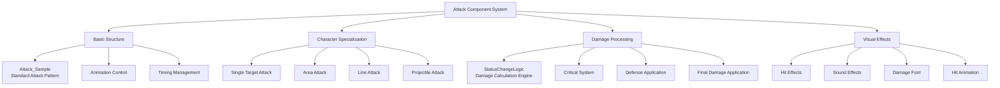

# In-game Systems - Unit Systems - Attack Component

## Overview

The Attack Component system is the core combat system in MetoChess that defines and executes **unit basic attack behavior**. It implements **character-specific attack patterns** based on **standardized Attack_Sample**, providing **precise damage calculation** and **diverse targeting systems** through integration with **StatusChangeLogic**.

The core design philosophy of this system is **modular scalability** and **consistent interface**. All attack components maintain the **same basic structure** while enabling **flexible customization** to express each character's **unique combat characteristics**.

## System Architecture

### Overall Structure Diagram



## Basic Attack Structure

### Attack_Sample - Standard Attack Pattern

The standard implementation that serves as the **basic template** for all attack components.

#### Core Properties

```lua
@Component
script Attack_Sample extends Component
    @Sync
    property number playRate = 0                        -- Animation playback speed
    property string hitEffectRUID = "..."              -- Hit effect RUID
```

#### Attack Execution Flow

```lua
@ExecSpace("Server")
method void Attack(Entity targetUnit)
    local myUnit = self.Entity
    local unitInfo = myUnit.UnitInfo
    local unitStatus = myUnit.UnitStatus
    local animComponent = myUnit.UnitAnimationComponent
    
    -- 1. Calculate animation playback speed
    self.playRate = (unitStatus.AttackSpeed * 1.02) * _BTLogic_New.ASpeedValue
    
    -- 2. Play attack animation
    animComponent:PlayAnimation(self.playRate, "Attack", targetUnit, unitInfo.OwnerId)
    
    -- 3. Set damage application timing
    local function damage()
        self:SetDamage(targetUnit)
    end
    _TimerService:SetTimerOnce(damage, 0.4 / self.playRate)
    
    -- 4. Change unit state
    unitStatus:SetProperty("state", "Attack", "")
end
```

#### Damage Application System

```lua
@ExecSpace("Server")
method void SetDamage(Entity targetUnit)
    if isvalid(targetUnit) then
        local myUnit = self.Entity
        local unitStatus = myUnit.UnitStatus
        
        -- 1. Play hit effect
        self:HitEffect(targetUnit, unitInfo.OwnerId)
        
        -- 2. Calculate damage
        local damageInfo = _StatusChangeLogic:CheckDamage(
            unitStatus.PhysicalAttack,  -- Basic attack power
            myUnit,                     -- Attacker
            targetUnit,                 -- Target
            0,                         -- True damage ratio
            "Physical"                 -- Damage type
        )
        
        -- 3. Apply final damage
        _StatusChangeLogic:HitDamage(
            myUnit,                    -- Attacker
            targetUnit,                -- Target
            damageInfo[1],             -- Physical damage
            0,                         -- Magical damage
            damageInfo[2],             -- True damage
            "defaultAttack"            -- Attack type
        )
    end
end
```

## Character-Specific Attack Patterns

### 1. Single Target Attack (Standard Type)

The **basic 1:1 attack** pattern used by most characters.

#### Example: C30017_UnknownSnackBar_Attack

```lua
-- Feature: Animation speed and timing adjustment
self.playRate = (unitStatus.AttackSpeed * 1.32) * _BTLogic_New.ASpeedValue
animComponent:PlayAnimation(self.playRate, "Attack", targetUnit, unitInfo.OwnerId)

-- Damage application timing
_TimerService:SetTimerOnce(damage, 0.5 / self.playRate)

-- Additional attack availability check
if _BTLogic_New:CheckAttackAble(myUnit, targetUnit, "Attack") then
    self:SetDamage(targetUnit)
end
```

### 2. Area Attack (AoE)

Pattern that attacks **multiple nearby enemies** simultaneously.

#### Example: C50001_PinkBean_Attack

```lua
@ExecSpace("Server")
method void Attack(Entity targetUnit)
    -- Basic setup
    self.playRate = (unitStatus.AttackSpeed * 2.28) * _BTLogic_New.ASpeedValue
    
    local function damage()
        -- 1. Search attackable enemies
        local enemies = {}
        if unitInfo.TeamType == "User" then
            enemies = teamManager.EnemyUnits
        elseif unitInfo.TeamType == "Enemy" then
            enemies = teamManager.OwnUnits
        end
        
        -- 2. Select targets within range
        local attackEnemies = _BTLogic_New:getTargets(
            unitInfo.setTile,                                    -- Base position
            enemies,                                             -- Target list
            string.format("Around_1_%d", unitStatus.AttackRange) -- Range pattern
        )
        attackEnemies = _BTLogic_New:getEntities(attackEnemies, "AttackAble")
        
        -- 3. Apply damage to all targets
        for _, enemy in pairs(attackEnemies) do
            if _BTLogic_New:CheckAttackAble(myUnit, enemy, "Attack") then
                self:SetDamage(enemy)
            end
        end
        
        -- 4. Area attack effect
        self:AttackEffect(unitInfo.OwnerId)
    end
    
    _TimerService:SetTimerOnce(damage, 0.7 / self.playRate)
end
```

#### Complex Damage System

```lua
method void SetDamage(Entity targetUnit)
    -- Calculate physical damage
    local physicalDamage = unitStatus.PhysicalAttack
    local physicalDamageInfo = _StatusChangeLogic:CheckDamage(
        physicalDamage, myUnit, targetUnit, 0, "Physical"
    )
    
    -- Calculate magical damage (based on skill description)
    local magicalDamage = unitStatus.MagicalAttack * 
                         _S01_SkillDescLogic.C50001_Passive_Attack_Magic[unitInfo.level]
    local magicalDamageInfo = _StatusChangeLogic:CheckDamage(
        magicalDamage, myUnit, targetUnit, 0, "Magical"
    )
    
    -- Apply complex damage
    _StatusChangeLogic:HitDamage(
        myUnit, targetUnit,
        physicalDamageInfo[1],                              -- Physical damage
        magicalDamageInfo[1],                               -- Magical damage
        physicalDamageInfo[2] + magicalDamageInfo[2],       -- Combined true damage
        "defaultAttack"
    )
end
```

### 3. Line Attack

Pattern that penetrates and attacks **all enemies in a straight line**.

#### Features
- **Sequential Hits**: Progress tile by tile attacking
- **Time-Delayed Attacks**: Time intervals between each tile attack
- **Penetration Effect**: Continues even with enemies in between

## Damage Calculation System

### StatusChangeLogic Engine

The central system responsible for **damage calculation and application** for all attacks.

#### Stage 1: CheckDamage - Basic Damage Calculation

```lua
@ExecSpace("Server")
method SyncTable<number> CheckDamage(number setDamage, Entity attackUnit, Entity targetUnit, 
                                     number trueDamagePer, string damageType)
    -- Separate true damage and normal damage
    local trueDamage = setDamage * trueDamagePer
    local damage = setDamage - trueDamage
    
    return {damage, trueDamage}
end
```

#### Stage 2: HitDamage - Comprehensive Damage Processing

Calculates final damage through a complex **7-stage damage processing pipeline**.

##### 1) Status Effect Check
```lua
-- Check blind effect for basic attacks
if attackType == "defaultAttack" and attackUnitStatus.StatusEffect["SE0007"] == true then
    physicalDamage = 0
    magicalDamage = 0
    trueDamage = 0
end
```

##### 2) Apply Attacker Modifiers
```lua
-- Apply damage increase/decrease rate
local dealingDamageRate = attackUnitStatus.DealingDamageRate
physicalDamage *= dealingDamageRate/100
magicalDamage *= dealingDamageRate/100
trueDamage *= dealingDamageRate/100
```

##### 3) Critical System
```lua
-- Calculate critical probability
local criticalPercent = attackUnitStatus.CriticalPercent
local criticalDamagePercent = attackUnitStatus.CriticalDamagePercent
local randomValue = _UtilLogic:RandomIntegerRange(1, 100)

-- Special synergy handling: Hunter synergy
if attackUnit.UnitInfo:DoesHaveSynergy("S10008") then
    local HPRateCondition = 0
    if onFieldSynCount_S10008 >= 2 then
        HPRateCondition = 0.35  -- Critical against enemies below 35%
    elseif onFieldSynCount_S10008 >= 4 then
        HPRateCondition = 0.7   -- Critical against enemies below 70%
    elseif onFieldSynCount_S10008 >= 6 then
        HPRateCondition = 1.1   -- Always critical
    end
    
    if targetUnit.UnitStatus.HP / targetUnit.UnitStatus.MaxHP < HPRateCondition then
        randomValue = -1  -- Force critical
    end
end

-- Apply critical damage
if randomValue < criticalPercent then
    isCriticalHit = true
    physicalDamage *= criticalDamagePercent/100
    magicalDamage *= criticalDamagePercent/100
    trueDamage *= criticalDamagePercent/100
end
```

##### 4) Apply Defense
```lua
-- Apply physical defense
local def = targetUnitStatus.Defence
if def < 0 then def = 0 end
physicalDamage = physicalDamage * (1 - (def / (100 + def)))

-- Apply magic resistance
local mr = targetUnitStatus.MagicalResistance
if mr < 0 then mr = 0 end
magicalDamage = magicalDamage * (1 - (mr / (100 + mr)))
```

##### 5) Damage Reduction System
```lua
-- Apply various damage reduction effects
local damageDecrease = targetUnitStatus.DamageDecrease

-- Percentage reduction
local damageDecreaseRate = 0
damageDecreaseRate += damageDecrease["Per"]                                -- Base reduction
damageDecreaseRate += damageDecrease["Physic_Per"] * targetUnitStatus.PhysicalAttack  -- Attack proportional
damageDecreaseRate += damageDecrease["Magic_Per"] * targetUnitStatus.MagicalAttack    -- Magic proportional
damageDecreaseRate += damageDecrease["MaxHP_Per"] * targetUnitStatus.MaxHP           -- Max HP proportional

physicalDamage *= (1 - damageDecreaseRate/100)
magicalDamage *= (1 - damageDecreaseRate/100)

-- Integer reduction
physicalDamage -= damageDecrease["Num"]
magicalDamage -= damageDecrease["Num"]
trueDamage -= damageDecrease["True_Num"]
```

##### 6) Invincibility State Handling
```lua
-- Check invincibility effect
if targetUnit.UnitStatus.StatusEffect["SE0001"] == true then
    targetUnitStatistics:SetProperty("PhysicalDamageAbsorbed", math.max(0, physicalDamage), true)
    targetUnitStatistics:SetProperty("MagicalDamageAbsorbed", math.max(0, magicalDamage), true)
    targetUnitStatistics:SetProperty("TrueDamageAbsorbed", math.max(0, trueDamage), true)
    trueDamage, physicalDamage, magicalDamage = 0, 0, 0
end
```

##### 7) Final Application and Event Triggering
```lua
-- Display damage font
if physicalDamage > 0 then
    _CustomizedBattleEffectService:PlayDamageSkin(
        targetUnit, "Physic", physicalDamage, isCriticalHit, userID
    )
end

if magicalDamage > 0 then
    _CustomizedBattleEffectService:PlayDamageSkin(
        targetUnit, "Magic", magicalDamage, isCriticalHit, userID
    )
end

if trueDamage > 0 then
    _CustomizedBattleEffectService:PlayDamageSkin(
        targetUnit, "True", trueDamage, isCriticalHit, userID
    )
end

-- Hit animation
targetUnit.UnitAnimationComponent:PlayHitDirection(userID)

-- Trigger event
targetUnit:SendEvent(Attacked({
    Attacker = attackUnit,
    Target = targetUnit,
    InitialDamages = initialDamage,
    FinalDamages = finalDamage,
    IsCritical = isCriticalHit,
    AttackType = attackType
}))
```

## Targeting System

### Advanced Targeting Through BTLogic_New

System supporting various **range patterns** and **target selection conditions**.

#### Range Pattern Types

```lua
-- Circular range (radius-based)
"Around_1_3"        -- Circular attack with radius 3

-- Line range (penetration attack)
"StraightLine_1"    -- Straight line penetration attack

-- Attack range-based range
string.format("Around_1_%d", unitStatus.AttackRange)  -- Circular range equal to unit's attack range
```

#### Target Selection System

```lua
-- 1. Basic target search
local attackEnemies = _BTLogic_New:getTargets(
    unitInfo.setTile,     -- Base position
    enemies,              -- Candidate target list
    rangePattern          -- Range pattern
)

-- 2. Filter only attackable targets
attackEnemies = _BTLogic_New:getEntities(attackEnemies, "AttackAble")

-- 3. Individual attack availability check
for _, enemy in pairs(attackEnemies) do
    if _BTLogic_New:CheckAttackAble(myUnit, enemy, "Attack") then
        -- Execute attack
    end
end
```

## Visual and Audio Effect System

### Effect Management

#### Hit Effects
```lua
@ExecSpace("Client")
method void HitEffect(Entity targetUnit)
    local myUnit = self.Entity
    local unitInfo = myUnit.UnitInfo
    
    -- Direction setting (left/right flip)
    local filpX = unitInfo.spriteRenderer.SpriteRendererComponent.FlipX
    
    -- Effect option setting
    local options = {
        ["FlipX"] = filpX,
        ["Color"] = Color(1,1,1, _ESCMenuService.skillEffectAlpha/100)
    }
    
    -- Play effect (attached to target)
    _EffectService:PlayEffectAttached(
        self.hitEffectRUID,      -- Effect RUID
        targetUnit,              -- Target to attach
        Vector3(0, 0.3, 0),      -- Offset position
        0,                       -- Rotation
        Vector3(1.5, 1.5, 1.5),  -- Scale
        false,                   -- World coordinates
        options                  -- Additional options
    )
end
```

#### Sound Effects
```lua
-- Sound on attack start
_PlaySoundLogic:PlaySound("M0038", self.Entity.UnitInfo.OwnerId)

-- Sound on hit
_PlaySoundLogic:PlaySound("M0126")
```

## Performance Optimization and Scalability

### 1. Timing Optimization
- **Animation Speed-Based Timing**: Dynamic timing adjustment based on attack speed
- **Frame-Based Calculation**: Precise timing synchronization

### 2. Memory Efficiency
- **Effect RUID Caching**: Reuse effect resources during runtime
- **Timer Management**: Prevent memory leaks through unnecessary timer cleanup

### 3. Scalability
- **Modular Design**: Easy addition of new attack patterns
- **Standardized Interface**: Consistent implementation rules
- **Data-Driven Balancing**: Value adjustment through CSV data

### 4. Debugging and Monitoring
- **Combat Statistics Integration**: All attacks automatically recorded in statistics
- **Event System**: Complete tracking of attack actions

## Related Files

### Code References
- `RootDesk/MyDesk/InGame/Unit/00_AttackComponent/Attack_Sample.mlua :: Attack()` — Standard attack pattern implementation
- `RootDesk/MyDesk/InGame/Unit/00_AttackComponent/Attack_Sample.mlua :: SetDamage()` — Basic damage application logic
- `RootDesk/MyDesk/InGame/System/StatusChangeLogic.mlua :: CheckDamage()` — Basic damage calculation
- `RootDesk/MyDesk/InGame/System/StatusChangeLogic.mlua :: HitDamage()` — Comprehensive damage processing system
- `RootDesk/MyDesk/InGame/Unit/00_AttackComponent/C50001_PinkBean_Attack.mlua :: Attack()` — Area attack pattern example
- `RootDesk/MyDesk/InGame/Unit/00_AttackComponent/C30017_UnknownSnackBar_Attack.mlua` — Single target attack variation example

### Character-Specific Attack Components
- All character-specific attack implementations in `RootDesk/MyDesk/InGame/Unit/00_AttackComponent/` folder

### Integration Systems
- `BTLogic_New.mlua` — Targeting and range calculation system
- `UnitAnimationComponent.mlua` — Attack animation control
- `UnitBattleStatistics.mlua` — Attack statistics recording
- `CustomizedBattleEffectService.mlua` — Damage font and effects
- `EffectService` — Visual effect playback
- `PlaySoundLogic.mlua` — Sound effects

### Event Integration
- `Events/UnitBehaviorEvents/` — Attack-related event definitions
- `DefaultAttack`, `DefaultAttackHit`, `Attacked` events

Through this systematic attack component system, MetoChess provides **diverse and engaging combat mechanisms** while ensuring **both performance and scalability** in a robust combat system. The **standardized structure** that enables **unlimited creativity** on top of a flexible architecture is the greatest advantage of this system.
