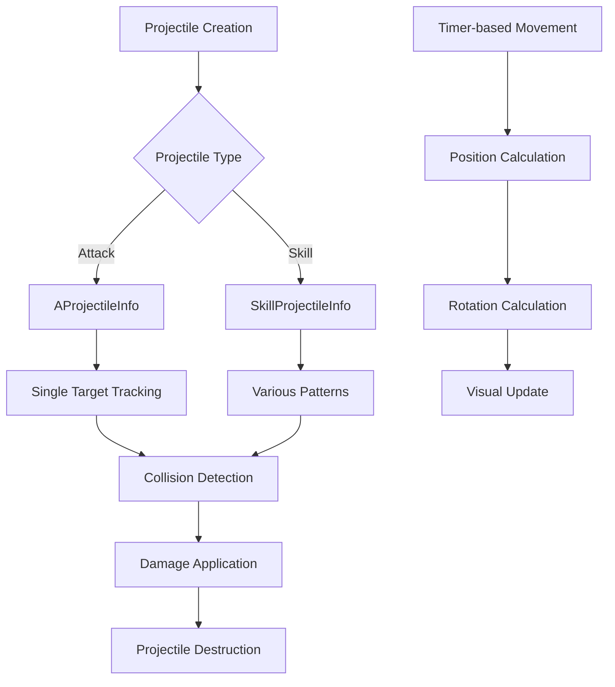

# Projectile System

MetoChess's projectile system is a core system responsible for physical movement, collision detection, and visual effects of all projectiles launched in ranged attacks and skills. It provides natural combat experience through real-time target tracking and precise trajectory calculations.

## System Overview

The projectile system is divided into two main types:
- **Attack Projectiles**: For basic ranged attacks
- **Skill Projectiles**: Special projectiles for skills



## Basic Attack Projectiles

### AProjectileInfo Structure

The base component for all basic attack projectiles.

**Core Properties:**
- `onwerUnit`: Projectile launching unit
- `targetUnit`: Target unit to track
- `projectile_speed`: Projectile movement speed
- `moveVec`: Current movement direction vector
- `setPos`: Current position coordinates

**Lifecycle Management:**
- `Shots`: Projectile active status
- `destroyTime`: Survival time (maximum 10 seconds)
- `ShotTimer`: Timer for movement processing

### Projectile Initialization

```lua
@ExecSpace("Server")
method void SetProjectile(Entity onwerUnit, Entity targetUnit, number speed, number scale, number vecY, number targetY)
```

**Initialization Process:**
1. Projectile activation and basic setup
2. Speed and scale application
3. Start position setting
4. FlipX direction calculation
5. Start timer-based movement

### Real-time Tracking System

Projectiles check target position every 0.01 seconds for tracking:

```lua
local function ShotsFnc()
    -- Survival time check
    self.destroyTime += interval
    if self.destroyTime >= 10 then
        self:Destroy()
        return
    end
    
    -- Target validity check
    if isvalid(self.targetUnit) and self.targetUnit.UnitStatus.HP > 0 then
        -- Collision detection
        if Vector2.Distance(targetVec2, selfVec2) <= 0.5 then
            -- Damage application
            self.onwerUnit.UnitInfo.AttackComponent:SetDamage(self.targetUnit)
            self:Destroy()
        else
            -- Movement direction calculation and position update
        end
    end
end
```

### Physical Movement Calculation

**Direction Vector Calculation:**
```lua
self.moveVec = Vector2.Normalize(targetVec2 - selfVec2)
```

**Rotation Angle Calculation:**
```lua
local zRotation = 0
if self.moveVec.y >= 0 then
    zRotation = Vector2.Angle(Vector2(1,0), self.moveVec)
else
    zRotation = -Vector2.Angle(Vector2(1,0), self.moveVec)
end
```

**Position Update:**
```lua
local posX = selfVec2.x + (self.moveVec.x * self.projectile_speed * interval * 20)
local posY = selfVec2.y + (self.moveVec.y * self.projectile_speed * interval * 20)
```

## Skill Projectile System

### SkillProjectileInfo Structure

Skill-specific projectiles that support more complex behavior patterns.

**Key Differences:**
- Skill damage application method
- Various special effects
- Complex collision detection

**Damage Application:**
```lua
if Vector2.Distance(targetVec2, selfVec2) <= 0.5 then
    self.onwerUnit.UnitInfo.SkillComponent:SetSkillDamage(self.targetUnit)
    self:Destroy()
end
```

### Special Projectile Patterns

#### Penetrating Projectile (C20011_Archer)

Projectile that moves in straight line attacking all enemies in path:

```lua
-- Check all enemies
local checkEnemy = _BTLogic_New:getEntities(self.Enemies, "AttackAble")
for _, enemy in pairs(checkEnemy) do
    local dis = Vector2.Distance(enemyVec2, selfVec2)
    if dis <= 0.5 and not isvalid(self.AttackedEnemy[enemy]) then
        self.AttackedEnemy[enemy] = true  -- Prevent duplicate attacks
        self.onwerUnit.UnitInfo.SkillComponent:SetSkillDamage(enemy)
    end
end
```

**Features:**
- Manage once-attacked enemies with `AttackedEnemy` table
- Duplicate damage prevention system
- Straight-line movement pattern

#### Multi-target Projectile

Projectiles that track multiple enemies simultaneously or deal area damage:

- **Area Search**: Utilize `_BTLogic_New:getEntities()`
- **Distance-based Detection**: Target all enemies within certain radius
- **Chain Effect**: Spread to surrounding enemies after hitting first target

## Collision Detection System

### Basic Collision Detection

**Distance-based Detection:**
- Threshold: 0.5 unit distance
- Utilize `Vector2.Distance()` function
- Real-time position comparison

### Advanced Collision Detection

**Multi-target Detection:**
```lua
for _, enemy in pairs(checkEnemy) do
    local dis = Vector2.Distance(enemyVec2, selfVec2)
    if dis <= detectionRadius then
        -- Collision processing
    end
end
```

**State-based Filtering:**
- Survival state check: `HP > 0`
- Active state check: `enemy.Enable`
- Attackable state: `"AttackAble"` entities

## Visual Effects System

### Rotation and Direction

**FlipX Processing:**
Projectiles flip left/right based on launch direction.

**Rotation Calculation:**
Projectiles rotate in real-time based on movement direction:
- X-axis reference angle calculation
- Positive/negative determination based on Y-axis direction
- Natural trajectory representation

### Size Adjustment

```lua
self.Entity.TransformComponent.Scale = Vector3(scale/2, scale/2, scale/2)
```

Projectile size is set at launch and adjusted to same ratio for visual consistency.

## Performance Optimization

### Timer Management

**Efficient Updates:**
- Position update every 0.01 seconds
- Immediately release unnecessary timers
- Actively use `_TimerService:ClearTimer()`

### Memory Management

**Projectile Lifecycle:**
1. **Creation**: `SetProjectile()` call
2. **Activation**: `SetEnable(true)` state
3. **Movement**: Timer-based continuous updates
4. **Collision**: Damage application
5. **Destruction**: Cleanup by calling `Destroy()`

**Auto Cleanup System:**
```lua
if self.destroyTime >= 10 then
    _TimerService:ClearTimer(self.ShotTimer)
    self:Destroy()
    return
end
```

### Exception Handling

**Target Invalidation:**
- When target dies
- When combat ends
- When target is deactivated

**Projectile Invalidation:**
- Maximum survival time exceeded
- Owner unit deleted
- Map boundary exceeded

## Integration with Combat System

### Speed Multiplier Application

```lua
self.projectile_speed = speed * _BTLogic_New.ASpeedValue
```

Projectile speed is adjusted to reflect combat system's speed multiplier.

### Damage System Integration

**Attack Projectiles:**
- Call `AttackComponent:SetDamage()`
- Apply basic attack damage calculation

**Skill Projectiles:**
- Call `SkillComponent:SetSkillDamage()`
- Apply skill-specific special damage calculation

## Code References

- `RootDesk/MyDesk/InGame/Unit/00_ProjectileComponent/AProjectileInfo.mlua :: SetProjectile()` — Basic projectile initialization
- `RootDesk/MyDesk/InGame/Unit/00_ProjectileComponent/SkillProjectile/SkillProjectileInfo.mlua :: SetProjectile()` — Skill projectile initialization
- `RootDesk/MyDesk/InGame/Unit/00_ProjectileComponent/SkillProjectile/C20011_Archer_SkillprojectileInfo.mlua :: ShotsFnc()` — Penetrating projectile implementation
- `RootDesk/MyDesk/InGame/Unit/00_ProjectileComponent/SkillProjectile/SkillShotCheckComponent.mlua :: SetOwnerID()` — Skill projectile owner setting
- `RootDesk/MyDesk/InGame/Unit/00_ProjectileComponent/AttackProjectileSample.model` — Attack projectile model
- `RootDesk/MyDesk/InGame/Unit/00_ProjectileComponent/SkillProjectileSample.model` — Skill projectile model
