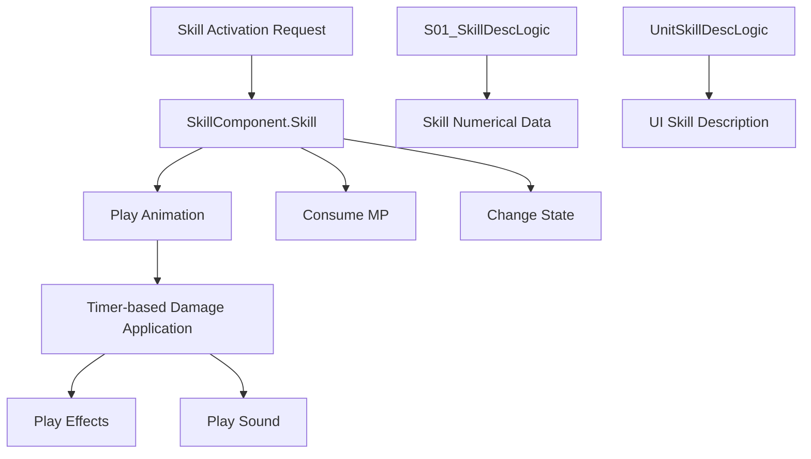

# Skill Component

MetoChess's skill system is a core system that manages the unique abilities of each unit. It implements and manages special abilities that are activated by consuming MP, separate from basic attacks.

## System Overview

The skill system consists of three main elements:
- **Skill Component**: Handles actual skill logic
- **Skill Data Management**: Manages numerical values and description information
- **Skill UI Integration**: Displays skill information in-game



## Basic Skill Component

### SkillComponent Structure

The base component that serves as the foundation for all skills.

**Key Properties:**
- `SkillType`: Skill type classification
- `SkillAnimLength`: Skill animation length
- `AttackEffectRUID`: Attack effect RUID
- `HitEffectRUID`: Hit effect RUID
- `SkillSoundID`: Skill sound ID

**Core Method:**
```lua
@ExecSpace("Server")
method void Skill(Entity targetUnit)
```

## Individual Skill Implementation

Each character has its own unique skill component, implemented following the basic pattern.

### Skill Execution Flow

1. **Collect Basic Information**
   ```lua
   local myUnit = self.Entity
   local unitInfo = myUnit.UnitInfo
   local unitStatus = myUnit.UnitStatus
   local targetInfo = targetUnit.UnitInfo
   ```

2. **Handle Animation and State**
   ```lua
   animComponent:PlayAnimation(skillRate, "Skill", targetUnit, unitInfo.OwnerId)
   unitStatus:SetProperty("state", "Skill", "")
   ```

3. **Consume MP**
   ```lua
   _StatusChangeLogic:SetVariableStatus(myUnit, myUnit, "MP", -1000, "useskill")
   ```

4. **Apply Delayed Damage**
   ```lua
   local function hitSkill()
       self:SetSkillDamage(targetUnit)
   end
   _TimerService:SetTimerOnce(hitSkill, 0.5)
   ```

### Character-Specific Skill Examples

**C30001_Yeti_Skill** (Recovery Type Skill):
- Self-recovery skill
- HP recovery amount = Fixed value + Max HP proportional value
- Short animation time (0.9 seconds)

**C30005_SoulMaster_Skill** (Complex Attack Skill):
- Multi-stage attack pattern
- Position-based targeting
- Multiple effect usage

**C00001_YetiAndPepe_Skill** (Special Effect Skill):
- Damage calculation based on received damage amount
- Long animation and complex effects
- Utilizes round-based statistics data

## Skill Data Management System

### S01_SkillDescLogic

Centralized logic that manages numerical data for all skills.

**Data Structure:**
- Manages level-based value arrays for each character
- Distinguishes between Active/Passive skills
- Manages coefficients for various damage types

**Initialization Method:**
```lua
method void OnBeginPlay()
    self:SkillDescC1()  -- C10000 series characters
    self:SkillDescC2()  -- C20000 series characters
    self:SkillDescC3()  -- C30000 series characters
    self:SkillDescC4()  -- C40000 series characters
    self:SkillDescC5()  -- C50000 series characters
    self:SkillDescC0()  -- C00000 series special characters
end
```

### Numerical Data Utilization

How actual values are retrieved and used in skill implementations:
```lua
local getHP = _S01_SkillDescLogic.C30001_Active_GetHP_Int[unitInfo.level] + 
              unitStatus.MaxHP * _S01_SkillDescLogic.C30001_Active_GetHP_MaxHPPer[unitInfo.level]
```

## Skill Description UI System

### UnitSkillDescLogic

System that dynamically generates skill descriptions in the game UI.

**Main Features:**
- Load basic descriptions through localization keys
- Real-time numerical calculations based on current unit status
- Standardized numerical display (used in shops, etc.)

**Description Generation Process:**
1. Generate key with character ID and skill type
2. Obtain basic text from localization
3. Calculate actual values with current unit stats
4. Insert numerical values into template

## Skill and Combat System Integration

### Skill Activation Conditions

- **MP Requirement**: Most skills consume 1000 MP (full MP)
- **Target Existence**: Activates only when appropriate target exists
- **Status Check**: Verified through `_BTLogic_New:CheckAttackAble()`

### Animation and Timing

- **skillAnimLength**: Total skill animation time
- **_BTLogic_New.SSpeedValue**: Apply combat speed multiplier
- **Timer-based Hit**: Separate animation and actual effects

## Effects and Sound

### Effect System

- **AttackEffect**: Visual effects when casting skill
- **HitEffect**: Visual effects when hitting target
- **Multiple Effects**: Combination of multiple effects for complex skills

### Sound Playback

```lua
if self.SkillSoundID ~= "" then
    _PlaySoundLogic:PlaySound(self.SkillSoundID, unitInfo.OwnerId)
end
```

## Special Skill Patterns

### Persistent Effect Skills

Some skills have continuous effects rather than immediate effects:
- Apply status ailments (`_StatusChangeLogic:SetStatus`)
- Apply buffs/debuffs
- Time-based effects

### Area Skills

Implementation of skills targeting multiple targets:
- Search surrounding units
- Apply effects to all enemies within range
- Complex targeting logic

## Performance Considerations

### Data Caching

- Skill coefficient data is loaded only once at game start
- Level-based values are pre-calculated and stored in arrays

### Timer Utilization

- Timer-based delayed execution rather than immediate execution
- Synchronization of animation and actual effects
- Server load distribution

## Code References

- `RootDesk/MyDesk/InGame/Unit/00_ SkillComponent/SkillComponent.mlua :: Skill()` — Basic skill execution logic
- `RootDesk/MyDesk/InGame/Unit/00_ SkillComponent/Skill_Sample.mlua :: SetSkillDamage()` — Damage application sample
- `RootDesk/MyDesk/InGame/Unit/00_ SkillComponent/C30001_Yeti_Skill.mlua :: Skill()` — Recovery skill implementation
- `RootDesk/MyDesk/InGame/System/S01_SkillDescLogic.mlua :: SkillDescC1()` — Skill data initialization
- `RootDesk/MyDesk/UIComponents/UnitSkillDescLogic.mlua :: GetDefaultDesc()` — Skill description generation
- `RootDesk/MyDesk/InGame/Unit/00_ SkillComponent/C00001_YetiAndPepe_Skill.mlua :: Skill()` — Complex skill implementation example
