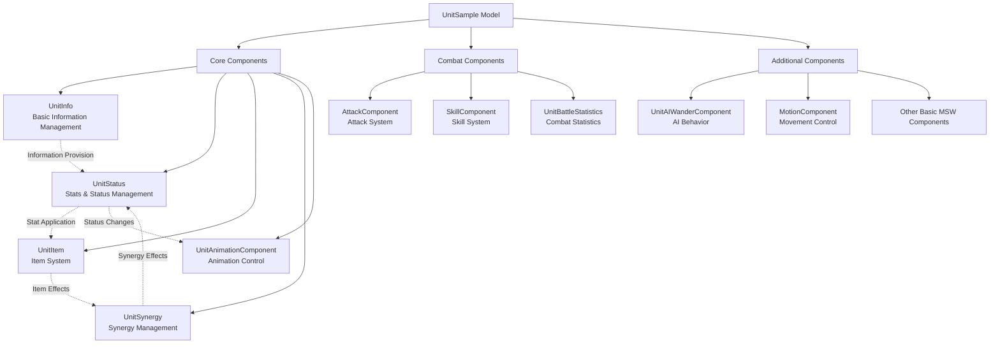
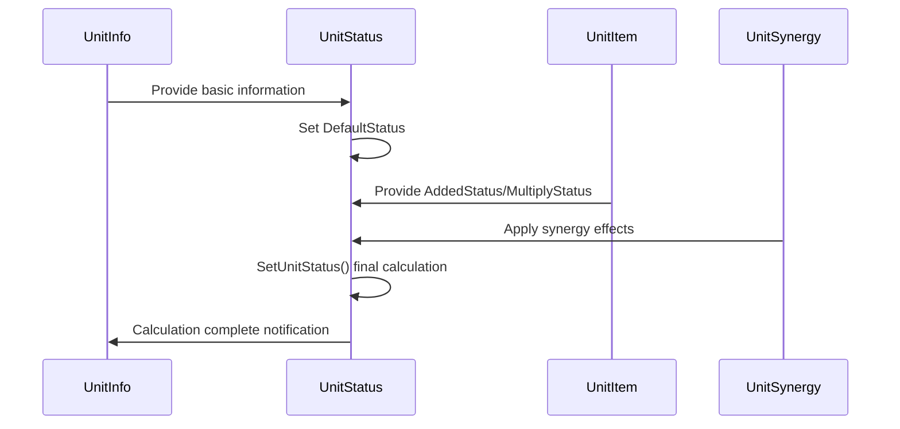
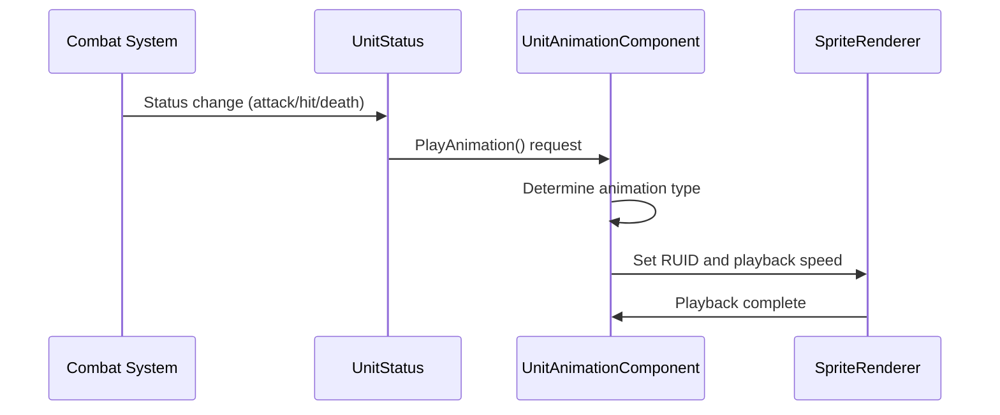
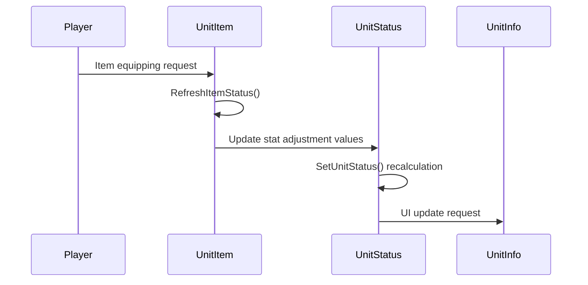

# In-game Systems - Unit Systems - Unit Component

## Overview

The Unit Component system provides a **standardized component structure** to **all unit entities** in MetoChess, serving as the core architecture. Based on the **UnitSample model**, **15 integrated components** work organically together to systematically handle unit **information management**, **stat calculation**, **animation control**, **combat behavior**, **synergy effects**, and more.

The core design philosophy of this system is **modularization** and **scalability**. Each component performs its **independent role** while **closely cooperating** through **standardized interfaces** to implement complex unit systems. This ensures a **consistent structure** is maintained even when adding new characters or features.

## System Architecture

### Overall Structure Diagram



### UnitSample Model Configuration

```lua
-- Standard component configuration in UnitSample.model
{
  "EntryKey": "model://b8e0687e-a1ea-472d-aacc-c2bc11fd79e8",
  "Components": [
    "MOD.Core.TransformComponent",           -- Position/Rotation/Scale
    "MOD.Core.SpriteRendererComponent",      -- Sprite Rendering
    "MOD.Core.TouchReceiveComponent",        -- Touch Events
    "MOD.Core.StateComponent",               -- State Management
    "MOD.Core.TriggerComponent",             -- Collision Detection
    "script.UnitAnimationComponent",         -- Animation Control
    "script.UnitItem",                       -- Item System
    "script.UnitSynergy",                    -- Synergy Management
    "script.UnitAIWanderComponent",          -- AI Behavior
    "script.UnitBattleStatistics",           -- Combat Statistics
    "script.UnitInfo",                       -- Basic Information
    "script.UnitStatus"                      -- Stats & Status
  ]
}
```

## Core Component System

### 1. UnitInfo - Basic Information Manager

The core component responsible for **unit identity and basic characteristics**.

#### Key Properties

##### Identity Information
```lua
property boolean use = false              -- Unit activation status
property string charID = "C10001"         -- Character unique ID
property string unitName = ""             -- Unit name
property number level = 1                 -- Unit grade (1-3 star)
property number cost = 1                  -- Purchase/sale cost
property string OwnerId = ""              -- Owner ID
property string TeamType = ""             -- "User" or "Enemy"
```

##### Placement and Position Information
```lua
property Entity setTile = nil                    -- Currently placed tile
property number setTileVerticalNum = 0           -- Vertical position (0=waiting area)
property number setTileHorizontalNum = 0         -- Horizontal position
property SyncTable<string, number> OnTileNum     -- Placement information per tile
```

##### Synergy and Characteristics
```lua
property SyncTable<string> synergyList           -- Owned synergy list
property number unitPhaseNumber = 1              -- Evolution stage (1=basic, 2=evolution)
```

#### Core Functions

##### Field/Waiting Area Distinction
```lua
method boolean IsOnFieldUnit()
    -- Check battlefield placement status
    if self.setTileVerticalNum == 0 then
        return false  -- Waiting area
    else
        return true   -- Battlefield
    end
end
```

##### Synergy Ownership Check
```lua
method boolean DoesHaveSynergy(string synergyID)
    -- 1) Basic synergy check
    for i=1, #self.synergyList do
        if self.synergyList[i] == synergyID then
            return true
        end
    end
    
    -- 2) Synergy check through Emblem (EI) items
    local equippedItems = self.Entity.UnitStatus.EquippedItemIDList
    for i=1, #equippedItems do
        local itemID = _UtilLogic:Split(equippedItems[i], "_")[1]
        local keyHead = string.sub(itemID, 1, 2)
        local keyTail = string.sub(itemID, 3, -1)
        
        if keyHead == "EI" then
            if synergyID == "S"..keyTail then
                return true
            end
        end
    end
    
    return false
end
```

#### Unit Control Flag System

```lua
-- Unit behavior restriction management
property boolean IsOnetimeUnit = false            -- One-time unit status
property boolean IsMergableUnit = true            -- Merging availability
property boolean IsItemEquippable = true          -- Item equipping availability
property boolean IsSettableOnWatingField = true   -- Waiting area placement availability
property boolean IsMovableByPlayer = true         -- Player movement availability
property boolean IsResellable = true              -- Resale availability
property boolean IsAppliableSynergy = true        -- Synergy application availability
```

### 2. UnitStatus - Stats and Status Manager

The **central processing component** responsible for **all stat calculation and status management** of units.

#### Basic Stat Properties

##### Survival-Related
```lua
property number MaxHP = 0                  -- Maximum health
property number HP = 100                   -- Current health
property number MaxMP = 0                  -- Maximum mana
property number MP = 0                     -- Current mana
property number Shield = 0                 -- Shield
```

##### Attack-Related
```lua
property number PhysicalAttack = 0         -- Physical attack
property number MagicalAttack = 0          -- Magical attack
property number CriticalPercent = 0        -- Critical chance
property number CriticalDamagePercent = 140 -- Critical damage (default 140%)
property number BloodAbsorptionPercent = 0 -- Lifesteal rate
property number DealingDamageRate = 100    -- Damage dealing rate
```

##### Defense-Related
```lua
property number Defence = 0                -- Physical defense
property number MagicalResistance = 0      -- Magic defense
```

##### Other Stats
```lua
property number AttackSpeed = 0            -- Attack speed
property number AttackRange = 0            -- Attack range
property number SkillRange = 0             -- Skill range
property number MoveSpeed = 1              -- Movement speed
property number MPBonusWhenAttack = 0      -- Mana gain on attack
property number MPBonusWhenBeAttacked = 0  -- Mana gain when hit
property number HPRecoverRate = 100        -- Health recovery rate
property number StatusEffectRemainTimeRate = 100 -- Status effect duration rate
```

#### Stat Calculation System

MetoChess stat calculation consists of a **4-stage hierarchy**:

```lua
-- Final stats = (Character base values + Integer increases) × (1 + Multiplier increases)
method void SetUnitStatus(boolean isBattleUnit)
    -- (1) Character base values (DefaultStatus): CSV data based
    -- (2) Integer increases (AddedStatus): Provided by items, synergies, etc.
    -- (3) Multiplier increases (MultiplyStatus): Percentage increase effects
    -- (4) Final application: Calculate in hierarchical order
    
    local statusType = {
        "MaxHP", "MaxMP", "MP", "PhysicalAttack", "MagicalAttack",
        "Defence", "MagicalResistance", "AttackSpeed", "AttackRange",
        "SkillRange", "CriticalPercent", "CriticalDamagePercent",
        "BloodAbsorptionPercent", "MoveSpeed", "DealingDamageRate",
        "MPBonusWhenAttack", "MPBonusWhenBeAttacked", "HPRecoverRate",
        "StatusEffectRemainTimeRate"
    }
    
    for i=1, #statusType do
        local stat = statusType[i]
        local finalValue = (self.DefaultStatus[stat] + self.AddedStatus[stat]) * 
                          (1 + self.MultiplyStatus[stat]/100)
        self[stat] = finalValue
    end
end
```

#### Status Effect Management System

```lua
-- Status ailment management
property SyncTable<string, boolean> StatusEffect    -- Status ailment activation status
property SyncTable<string, number> StatusTime       -- Status ailment duration

-- Stack-based effects
property SyncTable<string, number> StackProperty    -- Stackable effects

-- Damage reduction system
property SyncTable<string, number> DamageDecrease   -- Damage reduction effects
```

### 3. UnitItem - Item System Manager

The **dedicated component** for **item equipment and stat adjustment**.

#### Key Properties

```lua
property SyncTable<string, number> ItemAbilityStacks      -- Item special effect stacks
property SyncTable<number> InBattleAbilityStacks          -- Special effects during combat
property boolean IsBattlePhase = false                     -- Battle phase status
property SyncTable<string, number> AddedStatus            -- Integer increase adjustment
property SyncTable<string, number> MultiplyStatus         -- Multiplier increase adjustment
```

#### Item Stat Application System

```lua
-- Standardized processing for 19 types of stats
local statusType = {
    "MaxHP", "MaxMP", "MP", "PhysicalAttack", "MagicalAttack",
    "Defence", "MagicalResistance", "AttackSpeed", "AttackRange", 
    "SkillRange", "CriticalPercent", "CriticalDamagePercent",
    "BloodAbsorptionPercent", "MoveSpeed", "DealingDamageRate",
    "MPBonusWhenAttack", "MPBonusWhenBeAttacked", 
    "HPRecoverRate", "StatusEffectRemainTimeRate"
}

-- Reset all adjustment values to 0 on initialization
method void OnBeginPlay()
    for i=1, #statusType do
        self.AddedStatus[statusType[i]] = 0
        self.MultiplyStatus[statusType[i]] = 0
    end
end
```

### 4. UnitSynergy - Synergy Effect Manager

The component that processes **individual unit-level synergy effects**.

#### Key Properties

```lua
property SyncTable<string, number> SynergyStack    -- Stack values per synergy effect
```

#### Synergy Processing Principles

```lua
method void README()
    --[[
    [Writing Rules]
    1) On~ functions check 'synergy owned by this unit' and execute.
    2) Within executed functions, check 'currently activated synergy effect stage (like 3>6>9...)'.
    3) If required number of people for activation is not met in stage 2, return immediately.
    ]]
end
```

#### Synergy Stack Initialization Example

```lua
method void InitAllProperties()
    self.SynergyStack["S10003_Taunt"] = 2     -- Vanguard: Taunt at battle start and when HP below 50%
    -- Set default values for other synergy effects
end
```

### 5. UnitAnimationComponent - Animation Controller

The animation system responsible for **unit's visual representation**.

#### Key Properties

```lua
property SyncTable<string, string> animRUID        -- RUID mapping per animation
property Color SpriteColor = Color(1,1,1,1)        -- Sprite color
property string SetAnimType = ""                    -- Current animation type
property integer TimerID_HitDirection = 0          -- Hit direction timer
```

#### Animation RUID Setup

```lua
method void SetAnimRUID(string charID)
    local unitRUIDTable = self.unitRUIDs
    local row = unitRUIDTable:FindRow("CharID", charID)
    
    self.animRUID["Idle"] = row:GetItem("IdleRUID")      -- Idle
    self.animRUID["Move"] = row:GetItem("MoveRUID")      -- Movement
    self.animRUID["Attack"] = row:GetItem("AttackRUID")  -- Attack
    self.animRUID["Skill"] = row:GetItem("SkillRUID")    -- Skill
    self.animRUID["Dead"] = row:GetItem("DeadRUID")      -- Death
    
    -- Evolution animation (charID_2)
    local row2 = unitRUIDTable:FindRow("CharID", charID .. "_2")
    if isvalid(row2) then
        self.animRUID["Idle2"] = row2:GetItem("IdleRUID")
        self.animRUID["Move2"] = row2:GetItem("MoveRUID")
        self.animRUID["Attack2"] = row2:GetItem("AttackRUID")
        self.animRUID["Skill2"] = row2:GetItem("SkillRUID")
    end
end
```

#### Animation Playback System

```lua
method void PlayAnimation(number playRate, string anim, Entity targetUnit)
    local unitInfo = self.Entity.UnitInfo
    local spriteRenderer = unitInfo.spriteRenderer
    
    -- Death state check
    if unitStatus.HP <= 0 and self.SetAnimType == "Dead" then
        return
    end
    
    -- Animation selection by evolution stage
    if unitInfo.unitPhaseNumber == 1 then
        spriteRenderer.SpriteRendererComponent.SpriteRUID = self.animRUID[anim]
    elseif unitInfo.unitPhaseNumber == 2 then
        spriteRenderer.SpriteRendererComponent.SpriteRUID = self.animRUID[anim.."2"]
    end
    
    -- Apply playback speed
    spriteRenderer.SpriteRendererComponent.PlayRate = playRate
    
    -- UI handling on death
    if anim == "Dead" then 
        self.Entity:GetChildByName("StatInfo").Enable = false
        self.Entity:GetChildByName("Shadow").Visible = false
    end
    
    -- Direction setting (target-based or team-based)
    if isvalid(targetUnit) then
        local targetPosX = targetUnit.TransformComponent.WorldPosition.x
        local entityPosX = self.Entity.TransformComponent.WorldPosition.x
        
        if targetPosX > entityPosX then
            spriteRenderer.SpriteRendererComponent.FlipX = true
        elseif targetPosX < entityPosX then
            spriteRenderer.SpriteRendererComponent.FlipX = false
        end
    end
end
```

## Additional Component System

### 1. UnitBattleStatistics - Combat Statistics Collector

A data collection component that **records all actions during combat** for each unit.

#### Main Features
- **19 types of combat statistics** real-time collection
- **Round-based subdivision** data storage
- **Server-client synchronization**

### 2. UnitAIWanderComponent - AI Behavior Controller

An AI component responsible for **natural wandering of idle units**.

#### Main Features
- Random direction movement
- Natural wandering patterns
- Idle time management

### 3. MotionComponent - Movement Controller

A simple component that **manages unit's movement state**.

#### Main Features
- Check movement state
- Movement animation integration
- Movement speed control

## Component Interaction Flow

### Stat Calculation Flow


### Animation Control Flow


### Item Equipping Flow


## Scalability and Modularization

### Adding New Components
1. **Register new component** in UnitSample.model
2. **Implement standard interface**
3. **Define integration** with existing components

### Adding New Stats
1. **Add to statusType array** in UnitStatus
2. **Reflect in UnitItem's adjustment system**
3. **Update calculation formulas**

### Adding New Animation States
1. **Add RUID to CSV data**
2. **Implement playback logic** in UnitAnimationComponent
3. **Define state transition rules**

## Related Files

### Code References
- `RootDesk/MyDesk/InGame/Unit/01_UnitComponent/UnitInfo.mlua :: IsOnFieldUnit()` — Determine field placement status
- `RootDesk/MyDesk/InGame/Unit/01_UnitComponent/UnitInfo.mlua :: DoesHaveSynergy()` — Synergy ownership check
- `RootDesk/MyDesk/InGame/Unit/01_UnitComponent/UnitStatus.mlua :: SetUnitStatus()` — Comprehensive stat calculation
- `RootDesk/MyDesk/InGame/Unit/01_UnitComponent/UnitItem.mlua :: RefreshItemStatus()` — Item stat application
- `RootDesk/MyDesk/InGame/Unit/01_UnitComponent/UnitAnimationComponent.mlua :: PlayAnimation()` — Animation playback control
- `RootDesk/MyDesk/InGame/Unit/01_UnitComponent/UnitSynergy.mlua :: InitAllProperties()` — Synergy stack initialization

### Models and Data
- `RootDesk/MyDesk/InGame/Unit/01_UnitComponent/UnitSample.model` — Standard unit component configuration
- `CharacterInfo` CSV — Character-specific animation RUID and basic information

### Integration Systems
- `TeamManager.mlua` — Unit ownership and placement management
- `SynergyManager_New.mlua` — Team-level synergy calculation
- `UnitSetLogic_New.mlua` — Unit creation and placement logic
- `StatusChangeLogic.mlua` — Status effect animation integration

Through this **systematic component structure**, MetoChess **consistently manages complex unit systems** while providing **high scalability when adding new features**. The **clear role division** and **standardized interaction** of each component is the core architecture that ensures **both development efficiency and code quality**.
