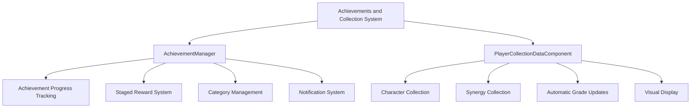
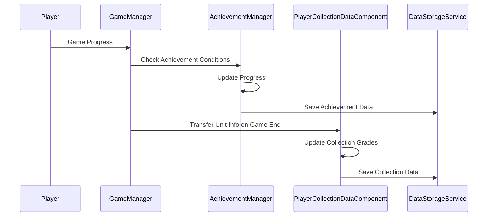

# Achievements and Collection

## Overview

An achievement system and character/synergy collection system that encourages long-term player engagement. It provides depth to the meta-game through step-by-step achievement progress tracking, various reward distribution, and visual collection display.

## Core System Structure



## 1. Achievement System (AchievementManager)

### Data Structure

Achievements manage step-by-step progress and states by ID:

```lua
@Component
script AchievementManager extends Component

    property table PlayerAchievementData = {}
    property table PlayerAchieveCategoryData = {}
```

Each achievement's data structure:

```lua
PlayerAchievementData[achieveID] = {
    ['count'] = progress,
    ['state'] = {stage_states},
    ['date'] = {completion_dates}
}
```

### Achievement State Management

Achievements have 4 states:

- **InProgress**: In progress
- **RewardEarned**: Reward obtainable
- **Complete**: Reward received
- **Lock**: Locked state

### Progress Updates

```lua
method void Modify_AchieveData(string achievementID, number value)
```

Achievement progress is calculated in two ways:

#### Cumulative Method (IsCumulative = "TRUE")
```lua
if data.IsCumulative == "TRUE" then 
    aftCount = befCount + value  -- Previous value + additional value
```

#### Maximum Value Method (IsCumulative = "FALSE")  
```lua
else 
    aftCount = math.max(befCount, value)  -- Maximum value update
```

### Staged Achievement System

A single achievement can have multiple stages:

```lua
for i = data.MaxStep, 1, -1 do 
    if aftCount >= tonumber(data.Count[i]) then 
        playerAchieveData['state'][i] = _AchievementStateEnum.RewardEarned
        playerAchieveData['date'][i] = DateTime.UtcNow:ToFormattedString("yyyy/MM/dd")
    end
end
```

### Special Achievement Type: Stack Achievements

```lua
method void Modify_AchieveStack(string achieveID, number value)
```

Achievements valid only within a game, reset when game ends:

- Achieve specific conditions within one game
- Reset progress when game ends
- Real-time progress tracking

### Achievement Reward System

```lua
method void EarnReward_Achieve(string achievementID, integer befStep)
```

Reward distribution process:

1. **Validity Check**: Verify achievement ID and rewardable state
2. **State Change**: RewardEarned → Complete
3. **Reward Distribution**: Distribute items according to RewardTable
4. **Category Update**: Increase completion count
5. **UI Notification**: Display red dot and popup

### Category Management

```lua
method void Modify_AchieveCategoryData(string categoryID, integer value)
```

Track completion count by achievement category to manage overall progress.

### Notification System

Provide multi-stage notifications upon achievement completion:

```lua
_UI_AchievementService:EnableRedDotByID(categoryID, true, userId)
_UI_AchievementService:EnableAchieveBtnRedDot(true, userId)
_UI_AchievementPopup:InsertPopUpQueue(achievementID, step, 1, userId)
```

## 2. Collection System (PlayerCollectionDataComponent)

### Collection Types

Manages two types of collections:

```lua
@TargetUserSync
property SyncTable<string, number> CharacterCollection  -- Character collection grades

@TargetUserSync
property SyncTable<string, number> SynergyCollection     -- Synergy collection grades
```

### Character Collection

#### Initialization

```lua
method void InitializeCharacterCollectionData()
```

Filter collectable characters from character information table and set initial values:

```lua
if _DataService:GetTable("CharacterInfo"):GetCell(i, "CollectionEnable") == "TRUE" then
    self.CharacterCollection[charID] = 0
end
```

#### Automatic Grade Updates

```lua
method void GetGameOverUnitSet(SyncTable<Entity> ownUnits, string season)
```

Automatically update collection grades by checking levels of units on the final battlefield when game ends:

1. **Extract Final Battlefield Units**: Select only units deployed in the final round
2. **Level Comparison**: Update only levels higher than current collection grade
3. **Duplicate Handling**: Apply only the highest level among multiple same characters

### Synergy Collection

```lua
method void InitializeSynergyCollectionData()
```

Initialize based on all synergy information, with grades updated upon synergy achievement.

### Collection UI System

#### UI_CollectionManager

Main manager for the collection book:

```lua
method void CreateCharColList_NewGrid(string season)
```

- **Season-based Filtering**: Display only characters included in each season
- **GridView Usage**: Efficient display of large amounts of data
- **Collection Rate Calculation**: Display completion rate by season

#### UI_CollectionCharacterCard

Individual character card display:

```lua
method void Initialize(string charID, integer level)
method void Set_CollectLevel(integer collectLevel)
```

- **Grade-based Visualization**: Display collection grades with star system
- **Platinum Card**: Special effects upon achieving highest grade (4 stages)
- **Resource Optimization**: Automatic adjustment of sprite scale and position

#### UI_CollectionCharacterInfo

Detailed information of selected character:

```lua
method void SetInfo(integer collectLevel, string charID)
```

- **Uncollected State Handling**: Display silhouette and "???"
- **Synergy Information**: Display synergies of that character
- **Avatar Change Integration**: Can change avatar to collected character

### Data Storage System

#### Storage Format

```lua
-- CharacterCollection: "(ID)-(Grade)_..._(ID)-(Grade)"
-- SynergyCollection: "(ID)-(Grade)_..._(ID)-(Grade)"
```

#### Loading Process

```lua
method void GetCollectionData(string userID)
```

1. **Load String from DB**: Use DataStorageService
2. **Data Parsing**: Separate ID-grade pairs through Split  
3. **Component Application**: Assign data to SyncTable
4. **Initial Value Handling**: Call Initialize function when no data exists

## 3. Integrated Linkage System

### Automatic Linkage with Game Progress



### Achievement-Collection Mutual Linkage

Collection achievements are reflected in achievement progress:

```lua
-- Title acquisition achievement example
_AchievementService:UpdateProgress_Graduate("AC001007", 1, self.Entity)
```

### Integrated UI Notifications

Both systems use integrated notification systems:

- **Red Dot Display**: When new rewards or collection updates occur
- **Popup Queue**: Sequential notification display to optimize user experience
- **Real-time Synchronization**: Immediate UI reflection through @TargetUserSync

## 4. Performance Optimization

### Data Caching

- **AchievementService**: Achievement information caching to optimize repeated queries
- **DictionaryDataManager**: Pre-loading character/synergy information dictionary

### UI Optimization

- **GridView**: Efficient display of large collection data
- **On-Demand Loading**: Load card information only when needed
- **Resource Management**: Cache image scale and position information

## 5. Data Table Integration

### Essential Data Tables

- **AchievementData**: Achievement definitions and reward information
- **AchievementCategory**: Achievement category classification
- **CharacterInfo**: Collection availability per character
- **SynergyInfo**: Synergy information and collection settings

### Reward System Integration

Support various reward types upon achievement completion:

- **Coach**: Integration with CoachManager
- **Title**: Integration with TitleManager
- **Currency**: Integration with PlayerDataComponent
- **Items**: Integration with in-game item system

## Code References

- `RootDesk/MyDesk/OutGame/Achievement/AchievementManager.mlua :: Modify_AchieveData()` - Achievement progress updates
- `RootDesk/MyDesk/OutGame/Outgame_CollectionBook/PlayerCollectionDataComponent.mlua :: GetGameOverUnitSet()` - Automatic collection updates
- `RootDesk/MyDesk/OutGame/Outgame_CollectionBook/UI_CollectionManager.mlua :: CreateCharColList_NewGrid()` - Collection UI generation
- `RootDesk/MyDesk/DataStorage/PlayerDataLogic.mlua :: GetCollectionData()` - Collection data load
- `RootDesk/MyDesk/OutGame/Achievement/AchievementManager.mlua :: EarnReward_Achieve()` - Achievement reward distribution
