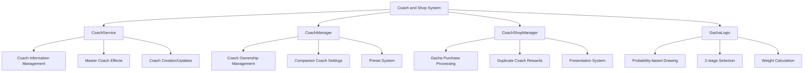

# Coach and Shop

## Overview

A meta-game system centered around coach collection and gacha shop. It provides personalized play experiences through collecting various coaches, setting companion coaches, master coach effects, and avatar changes.

## Core System Structure



## 1. Coach Service (CoachService)

### Coach Information Management

Loads and manages basic information for all coaches:

```lua
@Logic
script CoachService extends Logic

    property table CoachData = {}
    property SyncTable<integer, integer> CoachCountByCost
```

#### Coach Data Structure

```lua
-- CoachInfo struct
coachData.CoachID = "C_001"
coachData.Name = localized_name
coachData.Cost = grade_cost
coachData.ProfileRUID = profile_image
coachData.IdleRUID = default_animation
coachData.MoveRUID = move_animation
coachData.LoveRUID = love_animation
coachData.SadRUID = sad_animation
coachData.SleepRUID = sleep_animation
coachData.InteractionRUID_1~5 = interaction_animations
coachData.AngryRUID = angry_animation
coachData.Tags = tag_list
coachData.Desc = description_text
```

### Master Coach Effect System

```lua
property SyncTable<integer, string> MasterCoachRUID_Anim
property SyncTable<integer, Vector3> MasterCoachOffset
property SyncTable<integer, Vector3> MasterCoachScale
```

Manages special master-grade effects for each coach:

- **Animation RUID**: Master-exclusive effect animations
- **Offset**: Effect position adjustment
- **Scale**: Effect size adjustment

### Coach Entity Creation

```lua
method void CreateCoach(string userId)
method void UpdateCoach(Entity player)
```

Creates and manages player's companion coaches in the actual game world:

1. **Creation Condition Check**: Verify companion coach setting
2. **Entity Spawn**: Create coach with CoachEntity model
3. **Apply Presentation**: create/destroy animations
4. **Master Effects**: Activate special effects for master coaches

## 2. Coach Manager (CoachManager)

### Coach Ownership System

```lua
@TargetUserSync
property SyncTable<string, integer> PlayerOwnedCoachesID
```

Manages ownership status of each coach:

- **0**: Not owned
- **1**: Regular coach owned  
- **2**: Master coach owned

### Companion Coach System

```lua
@TargetUserSync
property string FollowingCoachID = ""

@TargetUserSync  
property Entity CurrentFollowingCoachEntity = nil
```

Manages companion coaches that follow the player in the lobby.

### Preset System

```lua
@TargetUserSync
property SyncTable<string> SetCoachesID          -- Set coach ID list

@TargetUserSync
property SyncTable<number> SetCoachesCost        -- Set coach cost list

@TargetUserSync
property SyncTable<number, string> SetCoachPresetInfo  -- Preset information

@TargetUserSync  
property SyncTable<string> SetCoachPresetName    -- Preset names
```

A system that allows pre-setting coach combinations to use in-game.

### In-game Coach System

```lua
@TargetUserSync
property SyncTable<string> PlayCoachesID         -- Actually applied coaches in game

@TargetUserSync
property SyncTable<number> PlayCoachesCost       -- Costs of applied coaches
```

Manages coaches that actually affect gameplay, separate from companion coaches.

## 3. Coach Shop Manager (CoachShopManager)

### Gacha Purchase Processing

```lua
method void Purchase_Gacha(string player, string GoodsID)
```

Handles the entire gacha purchase process:

#### 1. Currency Consumption Verification
```lua
local gachaData = _CoachShopDataLogic:Get_Gacha(GoodsID)
local purchaseResult = self.Entity.PlayerDataComponent:SubtractSyrup("Syrup", gachaData.Price)
```

#### 2. Coach Selection
```lua
-- Single gacha (CG00001)
if GoodsID == "CG00001" then
    table.insert(pickCoachID, _GachaLogic:ProcessGacha(self.Entity,""))
elseif GoodsID == "CG00002" then
    -- 10-draw gacha logic
```

#### 3. Duplicate Coach Processing
```lua
if pickCoachType ~= 0 then 
    if pickCoachType == 1 then -- Regular coach duplicate
        -- Provide Royal Syrup as duplicate reward
        duplicateReward = _GachaLogic:GetCoachPrice(cost,1,true)
        self.Entity.PlayerDataComponent:AddSyrup("RoyalSyrup", duplicateReward, "DuplicateCoach")
    end
else
    -- New coach added to collection
    isDuplicate = false
    pickCoachType = 1 
end
```

#### 4. Coach Distribution and Presentation Setup
```lua
if not isDuplicate then
    self.Entity.CoachManager:ModifyPlayerOwnedCoachesID(pickCoachID[i],pickCoachType,"GachaCoach")
end

-- Set gacha presentation data
_UI_GachaDirection:SetGachaGrade(bestdirectionGrade,bestisDuplicate,PlayerEntity.OwnerId)
_UI_GachaDirection:NextPlay(PlayerEntity.OwnerId)
```

## 4. Gacha Logic System (GachaLogic)

### 2-stage Selection Method

```lua
method string ProcessGacha(Entity player, string type)
```

#### Stage 1: Grade (Cost) Determination
```lua
local pickUpStruct = GachaPick()
local dataSet = _DataService:GetTable("GachaProbability")

-- Weight-based grade selection
for i=1, dataSet:GetRowCount() do
    local cost = row:GetItem("Cost") 
    pickUpStruct:AddItem(cost, tonumber(row:GetItem("Weight")))
end

local pickCost = pickUpStruct:Pick()
```

#### Stage 2: Coach Selection within Grade
```lua
-- Collect all coaches of selected grade
local coachTable = {} 
for coachId, data in pairs(_CoachService.CoachData) do 
    if pickCost == tostring(coachInfo.Cost) then 
        table.insert(coachTable, coachId)
    end
end

-- Select with equal probability
local rand = _UtilLogic:RandomIntegerRange(1, #coachTable)
return coachTable[rand]
```

### Weighted Drawing System (GachaPick)

```lua
@Struct
script GachaPick

    property table items = {}
    property table itemWeight = {}
    property number totalWeight = 0
```

#### Weight Addition
```lua
method void AddItem(string itemID, number weight)
    table.insert(self.items, itemID)
    self.totalWeight = self.totalWeight + weight
    table.insert(self.itemWeight, weight)
```

#### Probability Calculation and Selection
```lua
method string Pick()
    local pickNumber = _UtilLogic:RandomIntegerRange(0, self.totalWeight-1)
    
    local cumulative_weight = 0
    for i=1, #self.itemWeight do
        cumulative_weight = cumulative_weight + self.itemWeight[i]
        if pickNumber < cumulative_weight then
            return self.items[i]
        end
    end
```

## 5. Gacha Presentation System (UI_GachaDirection)

### Step-by-step Presentation Progress

```lua
method void NextPlay()
```

Gacha presentation consists of 6 stages:

```mermaid
stateDiagram-v2
    [*] --> play : Presentation Request
    play --> start : Init()
    start --> auto : Play_Start()
    auto --> preview : Play_Auto() 
    preview --> click : Play_Preview()
    click --> acquire : Play_Click()
    acquire --> end : Play_Acquire()
    end --> [*] : Play_End()
```

#### Processing by Stage

1. **play → start**: Initialization and presentation start
2. **start → auto**: Auto presentation playback
3. **auto → preview**: Grade preview display
4. **preview → click**: Induce user click
5. **click → acquire**: Coach acquisition display
6. **acquire → end**: Presentation end

### Grade-based Presentation Differentiation

```lua
method void SetGachaGrade(table gradeInfo, boolean isDuplicate, string userID)
```

Apply different presentations according to coach grade (cost):

- **Door Resources**: Different mystic doors by grade
- **Particle Effects**: Special effects by grade
- **Sound**: Dedicated sounds by grade
- **Duplicate Display**: Special UI for duplicate coaches

## 6. Avatar Change System (PlayerAvatarChangeComponent)

### Transformation System

```lua
method void AvatarChange(string charID)
```

Players can change their avatar to collected characters:

#### Transformation Activation
```lua
if self.nowChanging == true then
    self.Entity.AvatarRendererComponent.Enable = false
    self.newAvatar.Enable = true
    self.nowChangeID = charID
    self.newAvatar.NewPlayerAvatarComponent:ChangeCharacter_ON(charID)
```

#### Transformation Deactivation
```lua
else
    self.Entity.AvatarRendererComponent.Enable = true
    self.nowChangeID = ""
    self.newAvatar.Enable = false
```

### Transformation State Management

```lua
@Sync
property boolean nowChanging = false       -- Currently transforming?

@Sync  
property string nowChangeID = ""           -- Transformed character ID

@Sync
property Entity newAvatar = nil            -- Transformation avatar entity

@Sync
property Entity newAvatarEffect = nil      -- Transformation effect entity
```

### Multiplayer Synchronization

```lua
method void Init_OtherUser_Avatar(Entity user)
```

Real-time synchronization of other players' transformation states so all players can see transformation states.

## 7. UI Integration System

### Coach Inventory UI

```lua
-- UI_LobbyCoachInventory
method void SetCoachFollow(string coachID)      -- Set companion coach
method void RefreshFollowingCoach()             -- Refresh companion coach UI  
method void RefreshCoachList()                  -- Refresh coach list
```

### Gacha Result UI

```lua  
-- UI_GachaResult
-- Display 1x/10x drawing results
-- Show coach profile, grade, duplicate reward information
-- Acquisition animation presentation
```

### Probability Information UI

```lua
-- UI_ChanceTable  
-- Display gacha probability information
-- Appearance probability by grade
-- Comply with legal requirements
```

## 8. Data Management System

### Essential Data Tables

- **CoachInfo**: Coach basic information and resources
- **GachaProbability**: Gacha probability tables
- **CoachGachaGoods**: Gacha product information  
- **CoachDirectGoods**: Direct purchase coach information

### Save/Load System

```lua
-- PlayerDataLogic integration
_PlayerDataLogic:SetPlayerOwnedCoachesData(userID)  -- Save owned coaches
_PlayerDataLogic:GetPlayerOwnedCoachesData(userID)  -- Load owned coaches
```

### Real-time Synchronization

All coach-related data is synchronized with clients in real-time through @TargetUserSync.

## 9. Economic System Integration

### Currency Consumption/Acquisition

- **Syrup**: Consumed for gacha purchases
- **Royal Syrup**: Acquired as duplicate coach rewards
- **Direct Coach Purchase**: Direct purchase of specific coaches

### Reward System

Provide Royal Syrup rewards proportional to grade when duplicate coaches are acquired, mitigating sense of loss.

## Code References

- `RootDesk/MyDesk/OutGame/Coach/CoachService.mlua :: LoadCoachInfo()` - Coach information loading
- `RootDesk/MyDesk/InGame/Coach/CoachManager.mlua :: ModifyPlayerOwnedCoachesID()` - Coach ownership state changes
- `RootDesk/MyDesk/OutGame/CoachShop/Shop/CoachShopManager.mlua :: Purchase_Gacha()` - Gacha purchase processing
- `RootDesk/MyDesk/OutGame/CoachShop/Goods_Gacha/GachaLogic.mlua :: ProcessGacha()` - Gacha drawing logic
- `RootDesk/MyDesk/OutGame/OutGame_AvatarChange/PlayerAvatarChangeCompoenent.mlua :: AvatarChange()` - Avatar change system
