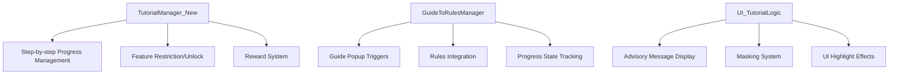
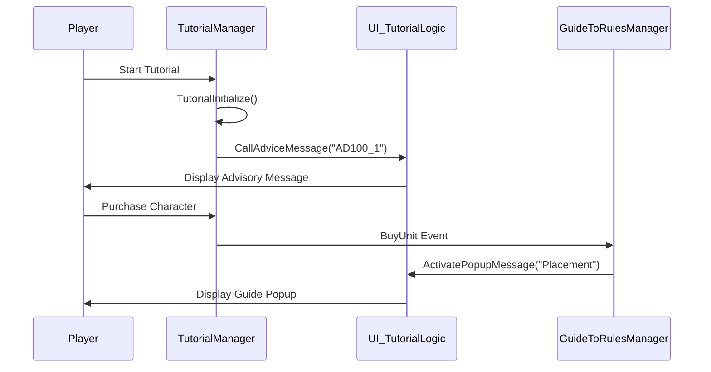

# Guide and Tutorial

## Overview

An educational system that provides systematic tutorial systems for beginners and real-time guide popups. It supports effective learning of basic gameplay through step-by-step progress management, feature restriction/unlock, and advisory messages.

## Core Component Structure



## 1. Tutorial Manager (TutorialManager_New)

### Basic Structure

The core component that manages the overall progress of tutorials.

```lua
@Component
script TutorialManager_New extends Component

    @TargetUserSync
    property boolean TutorialRewardReceived = false
    
    -- Feature restriction flags
    property boolean AllowReroll = false
    property boolean AllowPurchaseChar = false
    property boolean AllowPurchaseEXP = false
    property boolean AllowSellCharacter = false
```

### Feature Restriction/Unlock System

Game features are progressively unlocked according to tutorial steps:

```lua
method void SetAllowFeature(string allowAct, boolean TorF)
```

#### Restrictable Features

- **Char**: Character purchase
- **EXP**: Experience purchase  
- **RuneCard**: Rune card purchase
- **Item**: Item purchase
- **Reroll**: Shop refresh
- **SellChar**: Character selling
- **CharLock**: Character lock
- **DragAllChar**: Drag all characters

### Step-by-step Progress Processing

```lua
handler HandleRoundStart(RoundStart event)
```

Called at the start of each round to check tutorial progress:

#### Stage 1 (Basic Learning)

- **Round 1**: First character purchase learning
  ```lua
  self:ReRollTest("C10002","C10010","C10001","C10011","C10003")
  self:CallAdviceMessage("AD100_1")
  self:SetAllowFeature("Char1", true)
  ```

- **Round 2**: Guide specific character purchase
- **Round 3**: Multiple character purchase learning

#### Stage 2 (Applied Learning)

- **Round 1**: Advanced feature learning (character selling, etc.)

### Event-based Advisory System

Provides real-time advice based on player actions:

```lua
handler HandleBuyUnit(BuyUnit event)
```

- First character purchase: "AD101_1" message
- When holding 3 or more: "AD102_1" message  
- Specific character purchase: Character-specific messages

## 2. Guide-Rules Connection Manager (GuideToRulesManager)

### Guide Popup System

```lua
@TargetUserSync
property SyncTable<string, boolean> WatchedGuideList
```

Tracks display status of each guide popup to prevent duplicate displays.

### Action-based Guide Triggers

Automatically displays related guides when specific game actions occur:

#### Main Trigger Events

```lua
handler HandleBuyUnit(BuyUnit event)          -- On character purchase
handler HandleMergeUnit(MergeUnit event)      -- On character merge  
handler HandleBuyItem(BuyItem event)          -- On item purchase
handler HandleRerollCharacterShop(RerollCharacterShop event)  -- On shop refresh
handler HandlePlaceUnit(PlaceUnit event)      -- On character placement
```

Each event displays corresponding guide popups:

- **Placement**: Character placement guide
- **Cost**: Cost system guide
- **Upgrade**: Upgrade guide
- **Item**: Item system guide
- **Synergy**: Synergy system guide

### Rules Integration

When clicking "Learn More" button in guide popups, navigate to related rule pages:

```lua
handler HandleButtonClickEvent(ButtonClickEvent event)
    _DictionaryManager:OnOpenDictionary()
    _DictionaryManager:OnSelectCategory_1st(2)  -- Game rules tab
```

## 3. Tutorial UI System (UI_TutorialLogic)

### Advisory Message Display

```lua
method void ActivateAdviceMessage(string adviceID)
```

Displays detailed advisory messages along with character guidance:

#### Message Components

- **Guide Character**: Display character image with AdviceCharImageRUID
- **Advisory Text**: Localized guidance message
- **Progress Button**: Move to next message (check MaxCount)
- **Masking**: Highlight specific UI elements

### Masking System

Highlights only specific UI elements during tutorial progress to prevent confusion:

```lua
-- Handle by mask type
if overImageRUID == "927ddee89c2244649e5d7c1dad300a7b" then
    self.maskType = 1  -- Bench
elseif overImageRUID == "b258f19fa36e4bfda88352cf9412a6e6" then
    self.maskType = 2  -- Battlefield
```

#### Masking Functions

- **Target Highlight**: Highlight UI elements to click
- **Click Blocking**: Prevent clicking other UI elements (BlockMaskClick)
- **Position Adjustment**: Set mask position with MaskSetPos table
- **Overlay Image**: Additional visual effects

### Skip Function

Provides skip button during tutorial progress to enhance user convenience:

```lua
_UI_TutorialLogic:SetSkipButton(true, userID)
```

## 4. Data Management System

### Core Data Tables

#### AdviceDataset
```lua
-- Advisory message information
AdviceID: "AD100_1", "AD101_1", ...
AdviceText: Localization key
AdviceCharImageRUID: Guide character image
MaxCount: Consecutive message count
```

#### GuidePopupDataset  
```lua
-- Guide popup information
GuidePopupID: "Placement", "Cost", "Upgrade", ...
Category: Rules category
Text: Guide content localization key
```

#### MaskSetPos
```lua
-- Masking position information  
AdviceID: Connected advice ID
IsMaskOn: Mask usage flag
BlockMaskClick: Click blocking flag
PosX, PosY: Mask position
```

### Progress Storage

```lua
-- PlayerDataLogic.mlua
method void GetPlayerTutorialData(string userID)
method void SetPlayerTutorialData(string userID)
```

Saves player's tutorial progress to DB:

- **TutorialRewardReceived**: Reward received flag
- **TutorialRejected**: Tutorial rejected flag
- **WatchedGuideList**: List of viewed guides

## 5. Reward System

### Tutorial Completion Rewards

```lua
method void SetRewardReceived()
```

When tutorial is completed, distribute rewards and record completion status:

- Reward distribution processing
- Save completion status to DB  
- Update UI state

### Repeat Progress Handling

When players who already received rewards re-enter tutorial:

```lua
if self.TutorialRewardReceived == true then
    -- Simplified tutorial progress
    self:CallAdviceMessage("AD133_1")
```

## 6. Initialization and Settings

### Tutorial Start Initialization

```lua
method void TutorialInitialize()
```

Reset all restriction flags to initial state and disable guide system.

### Auto-activation Conditions

New players automatically see the tutorial selection screen:

```lua
if playerDataComponent.TutorialRewardReceived == false and 
   playerDataComponent.TutorialRejected == false then
    user.TutorialManager_New:ActivateTutoSelectForServer(userID)
```

## Integrated Workflow

### New Player Progress Flow



## Code References

- `RootDesk/MyDesk/TutorialGuide/TutorialManager_New.mlua :: SetAllowFeature()` - Feature restriction/unlock
- `RootDesk/MyDesk/TutorialGuide/GuideToRulesManager.mlua :: ActivatePopupMessage()` - Guide popup display
- `RootDesk/MyDesk/UIComponents/UI_TutorialLogic.mlua :: ActivateAdviceMessage()` - Advisory message activation
- `RootDesk/MyDesk/DataStorage/PlayerDataLogic.mlua :: GetPlayerTutorialData()` - Tutorial data load
- `RootDesk/MyDesk/Dictionary/DictionaryManager.mlua :: UpdateUI_GameRulesList()` - Rules integration
