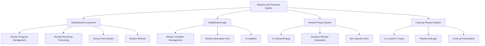
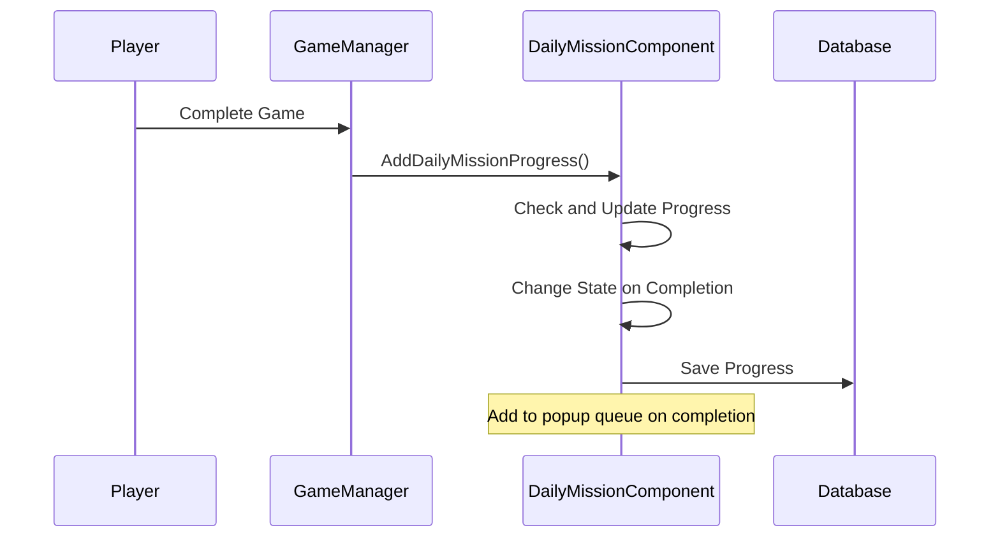

# Missions and Rewards

## Overview

A daily mission system and various reward distribution system that encourage continuous player engagement. It presents new goals daily, assists game progression through rewards upon achievement, and provides additional motivation through bonus point systems.

## Core System Structure



## 1. Daily Mission Component (DailyMissionComponent)

### Mission Data Structure

```lua
@Component
script DailyMissionComponent extends Component

    @TargetUserSync
    property SyncTable<string> MissionID           -- Mission IDs (1~3: basic, 4~6: additional)
    
    @TargetUserSync
    property SyncTable<integer> MissionProgress    -- Progress
    
    @TargetUserSync
    property SyncTable<integer> MissionState       -- State (0:in progress, 1:complete, 2:received)
    
    @TargetUserSync
    property integer BonusPoint = -1               -- Bonus points
    
    @TargetUserSync
    property integer BonusRewardReceiveState = 0   -- Bonus reward receiving stage
```

### Mission State Management

Missions are managed in 3 states:

- **0 (In Progress)**: Working towards goal achievement
- **1 (Reward Available)**: Goal achieved, waiting for reward collection
- **2 (Reward Received)**: Completed with reward received

### Daily Reset System

```lua
method void InitDailyMission()
```

All missions reset daily at UTC 0:00:

1. **Mission Refresh**: Randomly select 3 basic missions
2. **Progress Reset**: Reset all progress to 0
3. **Bonus Point Reset**: Reset bonus points and receiving state
4. **Database Save**: Permanently store changes

### Mission Progress Updates

```lua
method void AddDailyMissionProgress(string missionTypeID, integer playedLevel, integer addedValue)
```

Progress is automatically updated for specific actions during gameplay:

#### Progress Update Process

1. **Basic/Additional Mission Distinction**: Determine application scope based on basic mission completion status
2. **Mission Type Matching**: Check which mission the current action corresponds to
3. **Level Condition Verification**: Check if played level satisfies mission conditions
4. **Progress Increase**: Add addedValue to progress if conditions are met
5. **Completion Check**: Change state to "reward available" when target is reached

#### Auto-linked Missions

```lua
-- Examples called when game ends
self.Entity.DailyMissionComponent:AddDailyMissionProgress("DM10002", self.ModeLevel, 1)  -- Single mode completion
self.Entity.DailyMissionComponent:AddDailyMissionProgress("DM10015", self.ModeLevel, 1)  -- Challenge mode completion
```

### Mission Refresh System

```lua
method void RefreshMission_Check(integer missionIndex)
```

Players can refresh specific missions by consuming 1 syrup:

#### Refresh Conditions

1. **Reward Not Received**: Cannot refresh missions that already received rewards
2. **Syrup Possession**: Must have 1 or more syrup
3. **Playable Missions**: Only missions currently challengeable by the player appear

#### Smart Mission Selection

```lua
method void RefreshMission(integer missionIndex)
```

Upon refresh, only missions suitable for player's current progress are selected:

- **Single Mode**: Only missions up to cleared level + 1 appear
- **Challenge Mode**: Level 50+ and only unlocked challenges appear

### Bonus Point System

Points earned upon mission completion that provide additional rewards:

#### Bonus Reward Stages
```lua
local pointCondition = {20, 40, 60, 80, 100, 120}
```

Rewards can be received at each stage, requiring cumulative points per stage.

## 2. Daily Mission Logic (DailyMissionLogic)

### Mission Data Management

```lua
@Logic
script DailyMissionLogic extends Logic

    property SyncTable<string, string> MissionDesc           -- Mission descriptions
    property SyncTable<string, integer> MissionConditionLevel -- Required level
    property SyncTable<string, integer> MissionCondition      -- Completion condition value
    property SyncTable<string, integer> MissionRewardPoint    -- Reward points
```

### Dataset Loading

```lua
method void LoadDataSet()
```

Load mission information from DailyMission table to set localized descriptions and conditions:

- **Description Localization**: Convert mission descriptions to player language
- **Condition Parameters**: Insert dynamic values like level or count into text
- **Condition Value Setting**: Set target values for mission completion

### UI Update Management

```lua
method void UI_RefreshMissionList()
method void UI_RefreshPointArea()
```

Real-time UI updates when mission states change.

## 3. Reward Popup System

### Universal Reward Popup (UI_RewardPopup)

```lua
method void Open_N_UpdateRewardList(SyncTable<string, integer> rewards)
```

Universal popup that dynamically displays various rewards:

#### Dynamic Reward Generation Process

1. **Reward List Iteration**: Process all reward items in rewards table
2. **UI Entity Reuse**: Update content if existing entity exists, create new if not
3. **Icon and Quantity Setting**: Display icon and count for each reward
4. **Popup Activation**: Display popup after all reward settings complete

#### Reward Item UI (UI_Reward_inPopup)

```lua
method void UpdateReward(string rID, integer amount)
```

Manages visual representation of individual reward items:

- **Icon Setting**: Assign appropriate image RUID according to reward type
- **Quantity Display**: Display reward count as text
- **Tooltip Integration**: Show detailed information on mouse over

## 4. Level-up Reward System

### Level-up Popup (UI_LevelUP_Popup)

```lua
method void SetPopup(integer before, integer up, table rewardList)
```

Displays dedicated reward popup when player level increases:

#### Level-up Reward Processing

1. **Level Display**: Show previous level and post-increase level
2. **Basic Rewards**: Automatically distribute 80 syrup per level
3. **Special Rewards**: Additional rewards every 10 levels
4. **Reward Icons**: Visual distinction by reward type

#### Reward Type Processing

```lua
-- Coach rewards
if rewardType == "Coach" then
    self.Entity.CoachManager:ModifyPlayerOwnedCoachesID(rewardID, 1,"LvUp")

-- Repechage rewards  
elseif rewardType == "Repechage" then
    self:AddSyrup("Repechage_Free", rewardAmount, "LvUp")

-- Mode unlock rewards
elseif rewardInfo[1] == "ModeOpen" then
    -- Unlock Rank mode or Challenge mode
```

### PlayerLevelLogic Integration

```lua
method void SetUI_LevelUpPopup(integer beforeLevel, integer afterLevel, integer rewardSyrup, string rewardList_str)
```

Handles UI settings on level-up:

- **Popup Data Setting**: Set UI elements like level, reward information
- **Animation Presentation**: Fade-in effect over 1 second
- **Max Level Handling**: Special guidance when reaching level 500

### Level-up Presentation System

```lua
method void EnableUI_LevelUpPopup()
```

Manages visual presentation of level-up popup:

- **Alpha Animation**: Gradual appearance from 0 to 1
- **Timing Control**: Smooth animation divided into 50 steps
- **Sound Integration**: Play level-up sound

## 5. Notification System

### Red Dot System

```lua
method void SetRedDot()
```

Visually notifies mission completion or reward availability:

#### Red Dot Activation Conditions

1. **Completed Missions Exist**: When there are missions available for reward collection
2. **Bonus Points Achieved**: When next stage bonus rewards are available for collection

### Popup Queue System

```lua
_UI_AchievementPopup:InsertPopUpQueue(self.MissionID[i], 0, 2, self.Entity.OwnerId)
```

Integrates with achievement popup system to display sequential notifications upon mission completion.

## 6. Data Management System

### Database Integration

```lua
-- Save
_PlayerDataLogic:SetPlayerDailyMissionData(self.Entity.OwnerId)

-- Load  
method void OnLoadData(string data)
```

Permanently save mission progress and states to database.

#### Save Format

```lua
-- "MissionID,Progress,State/MissionID,Progress,State/MissionID,Progress,State/BonusPoints,BonusReceiveState"
local dataInfo = _UtilLogic:Split(data, "/")
local missionData = _UtilLogic:Split(dataInfo[i], ",")
```

### Real-time Synchronization

All mission data is synchronized with clients in real-time through @TargetUserSync.

## 7. Game System Integration

### Automatic Progress Updates

Various actions during gameplay are automatically reflected in mission progress:



### Mission Type Examples

- **DM10002**: Single mode completion
- **DM10015**: Challenge mode completion  
- **DM10005**: Reach level 10
- **DM10001**: Game play count

## 8. UI Slot System

### UI_DailyMission_Slot

UI slot displaying individual missions:

- **Mission Description**: Localized mission objective text
- **Progress Bar**: Visualization of current progress
- **Reward Information**: Points obtainable upon completion
- **Refresh Button**: Change mission by consuming syrup

## 9. Reward Presentation System

### Tooltip System

```lua
-- UI_LevelUpPopup_RewardButton
property string RewardTitle = ""
property string RewardDesc = ""
```

Display detailed information as tooltips when hovering over reward items.

### Animation System

Provides various visual feedback upon level-up and mission completion:

- **Fade In/Out**: Popup appearance/disappearance effects
- **Progress Bar Animation**: Display mission progress
- **Reward Icon Effects**: Special effects when obtaining rewards

## Code References

- `RootDesk/MyDesk/OutGame/DailyMission/DailyMissionComponent.mlua :: AddDailyMissionProgress()` - Mission progress updates
- `RootDesk/MyDesk/OutGame/DailyMission/DailyMissionLogic.mlua :: LoadDataSet()` - Mission data loading
- `RootDesk/MyDesk/OutGame/Reward_Popup/UI_RewardPopup.mlua :: Open_N_UpdateRewardList()` - Reward popup display
- `RootDesk/MyDesk/OutGame/UI_LevelUP_Popup.mlua :: SetPopup()` - Level-up popup setup
- `RootDesk/MyDesk/Player/PlayerLevelLogic.mlua :: SetUI_LevelUpPopup()` - Level-up UI management
