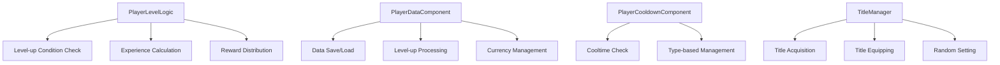

# Player Progress Management

## Overview

A system that manages the overall progress of players in out-of-game scenarios. It comprehensively handles all elements related to player growth, including player level, experience, cooldowns, and titles.

## Core Components



## 1. Level System (PlayerLevelLogic)

### Basic Structure

Player levels are managed in the range 1~500, providing differentiated experience based on game mode and difficulty.

```lua
-- PlayerLevelLogic.mlua
property integer Level_Min = 1
property integer Level_Max = 500

method integer GetRewardEXPAmount(string mode, integer level)
method integer IsLevelUpCondition(integer currentLevel, integer currentEXP)  
method integer GetRequiredEXP(integer targetLevel)
```

### Experience Gain Logic

Experience is gained according to mode and difficulty each time a game is cleared:

- Calculate mode-specific experience from EXPRewardByModeNLevel table
- Extract only the part before "_" from mode name
- Award experience only based on clear criteria

### Level-up Condition Check

Level-up is possible when current experience reaches the required experience for the next level:

- When level-up possible: Return remaining experience amount
- When level-up impossible: Return -1  
- When data error: Return -2

### Level-up UI Management

Visual display of results through UI popup on level-up:

- Display before/after levels
- Special guidance when reaching max level (500)
- Display list of acquired rewards

## 2. Player Data Management (PlayerDataComponent)

### Experience and Level Processing

```lua
method integer AddEXP(integer amount, string systemType)
```

Automatically checks level-up conditions when adding experience, and also handles multiple level-ups:

1. Add experience
2. Repeatedly check level-up conditions
3. Calculate and distribute rewards on level-up
4. Set UI popup

### Level-up Reward System

- **Basic Rewards**: 80 syrup per level
- **Special Rewards**: Additional rewards every 10 levels
  - Coach provision
  - Repechage provision
  - Reference Reward_LevelUP table

### Data Synchronization

Real-time synchronization with server DB through PlayerDataLogic:

- `GetPlayerLevelData()`: Load level data on login
- `SetPlayerLevelData()`: Save on level changes
- Data format: "Level_Experience" (e.g., "25_1500")

## 3. Cooldown Management (PlayerCooldownComponent)

### Type-based Cooldown System

Manages independent cooldowns for each action:

```lua
property table CooldownTable = {}

method boolean CheckAndSetCooldown(integer type)
method boolean CheckCooldown(integer type) 
method void SetCooldown(integer type)
```

### Cooldown Types

- `Type_CharacterShopLock = 1`: Character shop lock (0.3 seconds)
- Additional types defined in CooldownType.mlua

### Server-Client Differentiation

Server applies cooltime 0.2 seconds shorter than client to compensate for latency.

## 4. Title System (TitleManager)

### Title Components

Titles consist of 3 elements:

- **Name Tag** (NT1xxx): Player name background
- **Keyword Front** (KWFxxx): Modifier before name
- **Keyword Back** (KWBxxx): Modifier after name

### Main Functions

```lua
method void GetTitle(string TitleElementID, boolean GetBool)    -- Acquire title element
method void CheckTitleAvaliable(string titleElementID)         -- Check title equip availability
method void Random_Title()                                      -- Set random title
```

### Title Entity Management

- Create one title entity per player
- Maintain title state even when moving maps
- Real-time synchronization in multiplayer environment

### Acquisition and Achievement Integration

- Display red dot notification on title acquisition
- Integration with achievement system (AC001007: Acquire titles)
- Provide variety through random title feature

## Data Table Integration

### Essential Data Tables

- **EXPRewardByModeNLevel**: Experience reward amount by mode
- **RequiredEXP**: Required experience by level  
- **Reward_LevelUP**: Level-up reward information
- **Title_NameTagDataset**: Name tag information
- **Title_KeyWordFrontDataset**: Front keyword information
- **Title_KeyWordBackDataset**: Back keyword information

## UI Integration

### Level-related UI

- `UI_PlayerLevel`: Display player level in lobby
- `Lobby_LevelUP`: Level-up popup UI
- Real-time experience bar updates

### Title-related UI

- `UI_PlayerTitleSetting`: Title setting screen
- Visual name tag display
- Apply color and font offset

## Performance Optimization

### Caching and Optimization

- ExpTableLogic: Cache in-game experience tables
- Prevent simultaneous connection errors through timer-based delayed processing
- Optimize performance by updating UI only on level-up

## Code References

- `RootDesk/MyDesk/Player/PlayerLevelLogic.mlua :: GetRewardEXPAmount()` - Mode-specific experience calculation
- `RootDesk/MyDesk/DataStorage/PlayerDataComponent.mlua :: AddEXP()` - Experience addition and level-up
- `RootDesk/MyDesk/Player/PlayerCooldownComponent.mlua :: CheckAndSetCooldown()` - Cooldown check
- `RootDesk/MyDesk/Title/TitleManager.mlua :: GetTitle()` - Title acquisition
- `RootDesk/MyDesk/DataStorage/PlayerDataLogic.mlua :: SetPlayerLevelData()` - Level data save
