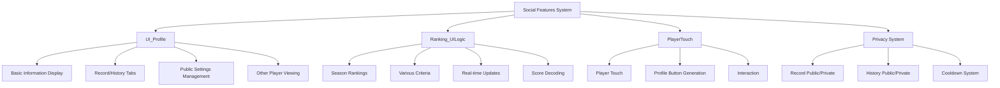

# Social Features

## Overview

A social system that supports communication and competition between players. It helps community formation through profile viewing, ranking system, and player interaction, while also providing privacy protection through privacy settings.

## Core System Structure



## 1. Profile System (UI_Profile)

### Profile Data Structure

```lua
@Logic
script UI_Profile extends Logic

    property string TargetUserID = ""                    -- Target user ID for viewing
    
    -- Record-related data
    property boolean Record_IsPublic = false             -- Record public flag
    property integer Record_HighestTier = 0              -- Highest tier
    property string Record_HighestTier_Season = ""       -- Season when highest tier achieved
    property integer Record_HighestRank = 0              -- Highest rank
    property SyncTable<string, number> Record_PlayRecords -- Play records
    
    -- History-related data
    property boolean History_IsPublic = false            -- History public flag
    property SyncTable<number, boolean> History_IsWin    -- Win/loss status
    property SyncTable<number, string> History_ModeType  -- Game mode
    property SyncTable<number, string> History_UnitInfo  -- Used units
    property SyncTable<number, string> History_RuneList  -- Rune card list
```

### Profile Data Request

```lua
method void RequestData(string userID)
```

When viewing another player's profile, collect and transfer data from server:

#### Data Collection Process

1. **Basic Information Collection**: Nickname, level, equipped title
2. **Public Setting Check**: Check record/history public status
3. **Record Data**: Provide highest tier, ranking, play statistics only when public
4. **History Data**: Provide recent game records only when public

#### Privacy Protection

```lua
if userID ~= senderUserId and playerDataCompo.Profile_Record_IsPublic == false then
    -- Send nil data if private
    self:SetData_Record(nil, nil, nil, nil, nil, nil, nil, nil, nil, nil, senderUserId)
```

Hide information when other players have set their profiles to private.

### UI Structure and Loading System

```lua
method void OnOpenUI()
```

Profile UI uses a 4-stage loading system:

#### Loading Stages

1. **Default**: Basic information (nickname, level, title)
2. **Public**: Public setting information
3. **Record**: Record tab data
4. **History**: History tab data

#### Loading Animation

```lua
-- Check loading completion (every 0.5 seconds)
-- Fade out animation (1 second) when complete
for i=1, 40 do
    _TimerService:SetTimerOnce(setLoadingPanelAlpha, i/80)
end
```

### Tab System

Profile consists of two main tabs:

#### Record Tab

- **Highest Tier**: Highest grade achieved in rank mode
- **Highest Ranking**: Highest rank by season and top percentage
- **Play Statistics**: Total games, win rate, etc.
- **Collection Progress**: Achievement, title, coach, character collection completion

#### History Tab

- **Recent Games**: Up to 10 game records
- **Game Information**: Mode, level, win/loss, reached round
- **Unit Composition**: Used characters
- **Rune Cards**: Equipped rune card list
- **Coaches**: Used coaches

## 2. Ranking System (Ranking_UILogic)

### Ranking Data Management

```lua
@Logic
script Ranking_UILogic extends Logic

    property table RankingData = {}                      -- Ranking data
    property integer RankingPageNum = 1                  -- Current page
    property string RanknigCriteriaID = ""               -- Ranking criteria
```

### Real-time Update System

```lua
method void OnUpdate(number delta)
```

Ranking information is automatically updated:

- **Season Remaining Time**: Update every 1 second
- **Ranking Data**: Refresh from server every 3 minutes (180 seconds)

### Various Ranking Criteria

```lua
method table ScoreDecoder(integer score, string criterialID)
```

Rankings are made based on different criteria each season:

#### Ranking Criteria Types

- **CT10001**: Short play time (fast clear)
- **CT10002**: Single unit maximum damage dealt
- **CT10003**: Single unit maximum damage taken  
- **CT10004**: Total survival count across rounds
- **CT10005**: Final team value (battlefield)
- **CT10006**: Total rune card value
- **CT10007**: Remaining heart count
- **CT10008**: Number of activated synergies
- **CT10009**: Gold remaining after game
- **CT10010**: Number of completed items

### Score Encoding/Decoding

Ranking scores compress composite information into a single number for storage:

```lua
-- Score structure: [RankLevel(2,500,000)] + [StageRound(100,000)] + [AdditionalCriteria]
rankingInfo["RankLevel"] = score // 2500000
local stageRound = (score % 2500000) // 100000 - 1
local remainder = score % 100000
```

### Pagination System

```lua
method void SetRankingPage(integer pageNum)
```

Display large amounts of ranking data in pages to optimize performance.

## 3. Player Interaction System

### Player Touch Event (PlayerTouch)

```lua
@Component
script PlayerTouch extends Component

    @EventSender("Self")
    handler HandleTouchEvent(TouchEvent event)
```

Handles basic processing when other players are clicked.

### Dynamic Profile Button Generation (ProfileButtonClick)

```lua
@EventSender("Model", "defaultplayer")
handler HandlePlayerTouchEvent(PlayerTouchEvent event)
```

Dynamically creates profile button when player is touched:

#### Button Generation Logic

```lua
if self.Entity.Enable then -- When button is active
    if self.CurrentTargetEntity == TouchedUserEntity then  
        -- Deactivate button on same player re-click
        self.CurrentTargetEntity = nil
        self.Entity:SetEnable(false)
    else 
        -- Change text on different player click
        self.Entity.TextComponent.Text = string.format("View %s's Profile", TouchedUserEntity.NameTagComponent.Name)
        self.CurrentTargetEntity = TouchedUserEntity
    end
else 
    -- Newly activate button
    self.Entity.TextComponent.Text = string.format("View %s's Profile", TouchedUserEntity.NameTagComponent.Name)
    self.CurrentTargetEntity = TouchedUserEntity
    self.Entity:SetEnable(true)
end
```

### Coach Interaction

```lua
-- CoachMoveComponent :: Interaction()
method void Interaction()
```

Interaction with companion coaches is also part of social elements:

- **Random Reactions**: Randomly select from 4 interaction animations
- **Cooltime System**: 3-second cooldown to prevent abuse
- **Auto Sleep**: Sleep mode after 100 seconds of non-interaction

## 4. Privacy Settings System

### Public Setting Data

```lua
-- PlayerDataComponent
@TargetUserSync
property boolean Profile_Record_IsPublic = false         -- Record public flag

@TargetUserSync
property boolean Profile_History_IsPublic = false        -- History public flag
```

Players can set records and history to public/private independently.

### Public Setting Changes

```lua
handler HandleButtonClickEvent2(ButtonClickEvent event)   -- Record public setting
handler HandleButtonClickEvent3(ButtonClickEvent event)   -- History public setting
```

#### Change Process

1. **Permission Verification**: Check if it's own profile
2. **Setting Toggle**: Change to opposite of current state
3. **Immediate UI Reflection**: Update checkbox state
4. **Cooldown Check**: Verify 3-second cooldown
5. **Server Transmission**: Request setting change

#### Cooldown System

```lua
-- Only 1 request allowed per 3 seconds
self.IsPublicChangeCooldown = true
_TimerService:SetTimerOnce(function()
    self.IsPublicChangeCooldown = false
end, 3)
```

Apply 3-second cooldown to prevent indiscriminate setting changes.

### Database Storage

```lua
method void SetPlayerProfileIsPublicData(string userID)
method void GetPlayerProfileIsPublicData(string userID)
```

Public settings are permanently stored in database and maintained on next login:

```lua
-- Save format: "RecordPublic_HistoryPublic"
local isPublicData = string.format("%s_%s", 
    playerDataComponent.Profile_Record_IsPublic, 
    playerDataComponent.Profile_History_IsPublic)
```

## 5. Game History System

### Automatic Record Collection

Automatically recorded to profile history when game ends:

```lua
-- PlayerDataComponent history properties
property SyncTable<number, boolean> Profile_IsWin        -- Win/loss
property SyncTable<number, string> Profile_ModeType      -- Mode
property SyncTable<number, number> Profile_ModeLevel     -- Level  
property SyncTable<number, string> Profile_LastRound     -- Reached round
property SyncTable<number, string> Profile_UnitInfo      -- Unit composition
property SyncTable<number, string> Profile_RuneList      -- Rune cards
property SyncTable<number, string> Profile_CoachList     -- Coaches
```

### History Limits

Store only the most recent 10 game records to manage data size.

## 6. UI Integration System

### Tab Component Integration

```lua
self.UI_TabList.TabComponent:ChangeTab(1)  -- Show Record page by default
```

Profile UI uses tab system to separately display records and history.

### Dynamic UI Generation

UI elements are dynamically generated or hidden according to profile information:

- **Private Panel**: Show "Private" message when set to private
- **Public Setting Button**: Display only on own profile
- **No Data**: Display "NoRecord" when no records exist

### Icon and Resource Management

Dynamically assign corresponding icon RUIDs by ranking, tier, and mode to provide visual information.

## 7. Multiplayer Synchronization

### Real-time Information Sync

Profile-related information is synchronized in real-time through @TargetUserSync:

- Immediate reflection on level changes
- Immediate reflection on title changes  
- Immediate reflection when game records are added

### Server-Client Communication

Profile viewing provides only server-verified data to maintain security.

## 8. Performance Optimization

### Data Caching

```lua
property SyncTable<string, boolean> IsLoadComplete
```

Track loading states to prevent duplicate requests.

### Pagination Processing

Ranking data is loaded in pages to optimize memory usage.

### Timer Management

Properly clean up unnecessary timers to prevent performance degradation:

```lua
_TimerService:ClearTimer(timerID)
```

## Code References

- `RootDesk/MyDesk/OutGame/Profile/UI_Profile.mlua :: RequestData()` - Profile data request
- `RootDesk/MyDesk/OutGame/Ranking/Ranking_UILogic.mlua :: GetRankingData()` - Ranking data collection
- `RootDesk/MyDesk/OutGame/Profile/ProfileButtonClick.mlua :: HandlePlayerTouchEvent()` - Player touch handling
- `RootDesk/MyDesk/DataStorage/PlayerDataLogic.mlua :: SetPlayerProfileIsPublicData()` - Privacy setting storage
- `RootDesk/MyDesk/OutGame/Profile/PlayerTouch.mlua :: HandleTouchEvent()` - Player interaction
