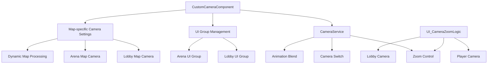

# Camera System

## Overview

MetoChess's Camera System handles map-specific camera settings and UI group management in an integrated manner centered on **CustomCameraComponent**. Based on MapleStory Worlds' **CameraService**, it automatically applies appropriate camera and UI settings during map transitions, and also provides special camera effects through zoom functionality in the lobby.

## System Structure

### Core Component Relationship Diagram



## Map-specific Camera Control

### CustomCameraComponent Core Functions

**CustomCameraComponent** automatically executes on map entry to apply camera and UI settings appropriate for the current map.

#### Lobby Map Settings
```lua
-- CustomCameraComponent :: OnBeginPlay()
if currentMapName == "Lobby" then
    -- Activate lobby UI
    ui_lobbyHUD.Enable = true
    ui_lobbycurrencyHUD.Enable = true
    
    -- Deactivate arena UI  
    ui_arena_Default.Enable = false
    ui_arena_Ready.Enable = false
    ui_arena_battle.Enable = false
    ui_gameResult.Enable = false
```

#### Arena/Dynamic Map Settings
```lua
-- When entering dynamic maps (Arena, Field)
elseif self.Entity.CurrentMap.MapComponent.IsDynamicMap == true then
    -- Deactivate lobby UI
    ui_lobbyHUD.Enable = false
    ui_lobbyLevelSelect.Enable = false
    ui_lobbycurrencyHUD.Enable = false
    
    -- Activate arena UI
    ui_arena_Default.Enable = true  
    ui_arena_Ready.Enable = true
    
    -- Initialize tile system
    _UnitSetLogic_New:SettingTile(self.Entity.CurrentMap)
```

### UI Group Classification

| UI Group | Active Map | Main Functions |
|----------|------------|----------------|
| **ui_lobbyHUD** | Lobby | Lobby main interface, navigation |
| **ui_lobbycurrencyHUD** | Lobby | Currency display, animation |
| **ui_lobbyLevelSelect** | Lobby | Game mode selection screen |
| **ui_arena_Default** | Arena/Field | Arena basic layout |
| **ui_arena_Ready** | Arena/Field | Preparation phase UI (unit placement, shop) |
| **ui_arena_battle** | Arena/Field | Battle progress UI (real-time information) |
| **ui_gameResult** | Arena/Field | Game result screen |

## Camera Switch System

### CameraService Utilization

Implements smooth camera transitions through MapleStory Worlds' **CameraService**:

#### Basic Camera Switch
```lua
-- Switch to map camera
_CameraService:SwitchCameraTo(self.Entity.CameraComponent)

-- Blend settings
_CameraService.TransitionBlendType = CameraBlendType.EaseInOut
_CameraService.TransitionBlendTime = 2.0
```

#### CameraService Main Functions
- **SwitchCameraTo()**: Switch to target camera
- **ZoomTo()**: Animate to specific zoom level 
- **ZoomReset()**: Reset zoom
- **ShakeCamera()**: Camera shake effect

### Camera Property Control

**CameraComponent** main settings:

```lua
-- Basic camera settings
CameraOffset: Vector2(0, 0)          -- Camera offset
ZoomRatio: 100                       -- Default zoom ratio  
ZoomRatioMin/Max: 30~500            -- Zoom range
ConfineCameraArea: true              -- Map area constraint
IsAllowZoomInOut: false              -- Zoom permission

-- Tracking settings
DeadZone: Vector2(0.052, 0.080)     -- Dead zone area
SoftZone: Vector2(0.268, 0.750)     -- Soft zone area  
Damping: Vector2(2.5, 5.0)          -- Camera damping
```

## Lobby Zoom System

### UI_CameraZoomLogic Functions

**UI_CameraZoomLogic** providing special zoom effects in the lobby:

#### Zoom Toggle Mechanism
```lua
-- UI_CameraZoomLogic :: Zoom()
if self.zoomed == false then
    -- Zoom in to player camera
    _CameraService:SwitchCameraTo(camera)
    camera.Entity.MovementComponent.Enable = false  -- Disable movement
    self.zoomed = true
else
    -- Zoom out to lobby camera  
    _CameraService:SwitchCameraTo(self.Lobby.CameraComponent)
    camera.Entity.MovementComponent.Enable = true   -- Enable movement
    self.zoomed = false
end
```

#### Zoom Settings
- **TransitionBlendType**: Cut (instant switch)
- **TransitionBlendTime**: 0 (no animation)
- **Movement Restriction**: Disable character movement in zoom-in state

## Camera Integration by Game Phase

### Integration with GameManager

The camera system also integrates with **GameManager** phase transitions:

#### Ready Phase Camera Settings
```lua  
-- GameManager :: Ready_OnClient()
self.UIGroup_ReadyPhase.Enable = true
self.UIGroup_BattlePhase.Enable = false

-- Integration with Progress UI animation
local ui_progressBar = _EntityService:GetEntityByPath("/ui/Arena_Default/Progress")
ui_progressBar.UITweenScale:Play()
```

#### Battle Phase UI Transition
During phase changes, UI groups configured by **CustomCameraComponent** are precisely controlled by **GameManager**.

### Tutorial Integration

**UI_TutorialLogic** also utilizes camera zoom:

```lua
-- Zoom effects by tutorial phase
_CameraService:ZoomTo(350, 0.25)  -- Zoom in (350%, 0.25 seconds)
_CameraService:ZoomTo(80, 1)      -- Zoom out (80%, 1 second)
```

## Camera Optimization

### Camera Material System

Camera material support for special effects like blur:
- **CameraMaterial_Blur002.material**: Material for blur effects
- **ChangeMaterial()**: Real-time material changes

### Performance Considerations

1. **UI Group Unit Management**: Activate/deactivate by group units, not individual UI
2. **Instant Switch**: Lobby zoom uses Cut mode for performance priority
3. **Conditional Activation**: Selective feature activation by map type

## Expandability

### When Adding New Maps

Add new map processing logic to **CustomCameraComponent**:
```lua
elseif currentMapName == "NewMap" then
    -- New map-specific UI settings
    ui_newMap_UI.Enable = true
    -- Deactivate existing UI
    ui_lobbyHUD.Enable = false
```

### Camera Event Extension

Additional features can be implemented using **CameraSwitchEvent**, **CameraZoomEndEvent**, etc.

## Code References

### Core Camera System
- `RootDesk/MyDesk/InGame/CustomCameraComponent.mlua :: OnBeginPlay()` — Map-specific camera initialization
- `RootDesk/MyDesk/UIComponents/UI_CameraZoomLogic.mlua :: Zoom()` — Lobby zoom toggle

### MSW Native System  
- `Environment/NativeScripts/Service/CameraService.d.mlua :: SwitchCameraTo()` — Camera switching
- `Environment/NativeScripts/Component/CameraComponent.d.mlua` — Camera component definition

### UI System Integration
- `RootDesk/MyDesk/InGame/Managers/GameManager.mlua :: Ready_OnClient()` — UI group control
- `RootDesk/MyDesk/UIComponents/UI_TutorialLogic.mlua` — Tutorial zoom effects

Through this camera system, MetoChess provides optimized visual experiences for each map and implements camera control perfectly integrated with the user interface.
