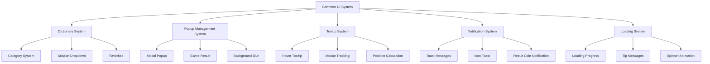
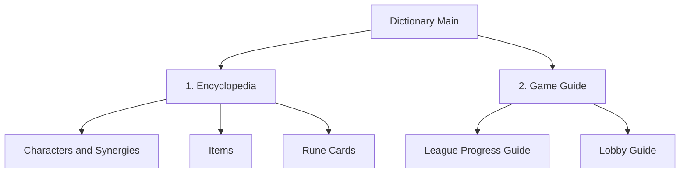

# Common UI System

## Overview

MetoChess's Common UI System manages interface elements shared throughout the game such as **popups**, **tooltips**, **notifications**, and **loading**. From the Dictionary's encyclopedia to the GameResultGroup's result screen, HoverPopupGroup's contextual tooltips, and ToastGroup's feedback messages, it provides a comprehensive universal UI framework that ensures a consistent user experience.

## System Structure

### Common UI Architecture



## 1. Dictionary System - Encyclopedia

### Multi-layer Category Structure

**DictionaryManager** manages a 3-level hierarchy encyclopedia structure.

#### Category System
```lua
-- DictionaryManager :: Initialize()
self.ShowingPageIndex["Default"] = 1      -- Primary: Dictionary/Guide
self.ShowingPageIndex["1"] = 1            -- Secondary: Characters/Items/Rune Cards
self.ShowingPageIndex["1_1"] = 1          -- Tertiary: By Synergy/Type/Grade
self.ShowingPageIndex["1_2"] = 1          
self.ShowingPageIndex["1_3"] = 1          
self.ShowingPageIndex["2"] = 1            -- Secondary: Guide 
self.ShowingPageIndex["2_1"] = 1          -- Tertiary: League/Lobby Rules
self.ShowingPageIndex["2_2"] = 1
```

#### Primary Category System


### UI Panel Management

**DictionaryManager** manages UI entities by panel:

```lua
-- DictionaryManager main UI entities
property Entity UI_Dictionary = "fe246253-c976-4abe-9cb0-ba3b32a59366"
property Entity UI_CharListPanel = "ae92af29-481e-4087-8f59-0e2f3aab1d68"
property Entity UI_ItemListPanel = "fec85286-f6bd-4a0f-9c0b-6af1bcd27ffa" 
property Entity UI_RuneListPanel = "4810457e-6c2b-4ca2-a6cc-417d98bba628"
property Entity UI_GameGuidePanel = "8723e575-1248-490a-97a6-2326fc92de16"
property Entity UI_CharInfoPanel = "bbfeb059-9cf2-4595-aa90-baed65982ddb"
property Entity UI_SynergyInfoPanel = "da6cc3bb-da92-4e51-afbb-1b9cf7e97a56"
```

#### Tab Switching System
```lua
-- DictionaryManager :: OnSelectCategory_1st()
-- Change tab button state on primary category selection
if idx == categoryIdx then
    ui_tabButton.SpriteGUIRendererComponent.Color = Color.FromHexCode("#233450")
    ui_tabButton.TextComponent.FontColor = Color.FromHexCode("#FFFFFF")
else
    ui_tabButton.SpriteGUIRendererComponent.Color = Color.FromHexCode("#253c5f")
    ui_tabButton.TextComponent.FontColor = Color.FromHexCode("#6078b8")
end
```

### Season Dropdown System

#### Season List Management
```lua
property SyncTable<string> SeasonList          -- Season list
property string NowShowingSeason = "1.0"       -- Currently displayed season
property Entity UI_SelectSeasonList            -- Season selection dropdown
```

#### Season-based Filtering
Filtering season-specific content in cooperation with **DictionaryDataManager**:
- Characters: Character list appearing by season
- Items: Items added/changed by season
- Rune Cards: Rune card pool by season

### Favorites System

Cooperation with **DictionaryFavoriteListManager**:
```lua
-- DictionaryManager :: OnOpenDictionary()
_DictionaryFavoriteListManager:Update_FavoriteUI("Character", fave_CharList)
_DictionaryFavoriteListManager:Update_FavoriteUI("Item", fave_itemList)  
_DictionaryFavoriteListManager:Update_FavoriteUI("RuneCard", fave_RunecardList)
```

## 2. Popup Management System

### UIPopup - Universal Modal Popup

**UIPopup** is a universal popup used in all situations requiring confirmation/cancellation.

#### Popup Structure
```lua
-- UIPopup main components  
property TextComponent message = "PopupMessage"      -- Popup message
property ButtonComponent btnOk = "PopupBtnOK"       -- OK button
property ButtonComponent btnCancel = "PopupBtnCancel" -- Cancel button
property Entity popupGroup = "PopupGroup"           -- Popup group
```

#### Popup Display System
```lua
-- UIPopup :: Open()
method void Open(string message, any onOk, any onCancel)
    if self.isOpen == true then return end
    
    self.isOpen = true
    self.popupGroup.Enable = true
    self.message.Text = message
    self.onOk = onOk
    self.onCancel = onCancel
    
    -- Connect event handlers
    self.okHandler = self.btnOk.Entity:ConnectEvent(ButtonClickEvent, self.OnClickOk)
    self.cancelHandler = self.btnCancel.Entity:ConnectEvent(ButtonClickEvent, self.OnClickCancel)
    
    self:StartTween(true)  -- Entrance animation
end
```

#### Tween Animation
```lua
-- UIPopup :: StartTween()
property number duration = 0.15    -- Animation duration
property number from = 0.5         -- Start scale
property number to = 1             -- End scale
```

### GameResultGroup - Game Result Display

**GameResultGroup** displays victory/defeat results at game end.

#### Components
```lua
-- GameResultGroup.ui main entities
GameResultPanel/
├── Particle_light        -- Light particle effect
├── Particle_Fog          -- Fog particle effect  
├── Background            -- Background image
├── Title                 -- Victory/defeat title
└── Message               -- Result message
```

#### Result-specific Effects
- **Victory**: Spectacular effects with light particles
- **Defeat**: Subtle fog effects with calm tones
- **Animation**: Fade in/out through CanvasGroupComponent

## 3. Tooltip System

### UI_Tooltip - Integrated Tooltip Management

**UI_Tooltip** is a core system that manages all hover information in the game.

#### Tooltip Type Management
```lua
-- UI_Tooltip main UI entities
property Entity UI_ItemInfo           -- Item information tooltip
property Entity UI_RuneInfo           -- Rune card information tooltip  
property Entity UI_SynergyInfo        -- Synergy information tooltip
property Entity UI_CharShopInfo       -- Character shop tooltip
property Entity UI_SkillInfo          -- Skill information tooltip
```

#### Mouse Tracking System
```lua
-- UI_Tooltip :: OnUpdate() - Real-time mouse position tracking
if self.RealtimeUpdateShowType == "ItemEquip" then
    local mousePos = _InputService:GetCursorPosition()
    local targetPos = _Util:ScreenPostoUIPos(mousePos)
    
    self.UI_ItemInfo.UITransformComponent.anchoredPosition = Vector2(
        -960 + targetPos.x + 0.5 * self.UI_ItemInfo.UITransformComponent.RectSize.x,
        -540 + targetPos.y - 0.5 * self.UI_ItemInfo.UITransformComponent.RectSize.y
    )
end
```

#### Contextual Position Calculation

**UI_Tooltip** calculates optimal positions based on context and UI type:

```lua
-- Synergy info tooltip position setting
if type == "unitInfo" then  -- Based on unit info window
    local ui_unitInfo = _EntityService:GetEntityByPath("/ui/UnitInfoPopupGroup/Popup_UnitInfo")
    local targetX = ui_unitInfo.UITransformComponent.anchoredPosition.x - ui_unitInfo.UITransformComponent.RectSize.x
    hoverUI.UITransformComponent.anchoredPosition = Vector2(targetX - 4, 2.5)
    
elseif type == "hud" then   -- Based on HUD
    if targetTeam == "User" then     -- Top-left
        hoverUI.UITransformComponent.anchoredPosition = Vector2(-960 + 250, 110)
    elseif targetTeam == "Enemy" then -- Top-right  
        hoverUI.UITransformComponent.anchoredPosition = Vector2(960 - 250, 110)
    end
end
```

#### Screen Boundary Handling
```lua
-- Monitor screen boundary constraints
if targetPos.x + 0.5 * rectSize.x > 960 then
    targetPos.x = 960 - 0.5 * rectSize.x
end

if targetPos.y - 0.5 * rectSize.y < -540 then
    targetPos.y = -540 + 0.5 * rectSize.y
end
```

### UI_ActivateTooltipOnMouseHover - Simple Tooltip

Universal component for **simple hover tooltips**:

```lua
-- UI_ActivateTooltipOnMouseHover settings
property Entity TooltipUI = nil       -- Tooltip UI to activate
property boolean PositionUpdate       -- Real-time position update flag
property Vector2 Anchor = Vector2(0,0) -- Anchor position
property Vector2 AnchoredPosition     -- Offset position
```

#### Automatic Position Calculation
```lua
-- OnUpdate() real-time position update
if self.PositionUpdate == true and self.TooltipUI.Enable then
    self.TooltipUI.UITransformComponent.anchoredPosition = Vector2(
        960 * self.Anchor.x + self.AnchoredPosition.x - self.Anchor.x * self.TooltipUI.UITransformComponent.RectSize.x * 0.5,
        540 * self.Anchor.y + self.AnchoredPosition.y - self.Anchor.y * self.TooltipUI.UITransformComponent.RectSize.y * 0.5
    )
end
```

## 4. Notification System

### UIToast - Toast Messages

**UIToast** handles all feedback messages in the game.

#### Toast Display System
```lua
-- UIToast core properties
property TextComponent message         -- Message text
property Entity toastGroup            -- Toast group
property number duration = 2          -- Display duration
property number tweenDuration = 0.1   -- Animation duration
```

#### Animation System
```lua
-- UIToast :: StartTween() - Fade in/out animation
local tween = function()
    if time >= (self.duration + self.tweenDuration) then    
        self.toastGroup.Enable = false  -- End toast
    else
        if time > self.duration then    
            alpha = alpha - delta / self.tweenDuration  -- Fade out
        else
            alpha = alpha + delta / self.tweenDuration  -- Fade in
        end
    end
    
    canvasGroup.GroupAlpha = alpha
    -- Position animation (disappear while moving up)
    local tweenValue = _TweenLogic:Ease(0, 1, 1, EaseType.SineEaseIn, alpha)
    transform.anchoredPosition = Vector2(0, -self.offset * tweenValue)
end
```

#### Localization Support
```lua
-- UIToast :: ShowMessageByLocalizingKey()
method void ShowMessageByLocalizingKey(string messageCode)
    local localizedMessage = _LocalizationService:GetText(messageCode)
    self:ShowMessage(localizedMessage)
end
```

### Icon Toast System

Special icon toast through **RuneCardDirector**:

#### Preparation Phase Toast
```lua
-- RuneCardDirector :: IconToastDirector_Ready()
local toastclone = toastUI:Clone("IconToast")
toastclone.UITransformComponent.WorldPosition = worldpos:Clone()

-- Icon and text setup
toastclone:GetChildByName("Value"):GetChildByName("Icon").SpriteGUIRendererComponent.ImageRUID = RUID
toastclone:GetChildByName("Value").TextComponent.Text = value

-- Position and animation
toastclone.UITweenPosition.from = toastclone.UITransformComponent.anchoredPosition:Clone()
toastclone.UITweenPosition.to = Vector2(from.x, from.y + 30)  -- Move up 30px
toastclone.UITweenPosition:Play()
```

#### Result Coin Toast
```lua
-- GeneralDirectorLogic :: ShowResultCoins() - Battle result reward toast
for ID, Coins in pairs(self.ResultCoin) do
    local toastUI_Clone = toastUI:Clone("ToastUI")
    toastUI_Clone.TextComponent.Text = name.."+"..tostring(math.floor(Coins))
    
    -- Sequential display (0.4 second intervals)
    _TimerService:SetTimerOnce(showUI, timer)
    timer += 0.4
end
```

## 5. Loading System

### LoadingGroup - Loading Screen Management

Integrated loading system through **LoadingManager** and **UI_Loading** (covered in detail in the Loading System document):

#### Main Features
- **Progress Display**: Real-time loading progress updates
- **Tip Messages**: Game tips rotating every 5 seconds
- **Spinner Animation**: Multi-dot animation
- **BGM Fade**: BGM control at loading start/completion

## 6. Modal Handling and Background Management

### Background Blur System

Blur background during popup display to enhance user focus:

```lua
-- PopupGroup.ui structure
PopupGroup/
├── PopupBack            -- Semi-transparent background overlay
│   └── PopupPanel      -- Popup panel
│       ├── PopupMessage -- Message text
│       ├── PopupBtnOK  -- OK button
│       └── PopupBtnCancel -- Cancel button
```

### Stack Management System

Priority management when multiple popups appear simultaneously:
- **Top-level Popup**: Latest opened popup stays on top
- **Modal Handling**: Lower popups disabled until upper popup closes
- **ESC Key Handling**: Close sequentially from top-level popup

## 7. Message Queue and Time Management

### Toast Message Queuing

Queue management when multiple toasts are requested simultaneously:
- **60fps Timer**: High-frequency updates for smooth animation
- **Message Duplication Prevention**: Prevent consecutive display of identical messages
- **Auto Cleanup**: Automatic resource cleanup after animation completion

### Real-time Update Management

**UI_Tooltip** real-time update system:
```lua
-- UI_Tooltip :: OnUpdate() - 60fps real-time update
if self.RealtimeUpdateTargetUI ~= nil and self.RealtimeUpdateTargetUI.Enable then
    self:OnUpdate_RealtimePosition()
end
```

## Code References

### Dictionary System
- `ui/Dictionary.ui` — Dictionary main screen entity composition
- `RootDesk/MyDesk/Dictionary/DictionaryManager.mlua :: OnSelectCategory_1st()` — Category switching
- `RootDesk/MyDesk/Dictionary/DictionaryManager.mlua :: Initialize()` — Dictionary initialization

### Popup Management
- `ui/PopupGroup.ui` — Universal popup entity composition
- `ui/GameResultGroup.ui` — Game result screen composition
- `RootDesk/MyDesk/UIPopup.mlua :: Open()` — Popup display system
- `RootDesk/MyDesk/UIPopup.mlua :: StartTween()` — Popup animation

### Tooltip System
- `ui/HoverPopupGroup.ui` — Hover popup entity composition
- `RootDesk/MyDesk/UIComponents/UI_Tooltip.mlua :: OnUpdate_RealtimePosition()` — Real-time position calculation
- `RootDesk/MyDesk/UIComponents/UI_Common/UI_ActivateTooltipOnMouseHover.mlua` — Simple hover tooltip

### Notification System
- `ui/ToastGroup.ui` — Toast message entity composition
- `RootDesk/MyDesk/UIToast.mlua :: ShowMessage()` — Toast display
- `RootDesk/MyDesk/UIToast.mlua :: StartTween()` — Toast animation
- `RootDesk/MyDesk/EffectFolder/Logic/RuneCardDirector.mlua :: IconToastDirector_Ready()` — Icon toast

### Loading System
- `ui/LoadingGroup.ui` — Loading screen entity composition  
- `RootDesk/MyDesk/UIComponents/LoadingUI/LoadingManager.mlua` — Loading progress management
- `RootDesk/MyDesk/UIComponents/LoadingUI/UI_Loading.mlua` — Loading UI control

Through this systematic common UI system, MetoChess provides a consistent user interface experience throughout the game, implementing an intuitive and user-friendly game environment through appropriate feedback and information display for each situation.
