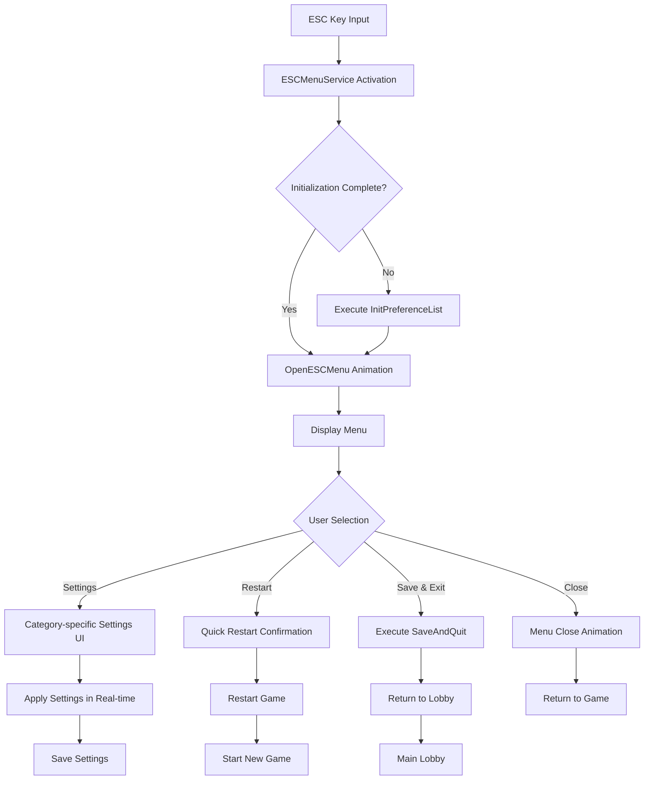

# UI Management - ESC Menu System

## Overview
MetoChess's ESC menu system is a core UI management system that provides integrated in-game pause menus, settings management, and shortcut systems centered around the `ESCMenuService`. It centrally manages all necessary setting changes and convenience features during gameplay to provide a consistent user experience.

## Core Component Structure

### ESCMenuService - Main Menu Management System

#### Main UI Entities
```lua
property Entity UI_MenuGroup        -- Main menu group
property Entity UI_Background       -- Background overlay  
property Entity UI_ESCMenu          -- Main ESC menu
property Entity UI_Setting          -- Settings page
property Entity UI_GameModeInfo     -- Game mode info
property Entity UI_PreferencePage   -- Preferences page
property Entity UI_ConfirmPopup     -- Confirmation popup
property Entity UI_ShortcutPopup    -- Shortcut popup
property Entity UI_QuickRestartButton -- Quick restart button
```

#### State Management Properties
```lua
property boolean ItsOn = false                          -- Menu activation state
property boolean Open = false                           -- Current open/close state
property number skillEffectAlpha = 100                  -- Skill effect opacity
property string Setting_ShowingCategory = "ShortcutKey" -- Current settings category
```

## Menu Animation System

### Open/Close Animation
```lua
-- OpenESCMenu() - Display menu with smooth animation
method void OpenESCMenu(boolean enable)
    if enable == true then
        -- Open animation: slide down from top
        local move = function()
            t += 1/40
            self.UI_ESCMenu.UITransformComponent.anchoredPosition.y = 
                _TweenLogic:Ease(1200, 0, 1, EaseType.BackEaseOut, t)
        end
        self._T.TimerID = _TimerService:SetTimerRepeat(move, 1/80, 0)
    else
        -- Close animation: slide up to top
        local move = function()
            self.UI_ESCMenu.UITransformComponent.anchoredPosition.y = 
                _TweenLogic:Ease(0, 1200, 1, EaseType.BackEaseOut, t)
        end
    end
end
```

### Animation Characteristics
- **BackEaseOut**: Smooth and natural easing effect
- **Timing Control**: 40-frame animation at 1/80 second intervals
- **Asynchronous Processing**: Non-blocking animation based on timers

## Settings System

### Dynamic Settings Loading
```lua
-- InitPreferenceList() - Dynamic settings UI generation based on CSV data
method void InitPreferenceList()
    local prefDataset = _DataService:GetTable("PreferenceList")
    
    for i=1, prefDataset:GetRowCount() do
        local optionName = prefDataset:GetRow(i):GetItem("Act")
        local optionType = prefDataset:GetRow(i):GetItem("Type")
        local defaultValue = prefDataset:GetRow(i):GetItem("DefaultSet")
        
        -- Create UI by setting type
        if optionType == "CheckBox" then
            -- Checkbox type setting
        elseif optionType == "Slider" then
            -- Slider type setting
        end
    end
end
```

### Supported Setting Types

#### CheckBox Type Settings
- **AchievementPopup**: Enable/disable achievement popup
- **BattleWaitingTime**: Skip battle waiting time option
- **CoinObtainEffect**: Toggle coin acquisition animation

```lua
-- Checkbox click event handling
checkbox:ConnectEvent(ButtonClickEvent, function(event)
    if optionName == "AchievementPopup" then
        _UI_AchievementPopup.isActivated = not _UI_AchievementPopup.isActivated
    elseif optionName == "BattleWaitingTime" then
        battleStartButton.ArenaUI_BattleStartButton.SkipWaitingTime = 
            not battleStartButton.ArenaUI_BattleStartButton.SkipWaitingTime
    elseif optionName == "CoinObtainEffect" then
        _GeneralDirectorLogic.IsCoinAnimationOn = not _GeneralDirectorLogic.IsCoinAnimationOn
    end
    
    -- Update checkbox visual state
    button.SpriteGUIRendererComponent.ImageRUID = activated and 
        "b84c0a94f4e7f13478fb731495ae84ad" or "9fd67813972dc5642b6563c6903583c8"
end)
```

#### Slider Type Settings
- **SkillEffectOpacity**: Adjust skill effect opacity
- **BGMVolume**: Background music volume control
- **SFXVolume**: Sound effect volume control

```lua
-- Slider value change event handling
slideBar:ConnectEvent(SliderValueChangedEvent, function(event)
    if optionName == "SkillEffectOpacity" then
        self.skillEffectAlpha = slideBar.SliderComponent.Value
    elseif optionName == "BGMVolume" then
        _PlaySoundLogic.BGMVolume = slideBar.SliderComponent.Value
    elseif optionName == "SFXVolume" then
        _PlaySoundLogic.SFXVolume = slideBar.SliderComponent.Value
    end
end)
```

## Shortcut System

### Shortcut Mapping Structure
```lua
-- Shortcut definitions based on ShortCutList.csv
Act,DefaultKey
RerollCharShop,D        -- Character shop refresh
BuyEXP,F               -- Buy experience
RerollRuneShop,R       -- Rune shop refresh
SellChar,E             -- Sell character
LockCharShop,T         -- Lock character shop
BattleStart,Space      -- Start battle
BuyCharShop1-5,Alpha1-5 -- Character shop purchase
BuyItemShop1-2,Alpha6-7 -- Item shop purchase
BuyRuneShop1-2,Alpha8-9 -- Rune shop purchase
Dictionary,Equals      -- Open dictionary
Statistics,Minus       -- Open statistics
```

### Keyboard Key Name Conversion
```lua
-- Key name shortening based on KeyboardKeyShorten.csv
Escape → ESC
Backspace → Back
Return → ↵
Space → Space
Alpha0-9 → 0-9
LeftShift → L-Shift
RightShift → R-Shift
```

## Game Control Functions

### Save and Quit System
```lua
-- SaveAndQuit() - Save game state and return to lobby
method void SaveAndQuit()
    local gameManager = user.GameManager
    
    if gameManager.PhaseType ~= "End" then
        -- Normal exit available state
        self:OpenESCMenu(false)
        user.LoadingManager:SetEnableUI(true)
        
        -- Move to lobby after 1 second
        _TimerService:SetTimerOnce(function()
            gameManager:MoveToLobby("SaveAndExit")
        end, 1)
    else
        -- Exit not possible state - show toast message
        _UIToast:ShowMessageByLocalizingKey("Toast_SaveError")
    end
end
```

### Quick Restart System
```lua
-- Game restart (including challenge mode limit check)
if string.sub(user.GameManager.ModeType, 1, 9) == "Challenge" then
    local leftTryCount = user.PlayerDataComponent.ChallengeMode_LeftTryCount
    if leftTryCount < 1 then
        _UIToast:ShowMessageByLocalizingKey("ExhaustAllTryChange")
        return
    end
end

user.GameManager:RestartArena()
```

### Settings Reset System
```lua
-- ResetSetting() - Restore all settings to default values
method void ResetSetting()
    local prefDataset = _DataService:GetTable("PreferenceList")
    
    for i=1, prefList.Children.Count do
        local dataRow = prefDataset:GetRow(i)
        local defaultValue = dataRow:GetItem("DefaultSet")
        local optionName = dataRow:GetItem("Act")
        
        -- Apply default values for each setting
        if optionName == "SkillEffectOpacity" then
            ui_line:GetChildByName("SlideBar").SliderComponent.Value = 100
        elseif optionName == "BGMVolume" then
            ui_line:GetChildByName("SlideBar").SliderComponent.Value = 1
            _PlaySoundLogic.BGMVolume = 1
        -- Other settings...
    end
end
```

## Category-Based Settings Management

### Settings Category System
```lua
-- Tab change event handling
local settingCategory = {
    [1] = "ShortcutKey",  -- Shortcut settings
    [2] = "Preference",   -- Preference settings
}
self.Setting_ShowingCategory = settingCategory[ChangedIdx]

-- Update tab UI state
for i=1, #ui_tab.Children do
    local ui_button = ui_tab.Children[i]
    ui_button.ButtonComponent.Enable = (i ~= ChangedIdx)
end

-- Show/hide settings page
for _, page in pairs(settingPage.Children) do
    page.Enable = (page.Name == "Page_"..self.Setting_ShowingCategory)
end
```

## Map-Specific Menu Behavior

### Lobby/In-Game Map Handling
```lua
-- Menu behavior branching based on current map
local currentMapName = _UserService.LocalPlayer.CurrentMapName

if currentMapName == "Lobby" then
    -- Menu behavior in lobby
    self.UI_MenuGroup.Enable = false
elseif _UserService.LocalPlayer.CurrentMap.MapComponent.IsDynamicMap == true then
    -- Menu behavior in dynamic maps (in-game)
    self.UI_MenuGroup.Enable = true
    self.UI_ESCMenu.Visible = true
end
```

## System Integration Flow



## Data References
- `RootDesk/MyDesk/InGame/ESCMenu/ShortCutList.csv` — Default shortcut mapping information
- `RootDesk/MyDesk/InGame/ESCMenu/KeyboardKeyShorten.csv` — Keyboard key name shorthand notation
- `RootDesk/MyDesk/InGame/ESCMenu/PreferenceList.csv` — Preference settings item definitions

## Code References
- `RootDesk/MyDesk/InGame/ESCMenu/ESCMenuService.mlua :: OpenESCMenu()` — Menu animation and display control
- `RootDesk/MyDesk/InGame/ESCMenu/ESCMenuService.mlua :: InitPreferenceList()` — Dynamic preference UI generation
- `RootDesk/MyDesk/InGame/ESCMenu/ESCMenuService.mlua :: SaveAndQuit()` — Game save and exit handling
- `RootDesk/MyDesk/InGame/ESCMenu/ESCMenuService.mlua :: ResetSetting()` — Settings reset system
- `RootDesk/MyDesk/InGame/ESCMenu/ESCMenuService.mlua :: HandleTabChangedEvent()` — Settings category switching
- `RootDesk/MyDesk/InGame/ESCMenu/ESCMenuService.mlua :: HandleKeyDownEvent()` — Keyboard input handling

## Features and Benefits

1. **Integrated Management**: Manage all game settings and control functions in one menu
2. **Dynamic Generation**: Flexible settings UI generation based on CSV data
3. **Real-time Application**: Settings changes are immediately reflected in the game
4. **Animation**: Smooth UI transitions for enhanced user experience
5. **Category Classification**: Easy-to-find structure through systematic setting classification
6. **Exception Handling**: Appropriate error messages and limitation handling for different situations
7. **Map Recognition**: Appropriate menu behavior based on current location
8. **Data-Driven**: Easy-to-modify structure for adding/changing setting items

The ESC menu system is a core UI system that enables players to intuitively and efficiently perform all necessary settings and controls during MetoChess gameplay.
