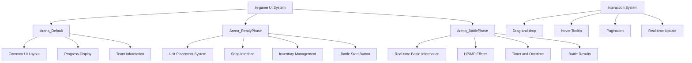

# In-game UI System

## Overview

MetoChess's In-game UI System provides an integrated interface that supports the core gameplay experience from **Arena_ReadyPhase** battle preparation to **Arena_BattlePhase** real-time combat. Various interaction systems including drag-and-drop, real-time information updates, hover tooltips, and pagination are organically connected to implement intuitive and responsive gameplay.

## System Structure

### In-game UI Architecture



## 1. Arena_Default - Common Basic Layout

### Core Components

**Arena_Default** provides the basic layout and information commonly used in all in-game screens.

#### Progress System
```lua
-- GameManager :: Ready_OnClient()
local ui_progressBar = _EntityService:GetEntityByPath("/ui/Arena_Default/Progress")
ui_progressBar.UITweenScale:Play()

-- Progress UI size adjustment (display game mode/round/heart information)
ui_progressBar.UITweenScale.from.x = 650
ui_progressBar.UITweenScale.to.x = 1400
```

#### Phase Transition Animation
```lua  
-- Current stage notification popup (Ready/Battle)
local progressPopupUI = _EntityService:GetEntityByPath("/ui/Arena_Default/ProgressPoup")
progressPopupUI:GetChildByName("Text_Phase").TextComponent.Text = "Ready"

-- Ease animation (drop down → rise up)
progressPopupUI.UITransformComponent.anchoredPosition.y = 
    _TweenLogic:Ease(300, -300, 0.4, EaseType.QuintEaseOut, t1)
```

#### On-field Unit Count Display
```lua
-- Activate only in Ready Phase
_EntityService:GetEntityByPath("/ui/Arena_Default/Text_OnFieldUnitsCount").Enable = true
```

## 2. Arena_ReadyPhase - Battle Preparation Screen

### Unit Placement System

**Arena_ReadyPhase** manages all interactions during the battle preparation phase.

#### Main Components
```lua
-- Arena_ReadyPhase.ui main entities
DefaultPanel/
├── Button_StartBattle     -- Battle start button (ArenaUI_BattleStartButton)
├── ShopPanel/            -- Shop system
│   ├── CharacterShop/    -- Character shop
│   ├── ItemShop/         -- Item shop  
│   └── RuneShop/         -- Rune card shop
└── InventoryPanel/       -- Inventory system
```

#### UI Group Switching
```lua
-- GameManager :: Ready_OnClient()
self.UIGroup_ReadyPhase.Enable = true 
self.UIGroup_BattlePhase.Enable = false

-- GameManager :: SetBattle_OnClient()  
self.UIGroup_ReadyPhase.Enable = false
self.UIGroup_BattlePhase.Enable = true
```

## 3. Arena_BattlePhase - Battle Progress Screen

### Real-time Battle Information

**Arena_BattlePhase** displays real-time information and situations during battle.

#### Team HP System
```lua
-- GameManager :: RefreshUI_TeamHPInfo() 
if team == "User" then
    self.UI_UserTeamHPBar.SpriteGUIRendererComponent.FillAmount = 
        self.TeamHP_User / self.TeamHPMax_User
    self.UI_UserTeamHPBar_dir.UI_HPShrinkBar.ShrinkTime = 1
else
    self.UI_EnemyTeamHPBar.SpriteGUIRendererComponent.FillAmount = 
        self.TeamHP_Enemy / self.TeamHPMax_Enemy
    self.UI_EnemyTeamHPBar_dir.UI_HPShrinkBar.ShrinkTime = 1
end
```

#### Team Info UI (TeamInfo_User/TeamInfo_Enemy)
```lua
-- User team info update
local ui_userTeamInfo = _EntityService:GetEntityByPath(
    "/ui/Arena_BattlePhase/TeamInfo/TeamInfo_User")
setUI(ui_userTeamInfo, self.Entity.PlayerComponent.Nickname, 
    self.Entity.TeamManager.OwnRunes, "User")

-- Enemy team info update  
local ui_enemyTeamInfo = _EntityService:GetEntityByPath(
    "/ui/Arena_BattlePhase/TeamInfo/TeamInfo_Enemy")
setUI(ui_enemyTeamInfo, _LocalizationService:GetText(mainEnemyID.."_EnemyName"), 
    runeList, "Enemy")
```

## 4. Shop System

### Character Shop (UI_CharShopProduct)

Provides character purchase interface in cooperation with **CharacterShopManager_New**.

#### Product Information Display
```lua
-- UI_CharShopProduct composition
property Entity UI_Sprite              -- Character sprite
property Entity UI_Name                -- Character name
property Entity UI_CostText            -- Price display
property Entity UI_SynergyList_2type   -- 2-synergy display
property Entity UI_SynergyList_3type   -- 3-synergy display
property Entity UI_Stars               -- Star display by grade
property Entity UI_FavoriteMark        -- Favorite mark
```

#### Purchase Processing System
```lua
-- UI_CharShopProduct :: HandleButtonClickEvent()
-- Gold shortage check
if _UserService.LocalPlayer.TeamManager.Golds < self.cost then
    user:SendEvent((NotEnoughCoin()))
    return
end

-- Tutorial progress check
if user.GameManager.ModeType == "Tutorial" then
    if self:CheckTutorial() == false then
        _UIToast:ShowMessageByLocalizingKey("Toast_TutoTargetButtonError")
        return	
    end
end

-- Execute purchase
_UserService.LocalPlayer.CharacterShopManager_New:BuyCharacter_Check(self.SlotIdx)
```

#### Hover Tooltip Integration
```lua
-- UI_CharShopProduct :: HandleUITouchEnterEvent()
_UI_Tooltip:SetCharShopInfo(true, self.CharID, slotIdx, true, "CharShop")
```

### Item/Rune Card Shop

#### UI_ItemShopSlot - Item Shop Slot
```lua
-- Display item information tooltip
-- Right-click for crafting recipe function
```

#### UI_RuneShopProductButton - Rune Card Shop
```lua
-- UI_RuneShopProductButton :: HandleButtonStateChangeEvent()
if state == ButtonState.Hover then
    _UI_Tooltip:SetRuneInfoUI(true, spriteRUID, self.Name, self.Desc, 
        self.Grade, self.Cost, self.Tag_Indestructible, 
        self.Tag_Deactivated, self.Tag_Incineration, "Shop")
end
```

#### Probability Display System (UI_ChanceTable)
```lua
-- CharacterShopManager_New :: UI_RefreshChanceList()
local chanceListUI = _EntityService:GetEntityByPath(
    "/ui/Arena_ReadyPhase/ShopPanel/CharacterShop/List_ChanceTable")

for i=1, 5 do
    local slot = chanceListUI:GetChildByName(string.format("Chance_%d", i))
    slot:GetChildByName("Text").TextComponent.Text = string.format("%d%%", costProb[i])
end
```

## 5. Inventory System

### UI_Inventory - Integrated Inventory Management

**UI_Inventory** manages item and rune card inventories in an integrated manner.

#### Inventory Configuration
```lua
-- UI_Inventory core properties
property Entity UI_Inventory        -- Item inventory
property Entity UI_RuneInventory    -- Rune card inventory
property number CurrentShowingPage  -- Current page
property integer ItemSlotCount_Item -- Item slot count (10)

-- Caching system
property SyncTable<string, string> IconRUID        -- Icon cache
property SyncTable<string, string> ItemType        -- Type cache  
property SyncTable<string, string> ItemName        -- Name cache
```

#### Cache System
```lua
-- UI_Inventory :: ResistCache()
local itemInfoTable = _DataService:GetTable("ItemStatus")
for i=1, itemInfoTable:GetRowCount() do
    local row = itemInfoTable:GetRow(i)
    local key = row:GetItem("ItemID")
    self.IconRUID[key] = row:GetItem("RUID")
    self.ItemType[key] = row:GetItem("Type")
    self.ItemName[key] = _LocalizationService:GetText("Item_"..key.."_Name")
end
```

#### Pagination System
```lua
-- UI_Inventory :: RefreshPageMoveButton()
-- Enable/disable processing for next/previous page buttons
```

### Drag-and-drop System

#### UI_InventoryItemSlot - Item Drag
```lua
-- Drag-and-drop processing
-- Tooltip display
-- Outline effect
-- Right-click crafting recipe check
```

#### Unit Placement Drag (UnitSetLogic_New)
```lua
-- Drag end processing at battle start
if isvalid(_UnitSetLogic_New.SelectUnit) then
    _UnitSetLogic_New.SelectUnit.Visible = true 
    _UnitSetLogic_New.DragSample.Visible = false 
    _UnitSetLogic_New.SelectUnit = nil
    
    _UserService.LocalPlayer.CharacterShopManager_New:UI_ShowSellUI(false, 0)
    _GeneralDirectorLogic:SetTileDirection_Main("OnDragging", false)
end
```

#### Item/Rune Card Drag (ItemSetLogic, RuneCardSetLogic)
```lua
-- Item drag end
if isvalid(_ItemSetLogic.DraggingEntity) then
    _ItemSetLogic.MouseChaser.Enable = false
    _ItemSetLogic.DraggingEntity.Visible = true
    _ItemSetLogic.DraggingEntity = nil
end

-- Rune card drag end
if isvalid(_RuneCardSetLogic.CurrentDraggingEntity) then
    _RuneCardSetLogic.DragChaser.Enable = false
    _RuneCardSetLogic.CurrentDraggingEntity.Visible = true
    _RuneCardSetLogic.CurrentDraggingEntity = nil
end
```

## 6. Unit Information System

### UI_UnitInfoPopup - Unit Detailed Information

**UI_UnitInfoPopup** displays detailed information of right-clicked units.

#### Information Display Components
```lua
-- UI_UnitInfoPopup :: UI_Init()
local charInfoRow = charInfoTable:FindRow("CharID", charId)
local charSynergyRow = charSynergyTable:FindRow("CharID", charId)

-- Basic information
local defaultCost = tonumber(charInfoRow:GetItem("Cost"))
local resellCost = defaultCost * unitInfo.level - 1
local spriteRUID = charInfoRow:GetItem("IdleRUID")
local role = _LocalizationService:GetText("CharacterRole_"..charInfoRow:GetItem("Role"))

-- Synergy information (maximum 3)
local synergyID = {}
for i=1, 3 do
    synergyID[i] = charSynergyRow:GetItem(string.format("Synergy_%d", i))
end
```

#### Real-time Information Update
```lua
-- UI_UnitInfoPopup :: UI_Update()
-- Real-time update of HP/MP/stats/items/synergies
-- Merge processing (same character synthesis)
-- Character shop preview
```

#### Hover System Integration
- **UI_UnitInfo_HoverSkill**: Skill information tooltip
- **UI_UnitInfo_HoverStat**: Stat information tooltip  
- **UI_UnitInfo_HoverSynergy**: Synergy information tooltip
- **UI_UnitInfo_ItemSlot**: Item information and crafting recipe

### UI_SynergyListComponent - Synergy List

**Synergy List** displays currently owned synergies by level.

#### Synergy Display Features
```lua
-- Color display by level
-- Hover tooltip
-- Rune card enhancement effects
-- Statistics UI support
```

#### Pagination
**UI_SynergyListNextPageButton** for synergy list page cycling

## 7. HP/MP Effect System

### UI_HPShrinkBar - HP Decrease Effects

**UI_HPShrinkBar** provides delayed decrease effects that visually represent HP changes.

#### Effect Mechanism
```lua
-- UI_HPShrinkBar :: OnUpdate()
if self.ShrinkTime > 0 then
    self.ShrinkTime -= delta
    
    local currentValue = self.Entity.SpriteGUIRendererComponent.FillAmount
    local targetValue = self.UI_TargetHPBar.SpriteGUIRendererComponent.FillAmount
    
    -- Interpolation animation (natural decrease over 1 second)
    self.Entity.SpriteGUIRendererComponent.FillAmount = 
        self:Lerp(currentValue, targetValue, self.ShrinkTime / 1)
end
```

#### Application Scope
```lua
-- UnitInfoUILogic :: SetBar()
-- Individual unit HP bar
local hpBarShrink = statInfoUI:GetChildByName("HPBar_dir")
hpBarShrink.UI_HPShrinkBar.ShrinkTime = 1

-- GameManager :: RefreshUI_TeamHPInfo()
-- Team HP bar
self.UI_UserTeamHPBar_dir.UI_HPShrinkBar.ShrinkTime = 1
```

### Real-time Stat Display

#### HP/MP/Shield Calculation
```lua
-- UnitInfoUILogic :: SetBar()
if unitStatus.HP + unitStatus.Shield > unitStatus.MaxHP then
    shieldBar.SpriteGUIRendererComponent.FillAmount = 1
    hpBar.SpriteGUIRendererComponent.FillAmount = 
        unitStatus.HP / (unitStatus.MaxHP + unitStatus.Shield)
else
    shieldBar.SpriteGUIRendererComponent.FillAmount = 
        (unitStatus.HP + unitStatus.Shield) / unitStatus.MaxHP
    hpBar.SpriteGUIRendererComponent.FillAmount = unitStatus.HP / unitStatus.MaxHP
end

mpBar.SpriteGUIRendererComponent.FillAmount = unitStatus.MP / unitStatus.MaxMP
```

## 8. Pagination and Scroll System

### CustomScrollLayoutComponent - Universal Pagination

**CustomScrollLayoutComponent** provides pagination used in various UIs.

#### Core Settings
```lua
-- CustomScrollLayoutComponent main properties
property string ChildAlignment = "UpperLeft"    -- Alignment mode
property boolean ReverseArrange = false         -- Reverse arrange
property integer SlotCountPerPage = 0          -- Slots per page
property integer CurrentScroll = 1             -- Current page
property integer MaxScrollCount = 1            -- Maximum page count
```

#### Scrollbar Drag Support
```lua
-- OnBeginPlay() connect scrollbar drag events
self.ScrollBarEntity:ConnectEvent(UITouchBeginDragEvent, function(event)
    self.ScrollbarDragStartPosition = e.TouchPoint.y
end)

self.ScrollBarEntity:ConnectEvent(UITouchDragEvent, function(event)
    self:OnDragScrollBar(event)
end)
```

### Application Cases
- **Coach Inventory**: Coach list pagination
- **Synergy List**: Synergy list page switching
- **Item Inventory**: Item list scrolling
- **Shop System**: Product list management

## 9. Tooltip and Hover System

### UI_Tooltip - Integrated Tooltip Management

**UI_Tooltip** manages all hover information in the game.

#### Processing by Tooltip Type
```lua
-- Character shop information
_UI_Tooltip:SetCharShopInfo(true, charID, slotIdx, true, "CharShop")

-- Rune card information  
_UI_Tooltip:SetRuneInfoUI(true, spriteRUID, name, desc, grade, cost, 
    indestructible, deactivated, incineration, "Shop")

// Item information
// Skill information
// Stat information
// Synergy information
```

#### Position and Display Management
- **Mouse Tracking**: Tooltip placement based on cursor position
- **Screen Boundary Handling**: Position adjustment to stay within screen
- **Duplication Prevention**: Prevent multiple tooltip display

## 10. Reroll and Special Systems

### Reroll System

#### UI_RuneRerollButton - Rune Card Reroll
```lua
-- Check reroll availability based on rune card slot number
-- Consume reroll opportunity to redraw rune card
```

#### Character Shop Reroll
Shop list update through **CharacterShopManager_New**

### Special UI Processing

#### Tutorial Integration
```lua
-- Only specific buttons enabled during tutorial progress
if user.GameManager.ModeType == "Tutorial" then
    if self:CheckTutorial() == false then
        _UIToast:ShowMessageByLocalizingKey("Toast_TutoTargetButtonError")
        return
    end
end
```

#### Phantom Rune Special Processing
Special display for phantom runes (RC40003) in **UI_RuneInventroyItemButton**

## Code References

### Basic Layout System
- `ui/Arena_Default.ui` — Arena common UI layout
- `ui/Arena_ReadyPhase.ui` — Preparation phase UI composition
- `ui/Arena_BattlePhase.ui` — Battle phase UI composition

### Shop System
- `RootDesk/MyDesk/UIComponents/UI_Ingame/UI_CharShopProduct.mlua :: HandleButtonClickEvent()` — Character purchase processing
- `RootDesk/MyDesk/UIComponents/UI_Ingame/UI_RuneShopProductButton.mlua :: SetProperty()` — Rune card product settings
- `RootDesk/MyDesk/InGame/Managers/CharacterShopManager_New.mlua :: UI_RefreshChanceList()` — Probability display

### Inventory and Drag-and-drop
- `RootDesk/MyDesk/UIComponents/UI_Ingame/UI_Inventory.mlua :: ResistCache()` — Inventory cache system
- `RootDesk/MyDesk/InGame/System/UnitSetLogic_New.mlua` — Unit drag-and-drop
- `RootDesk/MyDesk/InGame/System/ItemSetLogic.mlua` — Item drag-and-drop
- `RootDesk/MyDesk/InGame/System/RuneCardSetLogic.mlua` — Rune card drag-and-drop

### Information Display System
- `RootDesk/MyDesk/UIComponents/UI_Ingame/UI_UnitInfoPopup.mlua :: UI_Init()` — Unit information initialization
- `RootDesk/MyDesk/UIComponents/UI_Ingame/UI_SynergyListComponent.mlua` — Synergy list management
- `RootDesk/MyDesk/UIComponents/UI_Ingame/UI_HPShrinkBar.mlua :: OnUpdate()` — HP decrease effects

### UI Framework
- `RootDesk/MyDesk/UIComponents/UI_Common/CustomScrollLayoutCompo/CustomScrollLayoutComponent.mlua` — Pagination
- `RootDesk/MyDesk/InGame/System/UnitInfoUILogic.mlua :: SetBar()` — Real-time stat display
- `RootDesk/MyDesk/InGame/Managers/GameManager.mlua :: Ready_OnClient()` — UI group switching

Through this systematic in-game UI system, MetoChess provides complex auto-chess gameplay with an intuitive and responsive interface, implementing an optimized user experience that allows players to focus on strategic decisions.
