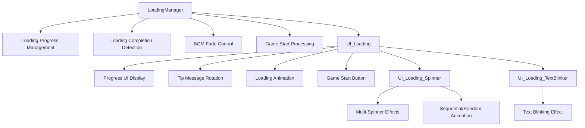

# Loading System

## Overview

MetoChess's Loading System manages the game loading process centered around **LoadingManager** and **UI_Loading** components. Beyond simple progress display, it provides players with a visually rich loading experience through **tip message rotation**, **animation effects**, **BGM fade control**, and **multi-spinner effects**.

## System Structure

### Core Component Relationship



## Loading Progress Management

### LoadingManager Core Functions

**LoadingManager** tracks and manages overall loading progress through server-client synchronization.

#### Loading Stage Definition
```lua
-- LoadingManager :: ClearLoadedCount()
self.NeedLoadCount["UnitSampleSpawn"] = 1      -- Unit sample spawn
self.NeedLoadCount["ProjectileSampleSpawn"] = 1 -- Projectile sample spawn  
self.NeedLoadCount["GameDataLoad"] = 1         -- Game data load

-- Initial loading state
self.LoadedCount["UnitSampleSpawn"] = 0
self.LoadedCount["ProjectileSampleSpawn"] = 0
self.LoadedCount["GameDataLoad"] = 0
```

#### Progress Calculation and Synchronization
```lua
-- LoadingManager :: OnSyncProperty()
local totalNeedCount = 0
for key, value in pairs(self.NeedLoadCount) do
    totalNeedCount += value
end

local totalLoadedCount = 0  
for key, value in pairs(self.LoadedCount) do
    totalLoadedCount += value
end

-- Pass progress to UI
self:SetProgressUI(totalLoadedCount / totalNeedCount)
```

### Loading Completion Processing

#### GameStart() - Execute when loading complete
```lua
-- Verify loading completion
if totalLoadedCount / totalNeedCount < 1 then
    return  -- Loading not yet complete
end

-- Disable loading screen
self:SetEnableUI(false, self.Entity.OwnerId)

-- Start stage transition effect
_BackgroundChangeLogic:GotoNextNode(gameManager.Stage, self.Entity.OwnerId)
_BackgroundChangeLogic:SetBg(gameManager.Stage, self.Entity.OwnerId)

-- Start game (after 1.8 seconds)
_TimerService:SetTimerOnce(gotonext, 1.8)
```

## UI Loading System

### UI_Loading Component Configuration

**UI_Loading** manages all visual elements of the loading screen:

| Entity | Role | Description |
|--------|------|-------------|
| **Text_Tip** | Tip Message | Game tips rotating every 5 seconds |
| **Text_LoadingState** | Loading State Text | Current loading stage display |
| **Sprite_ProgressBar** | Progress Bar | Progress display via FillAmount |
| **Particle_Progress** | Progress Particle | Particle effect linked to progress bar |
| **Text_ProgressRate** | Progress Percentage | Numerical display like "75%" |
| **Sprite_LoadingSpinner** | Spinner Animation | Multi-dot animation |
| **Button_GameStart** | Game Start Button | Activated after loading complete |

### Progress Animation System

#### SetProgressUI() - Progress update with animation
```lua
-- Immediate reset (no animation)
if rate == 0 then
    self.Sprite_ProgressBar.SpriteGUIRendererComponent.FillAmount = 0
    self.Particle_Progress.UITransformComponent.anchoredPosition.x = 0
    self.Text_ProgressRate.TextComponent.Text = "0%"
    return
end

-- Add to animation queue
table.insert(self.ProgressDirectionTimerQueue, delta)

-- Execute immediately if queue is empty
if #self.ProgressDirectionTimerQueue == 1 then
    self:PlayLoadingAnim()
end
```

#### Loading Completion Handling
```lua
-- When reaching 100%
if rate >= 1.00 then
    -- Activate game start button
    setEnable_GameStartButton()
    
    -- Play completion effect
    self.Sprite_LoadComplete.Enable = true
    self.Sprite_LoadCompleteDeco.Enable = true
end
```

## Tip Message System

### Tip Classification System

**UI_Loading** manages two tip categories to display appropriate tips for situations:

#### Tip Data Load and Classification
```lua
-- UI_Loading :: UpdateUI_Tip()
local tipListDataSet = _DataService:GetTable("LoadingTipList")
for i=1, tipListDataSet:GetRowCount() do
    local row = tipListDataSet:GetRow(i)
    local tipID = row:GetItem("Key")
    local condition = row:GetItem("Condition")
    
    if condition == "Enterance" then
        table.insert(self.TipList_Enterance, tipID)  -- Entry tips
    else
        table.insert(self.TipList_Exit, tipID)       -- Exit tips
    end
end
```

#### Contextual Tip Selection
```lua
-- Select random tip appropriate for situation
if self.TipUpdate_IsGoingToLobby == true then
    randomIndex = _UtilLogic:RandomIntegerRange(1, #self.TipList_Exit)
    targetID = self.TipList_Exit[randomIndex]
else
    randomIndex = _UtilLogic:RandomIntegerRange(1, #self.TipList_Enterance)  
    targetID = self.TipList_Enterance[randomIndex]
end

-- Duplication prevention
if targetID == self.TipUpdate_LastTipID then
    self:UpdateUI_Tip()  -- Retry
    return
end
```

### Tip Update Cycle
- **Update Interval**: Automatically changes every 5 seconds
- **Duplication Prevention**: Reselects if same as previous tip
- **OnUpdate()**: Timer-based auto rotation

## Visual Effects System

### UI_Loading_Spinner - Multi-Spinner Animation

**UI_Loading_Spinner** provides multi-dot animation that visually represents loading in progress.

#### Spinner Settings
```lua
-- Animation settings
Period: 0.4          -- Next dot selection period
UpTime: 0.1         -- Up time
HoverTime: 0.3      -- Hover time at peak
DownTime: 0.1       -- Down time
HoverDistance: 2    -- Movement distance (px)
HoverColorAlpha: 0.5 -- Opacity at peak

IsRandomPlaying: false  -- true=random, false=sequential
```

#### Animation Logic
```lua
-- Upward animation 
targetEntity.UITransformComponent.anchoredPosition.y = 
    _TweenLogic:Ease(0, self.HoverDistance, 10, EaseType.SineEaseOut, frame)
targetEntity.SpriteGUIRendererComponent.Color.a = 
    _TweenLogic:Ease(1, self.HoverColorAlpha, 10, EaseType.SineEaseOut, frame)

-- Downward animation
targetEntity.UITransformComponent.anchoredPosition.y = 
    _TweenLogic:Ease(self.HoverDistance, 0, 10, EaseType.SineEaseOut, frame)
```

### UI_Loading_TextBlinker - Text Blinking Effect

**UI_Loading_TextBlinker** provides smooth color transition effects for loading text:

```lua
-- Color change in 2-second cycle
Color1: Color(224/255, 234/255, 242/255, 1)  -- Bright color
Color2: Color(83/255, 125/255, 207/255, 1)   -- Dark color

-- Color interpolation
if self.Time <= 1 then
    local color = Color.Lerp(self.Color1, self.Color2, self.Time / 1)
elseif self.Time <= 2 then  
    local color = Color.Lerp(self.Color2, self.Color1, (self.Time - 1) / 1)
end
```

## BGM and Sound Integration

### BGM Fade System

**LoadingManager** controls BGM in cooperation with **PlaySoundLogic** at loading start and completion:

#### Fade Out at Loading Start
```lua
-- LoadingManager :: SetEnableUI(true)
if enable then
    -- Fade out BGM to 0.5*volume (over 1 second)
    _PlaySoundLogic:FadeInFadeOut(false, 1, 0.5*_PlaySoundLogic.BGMVolume, 0)
end
```

#### BGM Transition at Loading Completion
```lua
-- GameManager :: GoToLobby()
-- Switch to lobby BGM
_PlaySoundLogic:PlayBGM_Ver2(9)
```

## Loading Patterns by Map Transition

### In-game → Lobby Transition

Special loading pattern when moving to lobby managed by **GameManager**:

```lua  
-- GameManager :: GoToLobby()
-- Progress display divided into 3 stages (33% each)
local progressRate = 0.0
local setProgressUp = function()
    progressRate += 0.33
    self.Entity.LoadingManager:SetProgressUI(progressRate)
end

-- Execute at 0 sec, 1.3 sec, 2.6 sec respectively
for i=1, 3 do
    _TimerService:SetTimerOnce(setProgressUp, 1.3*(i-1))
end

-- Complete at 2.9 sec (progress 2.0 = special completion signal)
_TimerService:SetTimerOnce(function()
    self.Entity.LoadingManager:SetProgressUI(2.0)
end, 2.9)
```

### Game Result Integration
```lua
-- When moving to lobby after game end
if type == "GameEnd" then
    -- Activate result screen
    _EntityService:GetEntityByPath("/ui/Lobby_GameResult").Enable = true
    
    -- Reserve experience animation
    _TimerService:SetTimerOnce(function()
        _UI_GameResult:PlayAnim_EXP()
    end, 1.5)
end
```

## Extension and Customization

### Adding New Loading Stages

Add new loading items to **LoadingManager**:
```lua
-- Add to ClearLoadedCount()
self.NeedLoadCount["NewLoadingStep"] = 1
self.LoadedCount["NewLoadingStep"] = 0
```

### Adding Custom Tips
Add new tips to **LoadingTipList.csv** and set conditions:
- **Condition**: "Enterance" or "Exit"
- **Key**: Localization key or direct text

### Spinner Customization
Change effects by adjusting various settings in **UI_Loading_Spinner**:
- Animation timing adjustment
- Color and distance changes  
- Sequential/random mode selection

## Code References

### Core Loading Management
- `RootDesk/MyDesk/UIComponents/LoadingUI/LoadingManager.mlua :: GameStart()` — Loading completion handling
- `RootDesk/MyDesk/UIComponents/LoadingUI/LoadingManager.mlua :: SetProgressUI()` — Progress UI update

### UI and Effects 
- `RootDesk/MyDesk/UIComponents/LoadingUI/UI_Loading.mlua :: PlayLoadingAnim()` — Progress animation
- `RootDesk/MyDesk/UIComponents/LoadingUI/UI_Loading.mlua :: UpdateUI_Tip()` — Tip message rotation
- `RootDesk/MyDesk/UIComponents/LoadingUI/UI_Loading_Spinner.mlua :: OnUpdate()` — Spinner animation
- `RootDesk/MyDesk/UIComponents/LoadingUI/UI_Loading_TextBlinker.mlua :: OnUpdate()` — Text blinking

### Game Flow Integration
- `RootDesk/MyDesk/InGame/Managers/GameManager.mlua :: GoToLobby()` — Lobby transition loading pattern
- `RootDesk/MyDesk/DatasetCacheLogic/PlaySoundLogic.mlua :: FadeInFadeOut()` — BGM fade control

Through this systematic loading system, MetoChess transforms simple waiting time into a period of useful information delivery and visual enjoyment, enhancing the overall user experience.
