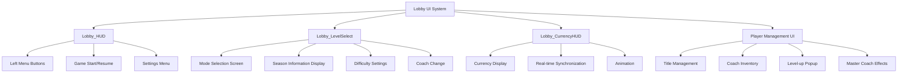

# Lobby UI System

## Overview

MetoChess's Lobby UI System serves as the **metagame hub** of the game. From the main navigation centered on **Lobby_HUD** to **Lobby_LevelSelect**'s mode selection, **Lobby_CurrencyHUD**'s currency management, and various character management systems, it provides an integrated out-of-game experience.

## System Structure

### Lobby UI Architecture



## 1. Lobby_HUD - Main Lobby Interface

### Core Components

**Lobby_HUD** serves as the main lobby interface providing left menu buttons and game start functionality.

#### Left Menu System (List_LeftMenu)
```lua
-- Lobby_HUD.ui structure
List_LeftMenu/
├── Button_Event           -- Event button (RedDot support)
├── Button_CoachGacha      -- Coach gacha button
├── Button_Dictionary      -- Game encyclopedia button  
├── Button_CollectionBook  -- Collection book button
├── Button_Achievement     -- Achievement button
├── Button_Profile         -- Profile button
└── Button_TitleSetting    -- Title settings button
```

#### Game Start/Resume System

**UI_LobbyHUD** dynamically switches buttons based on saved game data availability:

```lua
-- UI_LobbyHUD :: RefreshUI_LobbyHUD_GameStart()
if hasSavedData == true then
    btn_newGame.Enable = false         -- Disable new game
    btn_resumeLastGame.Enable = true   -- Enable resume
    
    -- Display saved game information
    text_lastGameInfo:GetChildByName("Level").TextComponent.Text = 
        modeText.." / "..modeLevelText
    text_lastGameInfo:GetChildByName("Round").TextComponent.Text = 
        string.format("%d - %d", needDataLoadStage, needDataLoadRound)
```

#### Mode-specific Information Display
- **Rank Mode**: Display rank tier information
- **Single Mode**: Season and difficulty information
- **Challenge Mode**: Challenge number and progress

## 2. Lobby_LevelSelect - Game Mode Selection

### Mode Selection System

**UI_LobbyLevelSelect** handles the core of game mode selection.

#### Mode Selection Panel (Panel_SelectMode)
```lua
-- UI_LobbyLevelSelect :: RefreshUI_ModeSelectPanel()
Button_SingleMode       -- Single mode 
Button_RankMode         -- Rank mode (level 10 or higher)  
Button_ChallengeMode    -- Challenge mode (condition check)
```

#### Entry Condition Verification System

**Rank Mode Conditions**:
```lua
-- Level condition check
if playerLevel < 10 then
    ui_rank.ButtonComponent.Enable = false
    ui_rank_locked.Enable = true
    ui_rank_locked.TextComponent.Text = 
        _LocalizationService:GetTextFormat("ModeLockedDesc", 10)
end

-- Maintenance time check
local leftTimeToNextUpdate = _ModeDataLogic:GetLeftTimeToNextOrdinal()
if leftTimeToNextUpdate["hours"] <= 0 then
    ui_rank.ButtonComponent.Enable = false
    ui_rank_locked.TextComponent.Text = 
        _LocalizationService:GetText("Ranking_CoolTime")
end
```

### Season and Difficulty Information

#### Season Information Panel (Panel_SeasonInfo)
```lua
-- UI_LobbyLevelSelect :: RefreshUI_SeasonLevelInfo()
ui_seasonIllust         -- Season illustration
ui_seasonTitle          -- Season title
ui_seasonDesc           -- Season rules description
```

#### Difficulty Settings (Panel_LevelInfo)
```lua
ui_levelIcon            -- Difficulty flag icon
ui_levelTitle           -- Difficulty name
ui_levelDesc            -- Difficulty description  
ui_penaltyDesc          -- Penalty description
```

#### Mode-specific Point Color System
Each game mode applies a unique **point color** for visual distinction.

## 3. Lobby_CurrencyHUD - Currency Display System

### Currency Types and Management

**Lobby_CurrencyHUD** displays the game's 3 main currencies in real-time:

| Currency | Description | UI Path |
|----------|-------------|---------|
| **Syrup** | Basic game currency | `Currency_1/Amount` |
| **RoyalSyrup** | Premium currency | `Currency_2/Amount` |
| **Repechage** | Second chance/revival token | `Currency_3/Amount` |

#### Real-time Synchronization System

Automatically updates UI when currency changes in **PlayerDataComponent**:

```lua
-- PlayerDataComponent :: OnSyncProperty()
if name == "Syrup" then
    local ui_currency = _EntityService:GetEntityByPath(
        "/ui/Lobby_CurrencyHUD/List_Currency/Currency_1/Amount")
    ui_currency.TextComponent.Text = string.format("%d", self.Syrup)

elseif name == "Repechage" or name == "Repechage_Free" then
    local ui_currency = _EntityService:GetEntityByPath(
        "/ui/Lobby_CurrencyHUD/List_Currency/Currency_3/Amount")
    ui_currency.TextComponent.Text = string.format("%d", 
        self.Repechage + self.Repechage_Free)
    
    -- Update tooltip information
    ui_currency.Parent.UI_SimpleTooltipActivator.Desc = 
        _LocalizationService:GetText("Repechage_Tooltip").."\n\n"..
        _LocalizationService:GetTextFormat("Repechage_Tooltip_Extra", 
            self.Repechage_Free, self.Repechage)
```

#### Animation Effects
Provides visual feedback through **UI_SimpleTooltipActivator** tooltips when currency changes.

## 4. Title Management System

### UI_PlayerTitleButton - Title Settings

The **Title System** expresses player individuality by combining 3 elements:

#### Title Components
```lua
-- UI_PlayerTitleButton composition
NameTag         -- Name tag (color by grade)
KeyWordFront    -- Front keyword  
KeyWordBack     -- Back keyword
```

#### Title Element Management System
```lua
-- UI_PlayerTitleButton :: callTitleElementList()
-- Show only currently owned items option
if _UI_PlayerTitleSetting.ShowOwnedTitlesOnly then
    targetTable = _UI_PlayerTitleSetting.KWFTable_owned  -- Owned only
else  
    targetTable = keywordFrontTable  -- Full list
end

-- Lock processing based on ownership
if targetTitleData[elementID] == true then
    titleElement:GetChildByName("LockedCover").Enable = false
    titleElement.ButtonComponent.Enable = true
else
    titleElement:GetChildByName("LockedCover").Enable = true  
    titleElement.ButtonComponent.Enable = false
end
```

#### Name Tag Grade Color System
```lua
-- UI_PlayerTitleButton :: SetNameTagFontColor()
local fontColor
if tonumber(NTRank) == 0 then fontColor = Color.FromHexCode("#FFFFFF")  -- Default
elseif tonumber(NTRank) == 2 then fontColor = Color.FromHexCode("#85db8f")  -- Green
elseif tonumber(NTRank) == 3 then fontColor = Color.FromHexCode("#859fdb")  -- Blue
elseif tonumber(NTRank) == 9 then fontColor = Color.FromHexCode("#ff5252")  -- Red (highest grade)
```

#### Red Dot System
```lua
-- Show red dot when new title is acquired
if isvalid(titleManager.redDotTable[elementID]) then
    titleElement:GetChildByName("RedDot").Enable = true
else
    titleElement:GetChildByName("RedDot").Enable = false
end
```

## 5. Coach Inventory System

### UI_LobbyCoachInventory - Coach Management

**Coach Storage** is a system to manage owned coaches and select an accompanying coach.

#### Accompanying Coach Display
```lua
-- UI_LobbyCoachInventory :: RefreshFollowingCoach()
if _UtilLogic:IsNilorEmptyString(self.CurrentFollowingCoachID) == false then
    -- When coach exists
    local coachData = _CoachService:GetCoachInfo(self.CurrentFollowingCoachID)
    coach_icon.SpriteGUIRendererComponent.ImageRUID = coachData.ProfileRUID
    coach_name.TextComponent.Text = coachData.Name
else
    -- When no coach exists (default cat + material)
    coach_icon.SpriteGUIRendererComponent.ImageRUID = "f8756e7774ae4d2bb0ed2c65ec81d706"
    coach_icon.SpriteGUIRendererComponent.MaterialId = 
        "material://e70dfe07-01ad-4ddc-bc12-f0858c772837"
    coach_name.TextComponent.Text = _LocalizationService:GetText("Coach_None")
end
```

#### Master Coach Effect System

Apply special effects for **Master Coaches** (HasType == 2):

```lua
-- Activate master coach effect
if _UserService.LocalPlayer.CoachManager:GetHasType(self.CurrentFollowingCoachID) == 2 then 
    self:EnableMasterCoachEffect(true)
    
    -- Apply effect to coach entity in lobby map
    local myCoach = _EntityService:GetEntityByPath("/maps/Lobby/coach"..senderUserId)
    local effect = myCoach:GetChildByName("Effect")
    effect:SetEnable(coachManager.MasterCoachEffect)
```

#### Coach Sorting System
```lua
-- Sort by ownership
property boolean SortByPossession = true

-- Filter by cost
property integer ShowingCoachCost = -3  -- -3(all), 1~5(by cost)
```

## 6. Special UI Systems

### UI_ChanceTable - Gacha Probability Display

Displays appearance probability by cost in character shop in cooperation with **CharacterShopManager_New**:

```lua
-- CharacterShopManager_New :: UI_RefreshChanceList()
local chanceListUI = _EntityService:GetEntityByPath(
    "/ui/Arena_ReadyPhase/ShopPanel/CharacterShop/List_ChanceTable")

for i=1, 5 do
    local slot = chanceListUI:GetChildByName(string.format("Chance_%d", i))
    slot:GetChildByName("Text").TextComponent.Text = string.format("%d%%", costProb[i])
end
```

### UI_LevelUpPopup - Level-up Rewards

Displays level-up reward popup in cooperation with **PlayerLevelLogic**:

#### Level-up Popup Settings
```lua
-- PlayerLevelLogic :: SetUI_LevelUpPopup()
-- Level display
ui_lvupGroup:GetChildByName("t_beforeLevel").TextComponent.Text = 
    string.format("%d", beforeLevel)
ui_lvupGroup:GetChildByName("t_UpLevel").TextComponent.Text = 
    string.format("%d", afterLevel)

-- Basic reward (syrup)
if rewardSyrup > 0 then
    self.UI_LvUp_Reward1.Enable = true
    self.UI_LvUp_Reward1:GetChildByName("t_amount").TextComponent.Text = 
        string.format("%d", rewardSyrup)
end
```

#### Special Reward Processing
```lua
-- Mode unlock reward
if rewardInfo[1] == "ModeOpen" then
    if rewardInfo[2] == "RankMode" then
        ui_reward2_icon.SpriteGUIRendererComponent.ImageRUID = 
            "ea216e4763e14908aa4f115fdf356a43"  -- Rank mode icon
        modeText = _LocalizationService:GetText("GameMode_Rank")
    else  -- Challenge Mode
        ui_reward2_icon.SpriteGUIRendererComponent.ImageRUID = 
            "39d166064d7945929c3800cd00423c72"  -- Challenge mode icon
        modeText = _LocalizationService:GetText("GameMode_Challenge")
    end
end
```

#### Popup Animation
```lua
-- PlayerLevelLogic :: EnableUI_LevelUpPopup()  
-- Fade-in animation over 1 second
local alpha = 0
local setPopupAlpha = function()
    alpha += 0.02
    ui_levelUpPopup.CanvasGroupComponent.GroupAlpha = alpha
end
for i=1, 50 do
    _TimerService:SetTimerOnce(setPopupAlpha, 0.02*i)
end
```

## 7. Integrated UI Management

### Popup and Panel System

The lobby UI hierarchically manages various popups and panels:

#### Main Popups
- **Dictionary**: Game encyclopedia 
- **CollectionBook**: Collection management
- **ProfileGroup**: Player profile
- **ESCMenu**: Settings menu
- **Lobby_GameResult**: Game result screen

#### UI State Management
```lua
-- Enable/Disable management by UI groups
ui_selectMode.Enable = true      -- Mode selection screen
ui_selectCoach.Enable = false    -- Coach selection screen  
ui_main.Enable = false           -- Main settings screen
ui_resume.Enable = false         -- Resume screen
```

### Camera Zoom Integration

Provides camera zoom effects when accessing specific UI in cooperation with **UI_CameraZoomLogic**:

```lua
-- When clicking profile button in UI_PlayerTitleButton
_UI_CameraZoomLogic:Zoom()  -- Toggle camera zoom
_UI_Profile:RequestData(_UserService.LocalPlayer.OwnerId)  -- Request profile data
```

## Code References

### Main Lobby Interface
- `ui/Lobby_HUD.ui` — Lobby main screen entity composition
- `RootDesk/MyDesk/UIComponents/UI_Lobby/UI_LobbyHUD.mlua :: RefreshUI_LobbyHUD_GameStart()` — Game start/resume switching

### Mode Selection System  
- `ui/Lobby_LevelSelect.ui` — Level selection screen entity composition
- `RootDesk/MyDesk/UIComponents/UI_Lobby/UI_LobbyLevelSelect.mlua :: RefreshUI_ModeSelectPanel()` — Mode selection condition check
- `RootDesk/MyDesk/UIComponents/UI_Lobby/UI_LobbyLevelSelect.mlua :: RefreshUI_SeasonLevelInfo()` — Season/difficulty information update

### Currency and Data Management
- `ui/Lobby_CurrencyHUD.ui` — Currency display UI composition  
- `RootDesk/MyDesk/DataStorage/PlayerDataComponent.mlua :: OnSyncProperty()` — Real-time currency synchronization

### Player Personalization System
- `RootDesk/MyDesk/UIComponents/UI_Lobby/UI_PlayerTitleButton.mlua :: callTitleElementList()` — Title element list management
- `RootDesk/MyDesk/UIComponents/UI_Lobby/UI_PlayerTitleButton.mlua :: SetNameTagFontColor()` — Name tag grade color
- `RootDesk/MyDesk/UIComponents/UI_Lobby/UI_LobbyCoachInventory.mlua :: RefreshFollowingCoach()` — Accompanying coach display

### Reward and Effect System
- `RootDesk/MyDesk/Player/PlayerLevelLogic.mlua :: SetUI_LevelUpPopup()` — Level-up popup settings
- `RootDesk/MyDesk/OutGame/Coach/CoachService.mlua` — Master coach effect management
- `RootDesk/MyDesk/UIComponents/UI_Lobby/UI_ChanceTable.mlua` — Gacha probability display

Through this systematic lobby UI system, MetoChess provides players with an intuitive and rich metagame experience, serving as a natural access point to the game's various features.
