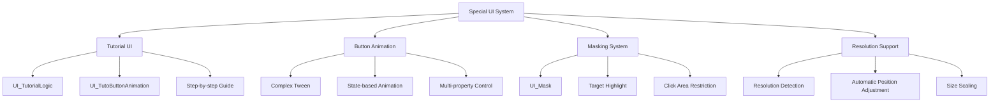
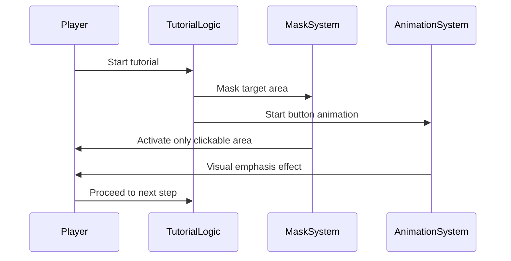

# Special UI System

## Overview

Covers UI systems used for special purposes in the game. Provides advanced features that are difficult to implement with standard UI components, such as tutorial guides, complex animation effects, screen masking, and resolution support.

## Core Component Structure



## 1. Tutorial UI System (UI_TutorialLogic)

### Basic Structure

A core system providing step-by-step guidance and visual emphasis effects for beginners.

### Advisory Message System

```lua
method void ActivateAdviceMessage(string adviceID)
```

Displays detailed advice with guide characters:

#### Components
- **Guide Character**: Provides visual familiarity through AdviceCharImageRUID
- **Localized Text**: Multi-language support through LocalizationService  
- **Progress Control**: Continuous message management through MaxCount
- **Auto Masking**: Emphasize only specific UI elements

### Masking System

Emphasizes only necessary UI elements during tutorial progress to prevent confusion:

```lua
-- Classification by mask type
if overImageRUID == "927ddee89c2244649e5d7c1dad300a7b" then
    self.maskType = 1  -- Waiting area
elseif overImageRUID == "b258f19fa36e4bfda88352cf9412a6e6" then
    self.maskType = 2  -- Battlefield
```

#### Masking Functions
- **Target Highlight**: Activate only click target UI
- **Click Blocking**: Deactivate other areas through BlockMaskClick
- **Dynamic Position**: Position calculation based on MaskSetPos table
- **Overlay Effect**: Visual emphasis with additional images

### Resolution Support System

Provides consistent experience across various screen resolutions:

```lua
-- Current resolution detection
self.screenSize = Vector2(_UILogic.ScreenWidth,_UILogic.ScreenHeight)

-- Position adjustment by resolution
if self.screenSize.y == 1080 then
    self.UI_TutorialMask.UITransformComponent.anchoredPosition = Vector2(posX,posY)
```

#### Support Functions
- **Resolution Detection**: Real-time screen size tracking
- **Position Scaling**: Ratio-based UI element position adjustment
- **Anchor System**: Various alignment options (Center, BottomLeft, TopRight, etc.)
- **Automatic Pivot Calculation**: Pivot point setting according to anchor

## 2. Button Animation System (UI_TutoButtonAnimation)

### Complex Animation Management

Manages complex state transition animations for tutorial selection buttons:

```lua
method void AdjustTutoSelectButtonSize(string TutoSelectState)
```

### State-based Animation

#### TutoSelectState Processing
- **Reset**: Reset to initial state
- **Play**: Emphasize "Start Tutorial" state
- **Skip**: Emphasize "Skip" state

#### Multi-property Control
Animate the following properties simultaneously for each state:
- **Scale**: Button scale effect
- **Position**: Smooth movement animation
- **Alpha**: Fade in/out effect
- **Material**: Material change for visual emphasis

### Interaction Feedback

Provides immediate visual feedback on mouse over to improve user experience.

## 3. Masking System (UI_Mask)

### Basic Principle

A visual emphasis system that emphasizes only specific UI elements while darkening the rest:

```lua
method void SetMask(Entity targetUI, string maskRUID)
```

### Implementation Method

#### Multi-mask Layer
- **Center Mask**: Target emphasis area
- **Background Mask**: Cover rest of screen area
- **Border Mask**: Border for smooth transition

#### Dynamic Size Adjustment
```lua
-- Set mask size to match target size
self.Entity.UITransformComponent.RectSize = targetUI.UITransformComponent.RectSize
```

### Use Cases
- **Tutorial**: Emphasize only buttons to click
- **Feature Introduction**: Highlight relevant area when introducing new features
- **Error Prevention**: Area restriction to prevent wrong operations

## 4. Resolution Support System

### Multi-resolution Support

Ensures consistent UI experience across various devices and screen ratios:

### Auto Scaling

#### Position Calculation
```lua
local pivotX, pivotY
if self.maskAnchor == "Center" then
    pivotX = 0.5; pivotY = 0.5
elseif self.maskAnchor == "BottomLeft" then
    pivotX = 0; pivotY = 0
```

#### Anchor Point System
- **Center**: Based on screen center
- **BottomLeft**: Based on bottom left
- **TopRight**: Based on top right
- **Others**: Support for 9 anchor points

### Dynamic Adjustment

UI automatically readjusts even when resolution changes during game execution.

## 5. Beginner UI Guide System

### Integrated Guide Experience

Multiple systems cooperate to provide systematic learning experience:



### Guide Flow Management

#### Step-by-step Progress
1. **Display Advisory Message**: Explanation with familiar character
2. **Apply Mask**: Emphasize only necessary UI
3. **Activate Animation**: Visual emphasis of click target
4. **Wait for Interaction**: Wait for player action
5. **Transition to Next Step**: Smooth step movement

#### Personalization Support
- **Skip Function**: Fast progress for skilled users
- **Repeated Learning**: Help that can be viewed again anytime
- **Save Progress State**: Restart from interrupted point

## Data Management

### Core Dataset

#### AdviceDataset
```lua
AdviceID: "AD100_1", "AD101_1", ...
AdviceText: Localization key
AdviceCharImageRUID: Guide character image
MaxCount: Number of continuous messages
```

#### MaskSetPos
```lua
AdviceID: Connected advice ID
IsMaskOn: Whether masking is active
MaskAnchor: Anchor point
posX, posY: Position coordinates
BlockMaskClick: Whether click blocking is active
```

### Resource Optimization

Efficient management of large images and animation resources:
- **Lazy Loading**: Load resources only when needed
- **Cache System**: Keep frequently used elements in memory
- **Resources by Resolution**: Appropriate quality for screen size

## Performance Considerations

### Memory Management
- **Dynamic Creation/Release**: Activate UI elements only when needed
- **Pooling System**: Manage reusable components
- **Garbage Collection**: Clean up unnecessary objects

### Rendering Optimization
- **Layer Separation**: Separate rendering of static/dynamic elements
- **Culling**: Exclude off-screen elements
- **Batch Processing**: Group rendering of similar elements

## Code References

- `RootDesk/MyDesk/UIComponents/UI_TutorialLogic.mlua :: ActivateAdviceMessage()` - Advisory message activation
- `RootDesk/MyDesk/UIComponents/UI_TutoButtonAnimation.mlua :: AdjustTutoSelectButtonSize()` - Button animation control
- `RootDesk/MyDesk/UIComponents/UI_Mask.mlua :: SetMask()` - Masking application
- `RootDesk/MyDesk/TutorialGuide/TutorialManager_New.mlua :: SetAllowFeature()` - Feature restriction management
- `RootDesk/MyDesk/TutorialGuide/GuideToRulesManager.mlua :: ActivatePopupMessage()` - Guide popup display
