# UI Framework

## Overview

MetoChess's UI framework provides a complete UI solution environment for developing consistent and extensible user interfaces by integrating reusable **UI components**, **animation systems**, **interaction handling**, and **layout management**. It encompasses everything from basic buttons to complex scroll layouts and image font systems to create a comprehensive UI solution.

## System Structure

### UI Framework Architecture

```mermaid
graph TD
    A[UI Framework] --> B[Basic Components]
    A --> C[Layout System]
    A --> D[Animation System]
    A --> E[Interaction System]
    A --> F[Advanced Features]
    
    B --> B1[UI_OpenButton/ExitButton]
    B --> B2[UI_ButtonClickSoundComponent]
    B --> B3[UI_HideButtonComponent]
    
    C --> C1[CustomScrollLayoutComponent]
    C --> C2[TabComponent]
    C --> C3[DropDownComponent]
    
    D --> D1[UITweenAlpha]
    D --> D2[UITweenPosition]
    D --> D3[UITweenScale/Rotate]
    D --> D4[UI_FlyingUIEntity]
    
    E --> E1[UI_DragMoverComponent]
    E --> E2[CursorPosManager]
    E --> E3[UI_ActivateTooltipOnMouseHover]
    
    F --> F1[UI_ImageFontService]
    F --> F2[UI_Color]
    F --> F3[UI_Mask]
    F --> F4[UI_AlphaDesolve]
```



## 1. Basic UI Components

### Universal Button Components

MetoChess provides universal components for consistent button behavior.

#### UI_OpenButton - Open Button
```lua
-- UI_OpenButton - Simple UI activation button
@Component
script UI_OpenButton extends Component
    property Entity TargetUI = nil   -- Target UI to activate
    
    @EventSender("Self")
    handler HandleButtonClickEvent(ButtonClickEvent event)
        self.TargetUI.Enable = true  -- Activate target UI
    end
end
```

#### UI_ExitButton - Exit Button
```lua
-- UI_ExitButton - Simple UI deactivation button
@Component  
script UI_ExitButton extends Component
    property Entity TargetUI = nil   -- Target UI to deactivate
    
    @EventSender("Self")
    handler HandleButtonClickEvent(ButtonClickEvent event)
        if self.TargetUI ~= nil then
            self.TargetUI.Enable = false  -- Deactivate target UI
        end
    end
end
```

#### UI_ButtonClickSoundComponent - Sound Attachment
```lua
-- UI_ButtonClickSoundComponent - Automatic button click sound playback
@Component
script UI_ButtonClickSoundComponent extends Component
    property string Soundtype = ""   -- Sound type to play
    
    @EventSender("Self")
    handler HandleButtonClickEvent(ButtonClickEvent event)
        if self.Soundtype ~= "" then
            _PlaySoundLogic:PlaySound(self.Soundtype)
        end
    end
end
```

#### UI_HideButtonComponent - Toggle Hide Button
```lua
-- UI_HideButtonComponent - Toggle all children of parent UI
@Component
script UI_HideButtonComponent extends Component
    property boolean IsHideState = false
    
    method void HideTargetUI(boolean hide)
        -- Toggle all sibling entities except self
        local parent = self.Entity.Parent
        for i=1, #parent.Children do
            parent.Children[i].Enable = not hide
        end
        self.Entity.Enable = true  -- Always keep self active
    end
end
```

## 2. Layout Management System

### CustomScrollLayoutComponent - Scroll and Pagination

**CustomScrollLayoutComponent** is a complete scroll and pagination solution for complex list UIs.

#### Core Settings
```lua
-- CustomScrollLayoutComponent main properties
property string ChildAlignment = "UpperLeft"     -- Alignment mode (9 combinations)
property boolean ReverseArrange = false          -- Reverse order flag
property integer SlotCountPerPage = 0           -- Slots per page
property integer CurrentScroll = 1              -- Current page number
property integer MaxScrollCount = 1             -- Maximum page count

-- Padding and spacing settings
property number Padding_Top/Bottom/Left/Right   -- Padding values
property number Spacing = 0                     -- Spacing between items

-- Scrollbar support
property Entity ScrollBarBackgroundEntity       -- Scrollbar background
property Entity ScrollBarEntity                 -- Scrollbar handle
```

#### Alignment System

**ChildAlignment** property supports 9 alignment combinations:
- **Vertical**: Upper, Middle, Lower (Top, Center, Bottom)
- **Horizontal**: Left, Center, Right (Left, Center, Right)
- **Combination Examples**: "UpperLeft", "MiddleCenter", "LowerRight"

#### Scrollbar Drag Support
```lua
-- CustomScrollLayoutComponent :: OnBeginPlay()
if isvalid(self.ScrollBarEntity) then
    -- Drag start event
    self.ScrollBarEntity:ConnectEvent(UITouchBeginDragEvent, function(event)
        self.ScrollbarDragStartPosition = e.TouchPoint.y
    end)
    
    -- Drag event
    self.ScrollBarEntity:ConnectEvent(UITouchDragEvent, function(event)
        self:OnDragScrollBar(event)
    end)
end
```

### TabComponent - Multi-Tab Management

**TabComponent** automatically manages tab buttons and synchronizes their states.

#### Automatic Tab Recognition
```lua
-- TabComponent - Automatically recognizes child entities as tab buttons
property string ChildNameStartsWith = "Tab"     -- Tab name prefix
-- Example: Automatically recognizes "Tab_1", "Tab_2", "Tab_3", etc.
```

#### Tab Change Event
```lua
-- TabChangedEvent dispatch
-- Other components can detect and respond to tab changes
```

### DropDownComponent - Dropdown Menu

**DropDownComponent** manages the main button and dropdown list.

#### Dropdown Structure
```lua
-- DropDownComponent - Main dropdown button
-- DropDownBtnComponent - Individual dropdown item button

-- Toggle dropdown list on click
-- Change main button text and close list when item is selected
```

## 3. Animation System

### UITween Series - Unified Animation

MetoChess provides a **UITween** component series for various UI animations.

#### Common Animation Properties
```lua
-- Common settings for all UITween components
property Vector2 from = Vector2(0,0)    -- Start value
property Vector2 to = Vector2(0,0)      -- End value
property boolean loop = true            -- Loop playback
property boolean pingpong = false       -- Ping-pong mode (back and forth)
property boolean autoPlay = true        -- Auto play
property number duration = 1            -- Animation duration
property string tweenType = "Linear"    -- Easing type
```

#### UITweenPosition - Position Animation
```lua
-- UITweenPosition - Position movement animation
property boolean isWorldPosition = false  -- World/local coordinate selection

-- OnUpdate() - Real-time position calculation
local tweenValue = _TweenLogic:Ease(0, 1, self.duration, self._T.tweenType, time)
if self.isWorldPosition == true then
    self.Entity.UITransformComponent.WorldPosition = 
        Vector3((self.to * tweenValue + self.from * (1 - tweenValue)).x, 
                (self.to * tweenValue + self.from * (1 - tweenValue)).y, 0)
else
    self.Entity.UITransformComponent.anchoredPosition = 
        self.to * tweenValue + self.from * (1 - tweenValue)
end
```

#### UITweenScale - Scale Animation
```lua
-- UITweenScale - Scale change animation
property boolean useRectSize = true  -- RectSize vs LocalScale selection

local scale = self.to * tweenValue + self.from * (1 - tweenValue)
if self.useRectSize then
    self.Entity.UITransformComponent.RectSize = scale
else
    self.Entity.SpriteGUIRendererComponent.LocalScale = Vector2(scale.x, scale.y)
end
```

#### UITweenAlpha - Alpha Animation
```lua
-- UITweenAlpha - Alpha change animation
-- Controls SpriteGUIRendererComponent.Color.a

-- UITweenAlpha_GroupCanvas - Group alpha animation
-- Controls CanvasGroupComponent.GroupAlpha (including children)
```

#### UITweenRotate - Rotation Animation
```lua
-- UITweenRotate - Z-axis rotation animation
-- Controls UITransformComponent.ZRotation
```

### Advanced Animation Features

#### Easing Type Support
```lua
-- Various easing types supported (EaseType enum)
"Linear"
"SineEaseIn", "SineEaseOut", "SineEaseInOut"
"QuintEaseIn", "QuintEaseOut", "QuintEaseInOut" 
"BackEaseIn", "BackEaseOut", "BackEaseInOut"
// Many others...
```

#### Loop and Ping-Pong Mode
```lua
-- UITweenPosition :: OnUpdate()
if self.loop then
    if self.pingpong then
        time = self:PingPong(time, self.duration)  -- Back-and-forth animation
    else
        time = self:Repeat(time, self.duration)    -- Repeat animation
    end
else
    if time > self.duration then
        time = self.duration
        self:Stop()  -- End one-shot animation
    end
end
```

## 4. Interaction System

### UI_DragMoverComponent - UI Drag Movement

**UI_DragMoverComponent** provides functionality to move UI panels by dragging.

#### Drag Settings
```lua
-- UI_DragMoverComponent
property Entity TargetUI = nil                    -- Target UI to move
property Vector2 PosBound_UpperRight = Vector2(0,0)  -- Movement boundary upper-right
property Vector2 PosBound_LowerLeft = Vector2(0,0)   -- Movement boundary lower-left
```

#### Drag Processing Logic
```lua
-- HandleUITouchDragEvent() - Touch drag event handling
local moveDelta = Vector2(TouchDelta.x * 1920 / _UILogic.ScreenWidth, 
                         TouchDelta.y * 1080 / _UILogic.ScreenHeight)
self.TargetUI.UITransformComponent.anchoredPosition += moveDelta

-- Boundary constraint processing
if self.TargetUI.UITransformComponent.anchoredPosition.x > self.PosBound_UpperRight.x then
    self.TargetUI.UITransformComponent.anchoredPosition.x = self.PosBound_UpperRight.x
end
```

### CursorPosManager - Cursor and Entity Detection

**CursorPosManager** detects entities at the mouse cursor position and provides highlight effects.

#### Entity Priority Detection
```lua
-- CursorPosManager :: CheckHoverEntity()
-- Priority: 1. Units > Tiles, 2. Higher LayerOrder
for i = 1, #components do
    local selectEntity = components[i].Entity
    
    if isvalid(hoverEntity) then
        -- Units have priority over tiles
        if isvalid(hoverEntity.TileComponent_New) and isvalid(selectEntity.UnitInfo) then
            hoverEntity = selectEntity
        elseif isvalid(selectEntity.TileComponent_New) and isvalid(hoverEntity.UnitInfo) then
            -- Keep unit
        else
            -- Compare LayerOrder
            if hoverEntity.SpriteRendererComponent.OrderInLayer < 
               selectEntity.SpriteRendererComponent.OrderInLayer then
                hoverEntity = selectEntity
            end
        end
    else
        hoverEntity = selectEntity
    end
end
```

#### Outline Effect Application
```lua
-- Apply outline shader on mouse hover
if isvalid(self.HoverEntity.UnitInfo) then
    self.HoverEntity.UnitInfo:SetOutlineMaterial(true, "mouseHover")
    
    -- Display combination info during item drag
    if isvalid(_ItemSetLogic.DraggingEntity) then
        local itemID = _ItemSetLogic.DraggingEntity.UI_InventoryItemSlot.ItemID
        _UI_Tooltip:SetItemEquipInfo(true, itemID, charID, level)
    end
end
```

## 5. Advanced UI Features

### UI_ImageFontService - Image Font System

**UI_ImageFontService** is an advanced text system that renders individual characters as image sprites.

#### Image Font Structure
```lua
-- UI_ImageFontService data management
property SyncTable<string, string> RUID         -- Image RUID per character
property SyncTable<string, Vector2> Size        -- Size info per character
property table RUIDTable = {}                   -- Character table per font
property string DefaultFontType = "Default_22"  -- Default font type
property SyncTable<string> ValidCharacters      -- Supported character list
```

#### Data Initialization
```lua
-- UI_ImageFontService :: OnBeginPlay()
local imageFontTable = _DataService:GetTable("ImageFontRUIDList")

-- Build valid character list
for i, v in pairs(imageFontTable.Columns) do
    table.insert(self.ValidCharacters, v)
end

-- Build fast access table with row-column inversion
for i=1, rowCount do
    local key = keyColumn[i]
    local row = imageFontTable:GetRow(i)
    self.RUIDTable[key] = row 
end
```

#### ImageFontComponent Integration
```lua
-- ImageFontComponent - Image font UI component
property string FontType = "Default_22"      -- Font type
property string Text = ""                    -- Text to display
property integer TextSize = 22               -- Font size
property Color TextColor = Color(1,1,1,1)    -- Text color
property boolean DropShadow = false          -- Use drop shadow
property Color DropShadowColor               -- Shadow color
property number DropShadowDistance = 32     -- Shadow distance
property number DropShadowAngle = 30        -- Shadow angle
```

#### Real-time Update System
```lua
-- ImageFontComponent :: SetText()
method void SetText(string value)
    self.Text = value
    _UI_ImageFontService:Refresh(self.Entity)  -- Immediate update
end
```

### UI_Color - Color and Material Management

**UI_Color** centrally manages colors and materials used throughout the game.

#### Color Category Management
```lua
-- UI_Color color classification
property SyncTable<integer, Color> CharCost         -- Color by character cost
property SyncTable<integer, Color> CharCost_Darker  -- Darker version
property SyncTable<integer, Color> CoachCost        -- Color by coach cost
property SyncTable<string, Color> RuneGrade         -- Color by rune grade
property SyncTable<string, string> Status           -- Color code by status
property SyncTable<number, string> SynergyStepMaterial  -- Material by synergy level
```

#### Dataset-Based Initialization
```lua
-- UI_Color :: OnBeginPlay()
local colorTable = _DataService:GetTable("GradeColor")

-- Character cost colors (0~5)
for i=0, 5 do
    local row = colorTable:FindRow("Key", string.format("Cost%d", i))
    self.CharCost[i] = Color.FromHexCode(row:GetItem("Default"))
    self.CharCost_Darker[i] = Color.FromHexCode(row:GetItem("Darker"))
end

-- Rune grade colors
local runeGrade = {"Normal", "Rare", "Epic", "Legendary"}
for i=1, #runeGrade do
    local grade = runeGrade[i]
    local row = colorTable:FindRow("Key", string.format("Rune_%s", grade))
    self.RuneGrade[grade] = Color.FromHexCode(row:GetItem("Default"))
end
```

### UI_Mask - Masking and Highlight

**UI_Mask** provides masking effects to highlight specific UI elements.

#### Mask Components
```lua
-- UI_Mask mask panels
property Entity BG_center     -- Center mask (target UI size)
property Entity BG_top        -- Top blur area
property Entity BG_bottom     -- Bottom blur area  
property Entity BG_left       -- Left blur area
property Entity BG_right      -- Right blur area
property boolean IsHighlight  -- Highlight mode
```

#### Mask Application System
```lua
-- UI_Mask :: SetMask()
method void SetMask(Entity targetUI, any targetImageRUID)
    -- Set blur areas to full screen size
    local screenSize = Vector2(_UILogic.ScreenWidth, _UILogic.ScreenHeight)
    self.BG_top.UITransformComponent.RectSize = screenSize * 3
    self.BG_bottom.UITransformComponent.RectSize = screenSize * 3
    
    -- Fit mask area to target UI
    local mask = self.Entity
    mask.SpriteGUIRendererComponent.ImageRUID = targetImageRUID
    mask.UITransformComponent.RectSize = targetUI.UITransformComponent.RectSize
    mask.UITransformComponent.WorldPosition = targetUI.UITransformComponent.WorldPosition
end
```

## 6. Special UI Effects

### UI_FlyingUIEntity - Movement Effects

Provides effects where UI elements appear while moving across the screen.

### UI_AlphaDesolve - Auto Fade

Auto fade-in/out processing for UI elements:
- Automatic transparency after a set time
- Auto deactivation after completion
- Smooth alpha transitions

### UI_AutoScroll - Auto Scroll

Effects where text or lists automatically scroll:
```lua
-- UI_AutoScroll settings
property boolean IsVertical           -- Vertical/horizontal scroll
property number ScrollSpeed          -- Scroll speed
property number WaitTime             -- Wait time
property boolean DynamicContentLength // Dynamic length calculation
```

## 7. Integrated Usage Examples

### Complex UI Composition
```lua
-- Typical complex UI composition example
Panel_Main/
├── TabComponent              -- Tab management
├── CustomScrollLayoutComponent  -- Content scrolling
├── UI_DragMoverComponent     -- Panel drag movement
├── UITweenAlpha             -- Appear/exit animation
└── Children/
    ├── Tab_1 (UI_ButtonClickSoundComponent)  -- Tab with sound
    ├── Tab_2 (UI_ExitButton)                 -- Tab with exit function
    └── Content/
        └── CustomScrollLayoutComponent       -- Nested scrolling
```

### Event Chain System
```lua
-- TabComponent change → CustomScrollLayoutComponent update → UITweenPosition execution
-- Complex UI behavior through event-based component interaction
```

## Code References

### Basic Components
- `RootDesk/MyDesk/UIComponents/UI_Common/UI_OpenButton.mlua` — Universal open button
- `RootDesk/MyDesk/UIComponents/UI_Common/UI_ExitButton.mlua` — Universal exit button  
- `RootDesk/MyDesk/UIComponents/UI_Common/UI_ButtonClickSoundComponent.mlua` — Button sound
- `RootDesk/MyDesk/UIComponents/UI_HideButtonComponent.mlua` — Toggle hide button

### Layout System
- `RootDesk/MyDesk/UIComponents/UI_Common/CustomScrollLayoutCompo/CustomScrollLayoutComponent.mlua` — Scroll layout
- `RootDesk/MyDesk/UIComponents/UI_Common/TabCompo/TabComponent.mlua` — Tab management
- `RootDesk/MyDesk/UIComponents/UI_Common/DropdownCompo/DropDownComponent.mlua` — Dropdown

### Animation System
- `RootDesk/MyDesk/UIComponents/UI_Common/UITween/UITweenPosition.mlua` — Position animation
- `RootDesk/MyDesk/UIComponents/UI_Common/UITween/UITweenScale.mlua` — Scale animation
- `RootDesk/MyDesk/UIComponents/UI_Common/UITween/UITweenAlpha.mlua` — Alpha animation
- `RootDesk/MyDesk/UIComponents/UI_Common/UITween/UITweenRotate.mlua` — Rotation animation

### Interaction System
- `RootDesk/MyDesk/UIComponents/UI_DragMoverComponent.mlua` — UI drag movement
- `RootDesk/MyDesk/UIComponents/CursorPosManager.mlua` — Cursor and entity detection
- `RootDesk/MyDesk/UIComponents/UI_Common/UI_ActivateTooltipOnMouseHover.mlua` — Hover tooltip

### Advanced Features
- `RootDesk/MyDesk/UIComponents/UI_Common/ImageFontSystem/UI_ImageFontService.mlua` — Image font service
- `RootDesk/MyDesk/UIComponents/UI_Common/ImageFontSystem/ImageFontComponent.mlua` — Image font component
- `RootDesk/MyDesk/UIComponents/UI_Color/UI_Color.mlua` — Color management
- `RootDesk/MyDesk/UIComponents/UI_Mask.mlua` — Masking processing

Through this comprehensive UI framework, MetoChess builds reusable and highly extensible user interfaces, providing powerful tools for developers to easily implement consistent UI experiences.
