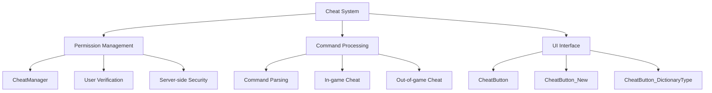
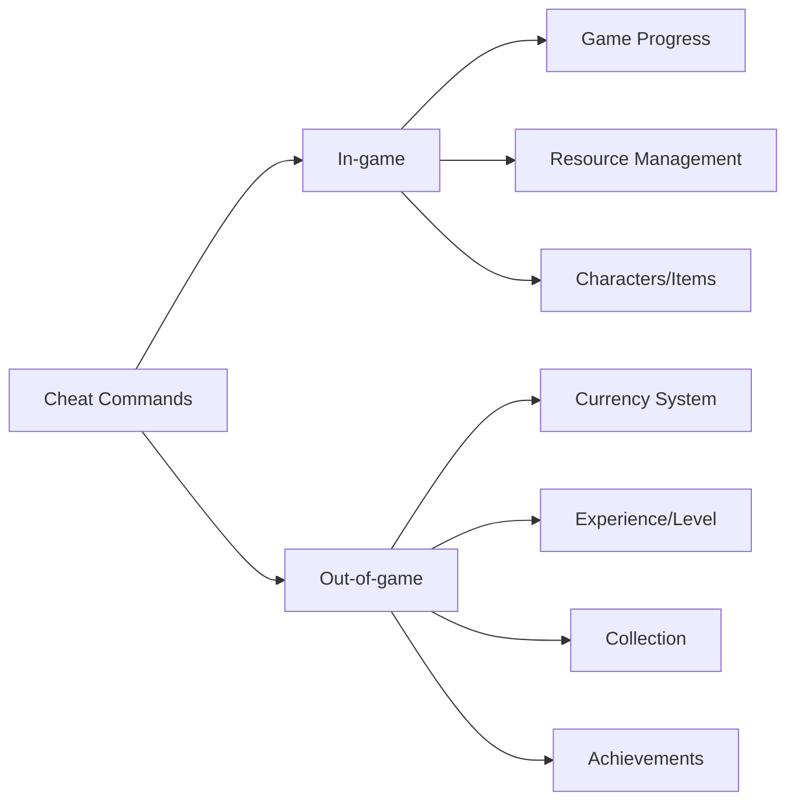

# Cheat and Debugging System

## Overview

A powerful cheat and debugging tool system for developers and testers. Considers both security and convenience by providing permission-based access control, support for various input methods, and systematic command systems. Enables efficient testing and debugging in game development and QA processes.

## System Architecture



## 1. Cheat Manager (CheatManager)

### Core Structure

Central manager of the cheat system that controls all cheat functions from security verification to command execution.

### Permission Verification System

```lua
method boolean IsAllowedUser(string userID)
```

Restricts cheat functions to only pre-registered developers for security:

#### User Registration Method
```lua
-- Set allowed user list at server startup
local cheatAllowedUsers = {
    "?????????????????", -- Enter account code
}
```

#### Security Features
- **Server-side Verification**: All cheats can only be executed on server
- **Account Code Based**: Permission management with unique account identifier
- **Partial Matching**: Use only specific parts of account code for security enhancement
- **Log Records**: Store cheat usage records on server

### Command Parsing System

```lua
method boolean UseCheat(string cheatKey)
```

Structurally parses complex commands to provide various cheat functions:

#### Parsing Structure
```lua
local split = _UtilLogic:Split(cheatKey, "_")
-- Example: "GetCoin_1000" → ["GetCoin", "1000"]
```

#### Command System

**In-game Cheat**
- **phaseOver**: Force end current phase
- **GoRound_[stage]-[round]**: Move to specific stage/round
- **GetCoin_[amount]**: Gold grant
- **ChangeLife_[amount]**: Life change
- **ChangeLevel_[level]**: Player level change
- **GetUnit_[id]**: Acquire specific character
- **GetItem_[id]**: Item acquisition
- **GetRuneCard_[id]**: Rune card acquisition

**Out-of-game Cheat**
- **GetSyrup_[amount]**: Syrup currency grant
- **GetRoyalSyrup_[amount]**: Royal syrup grant
- **GetEXP_[amount]**: Experience grant
- **ChangeCoachOwn_[id]_[status]**: Coach ownership status change
- **SetAchievementCount_[id]_[count]**: Achievement progress setting
- **CharCollectChange_[id]_[grade]**: Character collection change

### UI Panel Management

```lua
method void OpenCheatPanel()
```

Provides cheat UI only to users with confirmed permissions:
- **Security Verification**: Reconfirm permissions before opening panel
- **Client Synchronization**: UI activation after server approval
- **Path-based Access**: UI composition with "/ui/EtcGroup/CheatUI_New"

## 2. Cheat Button System

### Basic Cheat Button (CheatButton)

Basic component that generates cheat commands by receiving single or multiple input values:

```lua
property string Key = ""
handler HandleButtonClickEvent(ButtonClickEvent event)
```

#### Complex Input Processing
```lua
-- Cheat requiring two inputs (character collection, coach acquisition)
if self.Key == "GetCharacterCollect" then
    local inputs = self.Entity.Parent:GetChildComponentsByTypeName("TextInputComponent", true)
    local key = self.Key.."_"..inputs[1].Entity.TextComponent.Text.."_"..inputs[2].Entity.TextComponent.Text
    _CheatManager:UseCheat(key)
end
```

#### Special Format Support
- **Rune Card**: "GetRuneCard" → "GetRuneCard_RC[number]" auto conversion
- **Character Collection**: Process by receiving ID and grade together
- **General Cheat**: Complete command with single input value

### Improved Cheat Button (CheatButton_New)

Enhanced button system that supports variable input count:

```lua
property integer InputAmount = 0
property string CheatKey = ""
```

#### Dynamic Input Processing
```lua
-- Collect values for set number of inputs
if self.InputAmount > 0 then
    for i=1, self.InputAmount do
        local inputValue = Entity.Parent:GetChildByName(string.format("Input_%d", i)).TextComponent.Text
        key = key.."_"..inputValue
    end
end
```

#### Usage Examples
- **InputAmount = 0**: Cheat without parameters (phaseOver)
- **InputAmount = 1**: Single value cheat (GetCoin_1000)
- **InputAmount = 2**: Complex value cheat (GoRound_3-5)

### Type-specific Cheat Button (CheatButton_DictionaryType)

Simple cheat button specialized by game element type:

```lua
property integer Type = 1  -- 1:Characters, 2:Items, 3:Rune Cards
property string ID = ""
```

#### Type-based Processing
```lua
if self.Type == 1 then
    _CheatManager:UseCheat("GetUnit_"..self.ID)
elseif self.Type == 2 then
    _CheatManager:UseCheat("GetItem_"..self.ID)
elseif self.Type == 3 then
    _CheatManager:UseCheat("GetRuneCard_"..self.ID)
```

#### Advantages
- **Intuitive Settings**: Complete by setting only type and ID in editor
- **Typo Prevention**: Minimize mistakes with pre-defined command format
- **Quick Creation**: Efficient when creating large numbers of cheat buttons

## 3. Cheat Command System

### Command Classification System



### Game Progress Control

#### Phase Control
- **phaseOver**: Ready → Battle, Battle → Ready phase transition
- **GoRound_[stage]-[round]**: Immediate move to specific stage/round
- **SetBattleResult_[result]**: Force set battle result

#### Resource Management
- **GetCoin_[amount]**: Immediate in-game gold grant
- **ChangeLife_[amount]**: Set current life
- **SetLevel_[level]**: Immediate player level change

### Collection and Progress Management

#### Bulk Processing Support
```lua
-- Set all character collections to specific grade
"CharCollectChange_All_3"  -- All characters to 3 stars

-- Unlock all synergies of specific grade
"SynCollectChange_All_2"   -- Unlock all grade 2 synergies
```

#### Individual Processing
```lua
-- Change collection grade for specific character only
"CharCollectChange_C10001_5"  -- Specific character to 5 stars

-- Set individual achievement progress
"SetAchievementCount_ACHIEVE001_100"  -- Achievement 100 completion
```

## 4. Developer Convenience Features

### Debug Information Output

Provides detailed log information when executing cheat to support debugging:

```lua
log("cuttedUserID = ", cuttedUserID)  -- User ID verification
log("cheatKey = ", cheatKey)          -- Executed cheat command
log("result = ", result)              -- Cheat execution result
```

### Safety Verification

#### Input Value Validation
- **Number Conversion**: Safe type conversion with `tonumber()` function
- **nil Check**: Validity check with `isvalid()` function
- **Range Verification**: Execute only within appropriate value range

#### Game State Protection
- **Phase Check**: Execute cheat only in appropriate game state
- **Duplication Prevention**: Block duplicate execution of same cheat
- **Rollback Support**: Restore to previous state when problems occur

## 5. Extensibility Considerations

### Adding New Cheats

Designed to easily add new cheats while maintaining existing structure:

```lua
-- Add new condition to CheatManager.mlua's UseCheat method
elseif split[1] == "NewCheat" then
    local param = split[2]
    self:Cheat_NewFunction(senderUserId, param)
```

### Button Component Extension

Can add cheat buttons that support new input methods or UI patterns:
- **Slider Based**: Intuitively set range values
- **Dropdown Based**: Select from pre-defined options
- **Checkbox Based**: Boolean value setting

## Performance and Security Considerations

### Performance Optimization
- **Delayed Execution**: Cheat UI activated only when needed
- **Batch Processing**: Optimize when executing multiple cheats at once
- **Cache Utilization**: Cache frequently used data in memory

### Security Enhancement
- **Server-only Execution**: All cheats processed only on server
- **Permission Re-verification**: Check permission each time cheat is executed
- **Log Records**: Store all cheat usage records on server
- **Release Deactivation**: Auto deactivation in production build

## Code References

- `RootDesk/MyDesk/CheatPackage/CheatManager.mlua :: UseCheat()` - Cheat command parsing and execution
- `RootDesk/MyDesk/CheatPackage/CheatManager.mlua :: IsAllowedUser()` - User permission verification
- `RootDesk/MyDesk/CheatPackage/CheatButton.mlua :: HandleButtonClickEvent()` - Basic cheat button processing
- `RootDesk/MyDesk/CheatPackage/CheatButton_New.mlua :: HandleButtonClickEvent()` - Improved cheat button processing
- `RootDesk/MyDesk/CheatPackage/CheatButton_DictionaryType.mlua :: HandleButtonClickEvent()` - Type-specific cheat button
