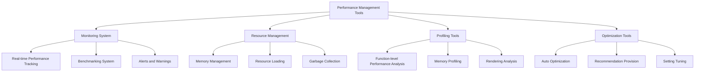

# Performance and Resource Management

## Overview

A comprehensive performance monitoring, resource management, and profiling tool system for developers. Supports identification and resolution of game performance bottlenecks by providing real-time performance tracking, memory usage analysis, and resource optimization tools. A comprehensive performance management solution available throughout the entire process from development phase to live service.

## System Architecture



## 1. Performance Monitoring System

### Real-time Performance Tracking

Continuously monitors key performance indicators during game execution.

### Benchmarking System

```lua
method void BenchmarkCachePerformance()
```

Quantitatively measures performance of core systems to verify optimization effects:

#### Cache Performance Measurement
```lua
local startTime = _TimeService:GetServerTime()
-- Cached data query test
for i = 1, 1000 do
    local data = _CharacterSynergyLogic.CharacterSynergy["C10001"]
end
local endTime = _TimeService:GetServerTime()
log(string.format("Cache query 1000 times: %.3fms", (endTime - startTime) * 1000))
```

#### Measurement Items
- **Data Query Speed**: Cache efficiency verification
- **UI Rendering Time**: Frame drop analysis
- **Network Response Time**: Communication performance measurement
- **Loading Time**: Resource loading efficiency

### Performance Threshold Monitoring

```lua
method void CheckPerformanceThresholds()
```

Automatically detects performance issues exceeding set thresholds and provides alerts:

#### Threshold Settings
- **Frame Rate**: Warning when below 60fps continuously
- **Memory Usage**: Alert when exceeding 80%
- **Loading Time**: Recommend optimization when exceeding 3 seconds
- **Network Latency**: Warning when exceeding 100ms

## 2. Memory Management Tools

### Memory Usage Tracking

Analyzes memory usage patterns in real-time to prevent leaks:

```lua
method void LogMemoryUsage()
```

#### Memory Analysis Items
```lua
log(string.format("CharacterSynergy cache: %d items", 
    table.count(self.CharacterSynergy)))
log(string.format("ExpTable cache: %d items", 
    #self.ExpTable))
log(string.format("UI entities: %d units", 
    _EntityService:GetEntityCount("UITransformComponent")))
```

### Garbage Collection Optimization

#### Automatic Memory Cleanup
```lua
method void OnDestroy()
    table.clear(self.CharacterSynergy)
    table.clear(self.ExpTable)
    table.clear(self.SoundTable)
    self.IsInitialized = false
end
```

#### Memory Cleanup Strategy
- **Table Reuse**: Reuse after clearing existing tables instead of creating new tables
- **String Interning**: Remove duplicates of frequently used strings
- **Weak References**: Use WeakTable to prevent memory leaks
- **Delayed Release**: Use batch cleanup process rather than immediate deletion

### Memory Leak Detection

```lua
method void DetectMemoryLeaks()
```

Automatically identifies objects not released for long periods:
- **Old Timers**: Detect uncleaned timers
- **Reference Cycles**: Detect leaks due to mutual references
- **Event Listeners**: Track unremoved event handlers

## 3. Resource Management Optimization

### Resource Loading Analysis

Analyzes resource loading patterns and usage frequency to suggest optimization solutions:

```lua
method void AnalyzeResourceUsage()
```

#### Analysis Metrics
- **Loading Frequency**: Identify frequently used resources
- **Memory Usage**: Memory occupancy by resource
- **Loading Time**: Identify large resources that cause bottlenecks
- **Cache Hit Rate**: Measure caching efficiency

### Resource Preloading Optimization

```lua
method void OptimizePreloading()
```

Pre-identifies necessary resources by game situation and establishes optimal loading strategy:

#### Optimization Strategy
- **Priority Loading**: Determine resource loading order by importance
- **Batch Loading**: Batch loading of related resources
- **Conditional Loading**: Selective resource loading by game situation
- **Background Loading**: Prepare next stage resources in advance during gameplay

### UI Resource Optimization

```lua
method void OptimizeUIResources()
```

Optimization tools for efficient use of UI-related resources:

```lua
-- Use pre-calculated UI optimization information
local optimInfo = _LoadResourcesInfo:GetUILocalPositionScale(RUID)
uiElement.UITransformComponent.LocalPosition = optimInfo["pos"]
uiElement.UITransformComponent.LocalScale = optimInfo["scale"]
```

#### UI Optimization Techniques
- **Sprite Atlasing**: Composite multiple UI images into one
- **Dynamic Font Loading**: Selective loading of only necessary characters
- **UI Pooling**: Reuse frequently used UI components
- **Render Target Optimization**: Remove unnecessary rendering passes

## 4. Network Performance Optimization

### Data Transmission Optimization

Minimizes network traffic and improves response speed:

```lua
method void OptimizeNetworkTraffic()
```

#### Optimization Techniques
- **Data Compression**: Reduce transmission volume through string-based data compression
- **Batch Request**: Bundle multiple data for transmission instead of individual requests
- **Delta Synchronization**: Transmit only changed parts
- **Priority Queue**: Manage transmission order by importance

#### Compression Example
```lua
-- Efficient data compression
local compressedData = string.format("%s_%s_%d", 
    charID, 
    table.concat(synergyList, "-"),
    level
)
```

### Synchronization Performance Analysis

Analyzes and optimizes performance of multiplayer synchronization:
- **@TargetUserSync Analysis**: Measure synchronization traffic by player
- **Update Frequency Optimization**: Remove unnecessary synchronization
- **Batch Update**: Synchronize multiple changes at once

## 5. Rendering Performance Tools

### Rendering Profiler

Identifies graphics performance bottlenecks and suggests optimization solutions:

```lua
method void ProfileRenderingPerformance()
```

#### Analysis Items
- **Draw Call Count**: Optimize rendering call count
- **Texture Memory**: Track VRAM usage
- **Shader Performance**: Analyze performance impact of complex shaders
- **Overdraw**: Detect unnecessary duplicate rendering

### Batch Rendering Optimization

```lua
method void OptimizeBatchRendering()
```

Bundles objects with same properties to improve rendering efficiency:

```lua
-- Batch rendering of same texture sprites
_ResourceService:PreloadAsync(spriteRUIDs, function()
    self:RenderSpriteBatch(spriteRUIDs)
end)
```

## 6. Developer Convenience Tools

### Performance Dashboard

Provides a dashboard that visualizes all performance metrics in real-time for viewing at a glance:

#### Dashboard Components
- **Real-time Graphs**: FPS, memory usage, network latency
- **Warning Alerts**: Immediate alert when threshold exceeded
- **History**: Analyze performance change trends
- **Detailed Information**: Show detailed analysis of corresponding system on click

### Automated Optimization Suggestions

```lua
method void SuggestOptimizations()
```

Automatically suggests specific optimization solutions based on performance analysis results:

#### Suggestion Types
- **Caching Opportunities**: Suggest caching of repeatedly calculated values
- **Resource Integration**: Suggest bundling of individually loaded resources
- **Algorithm Improvement**: Present alternatives to inefficient logic
- **Setting Adjustment**: Recommend settings for performance improvement

### Performance Comparison Tools

```lua
method void ComparePerformance(string baselineVersion, string currentVersion)
```

Quantitative comparative analysis of performance changes between versions:
- **Performance Regression Detection**: Identify performance degradation compared to previous version
- **Improvement Verification**: Measure effects of optimization work
- **Benchmark Records**: Manage performance history by version

## 7. Production Environment Optimization

### Live Service Monitoring

Continuously monitors performance in live service environment:

#### Monitoring Metrics
- **Server Response Time**: Response speed by API call
- **Concurrent Users**: Performance changes according to load
- **Error Rate**: Error occurrence rate due to performance issues
- **User Experience**: Performance experienced by actual players

### Auto Scaling

```lua
method void AutoScale()
```

Dynamically adjusts system resources according to load situations:
- **Memory Allocation**: Memory pool size adjustment as needed
- **Thread Pool**: Thread count adjustment based on CPU usage
- **Cache Size**: Auto adjust cache size under memory pressure

## Performance Optimization Best Practices

### Lazy Initialization

```lua
method any GetCachedData(string key)
    if not self.IsInitialized then
        self:LoadTable()  -- Initialize only when needed
    end
    return self.DataTable[key]
end
```

### Object Pooling

```lua
method Entity GetPooledEntity(string entityType)
    local pooledEntity = self.EntityPool[entityType]:Pop()
    if not isvalid(pooledEntity) then
        pooledEntity = self:CreateNewEntity(entityType)
    end
    return pooledEntity
end
```

### Efficient Data Structure

```lua
-- Use hash table for O(1) search
local unitLookup = {}
for i, unit in ipairs(units) do
    unitLookup[unit.ID] = unit
end
```

## Code References

- `RootDesk/MyDesk/InGame/Managers/LoadResourcesInfo.mlua :: ResourceLoad()` - Resource preloading system
- `RootDesk/MyDesk/DatasetCacheLogic/CharacterSynergyLogic.mlua :: LoadTable()` - Cache performance optimization
- `RootDesk/MyDesk/InGame/Managers/TeamManager.mlua :: Check_LevelUpCondition()` - Batch processing optimization
- `RootDesk/MyDesk/DatasetCacheLogic/PlaySoundLogic.mlua :: PlaySound()` - Audio performance optimization
- `RootDesk/MyDesk/DataStorage/GameModeDataManager.mlua :: Initialize()` - Mode-specific data optimization
